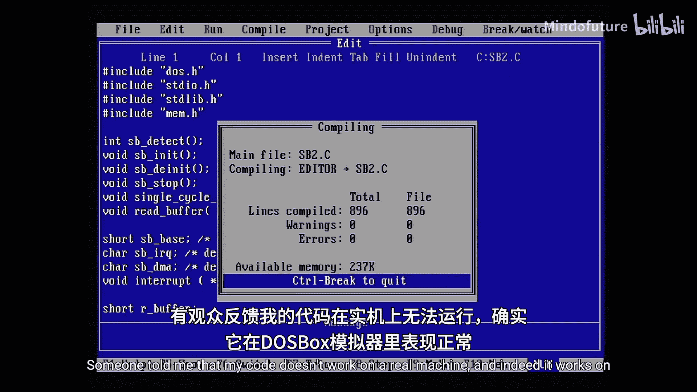
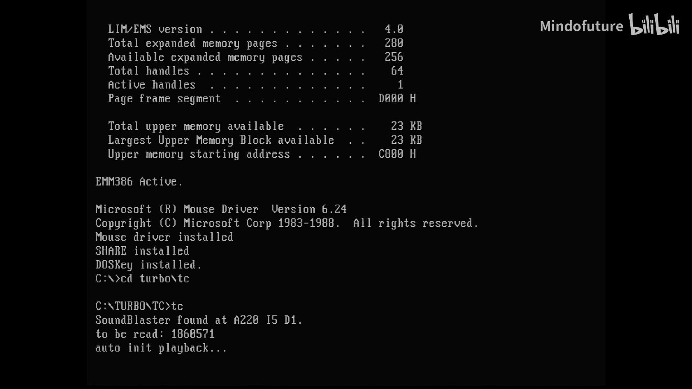
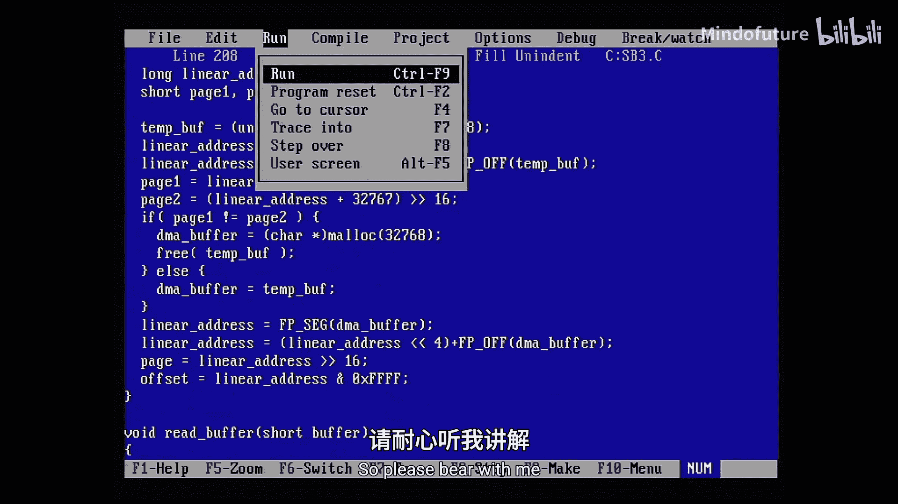
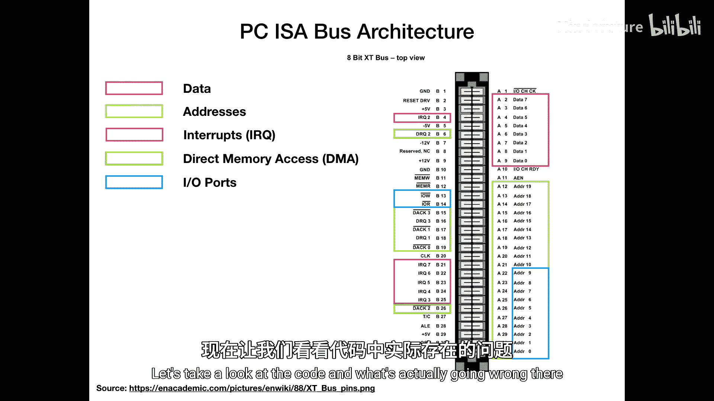
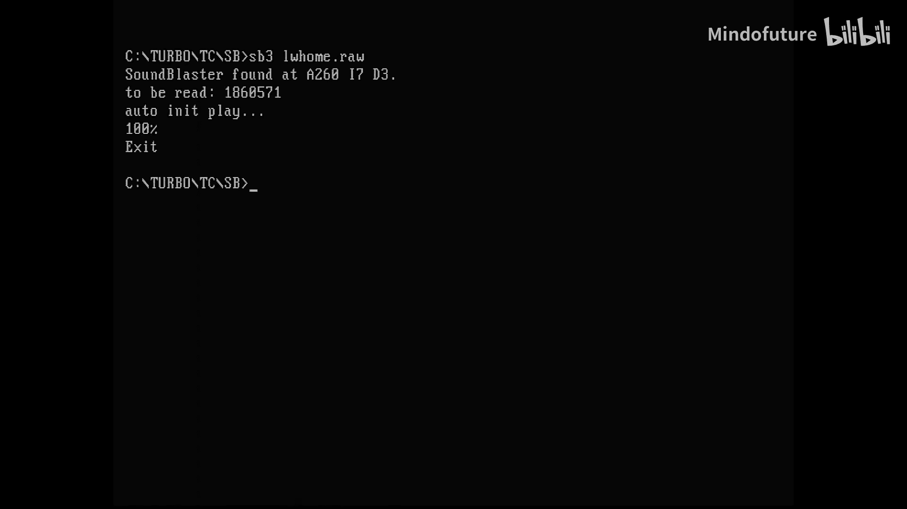

# 013：近指针、远指针与中断请求





在本节课中，我们将学习如何修复一个在真实MS-DOS硬件上无法运行的程序。我们将探讨近指针与远指针的概念，以及如何正确地在中断服务例程中处理硬件中断。通过理解PC架构的基础知识，我们将解决程序在DOSBox模拟器中运行正常，但在真实机器上失败的问题。



## PC架构快速回顾

上一节我们介绍了程序在真实硬件上遇到的问题。为了理解问题的根源，本节中我们来看看原始的IBM PC架构。

最初的IBM PC 5150基于Intel 8088和8086 CPU。8088是更便宜的版本，具有8位数据总线，而8086具有16位数据总线。两者都拥有20位地址总线，可寻址最多1 MB的RAM。

架构本身大致如下：CPU通过其地址和数据线，在所谓的ISA总线上与其他外围设备通信。外围设备包括用于控制硬件中断请求的中断控制器、用于直接内存访问和内存传输的DMA控制器，当然还有RAM。

问题在于，我们的程序需要特定的内存模型，而为了理解内存模型，我们需要了解8086如何与硬件或内存通信。

## 内存模型与分段

在硬件层面，CPU首先有一组寄存器。这些是CPU上直接的小型16位存储空间，包括通用寄存器（AX, BX, CX, DX）和段寄存器（CS, DS, ES, SS）。CS是代码段，指向当前执行的程序；DS是数据段，默认指向我们加载的数据；SS是栈段，用于函数调用等操作。

由于使用16位寄存器只能寻址最多64 KB的内存，但通过一个段寄存器和一个其他寄存器组合，可以寻址更多。内存分段的工作原理如下：我们有四个段寄存器（代码、数据、附加、栈），与通用或专用寄存器一起，可以寻址1 MB。

例如，数据段DS和源索引SI这对寄存器组合，可以给出内存中的某个1 MB位置。要获得线性地址，需要计算 `DS * 16 + SI`，因为每个段在16字节后开始，但每个段本身仍然是64 KB。段可以并且确实会重叠。

如果我们在内存中进行复制，可以使用`rep`（重复）指令和移动字符串字命令`movsw`。这将把16位值从源地址（DS:SI）复制到目标地址（ES:DI）。重复次数存储在CX寄存器中。

## 近指针与远指针

为了节省内存，编译器可以使用所谓的近指针，而不是两个16位值（一个段寄存器和一个偏移寄存器）。你可以只使用一个8位或16位偏移量，从而在当前段内寻址256字节或64 KB。

这当然节省了大量空间，因为存储地址时只需存储8或16位，而不是32位（否则需要将段寄存器存储在内存中的某个地方和偏移寄存器）。这也提高了速度，因为需要从内存加载或解码的代码更少。

以下是一个示例。助记符`mov`在语法中，目标在前，源在后。
```assembly
mov si, [bp]       ; 这是一个近指针操作示例
mov di, [bp+2]
rep movsw
```
这相当于写`mov si, ds:[bp]`。使用近指针在程序中占用的空间更少。

## 选择正确的内存模型

在Turbo C中，进入选项和编译器菜单，你会看到指针模型。默认是“小”内存模型。小内存模型为代码提供64 KB，为数据和栈提供另一个64 KB。在DOS中，如果没有DOS扩展器，总共可以使用640 KB的代码、数据和栈。这个模型只使用了大约10%的代码和10%的数据和栈空间，程序确实非常小。

重要的是第二部分：默认情况下，所有函数和数据指针都是近指针。这意味着当我们分配某些东西或传递某些东西时，它只会传递近指针（仅偏移量）。这可能会导致问题，特别是在使用`malloc`和分配DMA缓冲区时。

当我们切换到“紧凑”模型时，这是第一个声明“所有函数默认为近指针，所有数据指针默认为远指针”的模型。这对我们很重要。我们的代码库不大，所以我们的代码可能适合64K，因此函数指针是近指针没问题。我们这里也不使用函数指针，所以这应该没问题。

如果你不满意，甚至可以选更大的模型。“大”内存模型允许最多1 MB的代码、64 KB的栈和1 MB的堆。所有函数和数据指针都是远指针，应该完全没有问题。还有“巨大”内存模型，它提供多个数据段，每个大小为64 KB，代码最多1 MB，栈64 KB。所有函数和数据指针似乎都是远指针。

这当然会使你的代码稍微大一些，运行时性能可能稍差，但对于这些情况，应该选择紧凑型或大型。然而，现在我把它编译成了小内存模型。在DOSBox中运行正常，但在真实机器上可能不行，因为DOSBox模拟并不完美。

## 中断请求处理

下一个问题实际上是我的代码中的第二个错误，即IRQ处理，这在DOSBox和真实机器上也有些不同。

IRQ是什么？它们从哪里来？让我们看看实际的ISA总线插槽。这是一个8位插槽，用于插入声卡和其他设备。首先，有数据引脚。这是一个8位总线，所有数据都通过这8个数据引脚发送到任何设备。

哪个设备？为此，有地址线。每个地址要么是内存地址，要么是I/O端口地址，这将告诉设备当前在总线上流动的数据是否是为它准备的。

然后是IRQ线。ISA上的每个设备都可以占用其中一条IRQ线。在原始PC中，有IRQ线2、3、4、5、6和7。0和1不可用。每当设备说“我需要做某事”时，它就会触发这条线，CPU将响应并为此特定中断执行一个IRQ处理程序。

例如，声霸卡将根据其配置触发IRQ 5或7。这将开始调用我们编程到声霸卡代码中的IRQ处理程序，该处理程序将处理例如加载下一个样本。



当然，还有DRQ线，即直接内存访问请求线。在原始IBM PC上有三个通道，实际上是四个通道（0、1、2、3）。在AT机上，这被扩展了。IRQ也是如此，但从软件的角度来看，这几乎是相同的，需要考虑一些事情，但基本上保持不变。

然后是I/O端口，我提到过。它们重用部分地址线。前10条地址线可以使用，当读取或写入I/O端口时，将触发IOW和IOR线。例如，当我们与声霸卡的基本地址（通常是十六进制的220）通信时，当我们向DSP发送东西时，将使用`in`或`out`函数，它将触发IOW/IOR标志并发送适当的地址，声霸卡就会知道“现在有人在跟我说话”。

## 修复中断处理程序代码

你可能还记得，在代码的某个地方，我们确实有这个函数：
```c
void interrupt sb_irq_handler(...) { ... }
```
关键字`interrupt`是Turbo C和DOS特有的，在标准C中不可用。这意味着这是一个特殊的函数，实际上是一个中断处理程序，并将被用作这样的处理程序。它周围有一些额外的魔法代码。

在更改之前，它在DOSBox中工作，但在真实机器上效果不佳。原因有两个。首先，进入IRQ处理程序时应该做的是禁用所有其他IRQ（不可屏蔽的除外）。离开中断处理程序时，必须重新启用它们。

在dos.h头文件中有两个函数：`disable()`和`enable()`。`disable`函数禁用中断，禁用所有硬件中断（NMI除外）。因为在处理声霸卡代码期间，可能会触发其他中断，比如定时器。然后你正在写入声霸卡或使用`outport`命令，或者你正在写入IRQ或DMA控制器，一切都会变得混乱。这非常糟糕。所以当我们写入硬件时，我们绝不能被打断。这就是我们禁用中断的原因。在函数结束时，我们再次启用它们。

第二个问题是，在DOSBox中，一切都非常快。例如，输入和输出非常快。在更改之前，我们曾经调用`read_buffer`函数，该函数将进行磁盘访问并将缓冲区的下一部分（16 KB的数据）加载到内存中。这是非常昂贵的操作。在慢速机器上可能需要几毫秒。中断处理程序不应停留太久，因为可能还有其他硬件需求。如果你禁用所有中断，机器将变得不稳定。这就是我们在这里看到的情况。

所以实际上，在IRQ例程中进行加载是一个愚蠢的想法。相反，我们可以做的是引入一个新变量。它叫做`do_read`，默认设置为0。它是另一个`volatile`变量。`volatile`意味着它可以被中断改变，所以编译器无法知道在任何给定时间的值，因为它可能通过其控制之外的副作用被改变。

因此，与其真正读取数据，我们只是告诉变量“我们现在应该读取一些东西，因为我们的缓冲区快用完了”。所以我们在这里所做的只是将`do_read`设置为1，并像以前一样做所有事情。如果只剩下很少的字节，我们进行单周期播放；如果剩下更多但不多，我们实际上停止音频播放。否则，如果没有其他要播放的内容，我们就完成了。

我们还将缓冲区变量从0交换到1或从1交换到0。现在，当我们查看主函数时，曾经有一个忙循环或事件循环，它只是说“当正在播放且没有键盘中断时，什么都不做”。但现在我们实际上可以做些事情。即，如果`do_read`变量突然变为1，那么我们实际上读取缓冲区。然后我们将`do_read`设置回0。这样，我们将在IRQ处理程序中花费最少的时间。

由于我们在IRQ处理程序中交换了`buffer`变量，我们必须在这里再次执行以写入正确的缓冲区。当不读取时，我们现在也显示一个百分比，因为我想看看什么时候会卡住。这并不那么有趣，但我只是在这里等待10毫秒，这样我就不会做一个极其繁忙的循环，而是让进程休眠一会儿。然后计算百分比并打印这些内容。

## 总结



本节课中我们一起学习了如何修复一个在真实MS-DOS硬件上无法运行的程序。我们探讨了PC架构的基础知识，理解了内存分段、近指针与远指针的区别，以及它们如何影响程序在不同内存模型下的行为。我们深入研究了ISA总线和中断请求的工作原理，并修复了中断服务例程中的关键问题，通过引入`volatile`变量和将耗时操作移出中断上下文，显著提高了程序的稳定性和兼容性。最后，我们验证了修复后的程序在真实硬件上能够正常运行。这些知识对于编写健壮的底层系统软件至关重要。