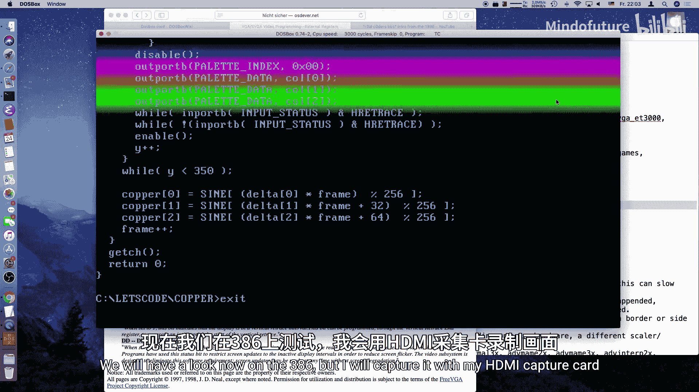
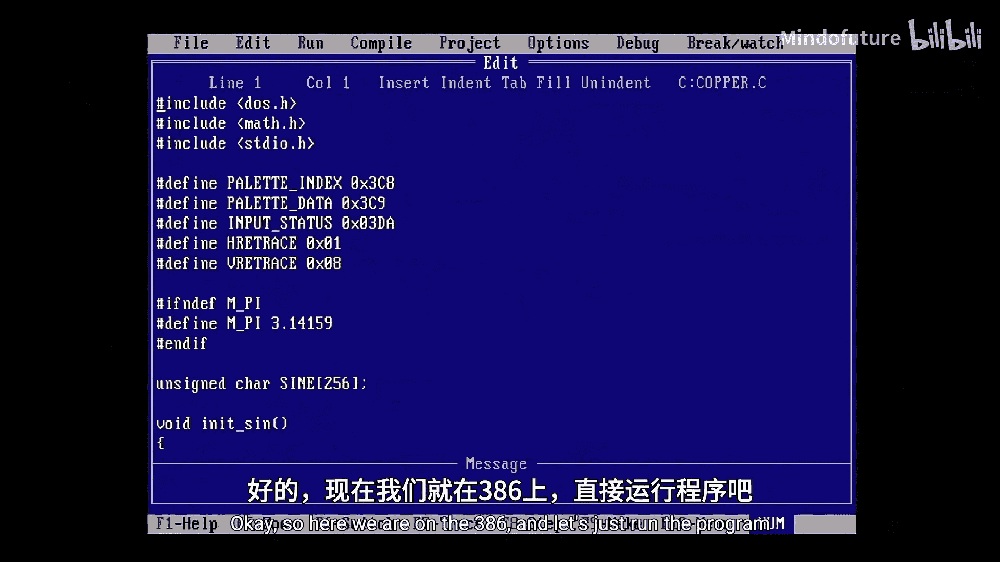
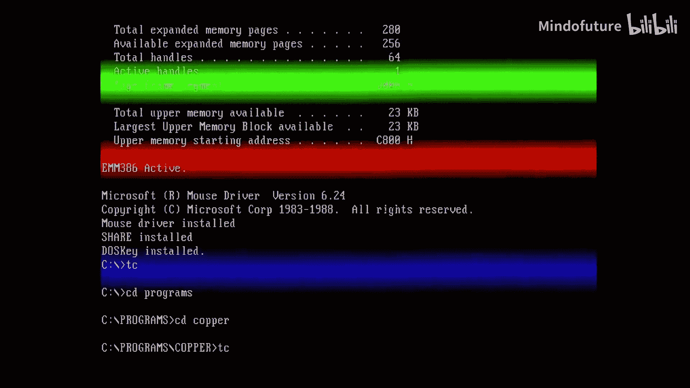

# 015：VGA铜条效果教程

## 概述

在本节课中，我们将学习如何在MS-DOS环境下，利用VGA显卡的硬件特性实现一个经典的图形效果——“铜条”或“光栅条”效果。这种效果在80年代和90年代的家用电脑上非常流行，常用于演示程序或破解软件的片头动画。我们将通过直接操作VGA寄存器，在文本模式下创造出平滑移动、带有渐变色彩的彩色横条。

## 铜条效果原理

上一节我们介绍了VGA的基本概念，本节中我们来看看铜条效果的工作原理。

这种效果的名字“铜条”源于Amiga电脑，其芯片上的一个名为“Copper”的协处理器可以实现复杂的视频特效。虽然PC的VGA芯片功能相对简单，但也能实现类似的效果。

其核心原理基于CRT显示器的扫描方式。显示器电子束从左到右、从上到下逐行扫描屏幕来绘制图像。通过在每个水平扫描行期间动态切换调色板颜色，我们就能创造出色彩平滑变化的横条效果。

为了实现这一点，我们需要精确地知道电子束当前扫描到了哪一行。VGA的输入状态寄存器（地址`0x3DA`）提供了这个能力。我们之前已经用它来同步垂直回扫。该寄存器的第0位是“显示禁用”位，当该位为1时，表示显示器正处于水平或垂直回扫区间。通过监视这个位的状态切换，我们可以精确地计数当前正在显示的行数。

## 准备工作与代码结构

理解了原理后，我们开始搭建程序框架。以下是实现效果所需的主要步骤和代码结构。

首先，我们需要包含必要的头文件，并定义一些常量和全局数据结构。

```c
#include <dos.h>   // 用于端口访问
#include <math.h>  // 用于sin函数（初始化阶段）
#include <stdio.h>
#include <conio.h>

#ifndef M_PI
#define M_PI 3.14159 // 旧C编译器可能没有定义PI
#endif

// VGA寄存器地址定义
#define INPUT_STATUS  0x3DA
#define PALETTE_INDEX 0x3C8
#define PALETTE_DATA  0x3C9

// 输入状态寄存器的位定义
#define VERTICAL_RETRACE   0x08 // 第3位
#define HORIZONTAL_RETRACE 0x01 // 第0位

// 预计算的256字节正弦查找表，用于快速生成动画值
unsigned char sin_table[256];
```

为了获得流畅的动画并避免在每帧都调用昂贵的`sin()`函数，我们将预先计算一个正弦值查找表。这个表将角度映射到0-255的亮度值。

```c
void init_sin_table() {
    int i;
    for (i = 0; i < 256; i++) {
        // 将i映射到0到2π的范围，计算sin值，结果从[-1,1]缩放到[0,255]
        double rad = (i / 255.0) * 2.0 * M_PI;
        sin_table[i] = (unsigned char)((sin(rad) + 1.0) / 2.0 * 255);
    }
}
```

## 主程序逻辑与动画实现

现在进入核心部分。我们将设置主循环，初始化变量，并实现逐行控制颜色的逻辑。

主函数首先初始化正弦表，然后进入一个循环，直到用户按键退出。在循环中，我们需要跟踪帧数、每个铜条的起始位置和移动速度。

```c
int main() {
    int frame = 0;
    int copper_start[3] = {0, 0, 0}; // 三个铜条（红、绿、蓝）的起始行
    int copper_delta[3] = {3, 1, 2}; // 每个铜条的移动速度（查表步进）
    int y, i, color_rgb[3];
    unsigned char status;

    init_sin_table();

    while (!kbhit()) { // 主循环，直到有按键
        // 1. 等待垂直回扫开始新的一帧
        disable(); // 禁用中断，确保计时精确
        do {
            status = inportb(INPUT_STATUS);
        } while ((status & VERTICAL_RETRACE) == 0);
        enable(); // 重新启用中断

        // 2. 逐行绘制屏幕（约350行）
        y = 0;
        while (y < 350) {
            // 等待当前行结束（水平回扫开始）
            disable();
            do {
                status = inportb(INPUT_STATUS);
            } while ((status & HORIZONTAL_RETRACE) == 0);
            enable();

            // 3. 根据当前行号y，计算并设置颜色
            // 我们将修改调色板中“黑色”（索引0）的颜色值
            // 这会使屏幕上所有黑色像素瞬间变色，形成横条
            color_rgb[0] = 0; color_rgb[1] = 0; color_rgb[2] = 0; // 默认黑色

            // 为每个铜条检查当前行是否在其范围内
            for (i = 0; i < 3; i++) {
                if (y >= copper_start[i] && y < copper_start[i] + 64) {
                    // 计算当前行在铜条内的相对位置 (0-63)
                    int pos_in_bar = y - copper_start[i];
                    // 创建渐变：前半段亮度增加，后半段亮度减少
                    int intensity;
                    if (pos_in_bar < 32) {
                        intensity = pos_in_bar * 2;      // 0 -> 62
                    } else {
                        intensity = (63 - pos_in_bar) * 2; // 62 -> 0
                    }
                    // 将强度值赋给对应的颜色通道
                    color_rgb[i] = intensity;
                }
            }

            // 将计算出的RGB值写入VGA调色板
            outportb(PALETTE_INDEX, 0); // 选择颜色索引0（黑色）
            outportb(PALETTE_DATA, color_rgb[0]); // 红色分量
            outportb(PALETTE_DATA, color_rgb[1]); // 绿色分量
            outportb(PALETTE_DATA, color_rgb[2]); // 蓝色分量

            y++; // 处理下一行
        }

        // 4. 更新动画：根据帧数和速度移动铜条位置
        frame++;
        for (i = 0; i < 3; i++) {
            // 使用正弦查找表产生平滑的上下移动
            // (frame * delta) % 256 确保在表内循环
            copper_start[i] = sin_table[(frame * copper_delta[i]) % 256];
        }
    }

    // 程序结束前，将颜色恢复为黑色
    outportb(PALETTE_INDEX, 0);
    outportb(PALETTE_DATA, 0);
    outportb(PALETTE_DATA, 0);
    outportb(PALETTE_DATA, 0);

    return 0;
}
```

## 关键技术与注意事项

在实现过程中，有几个技术细节需要特别注意，它们直接关系到效果能否正确运行。

1.  **精确计时**：使用`disable()`和`enable()`函数临时关闭中断，防止后台任务干扰我们对水平回扫信号的精确检测。这是效果稳定的关键。
2.  **DOSBox配置**：在DOSBox模拟器中运行此程序时，需要将机器类型设置为`machine=svga_s3`或`machine=vgaonly`，以确保输入状态寄存器被正确模拟。默认的SVGA S3模拟可能不支持此特性。
3.  **行数限制**：循环中我们只处理大约350行，而不是全部的400行。这是因为在真实的硬件上，代码执行速度可能无法跟上最高的行频，导致错过一些水平回扫信号。350是一个安全的数值。
4.  **调色板操作**：我们通过修改调色板中索引0的颜色（通常是黑色）来产生效果。这意味着屏幕上所有显示为“黑色”的像素都会瞬间变成我们设置的颜色。在文本模式下，这完美地创造了彩色横条，而无需绘制任何像素。



## 总结



本节课中我们一起学习了如何在MS-DOS环境下利用VGA硬件实现经典的铜条效果。我们深入了解了CRT扫描原理，掌握了通过`0x3DA`端口检测水平回扫来精确控制逐行颜色的方法。通过预计算正弦表优化性能，并直接操作调色板寄存器，最终在文本模式下创造出了带有平滑渐变和动画的彩色横条。



这个效果展示了直接操作硬件带来的强大控制力和效率，即使是在功能相对简单的VGA芯片上。你可以尝试修改代码中的颜色、速度、渐变形状，甚至同时控制多个调色板索引，来创造出属于自己的独特演示效果。