# 016：VGA 文本模式平滑滚动教程

## 概述

在本节课中，我们将学习如何在 MS-DOS 环境下，利用 VGA 显卡的 CRTC 控制器寄存器，在文本模式下实现平滑的垂直滚动效果。我们将从上一节课的“铜条”效果程序出发，修改它以支持逐像素级别的平滑滚动。

---

## 准备工作

上一节我们介绍了如何通过修改调色板实现 VGA 文本模式下的“铜条”效果。本节中，我们来看看如何利用 VGA 的硬件特性实现平滑滚动。

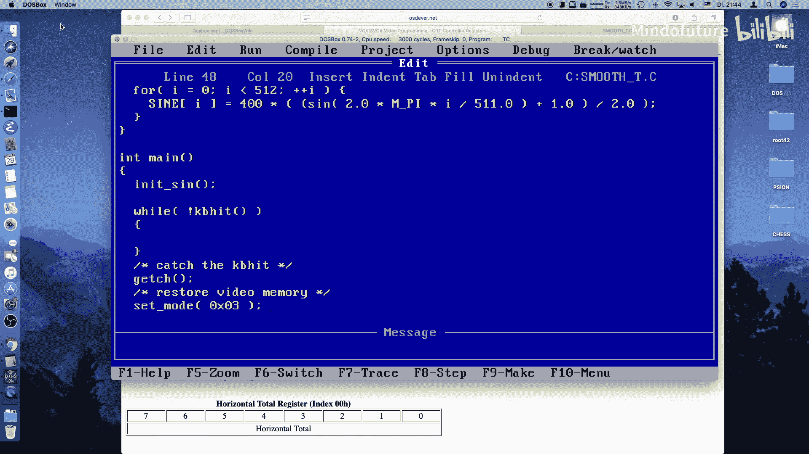

首先，我们需要一个基础程序。我们将使用上一节课的代码，但需要做一些关键修改。

以下是需要调整的核心部分：

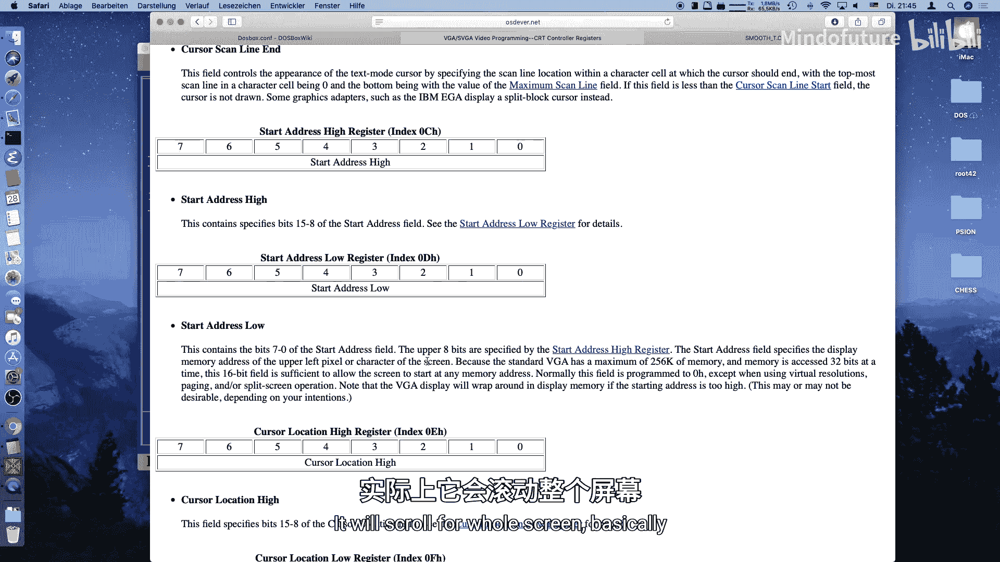

1.  **正弦函数表**：为了获得更平滑的滚动，我们需要更高精度的正弦波。我们将表的长度从 256 增加到 512，并将输出值范围映射到 0-400（对应文本模式的 400 像素高度）。
    ```c
    #define SINE_TABLE_SIZE 512
    unsigned char sine_table[SINE_TABLE_SIZE];
    // ... 初始化代码，将值归一化到 0-511 范围 ...
    ```
2.  **核心变量**：我们需要跟踪当前帧、垂直行偏移和像素偏移。
    ```c
    unsigned int frame = 0;
    unsigned int line = 0;
    unsigned int pixel = 0;
    unsigned int offset = 0;
    ```

---

## 理解滚动原理

平滑滚动的核心在于操纵 VGA CRTC（阴极射线管控制器）的两个寄存器。

以下是相关的两个关键寄存器：

*   **起始地址高位寄存器**：索引为 `0x0C`。它指定屏幕左上角字符在显示内存中地址的高 8 位。
*   **起始地址低位寄存器**：索引为 `0x0D`。它指定地址的低 8 位。

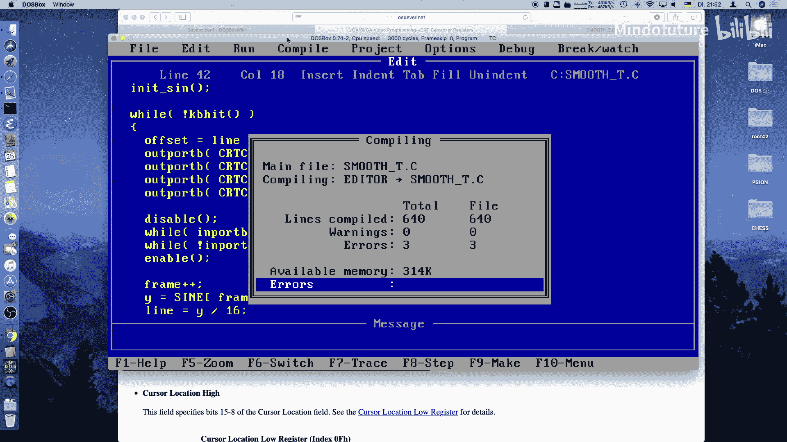

通过修改这个“起始地址”字段，我们可以告诉 VGA 从显存的不同位置开始读取数据并显示，从而实现**整行（字符行）级别的滚动**。在文本模式下，每行有 80 个字符，因此偏移量计算为 `行号 * 80`。

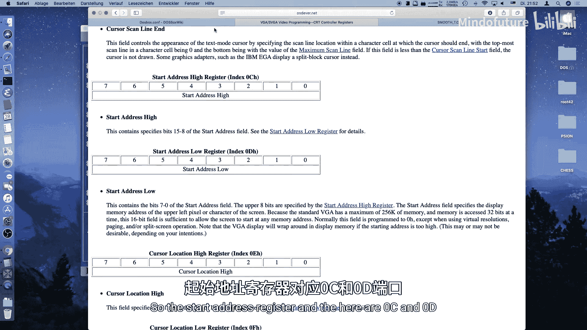

然而，仅靠起始地址寄存器只能实现跳跃式的行滚动。为了实现**像素级别的平滑滚动**，我们需要另一个寄存器。

---

## 实现像素级偏移

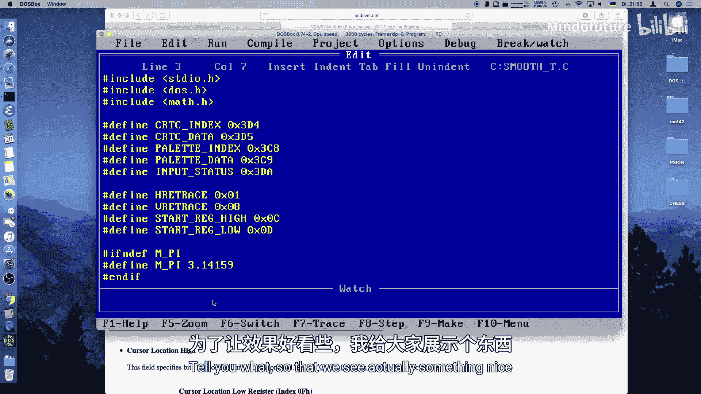

为了实现像素级的精细控制，我们需要使用 **预置行扫描寄存器**。

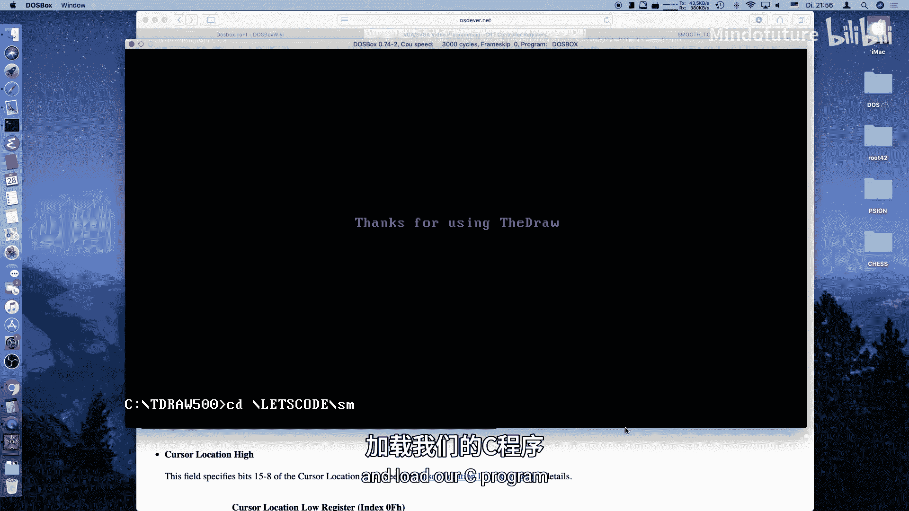

这个寄存器的索引是 `0x08`。它允许我们将渲染的起始行向上偏移最多 31 个扫描行（使用其低 5 位）。对于文本模式（每个字符块高 16 像素），我们最多需要偏移 15 个像素，因此使用低 4 位即可。

其工作原理是：当我们通过起始地址寄存器切换到一个新的字符行时，预置行扫描寄存器可以指定从该字符块的第几个像素行开始显示，从而实现字符行内的平滑滚动。

---

## 整合代码流程

现在，我们将上述原理整合到主循环中。以下是每一帧需要执行的操作步骤：

1.  **计算滚动位置**：根据正弦函数和当前帧数，计算出当前垂直位置的像素坐标 `y`。
    ```c
    y = sine_table[frame % SINE_TABLE_SIZE]; // y 范围 0-511
    ```
2.  **分解为行和像素**：将像素坐标 `y` 分解为字符行号 `line` 和行内像素偏移 `pixel`。
    ```c
    line = y / 16; // 每个字符高16像素
    pixel = y % 16;
    ```
3.  **计算显存偏移**：根据行号计算显存中的字节偏移量。
    ```c
    offset = line * 80; // 每行80字符
    ```
4.  **写入起始地址寄存器**：在垂直回扫期间，将偏移量的高字节和低字节分别写入 CRTC 寄存器，以实现行切换。
    ```c
    outportb(CRTC_INDEX, START_ADDRESS_HIGH);
    outportb(CRTC_DATA, (offset >> 8));
    outportb(CRTC_INDEX, START_ADDRESS_LOW);
    outportb(CRTC_DATA, offset & 0xFF);
    ```
5.  **写入预置行扫描寄存器**：紧接着，写入像素偏移量，实现行内的平滑滚动。
    ```c
    outportb(CRTC_INDEX, PRESET_ROW_SCAN);
    outportb(CRTC_DATA, pixel & 0x0F); // 只取低4位
    ```
6.  **同步垂直回扫**：所有寄存器操作必须与垂直回扫同步，以避免屏幕撕裂。
    ```c
    // 等待垂直回扫开始
    while ((inportb(INPUT_STATUS) & VRETRACE_MASK));
    // 等待垂直回扫结束
    while (!(inportb(INPUT_STATUS) & VRETRACE_MASK));
    ```
7.  **更新帧计数器**：递增帧数，为下一帧计算新的位置。
    ```c
    frame++;
    ```

---

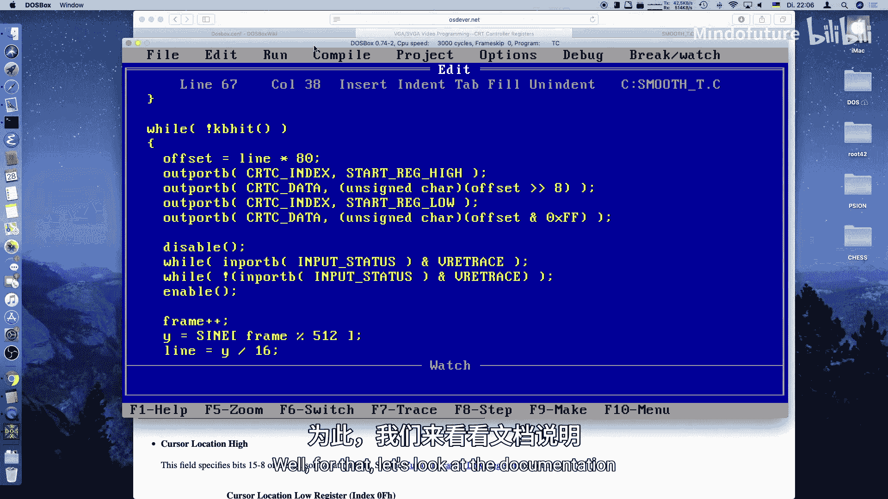

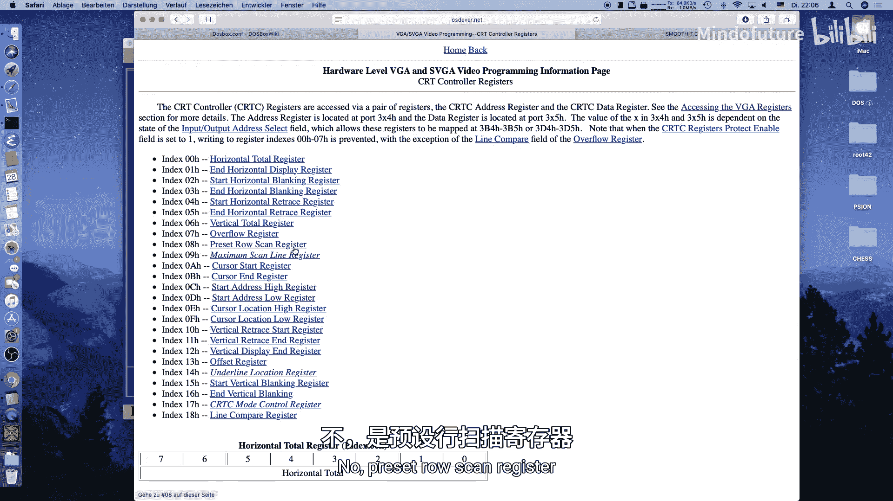

## 增强视觉效果（可选）

为了让效果更明显，我们可以用图像填充显存，而不是空白屏幕。可以使用像 “The Draw” 这样的 DOS 绘图工具创建图像，并将其导出为 C 语言头文件，然后在程序中包含并复制到显存。

以下是加载图像的示例代码：

```c
#include “image1.h“ // 包含图像数据
unsigned char far *buffer = (unsigned char far *)0xB8000000L; // 文本模式显存地址
// 将图像数据复制到显存
for(i = 0; i < image_data_1_length; i++) {
    buffer[i] = image_data_1[i];
}
```

---

## 总结

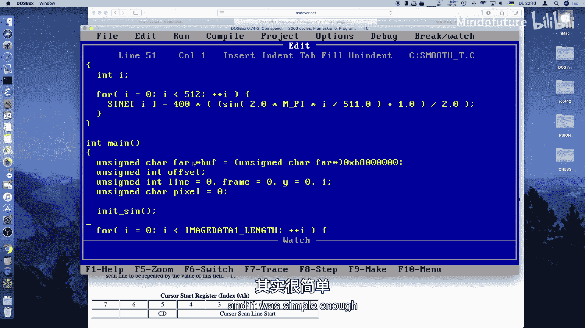

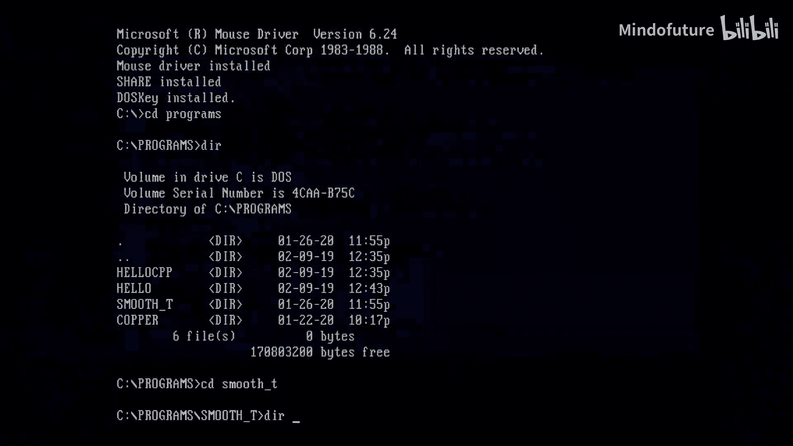

本节课中，我们一起学习了 VGA 文本模式下的平滑滚动技术。

我们掌握了两个核心的 CRTC 寄存器：
1.  **起始地址寄存器**：用于控制显存中屏幕起始点的字符行级定位。
2.  **预置行扫描寄存器**：用于实现字符行内部的像素级精细偏移。

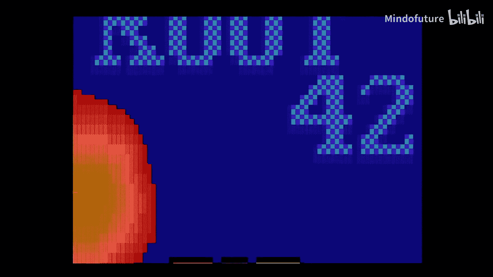

通过结合使用这两个寄存器，并与垂直回扫同步，我们成功实现了极其平滑的垂直滚动动画。这个效果即使在真实的 386 机器上也能以 70Hz 的刷新率流畅运行。这项技术是许多经典 DOS 游戏和演示场景中实现视差滚动、菜单动画等效果的基础。在后续课程中，我们将以此为基础，探索水平滚动以及图形模式下的平滑滚动技术。