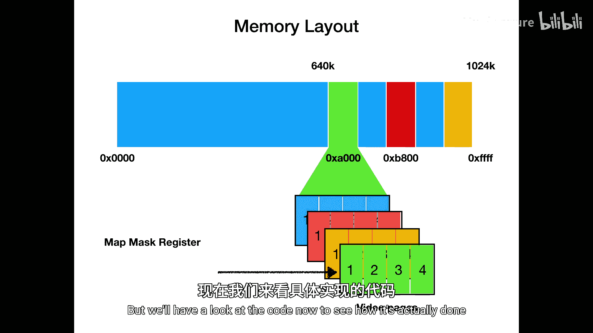
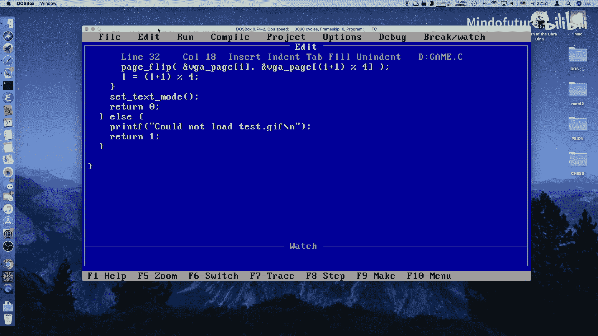
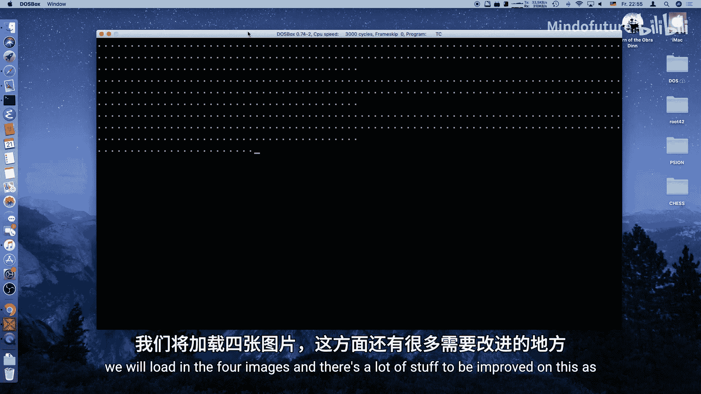

# 017：神秘的VGA模式X

## 概述

在本节课中，我们将要学习如何解锁VGA显卡的全部潜力，进入一个被称为“模式X”或“模式Y”的隐藏图形模式。这个模式提供了远超标准256色模式13的功能，包括页面翻转和平滑滚动能力，是编写流畅动画和游戏的关键。

## PC内存布局回顾

上一节我们介绍了VGA编程的基础，本节我们来看看PC的内存布局。理解这一点对于访问VGA的全部内存至关重要。

原始的PC可以访问1 MB的RAM。其中较低的640 KB用于应用程序和DOS。紧接着640 KB之后，是段地址 `0xA000`，这是EGA和VGA显卡的帧缓冲区。

然后是一些上端内存块，可用于扩展卡或加载驱动程序。文本模式CGA的帧缓冲区位于 `0xB800`。在1 MB内存的顶端，是BIOS ROM。

对于VGA而言，其内存段 `0xA000` 只有64 KB大小。然而，所有VGA卡，即使是IBM最早的型号，都至少安装了256 KB内存。许多卡甚至有512 KB或1 MB。但64 KB的段地址意味着我们无法直接访问剩余的192 KB内存，这非常可惜。

## VGA架构与位平面

VGA的前身EGA卡引入了“位平面”的概念。在16色模式下使用了4个位平面，但一次只能激活一个平面。VGA延续了这个概念，但我们称之为“字节平面”，它们可以用来切换访问整个256 KB内存。

以下是VGA的主要组件，我们需要对它们进行编程才能实现上述功能：
*   **图形控制器**：位于系统总线上，负责总线接口和读写逻辑以访问视频内存。
*   **视频内存**：组织为4个64 KB的平面，总计256 KB。
*   **定序器**：读取视频内存，并与DAC通信。
*   **数模转换器**：与CRT控制器通信。
*   **CRT控制器**：在屏幕上生成图像。

我们可以通过VGA的I/O端口来编程这些组件。VGA I/O端口是索引式的。这意味着首先，我们将要写入的寄存器索引发送到对应的索引端口，然后，在第二个数据端口上进行读写操作。

例如，属性控制器的索引端口是 `0x3C0`，数据端口是 `0x3C1`。定序器有类似的端口 `0x3C4` 和 `0x3C5`。

## 从模式13到模式X/Y

之前我们学习了模式13，这是我们已经知道的、由VGA BIOS提供的唯一支持256色的模式。

它的优点是兼容MCGA的64 KB标准，并且编程非常简单。我们拥有平坦的像素寻址方式，该段内的每个字节直接对应320x200屏幕上的一个像素，并且刷新率为70 Hz，基本无闪烁。

它的缺点是功能不够强大。没有页面翻转功能，无法进行平滑滚动，并且像素不是正方形的。

页面翻转正是我们最想要的功能之一，配合滚动能力，可以实现流畅的动画。

页面翻转的原理是：你有一个当前正由CRT控制器显示在屏幕上的**前缓冲区**，然后在后台，你向一个**后缓冲区**进行绘制，这个缓冲区不会显示在屏幕上。重绘有时会花费超过一帧屏幕刷新的时间。如果我们在前缓冲区进行绘制，你就能看到屏幕是如何被一笔笔画出来的，从而产生屏幕撕裂和各种奇怪的伪影。一旦完成后缓冲区的绘制，你就可以无缝地切换到后缓冲区，然后循环往复。这对于动画和游戏尤其有用。

那么，如何进入模式X和模式Y呢？我们基本上是通过进入模式13来开始的，它已经设置了所有重要的图形服务。模式X由Michael Abrash推广，它是一种隐藏模式，因为BIOS并不支持它。但实际上，VGA的所有寄存器都有很好的文档记录。

模式X真正释放了VGA的全部威力。它使页面翻转和滚动成为可能，并且我们可以访问大约3个屏幕页。每个页面在320x240分辨率下拥有方形像素，图像以60 Hz刷新。

如果我们调整刷新率和屏幕大小，最终会得到一种被称为**模式Y**的模式。它与模式X相同，但使用了熟悉的320x200分辨率，并具有70 Hz的刷新率。这为我们提供了恰好四个屏幕页，外加一些额外的行，我们可以以各种方式使用它们，并且仍然可以使用为320x200分辨率制作的所有图形资源。

## 设置模式Y

以下是设置模式Y的步骤：

1.  首先，我们通过调用中断 `0x10` 切换到模式13。
2.  然后，我们将VGA定序器控制器中的内存模式寄存器设置为 `0x06`。查看该寄存器中的位，这意味着我们启用了256 KB RAM、顺序访问和链4模式。链4模式允许我们写入映射掩码寄存器，以选择当前哪个位平面可用于读取或写入。这是实际访问VGA卡全部内存的关键步骤之一。
3.  其次，我们将CRTC下划线位置寄存器设置为 `0`，以禁用所谓的“字寻址模式”，这进一步允许我们访问所有视频内存。
4.  最后，我们将CRTC模式控制寄存器设置为十六进制值 `0xE3`。查看字节模式，这最终启用了字节寻址，这是启用访问全部256 KB的最后一步。

如果这些对你来说意义不大，我们稍后会再回顾。你只需要查找这些值并将它们写入正确的寄存器。弄清楚如何做到这一点并不难，这可能是困难的部分，但早在30多年前，那些可能比我们聪明得多的人就已经完成了这项工作。无论如何，我们可以利用他们的知识，获得一个非常适合编程游戏的模式。

## 在模式Y中访问像素

现在，在模式Y中，我们如何使用映射掩码寄存器来访问单个像素呢？如前所述，我们用它来选择四个字节平面中的一个。

每个字节平面包含我们能看到的所有视频页，但只包含单个视频页的大约四分之一。因此，要访问一个像素，我们取像素的x坐标并计算 `x % 4`。例如，对于前四个像素，我们得到0，1，2，3，然后又回到0。所以，每第四个像素将在字节平面0上，然后是字节平面1、2、3，依此类推。

整个内存包含所有四个页面，我们可以将其可视化。这就是我们之前看到的内存布局，也是VGA卡实际看到的方式，以及它如何映射到段 `0xA000`。

我们可以使用映射掩码寄存器来，例如，选择蓝色字节平面并写入我们想要的所有像素。完成后，我们可以切换到红色、橙色和绿色字节平面。当然，这比我们在模式13中拥有的寻址方式要复杂得多。

你应该避免过于频繁地切换字节平面，因为这是一个非常耗时的操作。当你设置单个像素时，你可能每次都无法绕过选择映射掩码寄存器。但是，当你在进行块传输时，例如复制内存的整个部分，你应该总是先为字节平面0复制一帧所需的所有内容，然后只有当字节平面0中的所有操作都完成后，才切换到字节平面1，依此类推。

## 代码实现

现在，让我们看看代码是如何实际完成的。我们将增强之前的图像加载器，加载四张不同的图像，以展示四个VGA页面的使用。

我们将实现以下关键函数：
*   `set_mode_y()`: 初始化模式Y。
*   `set_pixel()`: 在指定页面和坐标设置像素颜色（当前版本较慢）。
*   `copy_to_page()`: 将源图像数据复制到指定的VGA页面。
*   `page_flip()`: 执行页面翻转，交换前后缓冲区。

在 `set_mode_y()` 函数中，我们依次执行以下操作：
1.  调用 `set_mode(VGA_256_COLOR_MODE)` 进入模式13。
2.  初始化四个页面的偏移量地址：`page_offset = (VGA_WIDTH * VGA_HEIGHT / 4) * page_index`。
3.  向定序器内存模式寄存器（索引`0x04`）写入 `0x06`，禁用链4模式。
4.  向CRTC下划线位置寄存器（索引`0x14`）写入 `0x00`，禁用双字模式。
5.  向CRTC模式控制寄存器（索引`0x17`）写入 `0xE3`，启用字节模式。
6.  使用映射掩码寄存器选择所有平面（写入 `0x0F`），并清除全部256 KB视频内存。

`set_pixel(page, x, y, color)` 函数的工作流程如下：
1.  计算目标像素所在的字节平面：`plane = x & 3`。
2.  向定序器映射掩码寄存器（索引`0x02`）写入 `1 << plane`，以选择对应的平面。
3.  计算在选定平面内的内存地址：`address = page_offset + (VGA_WIDTH * y + x) / 4`。
4.  向 `address` 处写入 `color`。

`copy_to_page(src, page_offset, height)` 函数简单地遍历x和y坐标，对每个像素调用 `set_pixel`。

`page_flip()` 函数的核心是交换前后缓冲区的页偏移量指针，然后计算并设置CRTC的起始地址高位和低位寄存器，以告诉硬件从新的内存地址开始显示。为了无撕裂地切换，我们通常需要等待垂直回扫期。

## 总结

本节课中我们一起学习了神秘的VGA模式X/Y。我们了解了标准模式13的局限性，探索了通过直接编程VGA寄存器来解锁全部256 KB视频内存、实现页面翻转功能的方法。我们回顾了VGA的位平面内存架构，并动手实现了设置模式Y、像素写入、图像复制和页面翻转的代码。虽然目前的像素写入例程速度较慢，但它为我们构建更复杂的图形操作（如快速位块传输、滚动和精灵）奠定了坚实的基础。在接下来的课程中，我们将优化这些例程，并探索模式X/Y带来的更多可能性。