# 019：VGA Mode X 快速位块传输 🚀

在本节课中，我们将学习如何优化在VGA Mode X图形模式下将图像数据（位块）从内存传输到屏幕的过程。我们将通过改进现有的`copy_to_page`函数，实现一个名为`blit_to_page`的更快版本，并调整GIF加载器以支持Mode X格式的内存布局。

---

## 概述

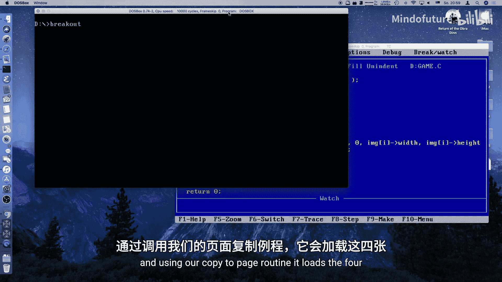

上一节我们介绍了VGA Mode X的基本概念和页面翻转技术。本节中，我们将重点解决在Mode X下绘制图形（位块传输）速度过慢的问题。原始的逐像素设置方法效率低下，我们将通过按平面（plane）组织内存并进行批量复制来大幅提升性能。

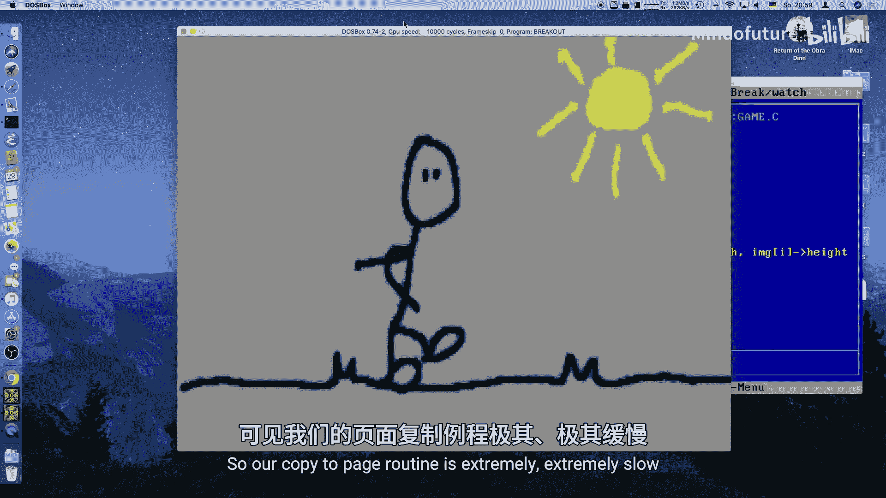

---

## 问题分析：为什么原始的 `copy_to_page` 很慢？

原始的 `copy_to_page` 函数循环遍历每个像素，并使用 `set_pixel` 函数将其写入VGA内存。`set_pixel` 函数的核心问题在于，每次写入一个像素都需要通过两次I/O端口操作（`OUT`指令）来选择合适的图形平面（plane）。

**核心瓶颈**：
1.  **频繁的端口I/O操作**：`OUT` 指令在x86架构上相对较慢。
2.  **单字节写入**：每次只能写入一个字节，无法利用处理器的批量数据传输能力（如`REP MOVSB`指令）。

这导致动画帧率极低，大约只有每秒1帧。

---

## 解决方案：`blit_to_page` 函数

为了解决上述问题，我们设计一个新的 `blit_to_page` 函数。其核心思想是：
1.  按VGA的四个图形平面分别处理数据。
2.  为每个平面只执行一次端口I/O操作来设置掩码。
3.  然后使用内存复制指令（`memcpy`）一次性复制整行数据。

以下是该函数的关键步骤和伪代码逻辑：

```c
void blit_to_page(int page, byte* source, int x, int y, int width, int height) {
    for (int plane = 0; plane < 4; plane++) {
        // 1. 计算当前平面在源位图中的起始偏移量
        dword bitmap_offset = plane * (width * height / 4);

        // 2. 计算当前平面在目标VGA内存中的起始偏移量
        //    考虑目标坐标(x,y)和平面偏移
        int effective_plane = (plane + x) % 4;
        dword screen_offset = (y * SCREEN_WIDTH + x) / 4;

        // 3. 通过一次端口写入，设置当前要操作的VGA平面
        set_plane_mask(1 << effective_plane);

        // 4. 按行复制数据
        for (int row = 0; row < height; row++) {
            memcpy(VGA_MEM + page_offset + screen_offset,
                   source + bitmap_offset,
                   width / 4); // 每行数据量是宽度/4
            // 更新偏移量，指向下一行
            bitmap_offset += width / 4;
            screen_offset += SCREEN_WIDTH / 4;
        }
    }
}
```

**关键公式与概念**：
*   **平面计算**：`plane = x % 4`。在Mode X下，水平方向上每4个像素属于不同的图形平面。
*   **内存布局**：源图像数据在**主内存**中也必须按照“平面优先”的方式存储，即所有像素的第0平面数据连续存放，然后是第1平面，以此类推。这与VGA显存中的布局一致。
*   **行复制**：设置好目标平面后，可以一次性复制 `width / 4` 字节的一整行数据，这比逐像素写入快几个数量级。

---

## 修改GIF加载器以支持Mode X格式

为了让 `blit_to_page` 函数正常工作，我们从GIF文件加载的图像数据在主内存中就必须是Mode X格式（平面化存储），而不是标准的线性（模式13h）格式。

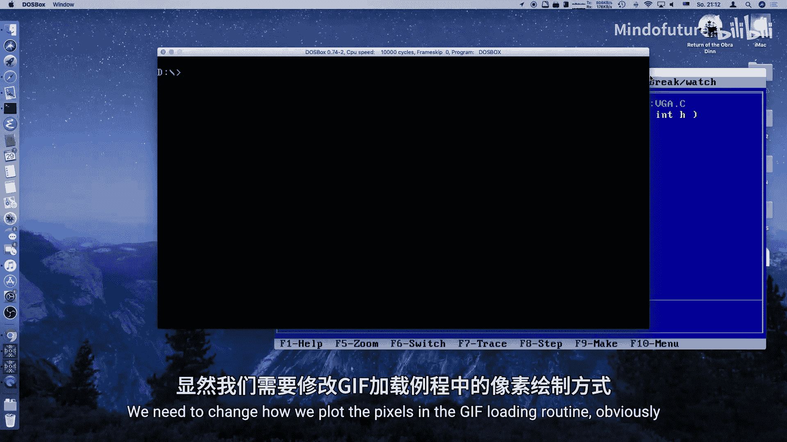

我们需要修改GIF解码器中的 `next_pixel` 例程：

以下是修改后的像素存储逻辑：

```c
if (decoder->mode_x) {
    // Mode X存储方式
    int plane = decoder->x % 4; // 确定像素属于哪个平面
    int x1 = decoder->x / 4; // 平面内的x坐标
    // 计算在平面化数组中的偏移量
    dword offset = plane * (decoder->width * decoder->height / 4);
    // 计算在目标平面行内的具体位置
    offset += decoder->y * (decoder->width / 4) + x1;
    // 存储像素颜色
    image_data[offset] = color;
} else {
    // 传统的线性存储方式 (用于模式13h)
    image_data[decoder->y * decoder->width + decoder->x] = color;
}
```

**修改要点**：
1.  向解码器状态添加一个 `mode_x` 标志。
2.  在加载GIF时，根据此标志决定以哪种格式将解压的像素存入内存数组。
3.  对于Mode X，计算像素对应的平面和在平面内的新坐标，然后存入正确位置。

---

## 性能对比与测试

完成上述修改后，我们进行测试：

1.  **启用优化 (`mode_x = 1`)**：动画运行极其流畅，帧率仅受垂直同步（约70Hz）限制，实现了每秒数十帧的渲染速度。
2.  **禁用优化 (`mode_x = 0`)**：切换回原始的 `copy_to_page` 函数，动画变得非常卡顿，大约只有每秒1-2帧。

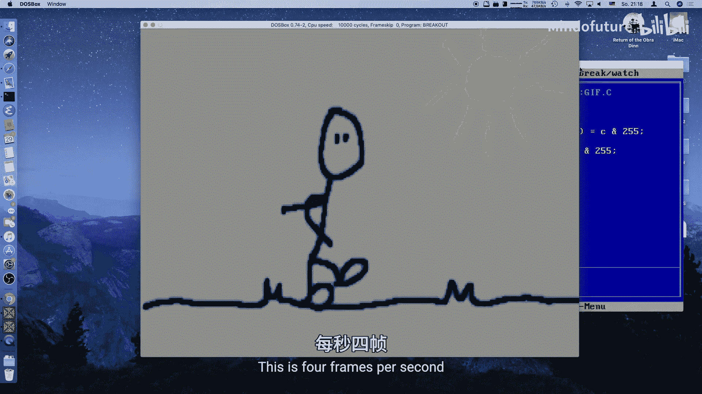

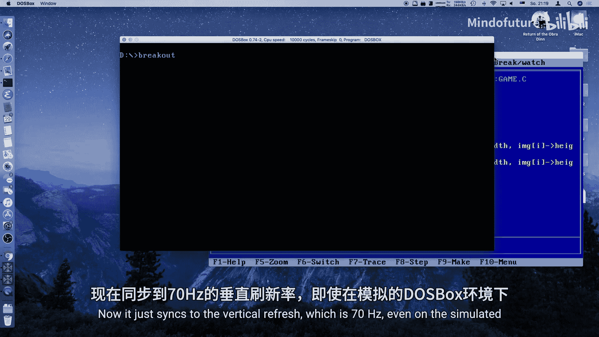

这个对比清晰地展示了优化带来的性能提升，可能达到**两个数量级（100倍）** 的差异。

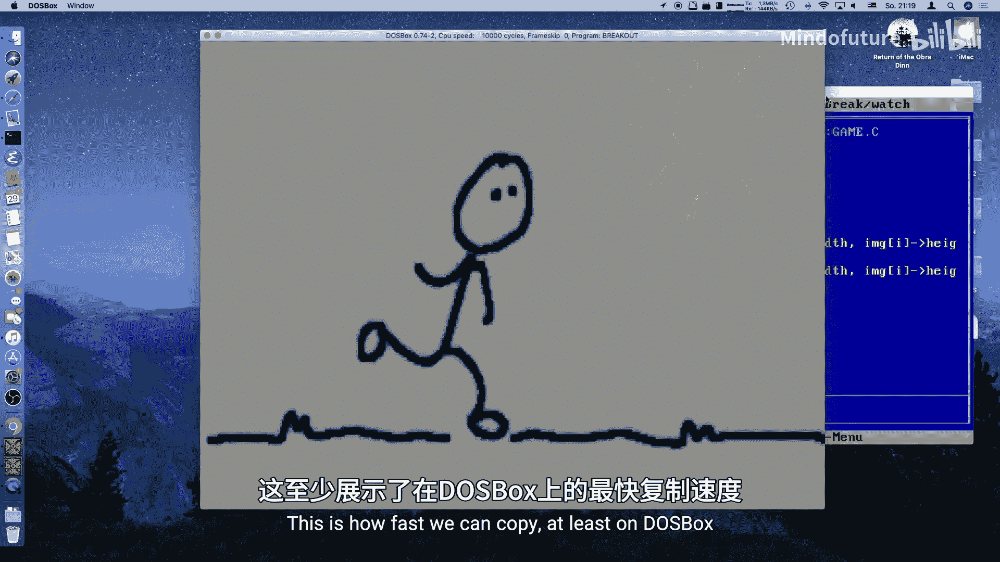

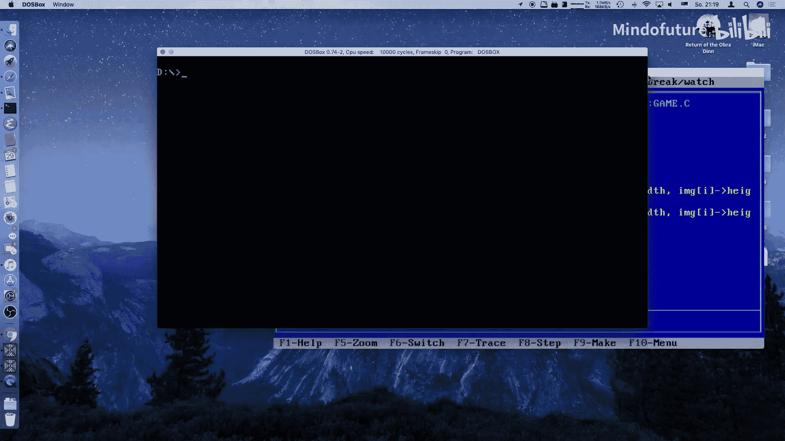

即使在真实的386 PC机（ISA总线，约8-16MB/s带宽）上测试，优化后的位块传输速度也令人满意，足以支撑动态游戏场景的渲染。

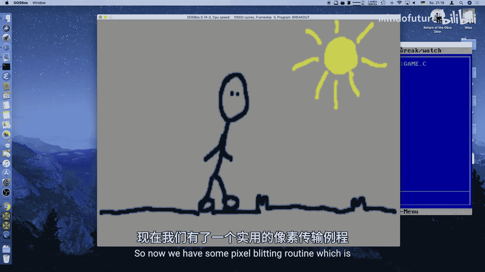

---

## 总结

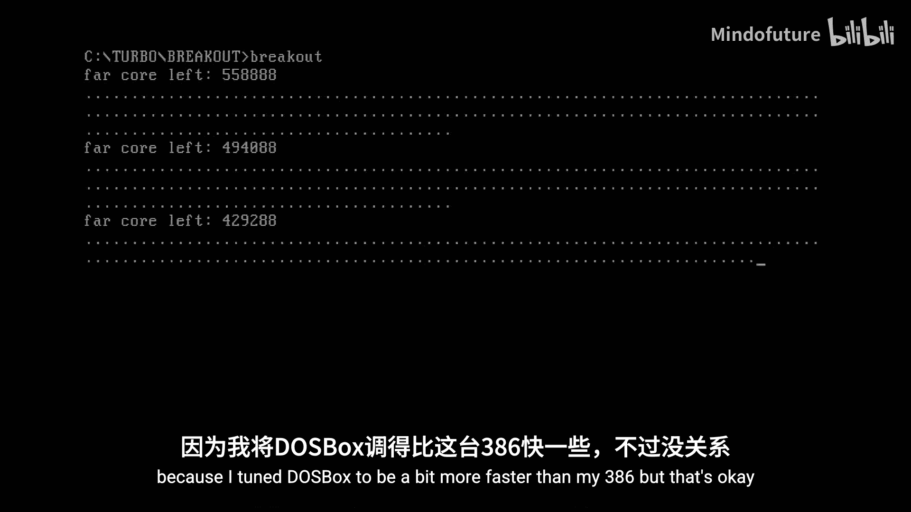

本节课中我们一起学习了如何为VGA Mode X实现高速位块传输（Blitting）。

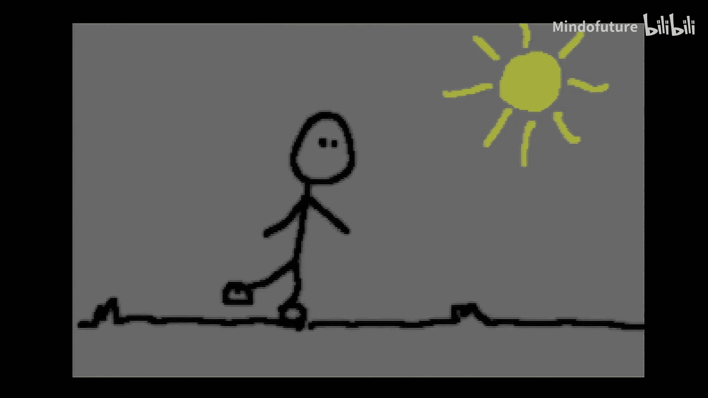

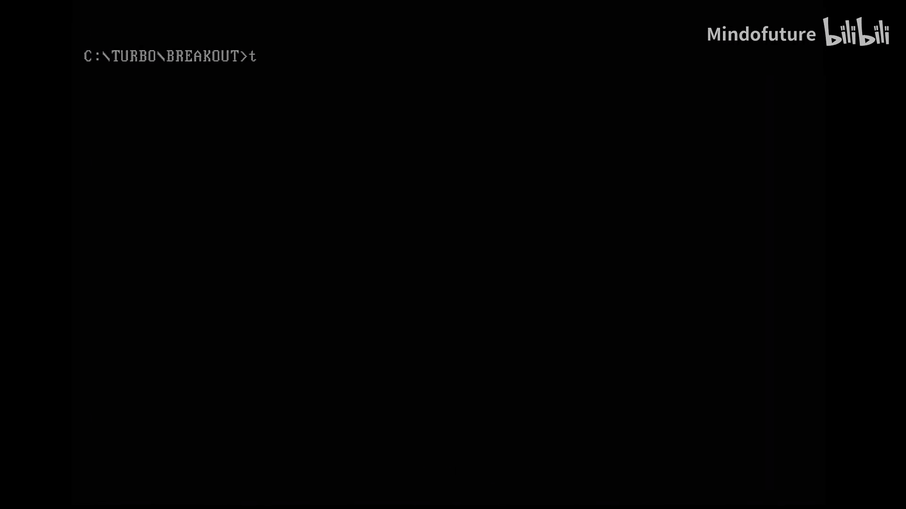

**核心收获**：
*   **理解了瓶颈**：原始的逐像素写入因频繁的I/O端口操作而效率低下。
*   **掌握了优化策略**：通过按图形平面组织数据，将多次I/O操作减少为每平面一次，并利用 `memcpy` 进行批量内存复制。
*   **实现了完整链路**：不仅改进了绘制函数 (`blit_to_page`)，还调整了资源加载器（GIF解码器），确保内存中的数据格式与VGA期望的格式匹配。
*   **验证了效果**：优化带来了巨大的性能提升，为后续实现游戏中的精灵（sprite）动画和动态场景打下了坚实基础。

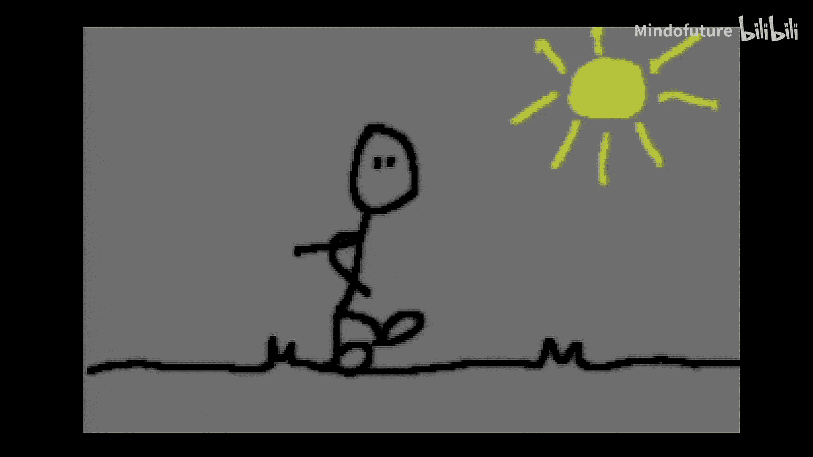

现在，我们拥有了一个高效的图形渲染基础，可以在接下来的课程中构建更复杂的游戏对象和交互逻辑。