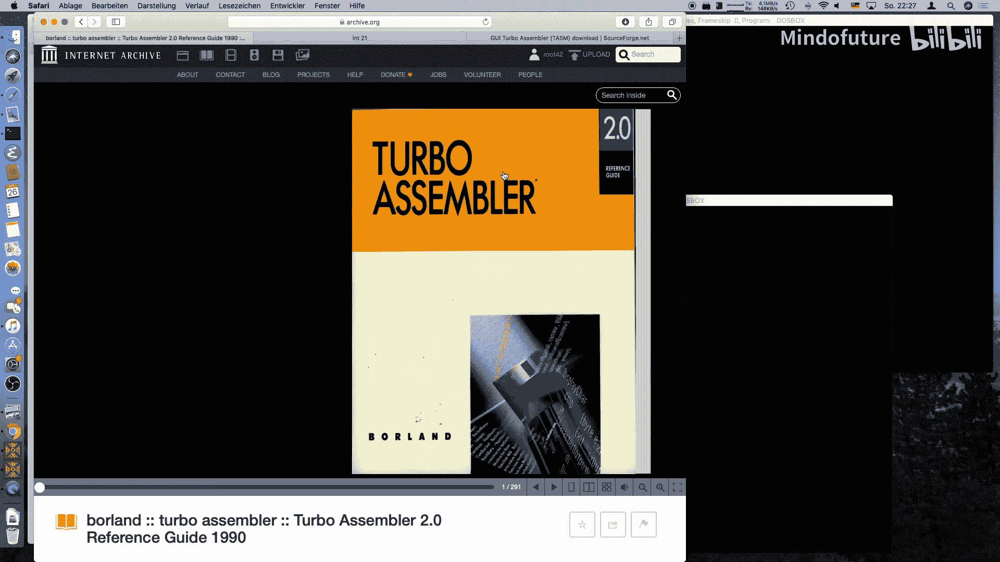
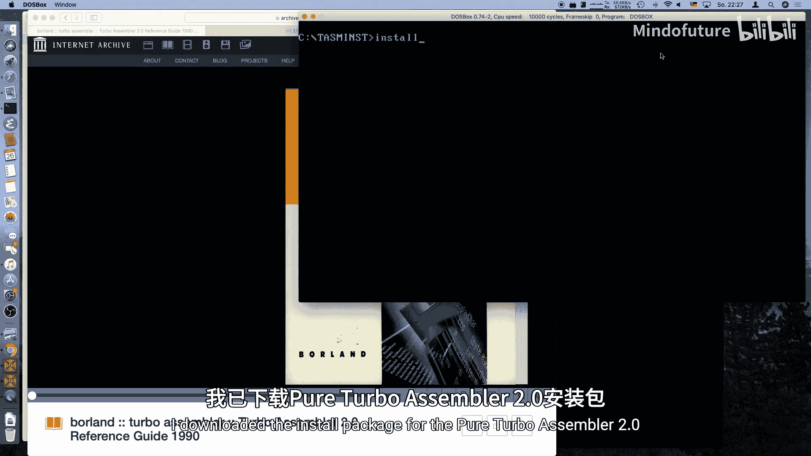
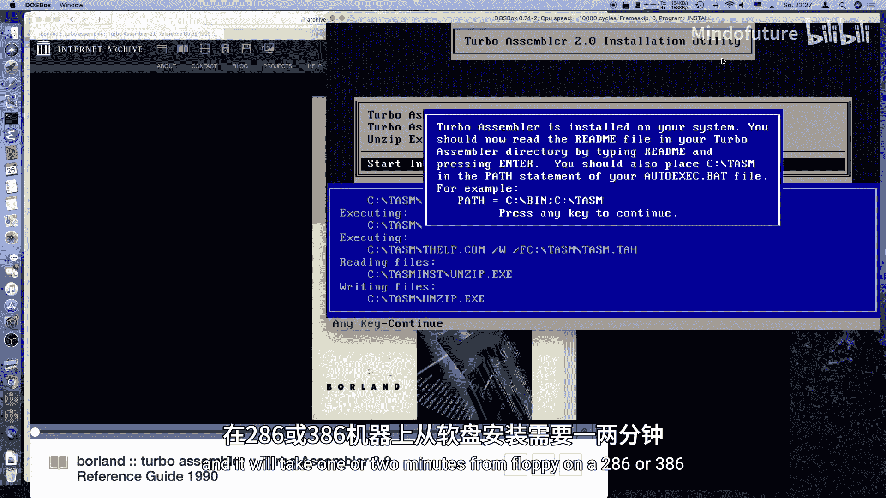
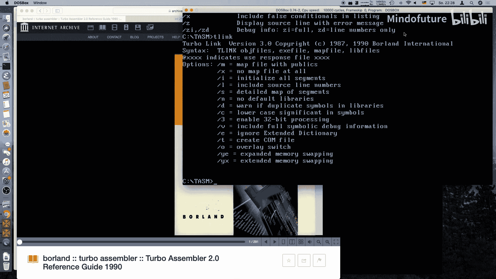
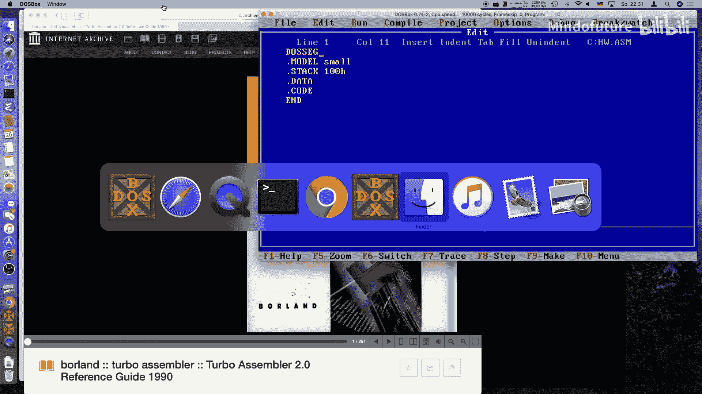
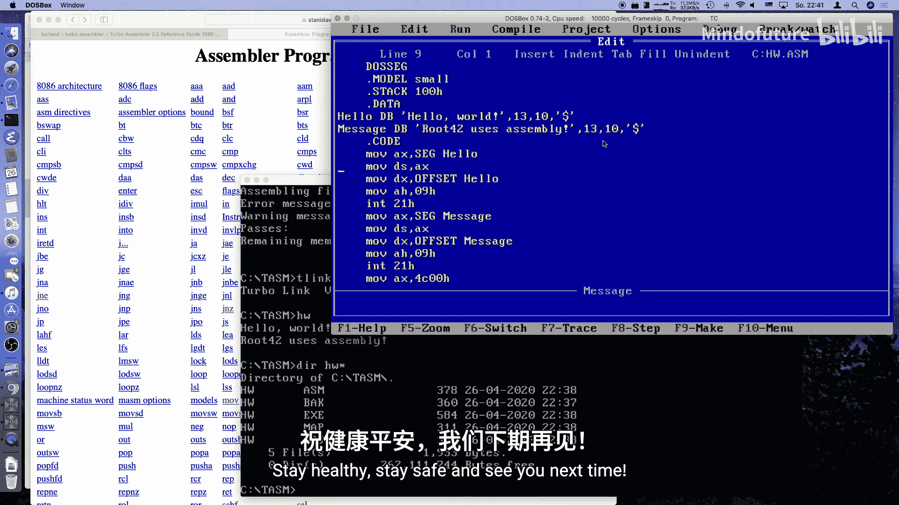

# 020：使用 x86 汇编编写 Hello World

## 概述
在本节课中，我们将学习如何使用 Turbo Assembler (TASM) 编写一个简单的 MS-DOS 汇编程序。我们将从设置环境开始，逐步编写一个能在屏幕上打印“Hello World”的程序，并了解汇编程序的基本结构。

## 环境准备与工具介绍
上一节我们介绍了汇编语言的基础概念，本节中我们来看看如何搭建一个简单的汇编开发环境。






首先，你需要一个汇编器。有多种选择，例如 Microsoft Macro Assembler、Netwide Assembler (NASM) 或 A86。在本系列中，我们使用与 Turbo C 2.01 配套的 Turbo Assembler 2.0。



你可以通过一些软件存档网站找到 Turbo Assembler 2.0。此外，SourceForge 上也有一个名为 “Gui Turbo Assembler” 的 Windows 版本，它包含了 TASM 和 TLINK。



安装过程很简单。运行安装程序，选择安装路径（例如 `C:\TASM`）。安装完成后，切换到 TASM 目录，你会看到许多示例文件，这对学习很有帮助。

以下是使用 TASM 和 TLINK 的基本流程：
1.  使用 `TASM` 命令将汇编源文件（`.ASM`）编译成目标文件（`.OBJ`）。
2.  使用 `TLINK` 命令将目标文件链接成可执行的 `.EXE` 文件。



## 汇编程序的基本结构
现在我们已经准备好了工具，接下来看看一个典型的 MS-DOS 汇编程序是什么样子的。

一个汇编程序由不同的“段”组成。最重要的几个段是：
*   **代码段**：存放程序指令。
*   **数据段**：存放变量和常量。
*   **堆栈段**：为函数调用和临时数据提供空间。

此外，我们通常会在程序开头使用 `.MODEL` 指令指定内存模型（如 `SMALL`），并使用 `DOSSEG` 指令确保段按照 MS-DOS 的约定顺序排列。

## 编写 Hello World 程序
了解了程序结构后，让我们动手编写第一个程序。我们将创建一个名为 `HELLO.ASM` 的文件。

首先，定义程序的基本框架：
```assembly
.MODEL SMALL
.STACK 100h
.DOSSEG
.DATA
    ; 变量将在这里定义
.CODE
    ; 代码将在这里开始
```
接下来，在数据段（`.DATA`）中定义我们要显示的字符串。在汇编中，使用 `DB`（Define Byte）来定义字节数据。MS-DOS 的打印字符串功能要求字符串以美元符号 `$` 结尾。
```assembly
.DATA
    hello DB ‘Hello World$‘
```
然后，在代码段（`.CODE`）中编写打印逻辑。MS-DOS 通过“中断”提供系统服务。打印字符串对应的是中断 `21h` 的功能 `09h`。
我们需要做三件事：
1.  将字符串的段地址加载到 `DS` 寄存器。
2.  将字符串的偏移地址加载到 `DX` 寄存器。
3.  将功能号 `09h` 放入 `AH` 寄存器，然后调用中断 `21h`。

代码如下：
```assembly
.CODE
start:
    MOV AX, @data   ; 获取数据段的地址
    MOV DS, AX      ; 将其设置到 DS 寄存器
    LEA DX, hello   ; 将 hello 字符串的偏移地址加载到 DX
    MOV AH, 09h     ; 设置功能号：打印字符串
    INT 21h         ; 调用 DOS 中断
```
最后，程序需要正确退出。我们使用中断 `21h` 的功能 `4Ch`。
```assembly
    MOV AX, 4C00h   ; 设置功能号 4Ch (退出)，返回码 00h (成功)
    INT 21h         ; 调用 DOS 中断
END start           ; 程序入口点标记为 ‘start‘
```

## 编译、链接与运行
代码编写完成后，我们需要将其转换为可执行文件。

以下是操作步骤：
1.  打开命令提示符，切换到源文件目录。
2.  使用 TASM 进行汇编：
    ```
    TASM HELLO.ASM
    ```
    如果成功，将生成 `HELLO.OBJ` 文件。
3.  使用 TLINK 进行链接：
    ```
    TLINK HELLO.OBJ
    ```
    这将生成 `HELLO.EXE` 文件。
4.  运行程序：
    ```
    HELLO
    ```
    屏幕上应该会显示 “Hello World”。

## 程序改进：添加换行
你可能会注意到，如果连续打印多个字符串，它们会连在一起。这是因为打印字符串功能不会自动添加换行。

在 MS-DOS 中，换行由两个字符组成：回车（CR，ASCII 13）和换行（LF，ASCII 10）。我们可以在字符串中直接包含它们。
```assembly
.DATA
    hello DB ‘Hello World‘, 13, 10, ‘$‘
    message DB ‘Route 42. Assembly, yay!‘, 13, 10, ‘$‘
.CODE
start:
    MOV AX, @data
    MOV DS, AX
    LEA DX, hello
    MOV AH, 09h
    INT 21h         ; 打印第一行
    LEA DX, message
    MOV AH, 09h
    INT 21h         ; 打印第二行
    MOV AX, 4C00h
    INT 21h
END start
```
重新汇编、链接并运行，现在两行文字就会分别显示了。

## 总结
本节课中我们一起学习了 x86 汇编编程的基础。我们了解了 MS-DOS 汇编程序的基本结构，包括代码段、数据段和堆栈段。我们学会了如何使用 `DB` 定义字符串，如何通过中断 `21h` 的功能 `09h` 在屏幕上输出文本，以及如何使用功能 `4Ch` 正确退出程序。最后，我们还掌握了如何为输出添加换行符。



虽然这个程序用 C 语言只需几行，但通过汇编语言，你能更深入地理解计算机底层是如何工作的。汇编程序通常非常紧凑，我们生成的这个可执行文件只有几百字节。在未来的课程中，我们可能会探索如何编写更小的 `.COM` 文件，甚至尝试用汇编语言编写简单的图形程序或游戏。