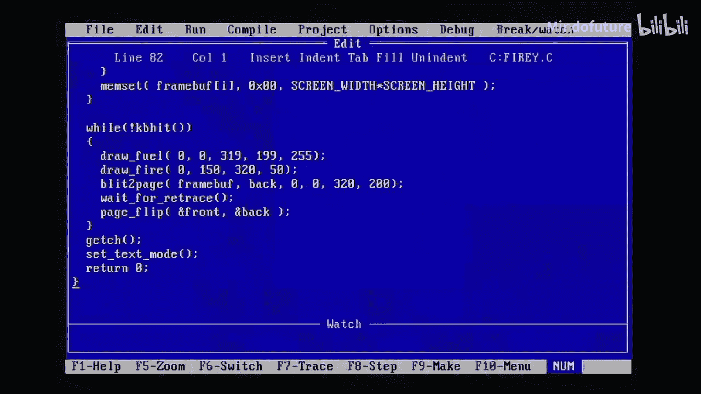
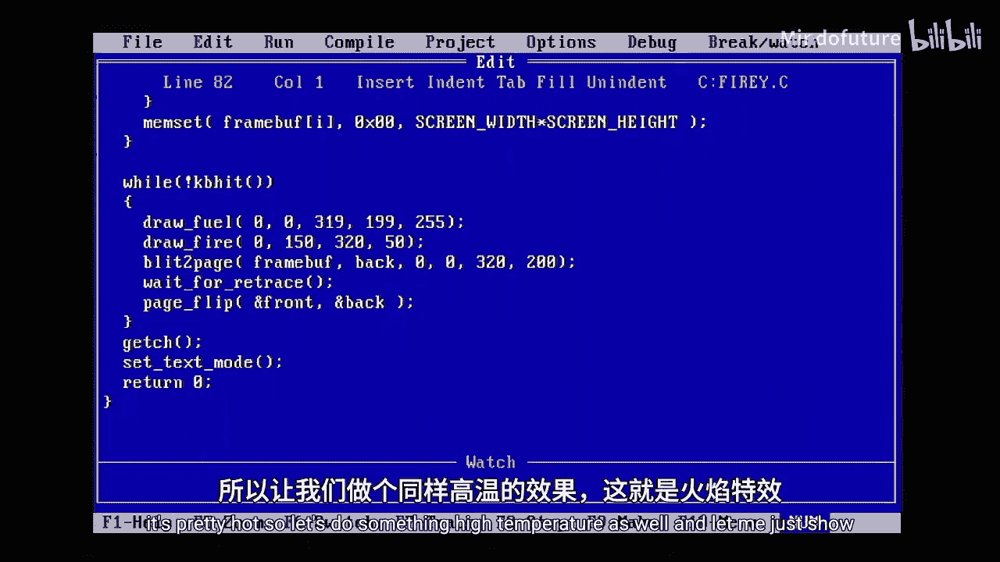
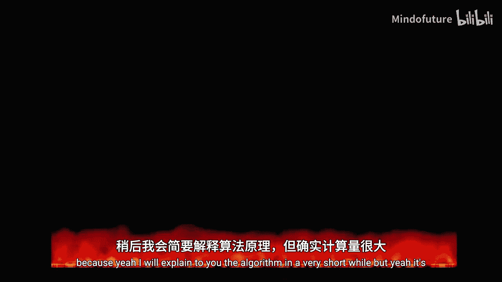
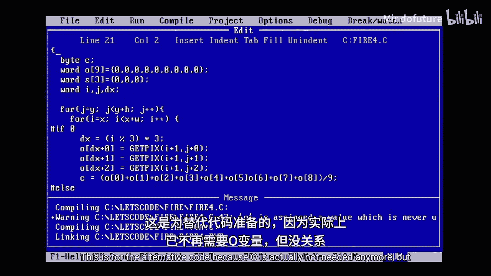
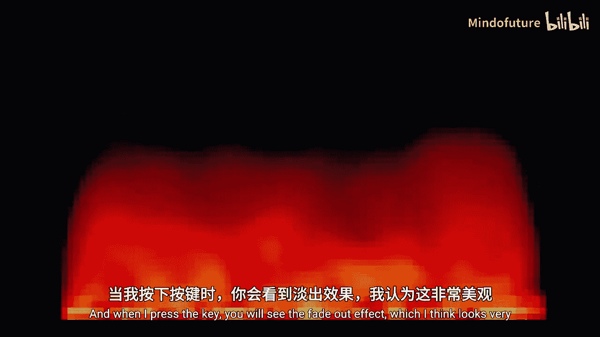
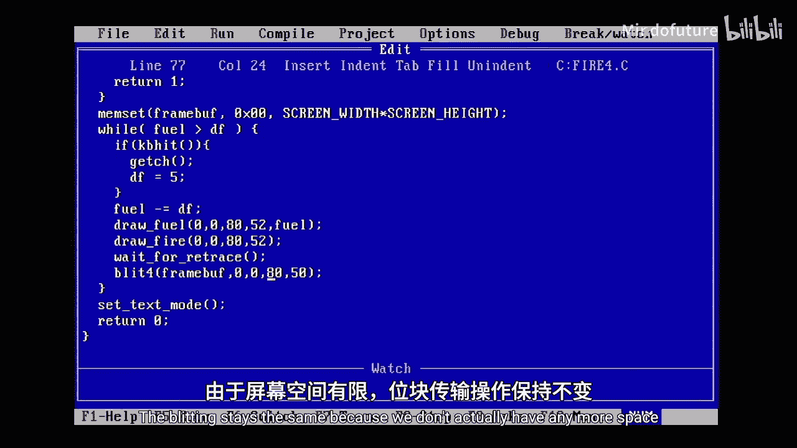
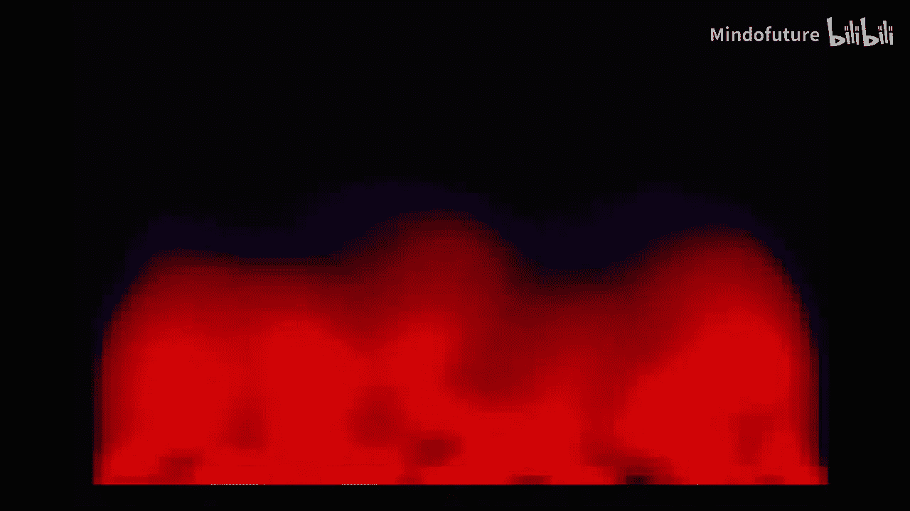

# 022：实现火焰特效 🔥





在本节课中，我们将学习如何在MS-DOS环境下，使用C语言和VGA图形模式，实现一个经典的火焰特效。我们将从算法原理开始，逐步编写代码，并利用VGA显卡的特性进行优化，最终得到一个运行流畅的火焰效果。



---

## 概述

火焰特效是一种经典的计算机图形效果，曾出现在许多演示程序和游戏中。其核心算法是通过在屏幕底部随机生成“燃料”像素，然后逐行向上计算模糊效果，模拟火焰的上升和扩散。虽然计算量较大，但通过巧妙的优化和利用VGA显卡的特定模式，我们可以在老旧的硬件上实现可观的帧率。

---

## 准备工作

在开始编写代码之前，我们需要一些基础。本教程基于之前的课程，因此你需要了解 `types.h` 和 `vga.h` 头文件。如果你还没看过之前的课程，建议先回顾一下。

我们还需要一个调色板文件 `palette.h`，它定义了火焰的颜色。为了简化，我们直接使用一个现成的256色调色板数据。

此外，我们将使用一个位于系统内存中的帧缓冲区（frame buffer），因为对系统内存的读写通常比对VGA显卡的直接操作更快，这对于我们的优化至关重要。

我们将定义简单的 `SET_PIXEL` 和 `GET_PIXEL` 宏来操作这个帧缓冲区，其逻辑与标准的VGA 13h模式类似。

```c
#define SET_PIXEL(fb, x, y, c) (fb[(y) * SCREEN_WIDTH + (x)] = (c))
#define GET_PIXEL(fb, x, y)    (fb[(y) * SCREEN_WIDTH + (x)])
```
注意，在定义这样的宏时，务必将参数用括号括起来，以避免当参数是表达式时可能出现的运算优先级问题。

---

## 主程序结构

上一节我们介绍了基础概念和宏定义，本节中我们来看看主程序 `main` 函数的整体结构。程序主要分为初始化、主循环和清理三个阶段。

以下是主函数的主要步骤：

1.  **变量声明**：我们需要一个变量来记录燃料强度（`fuel_intensity`），一个帮助退出的变量，以及循环计数器。
2.  **初始化随机数生成器**：使用 `srand` 函数，基于时间生成不同的随机序列，确保每次运行火焰效果都不同。
3.  **设置图形模式**：切换到 Mode Y（320x200，4个视频页）。这是一种特殊的VGA模式，能帮助我们实现快速缩放。
4.  **设置调色板**：载入预定义的火焰颜色。
5.  **分配帧缓冲区**：在内存中分配一块与屏幕分辨率相同大小的区域。
6.  **清空帧缓冲区**：将帧缓冲区所有像素值设为0，避免显示垃圾数据。
7.  **主循环**：
    *   检测键盘按键，实现火焰的淡出效果。
    *   调用 `draw_fuel` 函数在屏幕底部绘制燃料。
    *   调用 `draw_fire` 函数计算并绘制火焰效果。
    *   调用 `blit4` 函数将帧缓冲区的内容快速缩放并显示到屏幕上。

当用户按下按键后，程序会逐渐降低燃料强度，使火焰慢慢熄灭，然后退出图形模式。

---

## 绘制燃料

在了解了主循环后，我们首先实现最简单的部分：`draw_fuel` 函数。它的作用是在屏幕底部生成随机的“热煤”像素。

`draw_fuel` 函数接收一个矩形区域参数，但实际只在该区域的底部一行绘制像素。其逻辑如下：

1.  遍历指定宽度内的每一个X坐标。
2.  为每个位置生成一个随机字节值。
3.  如果这个随机值大于128，则使用当前的 `fuel_intensity` 作为像素亮度；否则，亮度为0。这种“开关”式随机性使得火焰底部更具闪烁感和扰动感。
4.  使用 `SET_PIXEL` 宏将这个亮度值写入帧缓冲区对应的底部位置。

你可以修改这个随机逻辑，例如使用平滑的随机值，或者绘制特定形状（如文字、圆圈）作为燃料源，来创造不同的火焰起源效果。

---

## 核心算法：绘制火焰

现在，我们进入最核心的部分：`draw_fire` 函数。这个函数实现了火焰向上蔓延和模糊的效果。

### 算法原理
火焰效果的原理是对每个像素，取其下方及左右相邻共3个像素（有时是3x3区域）的颜色值进行平均，然后将这个平均值稍作衰减后，作为当前像素的新颜色。这样，每一帧中，底部的热源（燃料）颜色会向上“传播”并逐渐变暗、模糊。

### 基础实现与优化
最直接的方法是使用9次 `GET_PIXEL` 调用和求和运算，但这样效率很低。

我们注意到，当从左到右、从上到下遍历像素时，每次移动到下一个像素，只有3个新的相邻像素需要读取（当前像素右下方的3个）。我们可以利用这个特性进行优化：

1.  我们维护一个大小为3的环形缓冲区（`sum_buffer`），用于存储当前计算涉及的3个像素列的临时和。
2.  在遍历每个像素时，我们计算并更新这个缓冲区。
3.  当前像素的新颜色值，可以通过对这个缓冲区中的3个值求和，再除以一个系数（如9），并减去一个衰减值（如2）来得到。衰减是为了防止火焰无限增强。

这种优化将9次像素读取和复杂的求和，简化为3次读取和一次简单的缓冲区更新与计算，显著提升了性能。

以下是优化后核心计算的示意代码：
```c
// 计算并更新环形缓冲区中对应于当前列索引 (i % 3) 的值
sum_buffer[idx] = GET_PIXEL(...) + GET_PIXEL(...) + GET_PIXEL(...);

// 计算当前像素的新颜色：对缓冲区三个值求和、平均、衰减
color = (sum_buffer[0] + sum_buffer[1] + sum_buffer[2]) / 9;
if(color > 2) color -= 2;
else color = 0;
SET_PIXEL(framebuffer, i, j, color);
```

---

## 关键优化：快速缩放显示

我们已经优化了火焰的生成算法，但最大的性能瓶颈可能在于将计算结果显示到屏幕上。本节中我们来看看如何利用VGA Mode Y的特性进行快速缩放。

`blit4` 函数是我们的显示利器。它的目标是将内存中 `80x50` 分辨率的帧缓冲区，快速放大4倍，以 `320x200` 的全屏分辨率显示出来。

### 原理
在 Mode Y 下，屏幕内存被组织成4个位平面（bit planes）。通过一次写入操作，可以同时影响4个水平相邻的像素。这相当于免费获得了4倍的水平缩放。

### 实现步骤
以下是 `blit4` 函数的工作流程：

1.  **设置图形控制器**：通过写入特定端口，告诉VGA卡我们将同时对4个位平面进行写入操作。
2.  **计算偏移**：
    *   `src_offset`：源帧缓冲区中的像素索引。
    *   `screen_offset`：目标屏幕内存中的字节地址。由于一次写影响4像素，所以目标地址是 `src_offset / 4`。
3.  **循环复制**：
    *   外层循环遍历每一行（50行）。
    *   对于每一行，我们需要在垂直方向上也复制4次以实现4倍缩放。因此，内层循环执行4次，将同一行源数据写入屏幕的连续4行。
    *   每次内层循环，更新 `screen_offset` 以指向下一行。
    *   每完成一行源数据的处理，才更新 `src_offset` 以指向下一行源数据。

通过这种方式，我们仅通过内存复制和VGA的特殊写入模式，就高效地完成了4x4的缩放显示，这是帧率得以大幅提升的关键。

如果你想获得2倍缩放而非4倍，可以调整设置，使其同时写入2个相邻的位平面，并相应修改循环逻辑。



---





## 总结

本节课中，我们一起学习了如何在MS-DOS环境下实现一个优化的火焰特效。

1.  **我们首先**了解了火焰特效的基本算法：底部随机生成燃料，并通过向上平均相邻像素来模拟火焰的上升与模糊。
2.  **接着**，我们构建了程序的主框架，处理了初始化、主循环和退出逻辑。
3.  **然后**，我们实现了 `draw_fuel` 函数来生成随机燃料源。
4.  **核心部分**是 `draw_fire` 函数，我们通过引入环形缓冲区和对相邻像素读取的优化，显著减少了计算量。
5.  **最后**，我们利用VGA Mode Y的特性，编写了 `blit4` 函数，将低分辨率的火焰缓冲区快速缩放到全屏显示，这是提升整体性能的最重要一步。



通过本教程，你不仅学会了一个经典图形效果的实现，更掌握了在受限环境下进行算法和硬件级优化的实用思路。你可以尝试修改燃料生成逻辑、火焰衰减系数或缩放因子，来创造出属于你自己的独特火焰效果。