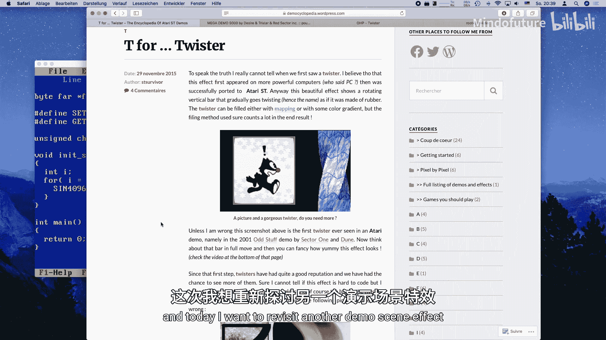
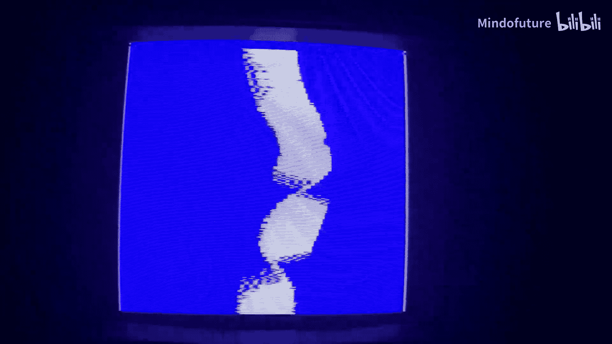
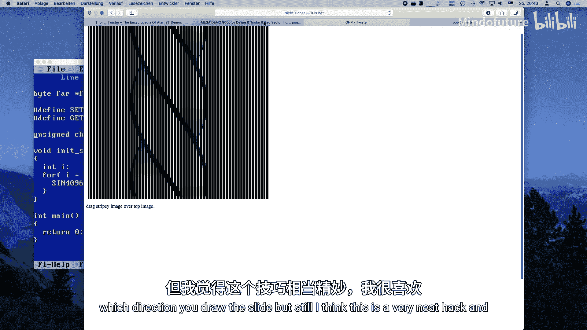
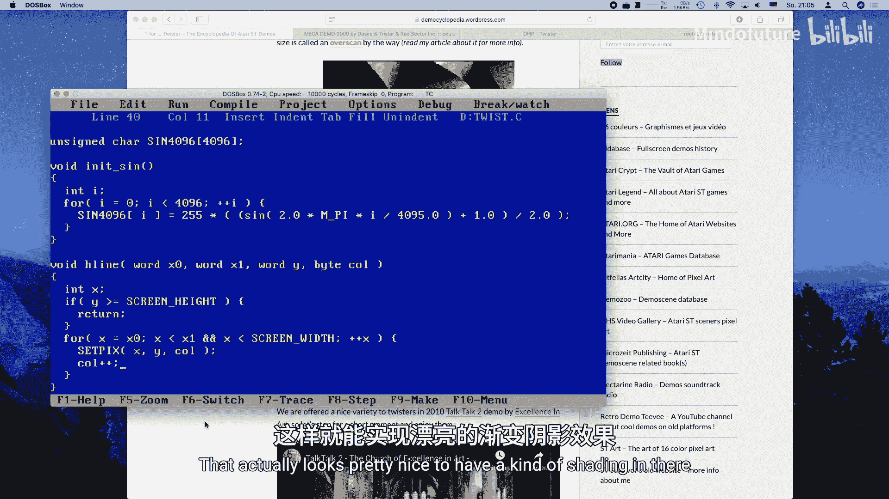
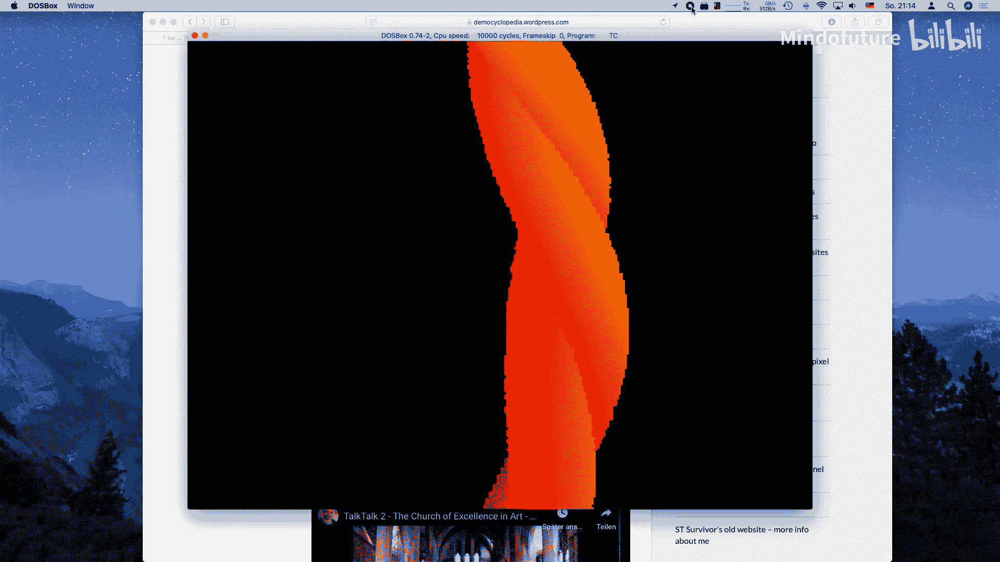

# 023：让我们来扭曲 - 编写扭曲条效果教程





## 概述
在本节课中，我们将学习如何在MS-DOS环境下，使用C语言和VGA图形模式，实现一个经典的“扭曲条”动画效果。我们将从零开始，逐步构建代码，理解其背后的数学原理，并最终在屏幕上看到动态的扭曲动画。

---

## 准备工作

上一节我们介绍了火苗效果的实现，本节中我们来看看如何创建一个“扭曲条”效果。这个效果在Atari 2600和Amiga等老式平台上很常见，但在PC的VGA卡上实现则需要更多的CPU计算。



首先，我们需要一个基础的程序框架。我们将复用之前教程中的VGA初始化代码和正弦查找表。

以下是初始化步骤：
1.  包含必要的头文件并定义屏幕尺寸。
2.  初始化随机数生成器，为动画提供一个随机的起始状态。
3.  初始化一个包含4096个条目的正弦查找表，以获得更高的精度。
4.  设置VGA图形模式（模式13h）。
5.  加载一个合适的调色板（例如火苗效果的调色板）。
6.  分配一个离屏帧缓冲区。

```c
#include <conio.h>
#include <dos.h>
#include <malloc.h>
#include <stdlib.h>
#include “vga.h”

#define SCREEN_WIDTH 320
#define SCREEN_HEIGHT 200
#define SCREEN_SIZE (SCREEN_WIDTH * SCREEN_HEIGHT)

unsigned char far *framebuffer;
int frame = 0;
```

---

## 主程序循环

设置好图形环境后，我们需要一个主循环来驱动动画。这个循环负责清除帧缓冲区、绘制扭曲条、等待垂直回扫以避免屏幕撕裂，最后将帧缓冲区复制到显存。

以下是主循环的核心步骤：
1.  使用`memset`将帧缓冲区清零。
2.  调用`draw_twister`函数，传入位置、大小和当前帧数。
3.  调用`wait_for_retrace`函数，等待显示器垂直回扫。
4.  使用`memcpy`将整个帧缓冲区快速复制到VGA内存。
5.  递增帧计数器，以推进动画。
6.  检测键盘输入，以便在按下任意键时退出程序。

```c
void main() {
    // ... 初始化代码（设置模式、调色板、分配内存等）...

    while (!kbhit()) {
        // 1. 清除离屏缓冲区
        memset(framebuffer, 0, SCREEN_SIZE);

        // 2. 在位置(100, 0)绘制一个128x200的扭曲条
        draw_twister(100, 0, 128, 200, frame);

        // 3. 等待垂直回扫
        wait_for_retrace();

        // 4. 复制到显存
        memcpy(VGA_PTR, framebuffer, SCREEN_SIZE);

        // 5. 更新动画帧
        frame++;
    }

    // 6. 退出前恢复文本模式
    set_text_mode();
}
```

---

## 绘制扭曲条算法

`draw_twister`函数是这个效果的核心。其原理是计算一个旋转的矩形条在屏幕上的投影。这个矩形条有四个角，每个角的X坐标由一个正弦波函数决定，从而产生扭曲效果。

我们首先需要定义一些变量：
*   `amplitude`：控制扭曲的幅度。
*   `x_mod`：在X方向添加额外的正弦调制，产生弯曲的波浪效果。
*   `x1, x2, x3, x4`：扭曲条四个角在屏幕上的X坐标。

算法的核心是一个遍历矩形条高度的循环。对于每一行（Y坐标），我们计算当前行的振幅和X调制量，然后据此计算出四个角点的X坐标。

```c
void draw_twister(int x0, int y0, int width, int height, int time) {
    int amplitude, x_mod;
    int x1, x2, x3, x4;
    int y;

    for (y = y0; y < y0 + height; y++) {
        // 计算基础振幅：基于时间和Y坐标的正弦波
        amplitude = sin_table[((time << 4) + (y << 1)) & 0xFFF];
        amplitude = (amplitude * width) >> 2; // 缩放至宽度的1/4

        // 计算X方向的调制波
        x_mod = sin_table[((time << 4) + (y << 2)) & 0xFFF];
        x_mod = (x_mod * width) >> 3; // 缩放至宽度的1/8
        x_mod += x0; // 加上基础X位置

        // 计算四个角点的X坐标，每个相差90度（1024个条目中的256个）
        x1 = x_mod + (sin_table[((time << 4) + (y << 1)) & 0xFFF] * amplitude >> 2);
        x2 = x_mod + (sin_table[((time << 4) + (y << 1) + 256) & 0xFFF] * amplitude >> 2);
        x3 = x_mod + (sin_table[((time << 4) + (y << 1) + 512) & 0xFFF] * amplitude >> 2);
        x4 = x_mod + (sin_table[((time << 4) + (y << 1) + 768) & 0xFFF] * amplitude >> 2);

        // ... 接下来绘制可见的边 ...
    }
}
```

---

## 绘制可见边并上色

计算出四个角点的坐标后，我们需要决定绘制哪几条边。由于矩形条在旋转，我们只能看到朝向观众的那两面。判断规则是：如果前一个角的X坐标小于后一个角的X坐标，则这条边是可见的。

对于每一条可见的边，我们调用`h_line`函数绘制一条水平线。为了增强视觉效果，我们使用不同的颜色绘制每条边，并在绘制一条线时让颜色值递增，从而产生平滑的渐变着色效果。

以下是绘制边的逻辑：
1.  如果`x1 < x2`，则在当前Y坐标，从`x1`到`x2`画一条颜色为33的水平线。
2.  如果`x2 < x3`，则从`x2`到`x3`画一条颜色为49的水平线。
3.  如果`x3 < x4`，则从`x3`到`x4`画一条颜色为65的水平线。
4.  如果`x4 < x1`，则从`x4`到`x1`画一条颜色为81的水平线。

```c
        // 在循环内部，计算完x1,x2,x3,x4后：
        if (x1 < x2) {
            h_line(x1, x2, y, 33);
        }
        if (x2 < x3) {
            h_line(x2, x3, y, 49);
        }
        if (x3 < x4) {
            h_line(x3, x4, y, 65);
        }
        if (x4 < x1) {
            h_line(x4, x1, y, 81);
        }
```

---

## 绘制水平线函数

`h_line`函数是一个简单的实用函数，用于在帧缓冲区中绘制一条水平线段。它接收起点和终点的X坐标、Y坐标以及颜色值。

函数首先进行简单的边界检查，确保Y坐标在屏幕范围内。然后，它遍历从`x_start`到`x_end`（确保`x_start <= x_end`）的每个X坐标，将对应的像素设置为指定颜色。在绘制过程中，颜色值会轻微递增，以产生微妙的渐变效果。

```c
void h_line(int x_start, int x_end, int y, unsigned char color) {
    int x;
    if (y < 0 || y >= SCREEN_HEIGHT) return; // 边界检查

    // 确保x_start是较小的那个
    if (x_start > x_end) {
        int temp = x_start;
        x_start = x_end;
        x_end = temp;
    }

    // 裁剪X坐标到屏幕范围内
    if (x_start < 0) x_start = 0;
    if (x_end >= SCREEN_WIDTH) x_end = SCREEN_WIDTH - 1;

    for (x = x_start; x <= x_end; x++) {
        framebuffer[y * SCREEN_WIDTH + x] = color++;
        // 颜色递增产生渐变
    }
}
```



---

## 效果优化与扩展

现在，一个基本的扭曲条效果已经完成了。它在486 33MHz的机器上可以流畅运行。你可以通过调整代码中的参数来改变效果。

以下是一些可以尝试的优化与扩展方向：
*   **调整参数**：修改`draw_twister`函数中与时间、Y坐标相关的移位和缩放因子，可以改变扭曲的速度、波浪形状和幅度。
*   **移除渐变**：在`h_line`函数中固定颜色值不递增，可以提升一些绘制速度。
*   **添加纹理**：不再绘制纯色水平线，而是根据一个纹理数组来获取每个像素的颜色，可以在扭曲条上显示文字或图案。
*   **多个扭曲条**：同时绘制多个位置、大小或运动速度不同的扭曲条，创造更复杂的场景。
*   **尝试Mode X/Y**：使用VGA的Mode X或Mode Y图形模式，利用其分页特性可能实现更高效的绘制（尽管代码会更复杂）。

---

## 总结



本节课中我们一起学习了如何在MS-DOS的VGA图形模式下实现“扭曲条”动画效果。我们了解了其核心算法：通过正弦波函数计算一个旋转矩形条的投影，并仅绘制其可见边。我们构建了从图形初始化、主循环到具体绘制函数的完整代码流程，并看到了如何通过简单的整数运算和调色板技巧来创造视觉上吸引人的动态效果。这个效果是纯CPU计算的，体现了复古编程的独特魅力。你可以基于这个基础，自由地调整参数和添加新功能，创造出属于自己的演示场景效果。