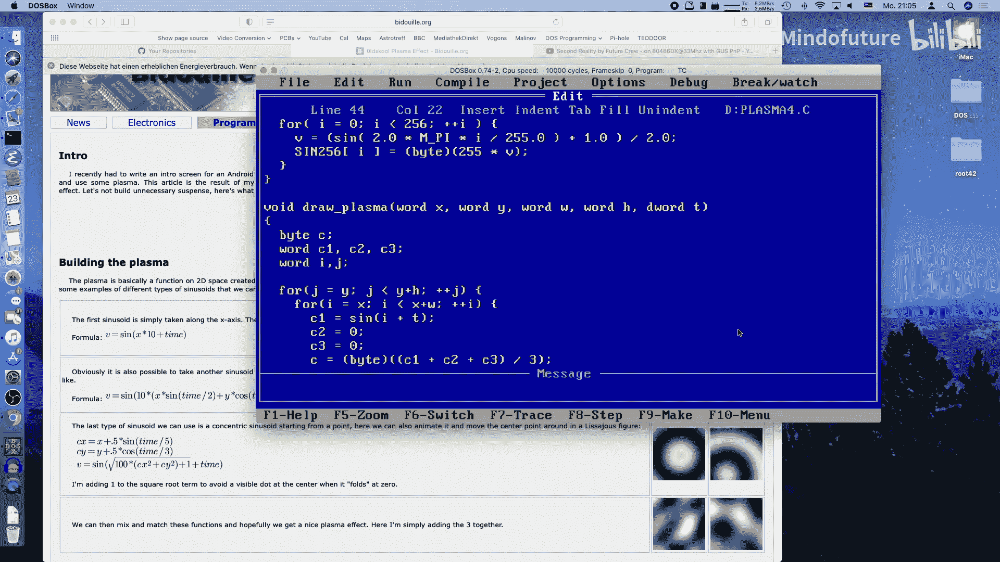
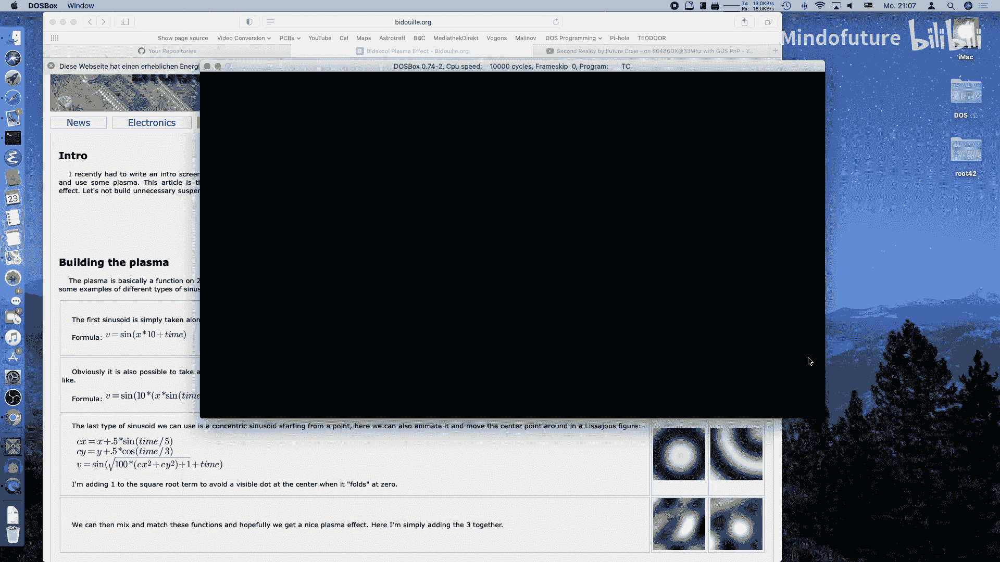
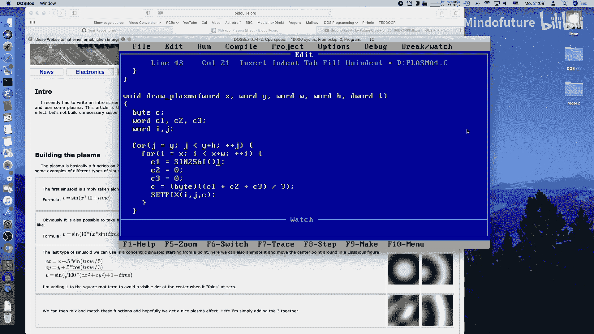
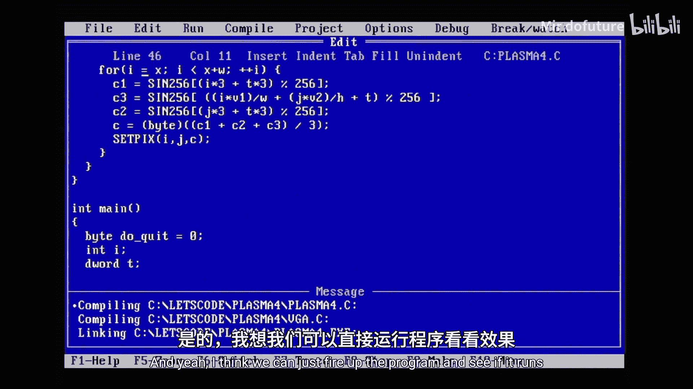
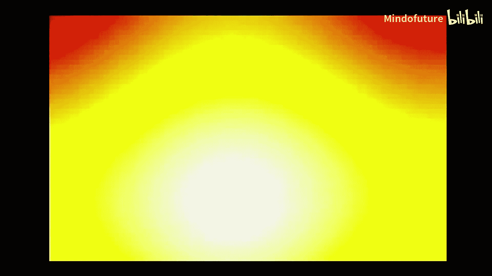

# 024：让我们编写MS-DOS 0x18 - VGA等离子效果

## 概述
在本节课中，我们将学习如何在MS-DOS环境下，使用Turbo C语言实现一个经典的“等离子”视觉效果。这个效果是许多演示程序中的标志性元素，我们将通过组合正弦函数来创建动态、色彩斑斓的波浪图案。

## 等离子效果的原理
等离子效果的核心是数学函数。它通常由几个简单的正弦波图案组合而成。

以下是构成该效果的基本元素：
*   **垂直条纹**：一个基于屏幕X坐标和时间的正弦函数，会产生水平滚动的波浪。
*   **水平条纹**：一个基于屏幕Y坐标和时间的正弦函数，会产生垂直滚动的波浪。
*   **旋转图案**：一个更复杂的项，使用 `x * sin + y * cos` 的公式来创建旋转的圆形条纹。

通过将这些不同频率和速度的正弦值相加并映射到颜色，就能产生复杂的、不断变化的等离子效果。

## 项目基础
我们将基于之前课程中的“火焰效果”程序进行修改。该程序使用了`mode Y`（13h模式的一种变体）和`blocky B4`函数来实现快速的低分辨率渲染，即使在旧机器上也能流畅运行。

我们移除了绘制火焰的例程，取而代之的是一个`draw_plasma`函数。这个函数接收一个时间参数`t`，用于驱动动画。程序初始化时会随机化起始时间，使每次启动的效果略有不同。



为了提高性能，我们预先计算了一个包含256个值的正弦查找表（`sinetable`），避免在渲染循环中进行耗时的浮点正弦计算。



## 绘制等离子效果
现在，让我们深入`draw_plasma`函数的具体实现。我们将循环遍历屏幕上的每个像素，并根据其坐标和时间计算颜色值。

以下是实现步骤：
1.  **定义变量**：我们需要循环变量`i`（X坐标）和`j`（Y坐标），以及用于存储各分项颜色值的变量`c1`， `c2`， `c3`。为了在相加时避免溢出，这些变量应使用16位整型（如`int`）。
2.  **嵌套循环**：外层循环遍历Y轴，内层循环遍历X轴，访问每个像素。
3.  **计算颜色分量**：
    *   `c1 = sine((i * scale1 + t) % 256)`：产生垂直移动的条纹。
    *   `c2 = sine((j * scale2 + t) % 256)`：产生水平移动的条纹。
    *   `c3` 的计算涉及旋转图案，稍后详细说明。
4.  **合并颜色**：将`c1`， `c2`， `c3` 相加后除以3（或求平均值），得到最终的颜色索引`c`。
5.  **设置像素**：使用`set_pixel(i， j， c)`函数将计算出的颜色写入屏幕。



## 实现旋转图案
旋转图案是效果的关键，它使用三角学来旋转坐标空间。

实现旋转图案的步骤如下：
1.  **计算旋转因子**：根据时间`t`计算正弦(`v1`)和余弦(`v2`)值。注意，余弦可以通过将正弦表的索引偏移64（即90度）来获得。
    ```c
    v1 = sine((t * rotation_speed1) % 256);
    v2 = sine((t * rotation_speed2 + 64) % 256); // +64 得到余弦
    ```
2.  **应用旋转变换**：对于每个像素`(i， j)`，计算旋转后的坐标分量。
    ```c
    rotated_value = (i * v1 / SCREEN_WIDTH) + (j * v2 / SCREEN_HEIGHT) + t;
    ```
3.  **生成图案**：将上述结果代入正弦函数，得到旋转的颜色分量。
    ```c
    c3 = sine(rotated_value % 256);
    ```
    这里对`i`和`j`进行归一化（除以屏幕宽高）是为了防止数值过大导致溢出和视觉失真。

## 优化性能
最初的实现可能比较慢。一个关键的优化点是识别并提取循环中不依赖于内层循环变量的计算。

例如，`c2` 的计算只依赖于`j`和`t`，而`t`在函数调用期间不变，`j`只在外层循环中变化。因此，我们可以将`c2`的计算移到内层`i`循环之外，在外层`j`循环中计算一次并重复使用。同样，旋转因子`v1`和`v2`只依赖于`t`，可以提到所有循环之前计算。

这种优化能显著提升执行速度，即使编译器没有自动进行，在编写汇编代码时也需要手动处理。

## 效果调整与运行
我们可以通过调整各个正弦函数中的缩放系数（如`i*3`， `t*5`）和时间增量来改变等离子效果的波动速度、条纹密度和运动模式。不同的调色板（这里沿用了火焰效果的调色板）也会极大地改变视觉效果。

此程序设计为在80x50的低分辨率下运行以确保流畅性。你也可以尝试修改为标准的13h模式（320x200），但请注意在真正的旧硬件上帧率可能会下降。



在真实的486计算机和MS-DOS环境下测试，这个优化后的程序能够流畅运行，产生令人满意的等离子动画效果。



## 总结
本节课中，我们一起学习了如何在MS-DOS环境下创建VGA等离子效果。我们了解了其背后的数学原理——主要是正弦函数的组合应用。我们从基础循环结构开始，逐步实现了垂直、水平和旋转的图案，并通过预计算正弦表和提取循环不变计算等技巧优化了性能。最终，我们获得了一个在旧硬件上也能流畅运行的、色彩斑斓的动态演示效果。你可以自由调整参数和颜色来创造属于自己的独特等离子秀。