# 025：使用PowerBasic与汇编语言制作烟花效果

在本节课中，我们将学习如何使用PowerBasic编程语言，结合少量x86汇编代码，在MS-DOS的EGA/VGA图形模式下创建一个烟花模拟效果。我们将从初始化图形模式开始，逐步实现粒子的物理模拟、绘制和爆炸效果。

---

## 概述与准备工作

首先，我们需要设置编程环境。我们使用的是PowerBasic 3.2，它可以编译成独立的EXE文件。代码也适用于免费的运行时版本，只需稍作修改。

我们首先初始化图形模式。在PowerBasic中，使用 `SCREEN` 命令。我们将使用EGA标准的320x200分辨率、16色模式，即 `SCREEN 7`。程序结束时，需要切换回文本模式 `SCREEN 0`。

以下是程序的主循环结构：
```basic
SCREEN 7
DO
    ' 更新和绘制粒子的代码将放在这里
LOOP UNTIL INKEY$ <> ""
SCREEN 0
```

为了实现无闪烁动画，我们将使用双缓冲技术。EGA/VGA显卡支持多个显示页。我们定义两个变量 `active` 和 `visible` 来代表前后缓冲区，并在每帧交换它们。
```basic
active = 1
visible = 0
DO
    ' ... 计算和绘制代码 ...
    SWAP active, visible
    SCREEN , , active, visible
LOOP
```

为了将帧率同步到显示器的垂直刷新率，我们需要一个垂直同步（Vsync）例程。这可以避免屏幕撕裂。

---

## 实现垂直同步（Vsync）

垂直同步的原理是等待显示器完成一次垂直回扫。在VGA显卡上，我们可以通过读取输入状态寄存器（端口 `&H3DA`）来检查垂直回扫位（第3位）。

以下是使用BASIC内联汇编实现的高效Vsync例程：
```basic
SUB Vsync INLINE
    ! CLI          ; 清除中断标志
    ! MOV DX, &H3DA ; VGA输入状态寄存器端口
Vsync1:
    ! IN AL, DX    ; 读取状态
    ! TEST AL, 8   ; 测试垂直回扫位
    ! JNZ Vsync1   ; 如果在回扫期，则等待其结束
Vsync2:
    ! IN AL, DX
    ! TEST AL, 8
    ! JZ Vsync2    ; 等待进入新的回扫期
    ! STI          ; 恢复中断标志
END SUB
```
在程序的主循环中，我们将在交换显示页之前调用 `Vsync`。

---

## 定义全局变量与数组

接下来，我们定义模拟所需的全局变量和数组。
- `frame`： 帧计数器。
- `t#`： 模拟时间。
- `g#`： 重力常数，我们使用一个缩放后的值 `0.00981`。
- `dt#`： 时间增量，设为 `0.05`。
- `n`： 当前活跃的粒子数。
- `isExploded`： 标记火箭是否已爆炸。
- 数组 `x#(255)`, `y#(255)`, `vx#(255)`, `vy#(255)`： 分别存储粒子的位置和速度。我们预留了256个位置。

```basic
DIM x#(255), y#(255), vx#(255), vy#(255)
frame = 0
t# = 0
g# = 0.00981
dt# = 0.05
n = 1
isExploded = 0
```

---

## 初始化新火箭

火箭本身被视为一个粒子。`InitNewRocket` 子程序负责初始化这个粒子的位置和速度。
- 初始X位置： 屏幕中部（120到200像素之间的随机值）。
- 初始Y位置： 屏幕底部（我们将在绘制时转换为屏幕坐标）。
- 初始X速度： `-1` 到 `1` 之间的随机值。
- 初始Y速度： `-3` 到 `-1` 之间的随机值（负值表示向上）。

```basic
SUB InitNewRocket (x#(), y#(), vx#(), vy#())
    RANDOMIZE TIMER
    x#(0) = 0
    y#(0) = 0
    x0# = 120 + 80 * RND
    y0# = 0
    vx#(0) = 2 * RND - 1
    vy#(0) = - (1 + 2 * RND)
END SUB
```
程序启动时，我们需要调用一次 `InitNewRocket` 来创建第一个火箭。

---

## 更新粒子状态

`UpdateParticles` 子程序根据物理公式更新所有粒子的位置。我们使用经典的抛射体运动公式：
- **水平位移公式**： `x = x0 + vx * t`
- **垂直位移公式**： `y = y0 + vy * t + 0.5 * g * t^2`

以下是该子程序的实现：
```basic
SUB UpdateParticles (t#, n, x#(), y#(), vx#(), vy#())
    FOR i = 0 TO n - 1
        x#(i) = x#(i) + vx#(i) * t#
        y#(i) = y#(i) + vy#(i) * t# + 0.5 * g# * t# * t#
    NEXT i
END SUB
```
在主循环中，我们每帧都会调用此子程序，并增加模拟时间 `t#`。

---

## 绘制粒子

`DrawParticles` 子程序负责将粒子绘制到屏幕上。我们使用 `PSET` 命令来画点。
- 颜色： 我们使用帧计数器对15取模，然后加1，使颜色在1到15之间循环，产生闪烁效果。
- 坐标转换： 我们的模拟坐标系原点在屏幕左下角，但屏幕坐标原点在左上角。因此，Y坐标需要转换：`screenY = 199 - y`。

```basic
SUB DrawParticles (n, x#(), y#(), frame)
    colour = (frame MOD 15) + 1
    FOR i = 0 TO n - 1
        PSET (x#(i), 199 - y#(i)), colour
    NEXT i
END SUB
```

---

## 初始化爆炸效果

当火箭到达顶点或特定时间后，它会爆炸，生成许多新的粒子。`InitExplosion` 子程序负责初始化这些爆炸粒子。
- 所有粒子从火箭的最终位置 `(x1#, y1#)` 开始。
- 每个粒子被赋予一个随机的速度和方向（角度），使其从中心向外呈圆形散开。
- 速度大小在 `0.5` 到 `2.0` 之间随机。
- 角度在 `0` 到 `2π` 之间随机。

速度的X和Y分量通过三角函数计算：
- `vx = v0 * COS(angle)`
- `vy = v0 * SIN(angle)`

```basic
SUB InitExplosion (n, x#(), y#(), vx#(), vy#(), x1#, y1#)
    FOR i = 0 TO n - 1
        x#(i) = x1#
        y#(i) = y1#
        v0# = 0.5 + 1.5 * RND
        angle# = 6.283185 * RND
        vx#(i) = v0# * COS(angle#)
        vy#(i) = v0# * SIN(angle#)
    NEXT i
END SUB
```

---

## 主程序逻辑与循环

现在，我们将所有部分组合到主循环中。核心逻辑是：
1.  每帧更新粒子位置并绘制。
2.  每170帧触发一个事件：如果火箭未爆炸，则使其爆炸；如果爆炸动画已结束，则发射一枚新火箭。
3.  在爆炸期间，粒子数 `n` 会变为100；在新火箭期间，粒子数 `n` 重置为1。

以下是主循环的完整结构：
```basic
SCREEN 7
active = 1: visible = 0
InitNewRocket(x#(), y#(), vx#(), vy#())

DO
    ' 1. 清空当前活动页
    SCREEN , , active, visible
    CLS

    ' 2. 更新和绘制粒子
    UpdateParticles t#, n, x#(), y#(), vx#(), vy#()
    DrawParticles n, x#(), y#(), frame

    ' 3. 每170帧处理爆炸/发射新火箭
    IF (frame MOD 170) = 0 THEN
        t# = 0
        IF isExploded THEN
            ' 爆炸结束，发射新火箭
            isExploded = 0
            n = 1
            InitNewRocket(x#(), y#(), vx#(), vy#())
        ELSE
            ' 火箭爆炸
            isExploded = 1
            n = 100
            InitExplosion n, x#(), y#(), vx#(), vy#(), x#(0), y#(0)
        END IF
    ELSE
        ' 4. 更新模拟时间
        t# = t# + dt#
    END IF

    frame = frame + 1

    ' 5. 垂直同步并交换页面
    Vsync
    SWAP active, visible

LOOP UNTIL INKEY$ <> ""
SCREEN 0
```

---


## 编译与运行


在编写完所有代码后，我们需要设置编译选项以获得最佳性能：
- 设置CPU目标为至少80286。
- 仅链接EGA图形库以减少代码大小。
- 关闭数组边界检查等运行时检查。
- 优化速度。

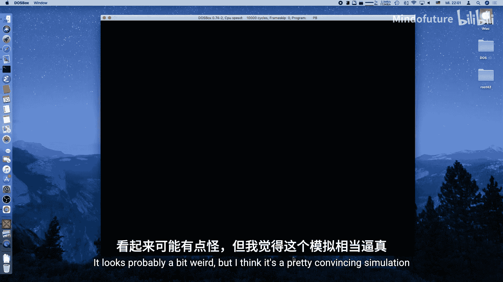


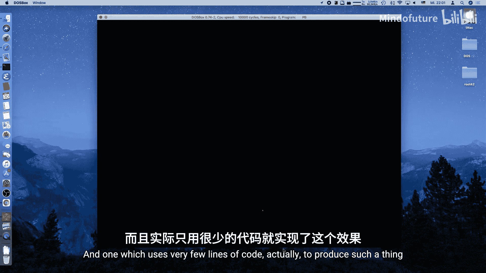

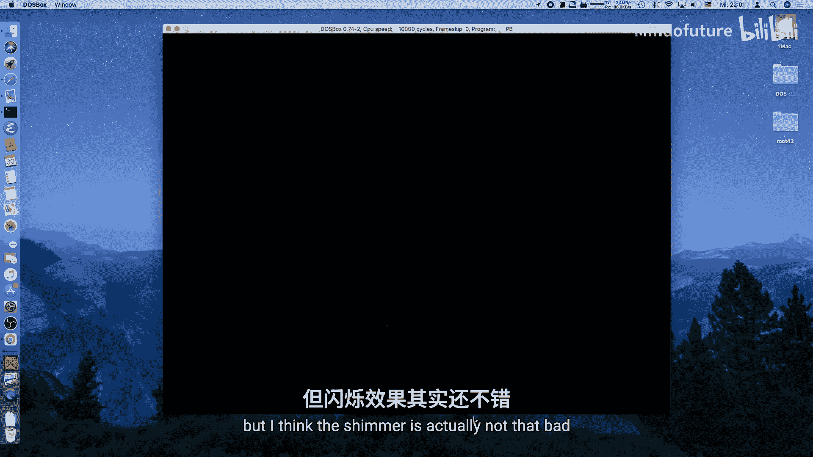

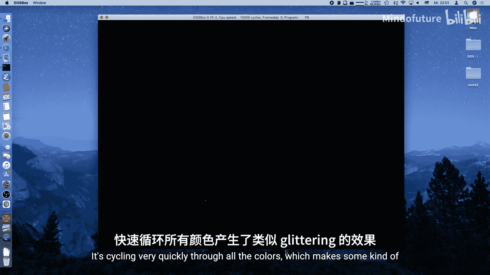

使用PowerBasic编译器进行编译，生成EXE文件。在MS-DOS或DOSBox中运行该程序，即可看到火箭发射、爆炸成烟花的效果。

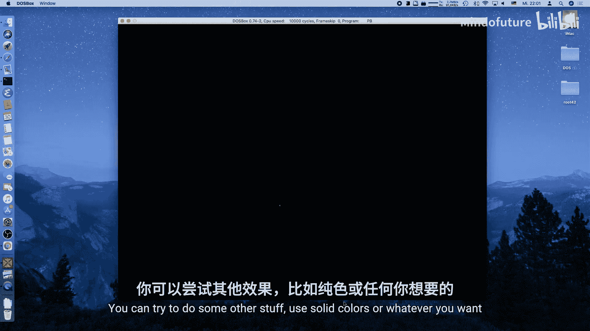


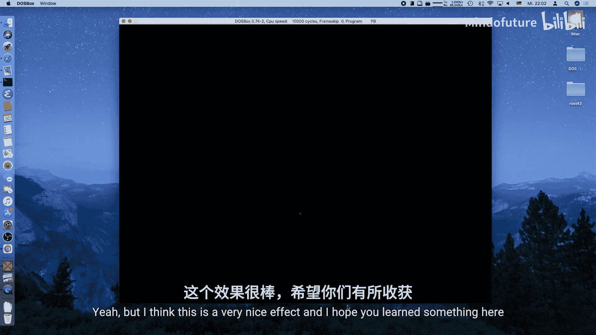

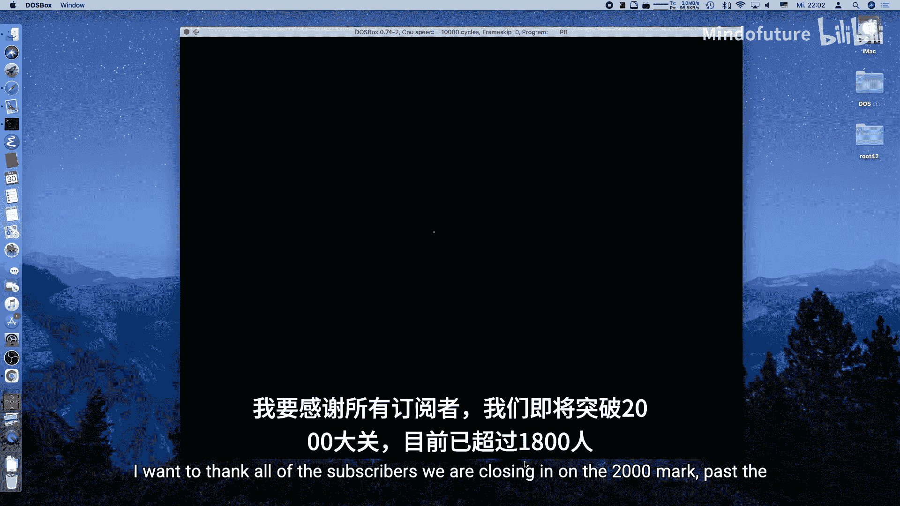


---

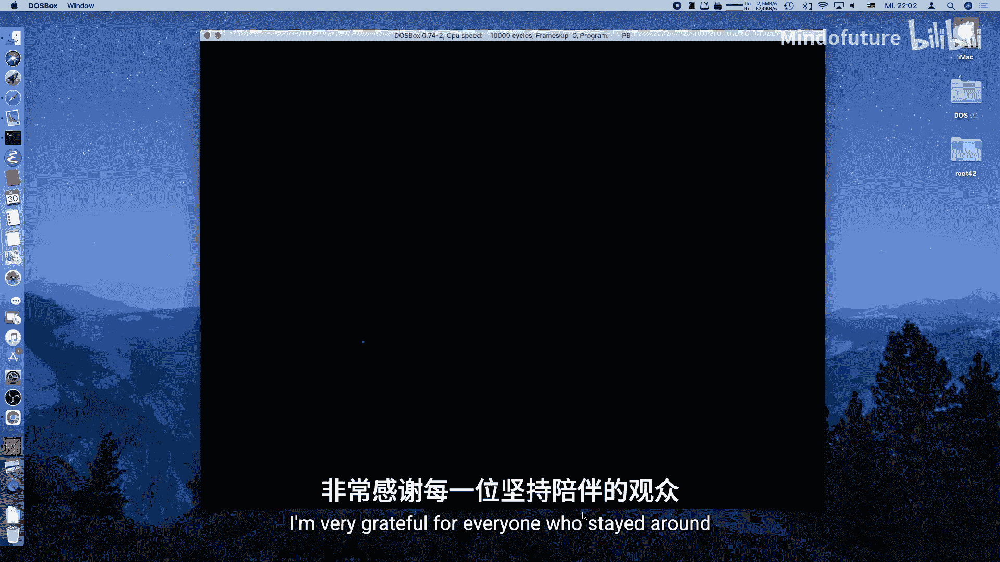


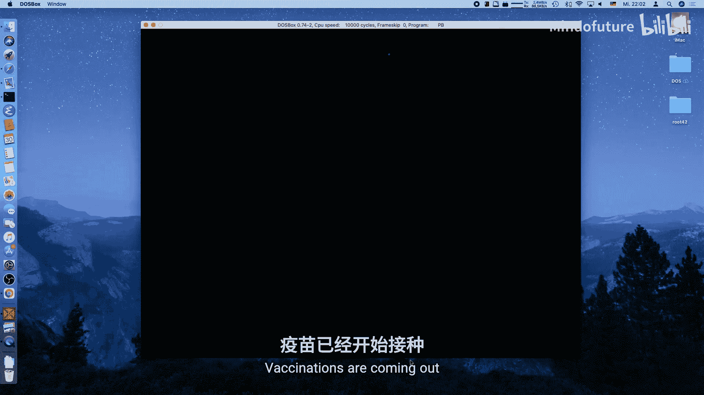

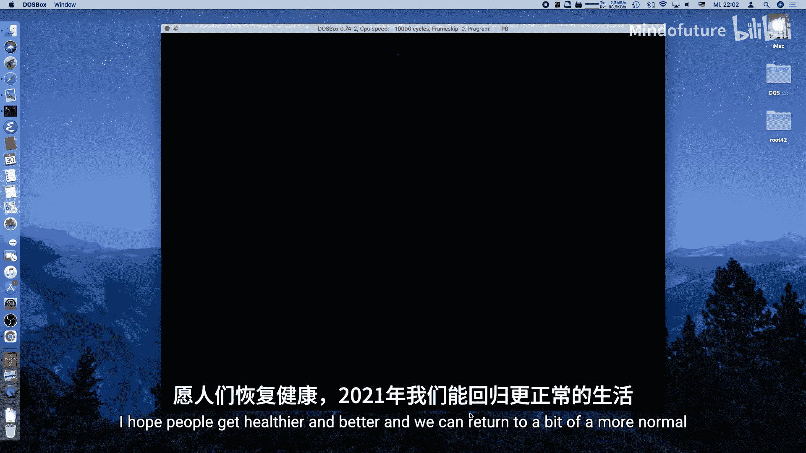

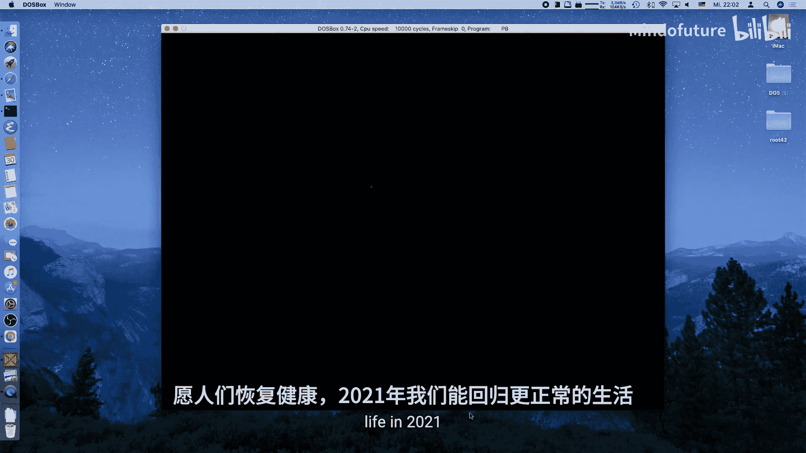

## 总结

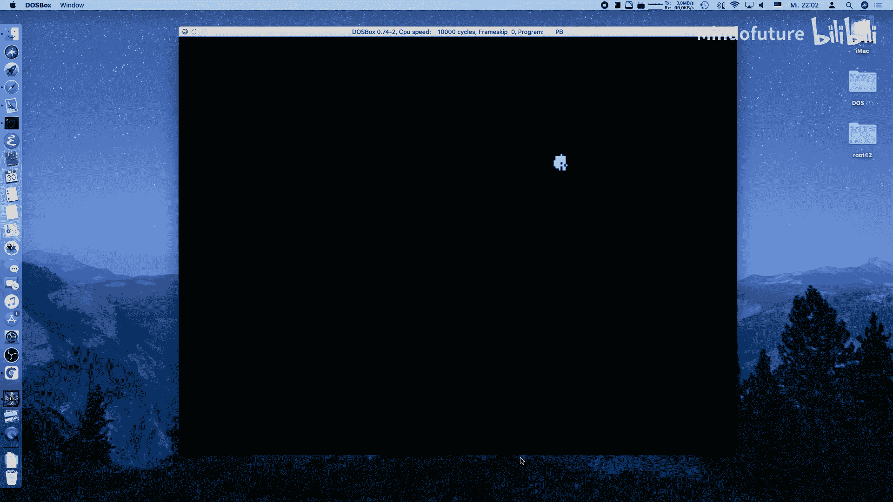

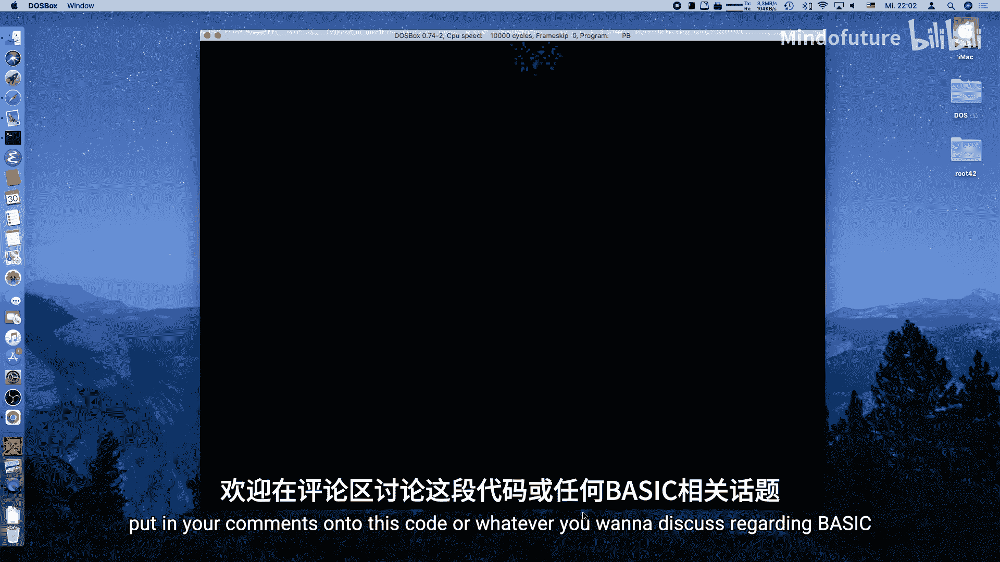

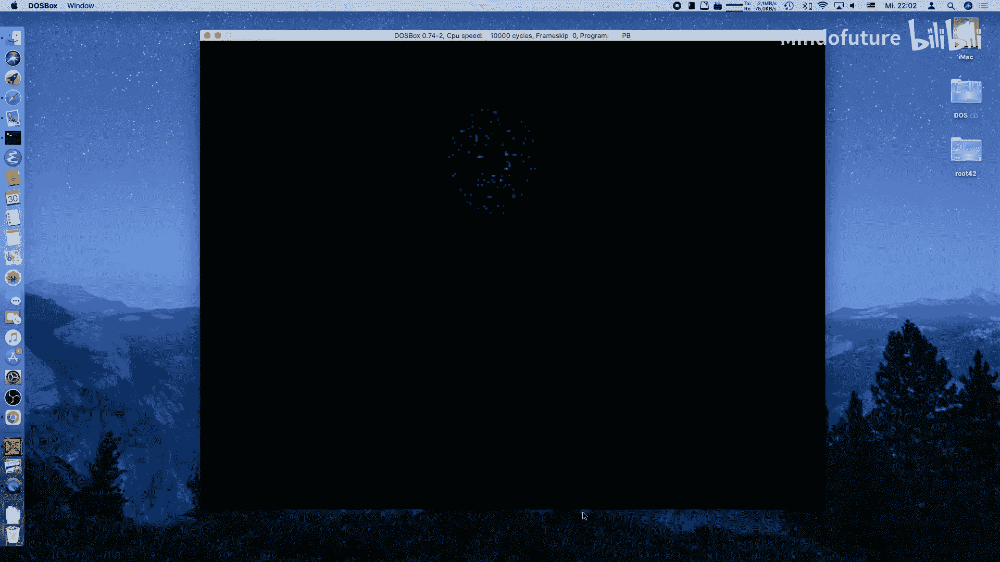

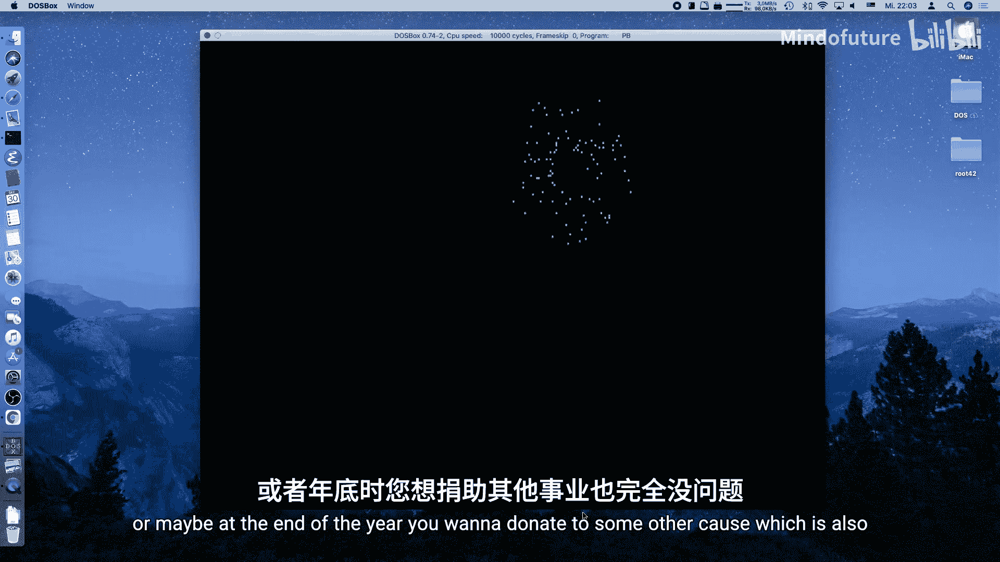


本节课中，我们一起学习了如何使用PowerBasic在MS-DOS环境下创建一个图形化的烟花模拟效果。我们涵盖了以下核心内容：
1.  **初始化EGA/VGA图形模式** 并使用双缓冲技术避免闪烁。
2.  **编写高效的垂直同步例程**，使用了x86内联汇编。
3.  **定义粒子系统**，用数组管理位置和速度。
4.  **模拟物理运动**，实现了抛射体运动公式 `x = x0 + vx * t` 和 `y = y0 + vy * t + 0.5 * g * t^2`。
5.  **绘制粒子** 并进行屏幕坐标转换。
6.  **实现爆炸效果**，通过随机角度和速度使粒子从中心向外扩散。
7.  **组织主循环逻辑**，控制火箭发射、爆炸和粒子更新的节奏。

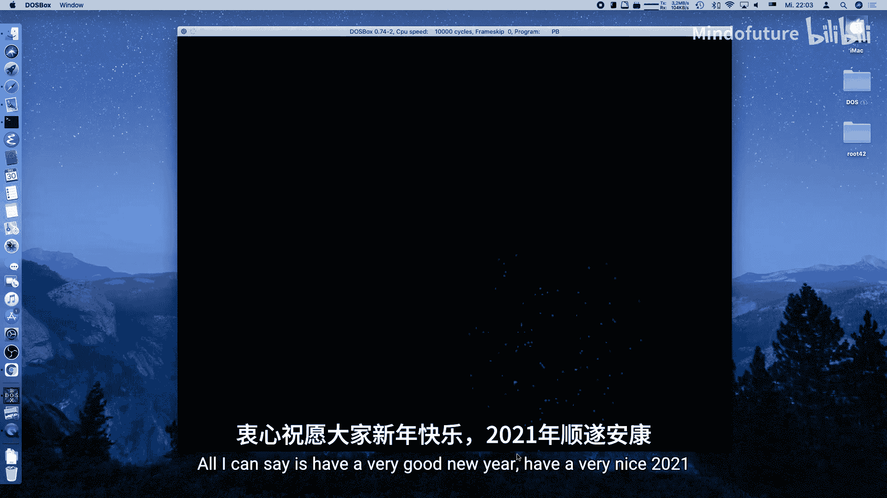


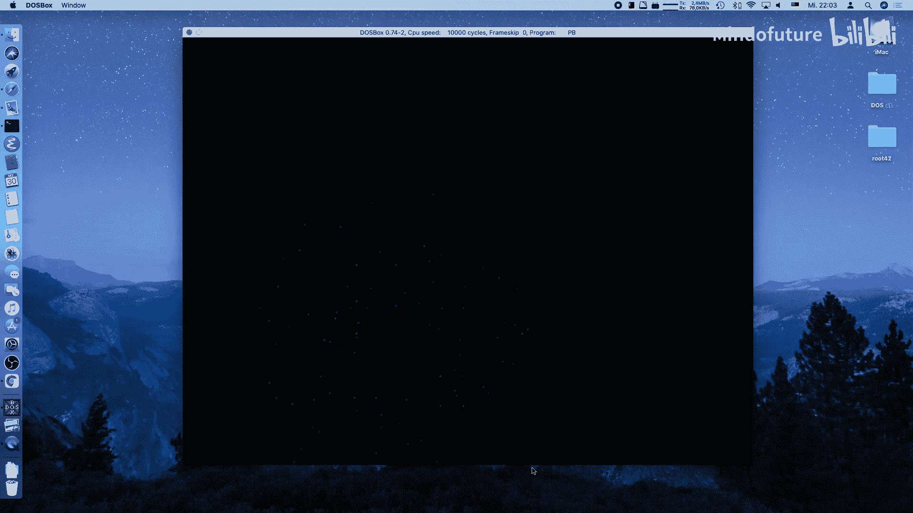


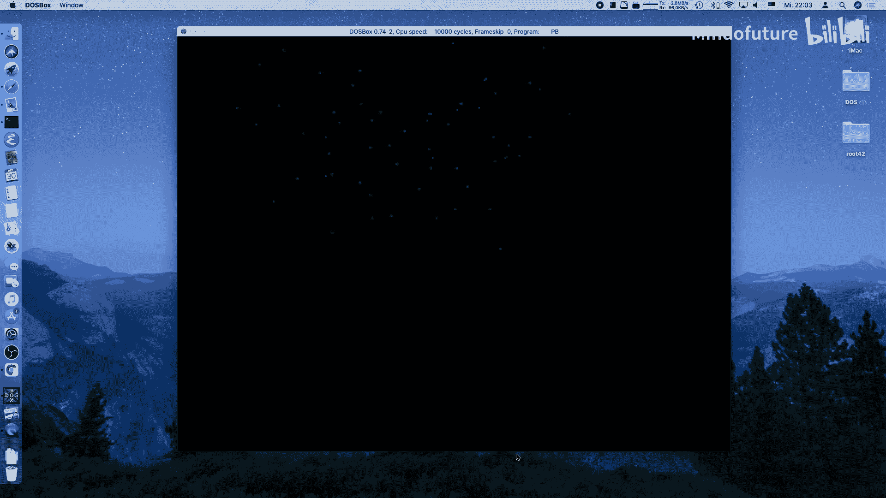


通过这个项目，你将BASIC语言的易用性与底层汇编的控制能力相结合，实现了一个既美观又有趣的图形效果。你可以尝试调整重力、速度、颜色和粒子数量等参数，创造出属于自己的烟花表演。