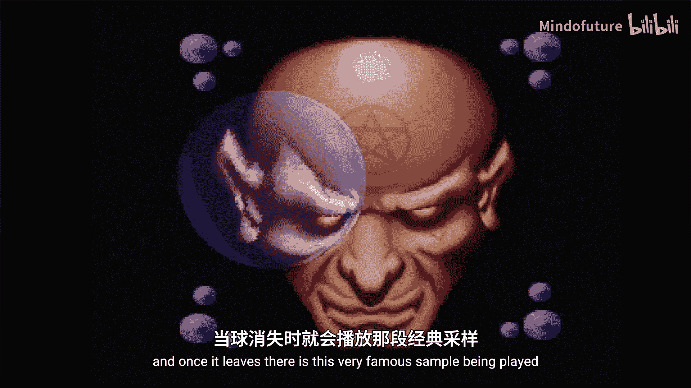
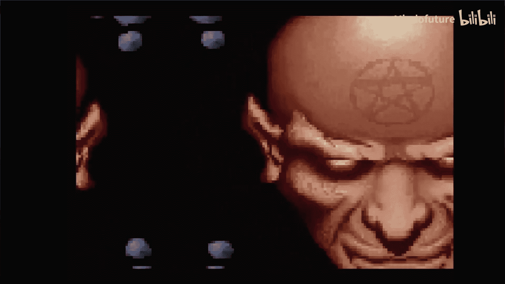
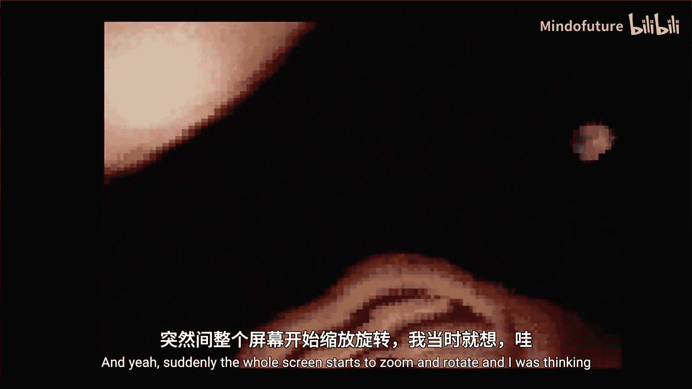
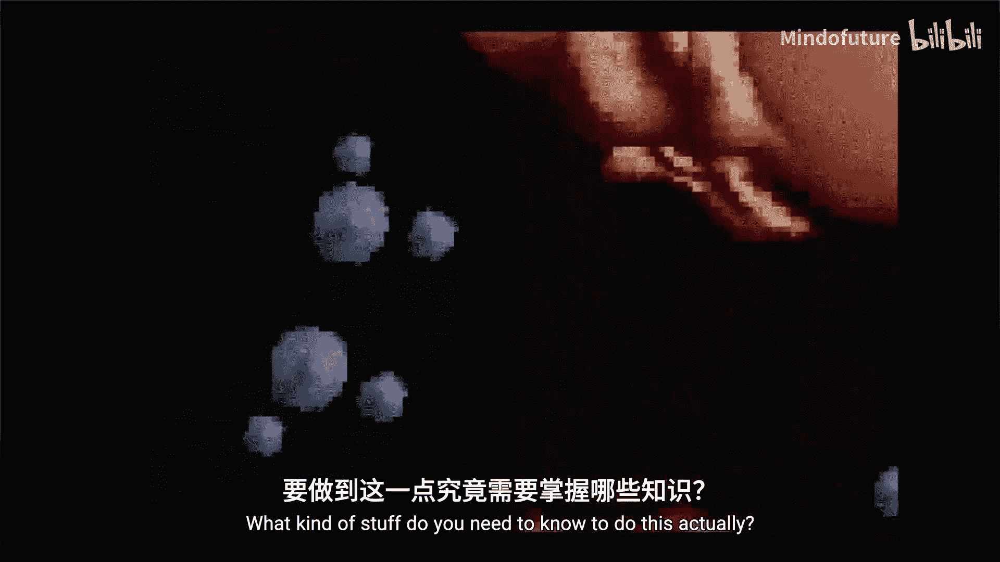
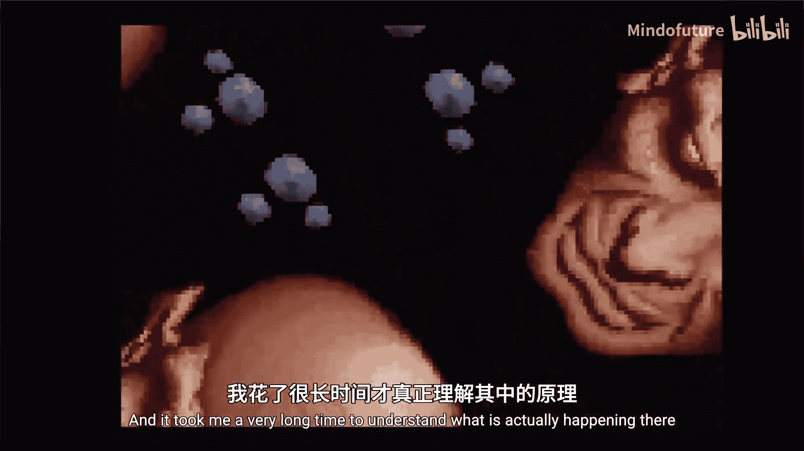

# 026：编写旋转缩放效果

## 概述











在本节课中，我们将学习如何在MS-DOS环境下，使用x86汇编和VGA图形模式，实现一个经典的“旋转缩放”视觉效果。这个效果源自1993年Future Crew小组发布的著名演示程序《Second Reality》。我们将从数学原理开始，逐步讲解如何将线性代数中的旋转变换转化为高效的代码，并最终在屏幕上实现动态的纹理旋转与缩放。

## 从《Second Reality》到旋转缩放原理

上一节我们提到了《Second Reality》演示程序及其标志性的旋转缩放效果。本节中，我们来看看这个效果背后的核心数学原理。

旋转缩放本质上是一种二维纹理映射技术。它涉及将一个源图像（纹理）经过旋转、缩放和平移变换后，绘制到屏幕上。

我们有两个坐标系：
*   **纹理空间**： 使用 `(U, V)` 坐标来描述源图像中的像素位置。
*   **屏幕空间**： 使用我们熟悉的 `(X, Y)` 坐标来描述屏幕上的像素位置。

我们的目标是为屏幕上的每一个像素 `(X, Y)`，找到其在纹理图像中对应的源像素 `(U, V)`。

### 旋转变换的数学基础

对一个二维平面上的点或向量进行旋转，可以通过一个**旋转矩阵**来实现。

一个二维向量可以表示为：
`v = [x, y]^T`

一个旋转矩阵 `R`（旋转角度为 θ）定义为：
`R = [ [cosθ, -sinθ], [sinθ, cosθ] ]`

将向量 `v` 旋转 θ 角度得到新向量 `v'` 的运算为：
`v' = R * v`

将其展开为公式，新坐标 `(x', y')` 为：
`x' = x * cosθ - y * sinθ`
`y' = x * sinθ + y * cosθ`

### 整合缩放与平移

在旋转的基础上，我们还可以加入缩放因子 `Z` 和平移向量 `(Tx, Ty)`。

完整的纹理坐标 `(U, V)` 计算过程可以描述为：
1.  对屏幕坐标 `(X, Y)` 应用平移： `(X + Tx, Y + Ty)`
2.  对平移后的坐标应用旋转矩阵 `R`。
3.  对旋转后的坐标应用缩放因子 `Z`。
4.  将结果映射到纹理图像的尺寸范围内（通常使用取模运算 `%` 来实现纹理平铺）。

核心公式可以概括为：
`U = (( (X+Tx) * cosθ - (Y+Ty) * sinθ ) * Z) % TextureWidth`
`V = (( (X+Tx) * sinθ + (Y+Ty) * cosθ ) * Z) % TextureHeight`

## 代码实现与分析

理解了数学原理后，我们进入代码实现环节。我们将基于一个已有的演示程序框架，重点实现 `draw_roto` 函数。

以下是实现该效果的关键步骤和代码结构：

首先，我们需要计算当前帧的旋转角度、缩放因子和平移量。为了性能，我们预先计算好 `sinθ` 和 `cosθ`。

```c
float angle = M_PI * time_index / 180.0f; // 将角度转换为弧度
float sin_theta = sin(angle);
float cos_theta = cos(angle);
float zoom = sin_theta + 1.5f; // 确保缩放因子不为零
float translate_x = sin_theta * 64.0f;
float translate_y = cos_theta * 64.0f;
```

接下来是核心的双重循环。外层循环遍历屏幕的Y坐标，内层循环遍历X坐标。为了提高效率，我们避免在每次循环中都进行完整的矩阵乘法运算。

我们利用一个数学技巧：对于等差数列 `i * cosθ`，当 `i` 每次递增1时，结果值每次递增 `cosθ`。因此，我们可以用加法来替代昂贵的乘法运算。

以下是内层循环更新纹理查找坐标的关键变量初始化与更新逻辑：

```c
// 外层循环 (j 循环) 初始化
float js = (y_start + translate_y) * sin_theta;
float jc = (y_start + translate_y) * cos_theta;

// 内层循环 (i 循环) 初始化
float u_coord = (x_start + translate_x) * cos_theta - js;
float v_coord = (x_start + translate_x) * sin_theta + jc;

for (int i = 0; i < width; i++) {
    // 计算纹理坐标并取模，确保在图像尺寸内
    int tex_u = ((int)(u_coord * zoom)) % texture_width;
    int tex_v = ((int)(v_coord * zoom)) % texture_height;

    // 从纹理中获取颜色并写入屏幕缓冲区
    *pixel_ptr++ = get_pixel_from_texture(tex_u, tex_v);

    // 关键优化：使用加法更新坐标，替代 i * cosθ 和 i * sinθ 的重复计算
    u_coord += cos_theta;
    v_coord += sin_theta;
}

// 外层循环更新
js += sin_theta;
jc += cos_theta;
```

为了在低分辨率的VGA模式（如Mode Y）下获得可接受的帧率，代码还实现了一次写入多个像素的优化。同时，程序提供了使用浮点数（便于理解）和定点数（为了在古董CPU上获得更高性能）两种计算路径，通过预编译宏进行切换。

## 总结

本节课中，我们一起学习了MS-DOS演示场景中经典的旋转缩放效果的实现。

我们从《Second Reality》的震撼效果引入，剖析了其背后的二维纹理映射与旋转变换的数学原理，核心是**旋转矩阵公式** `[x', y'] = [x*cosθ - y*sinθ, x*sinθ + y*cosθ]`。

接着，我们将其转化为实际的C语言代码，并重点介绍了通过将乘法替换为加法来优化性能的关键技巧。最终，我们成功在模拟器中复现了动态的旋转、缩放与平移的纹理效果。

这个例子完美展示了在极度有限的硬件资源（如33MHz的486 CPU）下，程序员如何通过深入理解数学原理并精心优化代码，创造出令人惊叹的视觉体验。在下一节课中，我们将探讨如何用定点数运算进一步优化这个效果，使其在真实的古董硬件上也能流畅运行。