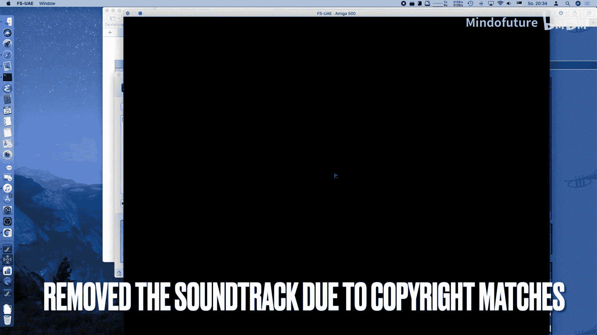
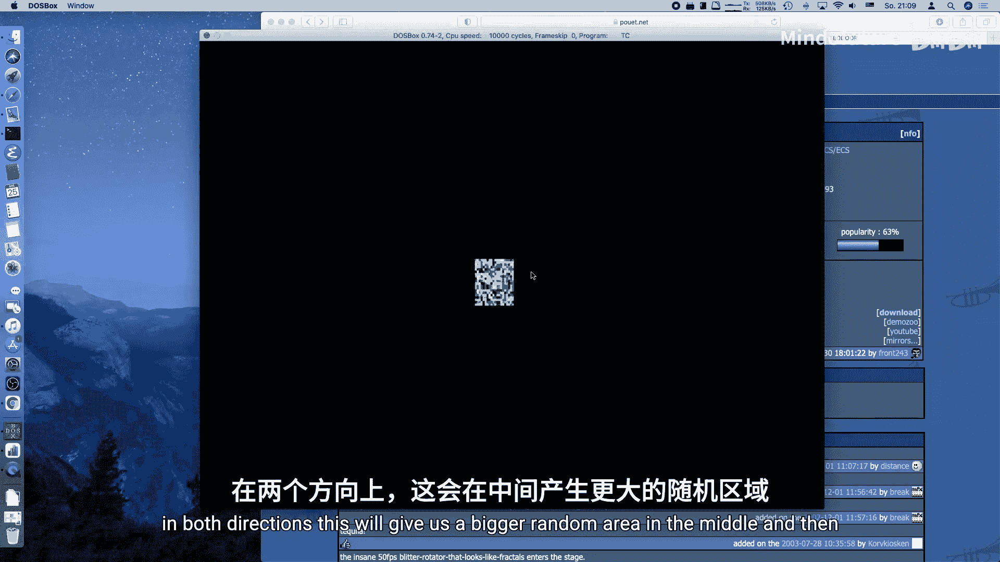

# 028：Dweezil分形缩放效果教程

## 概述



在本节课中，我们将学习如何在MS-DOS环境下，使用x86汇编和VGA图形模式，实现一个源自Amiga演示场景的经典视觉效果——Dweezil分形缩放器。这个效果结合了动态缩放和旋转，通过将屏幕分割成多个矩形块并巧妙地进行内存拷贝来模拟出复杂的视觉运动。

## 背景介绍

上一节我们探讨了基础的图形操作，本节中我们来看看一个更复杂的演示场景效果。该效果最初出现在1993年Amiga平台的演示程序“Banana Man by Stlar”中，被称为“无限分形缩放器”。它并非进行真正的像素级变换，而是通过将屏幕划分为网格，并快速拷贝矩形区域来近似实现缩放和旋转效果，这在当时硬件性能有限的情况下是一种非常高效的技巧。

## 核心原理

### 网格划分与坐标系统

效果的核心是将屏幕划分为一个奇数行奇数列的网格（例如13x13）。每个网格单元称为一个“图块”（Tile）。我们建立一个以屏幕中心为原点(0,0)的坐标系。

**公式**：
`相对X坐标 = 当前图块X索引 - (总图块数X / 2)`
`相对Y坐标 = 当前图块Y索引 - (总图块数Y / 2)`

例如，在13x13的网格中，最左侧图块的X索引为0，其相对X坐标为 `0 - 6 = -6`；中心图块的相对坐标则为 `6 - 6 = 0`。

### 缩放操作

缩放效果是通过在拷贝每个图块时，根据其相对于中心的位置进行位移来实现的。离中心越远的图块，位移量越大，从而模拟出透视缩放感，类似于穿过隧道时边缘物体移动更快的视觉效果。

**代码逻辑**：
在拷贝源图块到目标缓冲区时，源坐标会根据其相对坐标进行偏移。
`源X坐标偏移 = 相对X坐标 * 缩放因子`
`源Y坐标偏移 = 相对Y坐标 * 缩放因子`

### 旋转操作

旋转效果是通过交换并取反相对坐标来实现的。这会导致拷贝源在图块网格中沿对角线方向移动，从而产生旋转的视觉印象。

**代码逻辑**：
`旋转后的源X偏移 = -相对Y坐标 * 旋转因子`
`旋转后的源Y偏移 = 相对X坐标 * 旋转因子`

### “分形”抖动效果

为了产生更有机、类似分形的图案，每一帧都会随机选择一个微小的偏移量（在一个图块大小内），并将其应用到所有拷贝操作中。这使得图案的中心点在每一帧都略有不同，打破了严格的对称性，产生了更复杂的动态。

## 代码实现步骤

以下是实现该效果的主要步骤。

### 1. 初始化设置

首先，我们需要设置图形模式并分配必要的缓冲区。

**代码**：
```c
// 进入320x200 256色模式（模式13h）
set_video_mode(0x13);
// 分配两个缓冲区：一个帧缓冲区，一个用于中间处理的数据块缓冲区
unsigned char far *framebuf = farmalloc(BUFFER_SIZE);
unsigned char far *datachunks = farmalloc(BUFFER_SIZE);
// 设置调色板（例如火焰效果的调色板）
set_palette(fire_palette);
```

### 2. 主循环结构

主循环负责处理用户输入、更新效果状态并将最终图像输出到屏幕。

**代码**：
```c
while (!key_pressed(KEY_ESCAPE)) {
    handle_input(&zoom, &rotation, &do_shift); // 处理缩放、旋转、抖动的开关
    draw_dweezil(framebuf, datachunks, zoom, rotation, do_shift); // 核心绘制函数
    wait_for_retrace(); // 等待垂直回扫，同步帧率
    copy_to_vga(framebuf); // 将帧缓冲区复制到VGA内存
}
```

### 3. 核心绘制函数 `draw_dweezil`

这个函数实现了效果的核心算法。

以下是该函数内部的关键操作列表：

*   **计算随机抖动**：如果启用抖动，则生成一个随机偏移量。
    `shift = (do_shift) ? rand() % PIECE_SIZE : 0;`

*   **填充中心随机像素**：在中心图块区域生成随机颜色的像素，作为效果的“种子”。
    `set_pixel(framebuf, center_x + rand_x, center_y + rand_y, random_color);`

*   **遍历所有图块**：使用嵌套循环遍历网格中的每一个图块。
    `for (iy = 0; iy < NUM_PIECES_Y; iy++) { for (ix = 0; ix < NUM_PIECES_X; ix++) { ... } }`

*   **计算源与目标坐标**：
    *   基础坐标：`src_x = ix * PIECE_SIZE;` `dst_x = ix * PIECE_SIZE;`
    *   应用抖动：`src_x += shift;` `dst_x -= shift;` （反向应用以稳定图像）
    *   应用缩放偏移：基于相对坐标(`rel_x`, `rel_y`)计算偏移并叠加。
    *   应用旋转偏移：交换并取反相对坐标，计算偏移并叠加到缩放偏移上。

*   **执行矩形拷贝**：使用优化的内存拷贝函数，将计算出的源矩形区域拷贝到目标位置。
    `mem_copy_rectangle(datachunks, framebuf, BUFFER_WIDTH, BUFFER_HEIGHT, src_x, src_y, dst_x, dst_y, PIECE_SIZE, PIECE_SIZE);`

*   **交换缓冲区**：将处理后的`datachunks`缓冲区内容拷贝回`framebuf`，为下一帧或最终显示做准备。
    `memcpy(framebuf, datachunks, BUFFER_SIZE);`

### 4. 优化与显示



为了提升性能并避免边缘伪影，我们进行了一些处理。

*   **直接内存拷贝**：使用`memcpy`和自定义的`mem_copy_rectangle`进行大块内存操作，这比逐像素操作快得多。
*   **屏幕居中与裁剪**：计算偏移将最终图像居中显示在320x200的屏幕上。同时，裁剪掉最左边和最上边的一行图块，因为拷贝时的环绕会导致这些边缘出现不正确的图像。

## 参数交互与效果控制

通过调整参数，可以产生多种不同的视觉效果。

*   **缩放因子 (`zoom`)**：
    *   `1`：放大（从图像中向外缩放）。
    *   `-1`：缩小（向图像中心缩放）。
    *   `0`：关闭缩放。
*   **旋转因子 (`rotation`)**：
    *   `1`：顺时针旋转。
    *   `-1`：逆时针旋转。
    *   `0`：关闭旋转。
*   **抖动开关 (`do_shift`)**：
    *   `true`：启用随机抖动，产生更破碎、分形式的外观。
    *   `false`：关闭抖动，产生更平滑、几何式的隧道效果。

## 总结

本节课中我们一起学习了Dweezil分形缩放效果的原理与实现。我们了解到，通过将屏幕离散化为网格，并利用相对坐标来控制每个图块的拷贝位移，可以高效地模拟出复杂的缩放和旋转视觉效果。引入随机抖动则能打破规律性，创造出更有机的动态图案。这个例子完美展示了在有限硬件（如古老的Amiga或MS-DOS PC）上，通过巧妙的算法而非蛮力计算，也能实现令人印象深刻的图形特效。在未来的课程中，我们可能会探索更适合此效果的视频模式，并进一步优化代码性能。