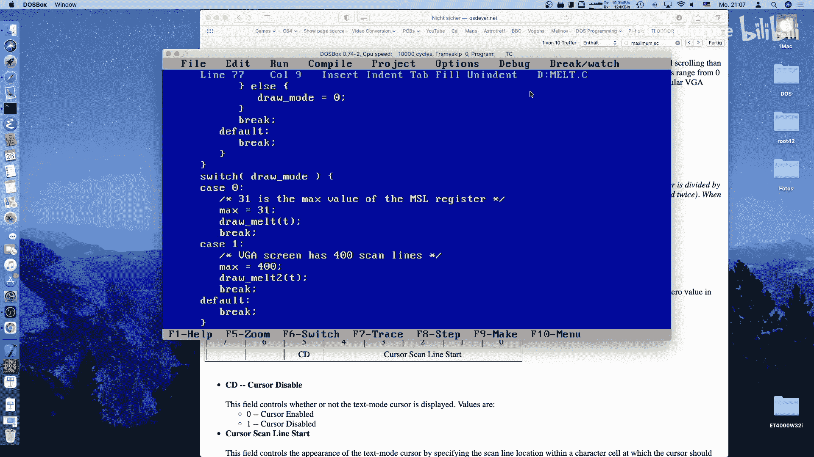
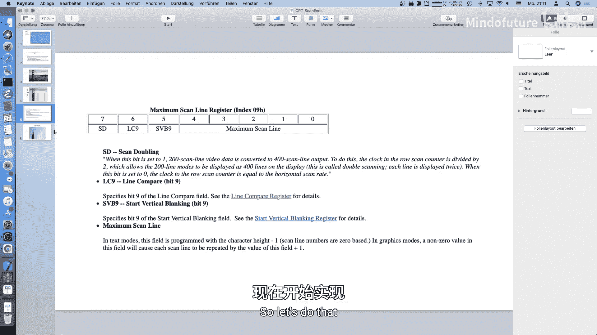
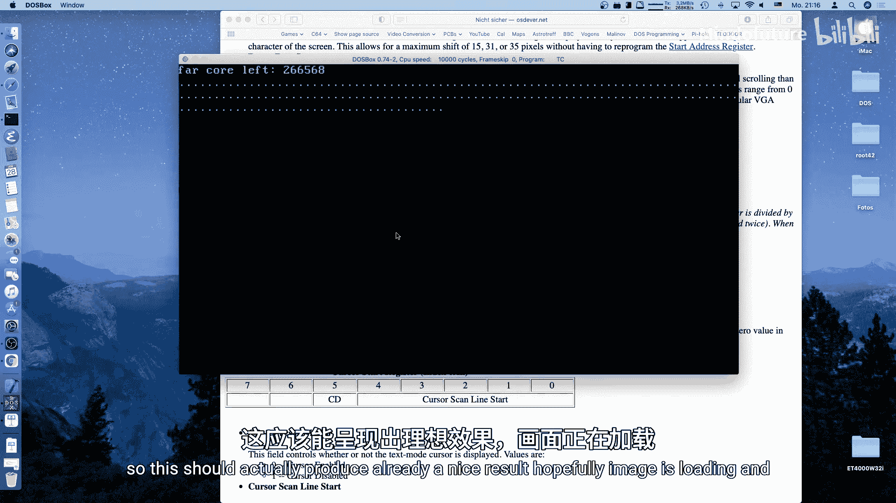
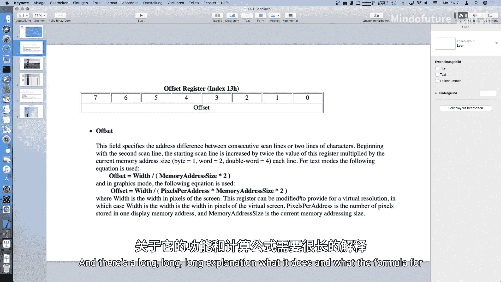

# 029：VGA屏幕融化效果教程



## 概述
在本节课中，我们将学习如何利用VGA显卡的特定寄存器，实现两种高效的屏幕“融化”视觉效果。这两种效果的核心在于巧妙地操作EGA/VGA寄存器，而非通过大量绘制像素来实现，因此即使在较慢的MS-DOS系统上也能流畅运行。

## VGA屏幕绘制原理
上一节我们介绍了课程目标，本节中我们来看看实现这些效果的基础：CRT显示器的扫描原理。

在MS-DOS时代，显示器使用阴极射线管。电子束从左到右、从上到下扫描屏幕，绘制出图像。
*   **水平回扫**：当电子束完成一行扫描，从右侧返回左侧准备绘制下一行时，这个过程称为水平回扫。在此期间，我们可以安全地修改VGA寄存器。
*   **垂直回扫**：当电子束完成一整帧（例如400条扫描线）的绘制，从屏幕右下角返回左上角时，这个过程称为垂直回扫。此时屏幕没有绘制操作，也是修改寄存器的安全时机。

理解这些时机对于实现精准的屏幕效果至关重要。



## 效果一：最大扫描线寄存器融化
第一种效果通过动态修改**最大扫描线寄存器**来实现。这个寄存器控制每条扫描线在屏幕上重复显示的次数。

以下是该寄存器的关键位域说明：
*   **位 7**：扫描线加倍位（在标准320x200图形模式下通常设为1，将200线倍增至400线输出）。
*   **位 5-6**：用于其他控制功能（如行比较、垂直消隐开始），我们需要保存和恢复它们。
*   **位 0-4**：**最大扫描线计数**。这5位值（0-31）决定了每条扫描线重复显示的次数，公式为 `重复次数 = 寄存器值 + 1`。

通过动画改变这5位的值（例如从0递增到31），可以让图像像橡皮筋一样向下拉伸（融化），然后再收缩回来。

现在，让我们来看看实现这个效果的代码核心部分。

以下是操作最大扫描线寄存器的关键步骤：
```c
// 1. 选择最大扫描线寄存器（索引为0x09）
outportb(CRTC_INDEX, MAX_SCAN_LINE_REG);



// 2. 读取寄存器的原始值
original_value = inportb(CRTC_DATA);



// 3. 构造新值：保留高3位，替换低5位为动画参数
new_value = (original_value & 0xE0) | (timer & 0x1F);

// 4. 将新值写回寄存器
outportb(CRTC_INDEX, MAX_SCAN_LINE_REG);
outportb(CRTC_DATA, new_value);
```
在主循环中，我们只需让 `timer` 变量在0到31之间循环递增和递减，然后调用上述函数，即可产生屏幕垂直融化的动画效果。这种方法没有移动任何像素数据，效率极高。

## 效果二：行偏移寄存器融化
上一节我们实现了垂直方向的拉伸融化，本节中我们来看看一个更复杂的水平方向“切割”融化效果。这需要用到**行偏移寄存器**。

行偏移寄存器决定了VGA在完成一条扫描线后，其帧缓冲区地址指针的增量。通常，对于320像素宽的模式，这个值是40（320字节 / 8位每字节），以确保指针指向下一行的开头。

这个效果的思路是：
1.  让屏幕正常绘制一定数量的扫描线（比如50行）。
2.  在某一时刻，将行偏移寄存器设置为0。
3.  此后，VGA将反复绘制同一行数据，直到帧结束，在屏幕上产生一条“切割”线。
4.  通过动画控制开始“切割”的位置，就能实现屏幕从上到下逐渐被“融化”或“切割”的效果。

以下是实现此效果的核心逻辑流程：
1.  **保存原始值**：读取并保存行偏移寄存器的原始值。
2.  **等待垂直回扫结束**：确保操作从新的一帧开始。
3.  **计数扫描线**：通过检测**水平回扫**状态位，精确等待N条扫描线经过。
4.  **修改寄存器**：将行偏移寄存器设置为0。
5.  **等待帧结束**：等待垂直回扫开始，表明当前帧绘制完毕。
6.  **恢复寄存器**：将行偏移寄存器恢复为原始值，以便下一帧正常显示。

由于此过程需要精确的时序，并且要防止被中断打扰，代码中会临时禁用中断，并在操作完成后重新启用。

## 总结
本节课中我们一起学习了两种在MS-DOS系统下利用VGA硬件寄存器实现的屏幕融化效果。

*   **效果一**通过动态修改**最大扫描线寄存器**，控制扫描线的重复次数，实现了高效的垂直方向拉伸动画。
*   **效果二**则通过在中途将**行偏移寄存器**置零，使VGA重复绘制同一行，创造了屏幕被水平“切割”融化的视觉效果。

这两种方法的共同优点是**极高的效率**，它们通过直接操纵硬件寄存器实现动画，避免了庞大的内存拷贝操作，因此即使在古老的X86机器上也能表现出色。你可以尝试调整动画参数，将这些效果用于场景切换或创造更独特的视觉演示。