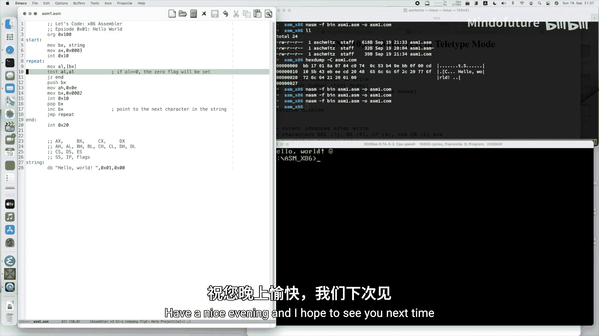

# 030：让我们编写x86汇编 - 0x01 Hello World


在本节课中，我们将学习如何编写一个简单的x86汇编程序，在MS-DOS环境下运行并打印“Hello World”。我们将从设置开发环境开始，逐步讲解汇编语言的基础概念，如寄存器、指令、中断和循环，最终完成并运行我们的第一个程序。

## 设置开发环境 🛠️

要开始编写x86汇编程序，首先需要搭建开发环境。这主要包括一个汇编器和一个MS-DOS模拟器。

以下是所需工具及其获取方式：

*   **汇编器：Netwide Assembler (NASM)**
    *   访问 [nasm.us](https://nasm.us) 下载最新版本，支持Linux、macOS和Windows。
    *   在macOS或Linux上，也可以通过包管理器安装，例如使用命令 `brew install nasm`。

*   **MS-DOS模拟器：DOSBox**
    *   访问 [dosbox.com](https://www.dosbox.com) 下载适用于您操作系统的版本。
    *   DOSBox易于使用，无需复杂的虚拟机配置。启动后，可以使用 `mount` 命令将本地目录挂载为DOS驱动器，方便访问源代码。例如：`mount d /path/to/your/programs`。

设置好环境后，就可以用任何文本编辑器（如Notepad++、Vim等）编写汇编代码了。

## 编写第一个程序：Hello World ✍️

上一节我们准备好了工具，本节中我们来看看如何编写一个能在MS-DOS下运行的“Hello World”程序。汇编文件使用分号 `;` 进行注释。

### 程序起始点

MS-DOS的`.COM`程序有其固定格式。程序代码必须从内存地址 `0x100` 开始，因为前面的256字节（`0x00` 到 `0xFF`）被MS-DOS的程序控制块占用。

```assembly
org 0x100      ; 告知汇编器，程序将从地址0x100开始加载和执行
```

接着，我们定义一个标签 `start`，作为程序代码的实际起点。

```assembly
start:
```

### 定义数据

我们需要在内存中存储要打印的字符串。使用 `db`（Define Byte）指令来声明字节数据。

```assembly
string db 'Hello World', 0x01, 0  ; 定义字符串，0x01是笑脸符号，0是字符串终止符
```

这里，`string` 是一个标签，代表了这段数据在内存中的起始地址。字符串以数字 `0`（空字符）结尾，这是C语言风格，便于我们检测字符串的结束。

### 使用寄存器

CPU中有一些用于临时存储数据的空间，称为寄存器。在8086处理器中，主要的通用寄存器是16位宽的：

*   **AX**：累加器，常用于算术运算。
*   **BX**：基址寄存器，常用于存放内存地址。
*   **CX**：计数寄存器，常用于循环计数。
*   **DX**：数据寄存器，常用于I/O操作。

每个16位寄存器还可以拆分为两个8位寄存器使用：
*   **AX** = **AH**（高8位） + **AL**（低8位）
*   **BX** = **BH** + **BL**
*   **CX** = **CH** + **CL**
*   **DX** = **DH** + **DL**

### 加载字符串地址

要将字符串打印到屏幕，首先需要知道它在内存中的位置。我们使用 `mov`（移动）指令将地址加载到BX寄存器中。

```assembly
mov bx, string  ; 将字符串`string`的地址存入BX寄存器
```

现在，BX寄存器就像一个指针，指向了字符串的开头。

### 循环打印字符

打印过程需要逐个字符进行，因此我们使用一个循环。首先定义一个循环标签 `repeat`。

```assembly
repeat:
```

在循环内部，我们需要做以下几件事：

1.  **获取当前字符**：通过BX寄存器指向的地址，取出一个字节（字符）放到AL寄存器中。方括号 `[bx]` 表示“取BX所指地址处的值”。
    ```assembly
    mov al, [bx]  ; 将BX指向的内存地址中的字节（字符）加载到AL寄存器
    ```

2.  **检查是否结束**：检查AL中的字符是否为0（字符串结尾）。我们使用 `test` 指令，它会对两个操作数进行按位与运算，并根据结果设置标志寄存器中的零标志位（ZF）。如果AL为0，则 `test al, al` 会将ZF设为1。
    ```assembly
    test al, al    ; 测试AL的值是否为零
    jz end         ; 如果为零（ZF=1），则跳转到`end`标签，结束循环
    ```

3.  **保存指针并递增**：在调用打印功能前，需要暂时保存BX的值（当前字符指针），因为打印功能会使用BX寄存器。我们使用栈来保存和恢复数据。
    ```assembly
    push bx        ; 将BX寄存器的值压入栈中保存
    inc bx         ; 将BX加1，指向字符串中的下一个字符
    ```

4.  **打印字符**：通过MS-DOS/BIOS提供的中断服务来打印字符。中断 `int 0x10` 是视频服务，其子功能 `0x0E` 用于在屏幕上以电传打字机模式写一个字符。
    *   将子功能号 `0x0E` 放入AH寄存器。
    *   将待打印的字符（已在AL中）放入AL寄存器。
    *   设置BH为页码（通常为0），BL为颜色属性（在文本模式下常被忽略）。
    ```assembly
    mov ah, 0x0E   ; 设置中断功能：电传打字机输出
    mov bh, 0      ; 页码为0
    mov bl, 0x0F   ; 颜色属性为白色（在图形模式下有效）
    int 0x10       ; 调用视频中断，打印字符
    ```

5.  **恢复指针并继续循环**：字符打印完毕后，从栈中恢复BX原来的值（指向当前已打印的字符），然后跳回循环开始，处理下一个字符。
    ```assembly
    pop bx         ; 从栈中弹出值，恢复BX寄存器（指向当前字符）
    jmp repeat     ; 无条件跳转回`repeat`标签，继续循环
    ```

### 程序结束

当循环检测到字符串结束符（0）并跳转到 `end` 标签时，程序需要正常退出。使用中断 `int 0x20` 可以终止程序，将控制权交还给MS-DOS。

```assembly
end:
int 0x20  ; 调用DOS中断，终止程序
```

## 汇编与运行程序 ⚙️

代码编写完成后，需要将其汇编成MS-DOS可执行的`.COM`文件。

使用NASM汇编器，指定输出格式为纯二进制（`-f bin`），因为`.COM`文件没有复杂的头部结构。

```bash
nasm -f bin asm1.asm -o asm1.com
```

如果汇编成功，将生成一个 `asm1.com` 文件。用DOSBox运行它：

```bash
# 在DOSBox中，假设你的程序在D盘
D:\> asm1.com
```

运行后，屏幕上应该会显示“Hello World”和一个笑脸符号。

## 扩展尝试：图形模式下的颜色 🎨

为了展示颜色属性的作用，我们可以尝试切换到图形模式。通过中断 `int 0x10` 的子功能 `0x00`（设置显示模式）可以实现。

在程序开头（`start:`标签后）添加以下代码切换到320x200、16色的图形模式：

```assembly
mov ax, 0x0013  ; AH=0（设置模式），AL=0x13（图形模式编号）
int 0x10        ; 调用视频中断
```

运行程序，你会看到“Hello World”显示在图形模式的屏幕上。此时，之前设置的 `mov bl, 0x0F`（白色）颜色属性可能会生效（取决于具体环境）。要切换回文本模式，可以使用模式 `0x03`：

```assembly
mov ax, 0x0003  ; AH=0， AL=0x03（80x25文本模式）
int 0x10
```

## 总结 📚

本节课中我们一起学习了x86汇编语言的基础。我们完成了一个完整的MS-DOS `.COM` 程序，它能够打印“Hello World”。我们涵盖了以下核心概念：

*   **程序结构**：`.COM`程序从 `org 0x100` 开始，使用标签组织代码和数据。
*   **数据定义**：使用 `db` 指令定义字节数据，并以0终止字符串。
*   **寄存器操作**：使用 `mov` 指令在寄存器和内存间移动数据。了解了AX、BX、CX、DX等通用寄存器及其高低字节。
*   **流程控制**：使用 `jmp` 进行无条件跳转，使用 `test` 配合 `jz`（或 `je`）进行条件跳转，实现循环逻辑。
*   **中断调用**：通过 `int` 指令调用系统服务，如 `int 0x10` 进行屏幕输出，`int 0x20` 终止程序。
*   **栈操作**：使用 `push` 和 `pop` 指令临时保存和恢复寄存器的值。

这个简单的程序是进入x86汇编和PC系统编程世界的第一步。在接下来的课程中，我们将探索如何处理用户输入、进行数学运算以及利用更多的BIOS和硬件功能。



