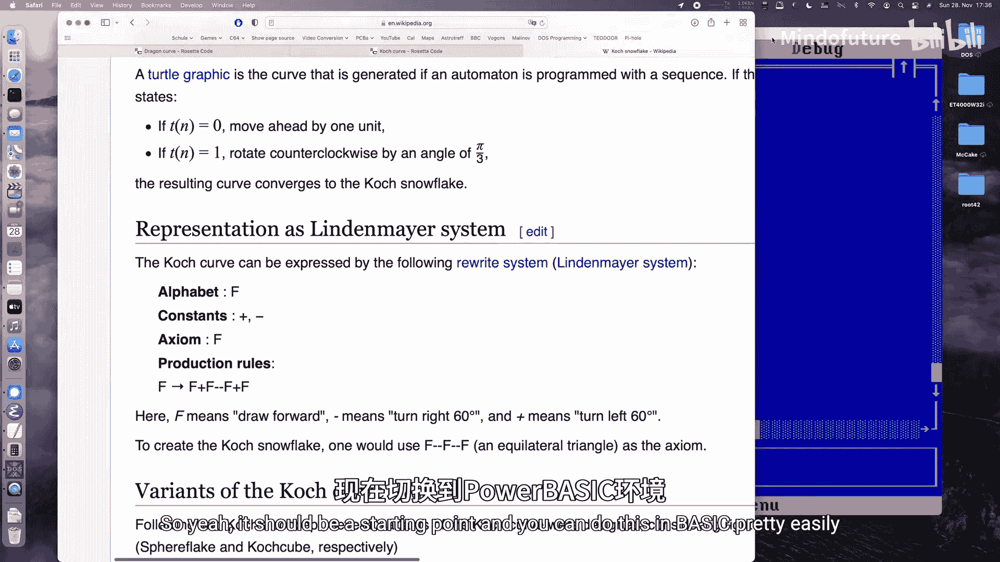
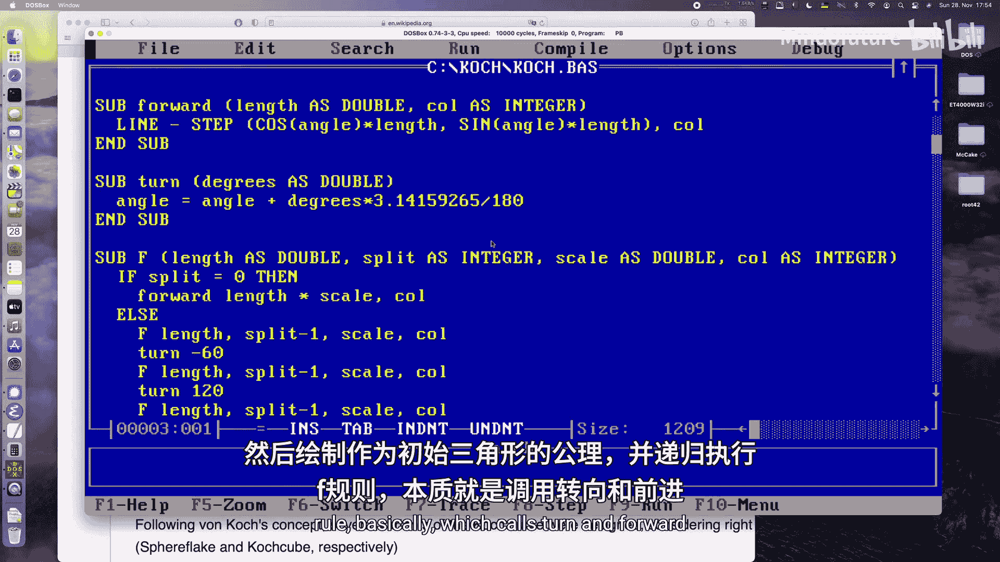
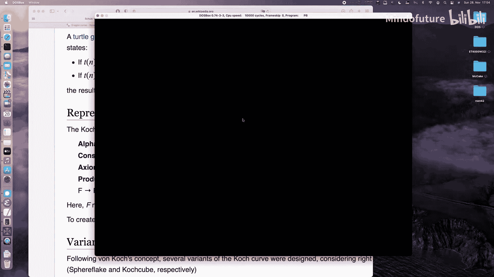
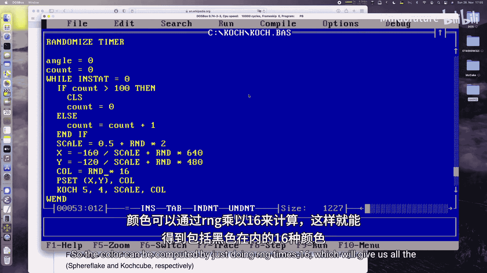
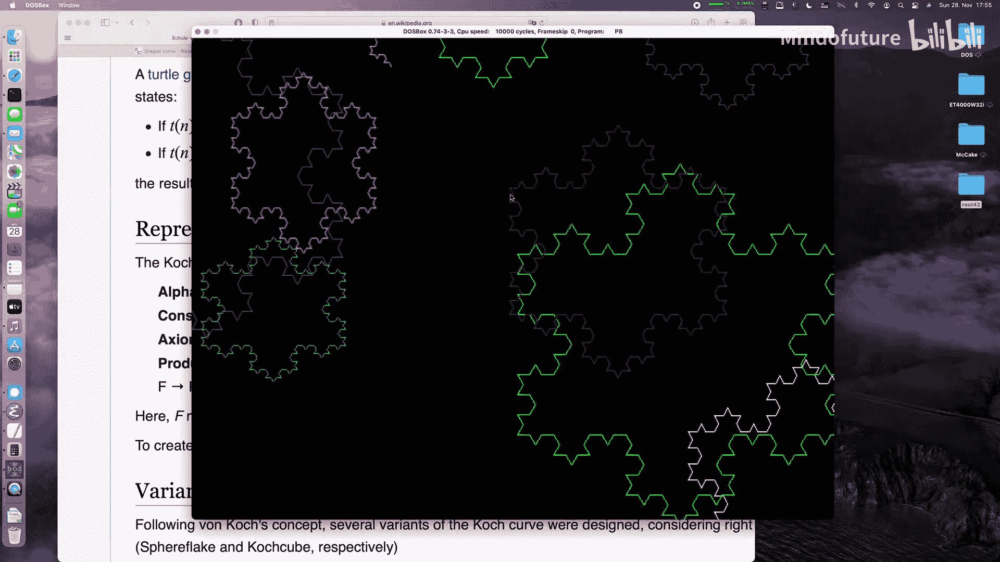
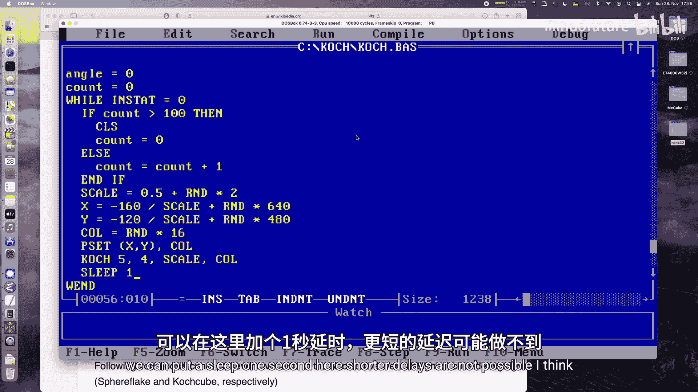
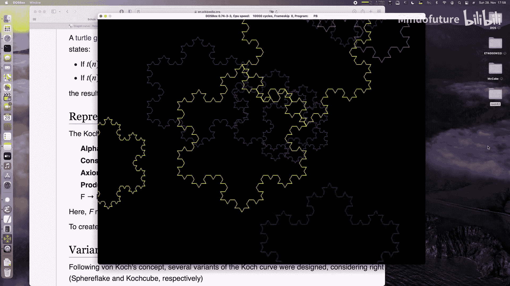

# 031：用Power BASIC绘制科赫雪花

## 概述

在本节课中，我们将学习如何使用Power BASIC编程语言在MS-DOS环境下绘制科赫雪花。科赫雪花是一种基于迭代函数系统（IFS）的分形图形，我们将通过实现一个L系统来生成它。课程将涵盖从设置图形模式到实现递归绘图函数的完整过程。

## 图形模式初始化与主循环

首先，我们需要将屏幕切换到VGA图形模式，并设置一个主循环来持续绘制雪花，直到用户按下任意键。

以下代码初始化图形模式并设置主循环结构：

```basic
SCREEN 12 ' 切换到640x480分辨率、16色的VGA模式
RANDOMIZE TIMER ' 初始化随机数生成器
angle = 0 ' 初始化当前角度变量
count = 0 ' 初始化绘制计数器

DO UNTIL INKEY$ <> "" ' 主循环，直到有按键按下
    IF count > 100 THEN ' 每绘制100个雪花后清屏
        CLS
        count = 0
    ELSE
        count = count + 1
    END IF
    ' ... 此处将放置绘制单个雪花的代码 ...
    SLEEP 1 ' 暂停1秒，控制绘制速度
LOOP



SCREEN 0 ' 程序退出前切换回文本模式
```

## 计算雪花初始位置与参数

在绘制每个雪花前，我们需要计算其初始位置、大小和颜色。这些参数通过随机数生成，以确保每个雪花都独一无二。

以下是计算这些参数的代码：

```basic
scale = 0.5 + RND * 2 ' 缩放因子，在0.5到2.5之间随机
x = RND * 640 - 160 / scale ' X坐标，考虑偏移使雪花分布均匀
y = RND * 480 - 120 / scale ' Y坐标
colour = INT(RND * 16) ' 颜色，0到15之间的随机整数
PSET (x, y), colour ' 设置绘图的起始像素点
```

## 定义科赫雪花绘制子程序

科赫雪花的绘制逻辑封装在一个名为 `co` 的子程序中。它接收长度、递归深度、缩放因子和颜色作为参数，并执行绘制雪花的“公理”（初始三角形）。

`co` 子程序的定义如下：

```basic
SUB co (length AS DOUBLE, split AS INTEGER, scale AS DOUBLE, colour AS INTEGER)
    ' 公理：绘制一个等边三角形
    CALL f(length, split - 1, scale, colour)
    CALL turn(120)
    CALL f(length, split - 1, scale, colour)
    CALL turn(120)
    CALL f(length, split - 1, scale, colour)
END SUB
```

## 实现L系统规则函数 `f`

函数 `f` 是L系统的核心，它实现了科赫曲线的生成规则。当递归深度 `split` 为0时，它绘制一条直线；否则，它将应用规则进行递归细分。

`f` 函数的实现代码如下：

```basic
SUB f (length AS DOUBLE, split AS INTEGER, scale AS DOUBLE, colour AS INTEGER)
    IF split = 0 THEN
        ' 递归基础情况：向前绘制线段
        CALL forward(length * scale, colour)
    ELSE
        ' 递归规则：F -> F+F--F+F
        CALL f(length, split - 1, scale, colour)
        CALL turn(60)
        CALL f(length, split - 1, scale, colour)
        CALL turn(-120)
        CALL f(length, split - 1, scale, colour)
        CALL turn(60)
        CALL f(length, split - 1, scale, colour)
    END IF
END SUB
```

## 实现基础绘图函数

为了支持 `f` 函数的操作，我们需要两个基础函数：`forward` 用于沿当前方向绘制线段，`turn` 用于改变当前方向。

以下是这两个函数的实现：

```basic
SUB forward (length AS DOUBLE, colour AS INTEGER)
    ' 根据当前角度和长度计算终点，并画线
    LINE -STEP(COS(angle) * length, SIN(angle) * length), colour
END SUB

SUB turn (degrees AS DOUBLE)
    ' 更新当前角度，将角度转换为弧度
    angle = angle + degrees * 3.14159265 / 180
END SUB
```

## 整合与运行

最后，在主循环中调用 `co` 子程序，传入计算好的参数，即可开始绘制雪花。







调用示例如下：





```basic
CALL co(5, 4, scale, colour) ' 绘制一个雪花，线段基础长度5像素，递归深度4
```

## 总结



本节课我们一起学习了如何在MS-DOS环境下使用Power BASIC绘制科赫雪花。我们了解了L系统的基本概念，实现了从图形初始化、参数计算、递归规则到最终绘制的完整流程。通过修改角度、规则或递归深度，你可以创造出无数种不同的分形图案。完整的源代码可在提供的GitHub链接中找到，欢迎下载并尝试修改以探索更多可能性。