# 033：Bresenham直线绘制算法 🖥️

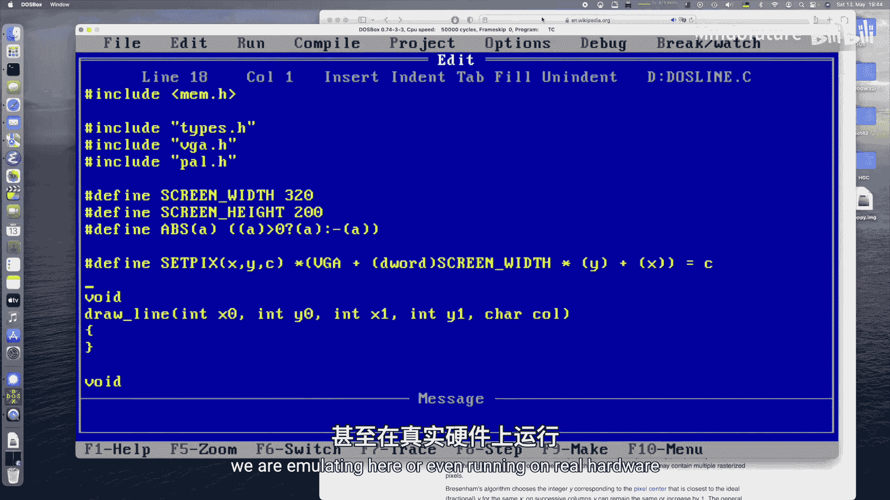

在本节课中，我们将学习如何在MS-DOS环境下，使用C语言和VGA图形模式实现经典的Bresenham直线绘制算法。我们将创建一个动态的、色彩循环的线条动画效果，类似于经典的屏幕保护程序。

## 概述 📋

Bresenham直线算法是计算机图形学中用于在栅格显示器上绘制直线的标准算法。它的主要优势在于完全使用整数运算，避免了耗时的浮点计算，因此在古老的MS-DOS机器上也能高效运行。

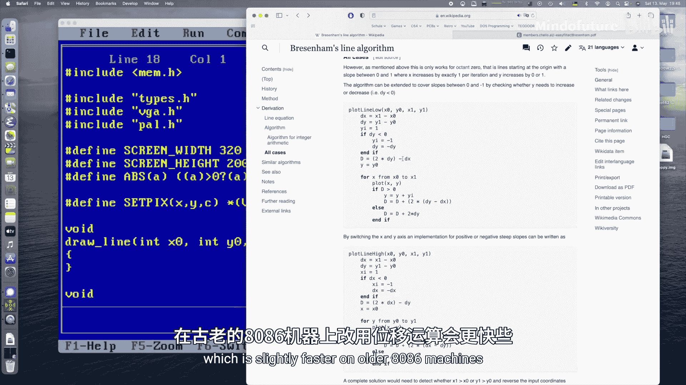

## Bresenham算法核心原理 🧮

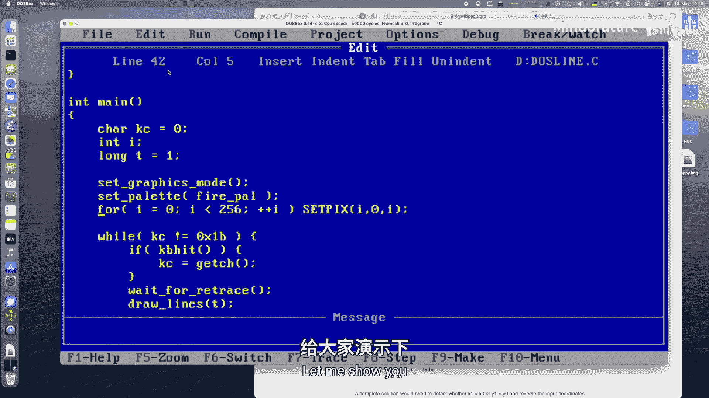

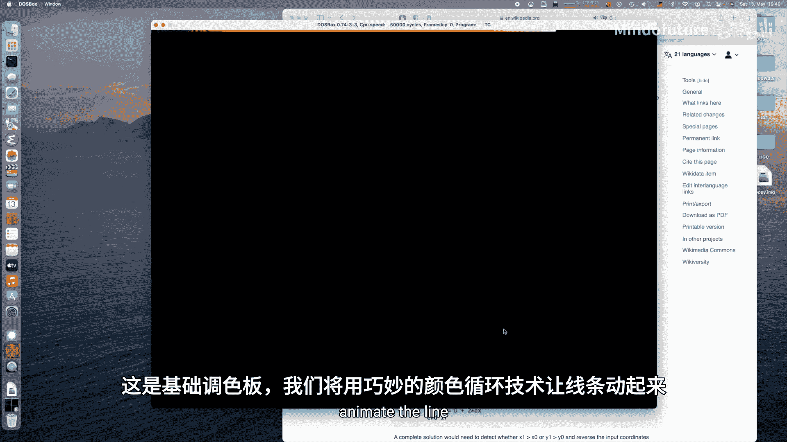

上一节我们介绍了算法的目标，本节中我们来看看其核心思想。Bresenham算法，也称为中点算法，其核心是通过计算并累加一个“误差”值来决定下一个像素点的位置。

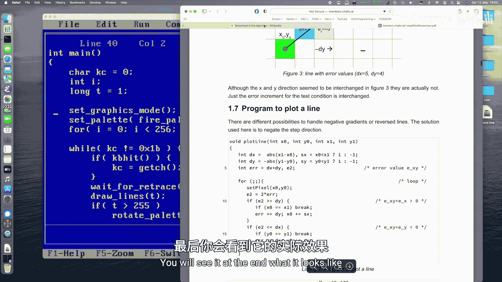

该算法基于直线的隐式方程。对于由两点 `(x0, y0)` 和 `(x1, y1)` 定义的直线，我们计算差值：
```
dx = |x1 - x0|
dy = |y1 - y0|
```
同时，确定X和Y方向的步进符号 `sx` 和 `sy`。

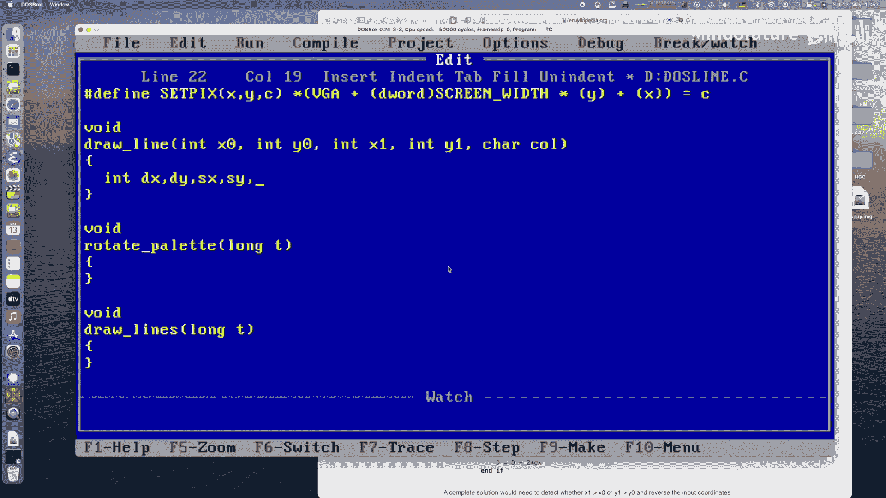

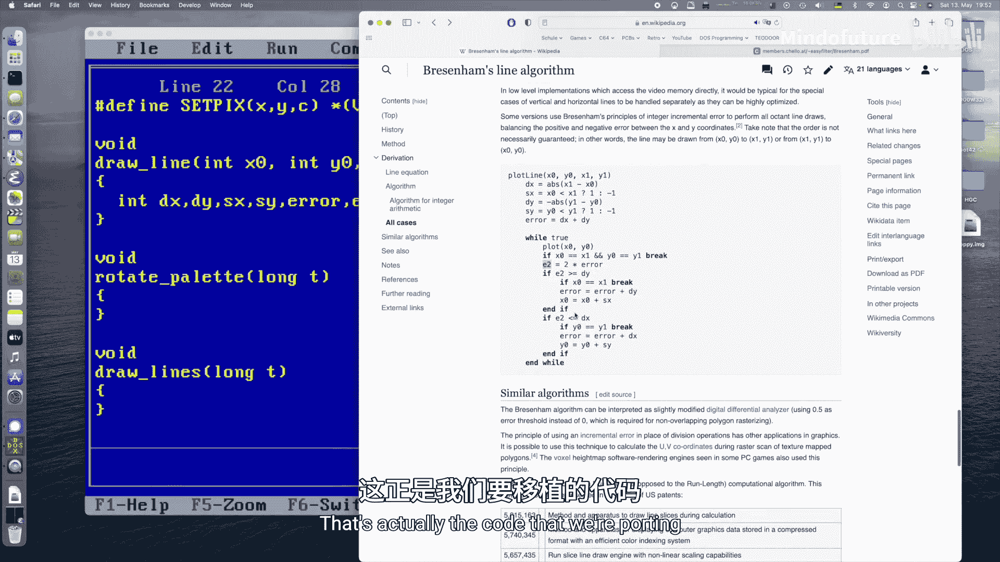

初始误差值 `error` 的计算公式为：
```
error = -dx - dy
```
然后，算法进入循环，在每一步：
1.  绘制当前像素点 `(x, y)`。
2.  计算两倍的误差值 `e2 = 2 * error`。
3.  根据 `e2` 与 `-dy` 和 `dx` 的比较，决定是沿X方向步进、沿Y方向步进，还是同时步进，并更新误差值。

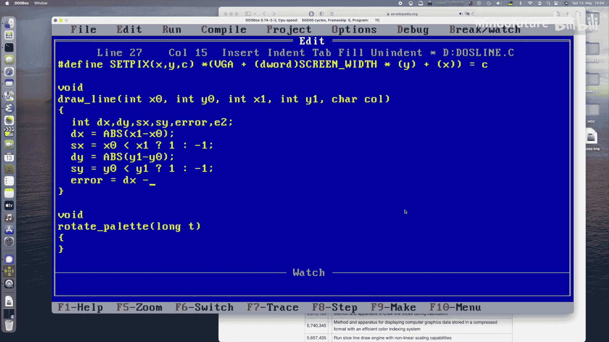

以下是该算法“全象限”版本的伪代码，它通过处理符号和绝对值，避免了传统Bresenham算法需要分八个象限处理的复杂性：
```
function draw_line(x0, y0, x1, y1, color)
    dx = abs(x1 - x0)
    dy = abs(y1 - y0)
    sx = (x0 < x1) ? 1 : -1
    sy = (y0 < y1) ? 1 : -1
    error = -dx - dy

    while true do
        plot_pixel(x0, y0, color)
        if x0 == x1 and y0 == y1 then break
        e2 = 2 * error
        if e2 >= -dy then
            if x0 == x1 then break
            error = error - dy
            x0 = x0 + sx
        end if
        if e2 <= dx then
            if y0 == y1 then break
            error = error + dx
            y0 = y0 + sy
        end if
    end while
end function
```

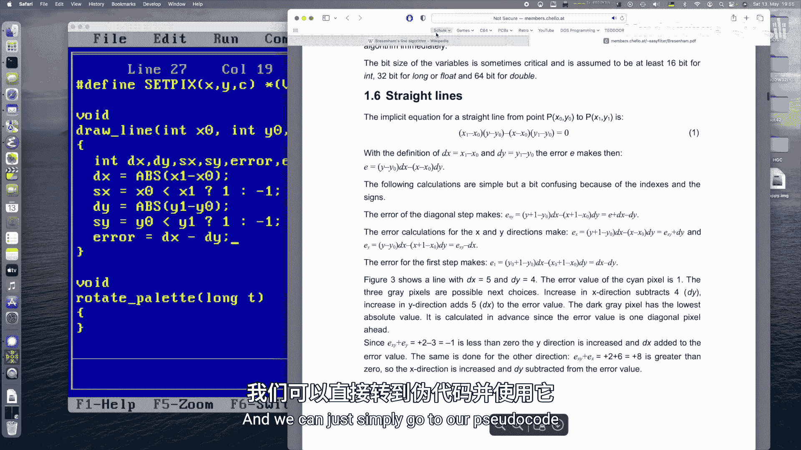

## 代码实现：绘制单条直线 💻

现在，我们将上述伪代码转化为可在Turbo C中运行的C语言函数。

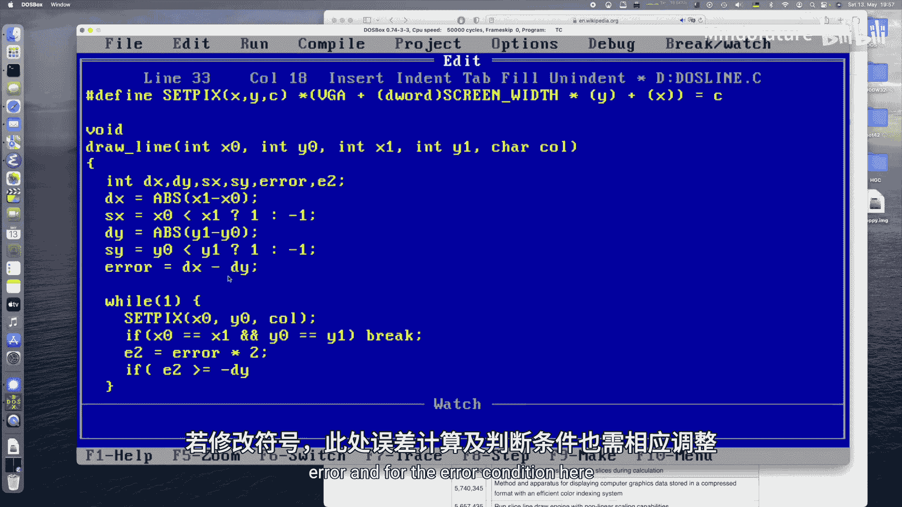

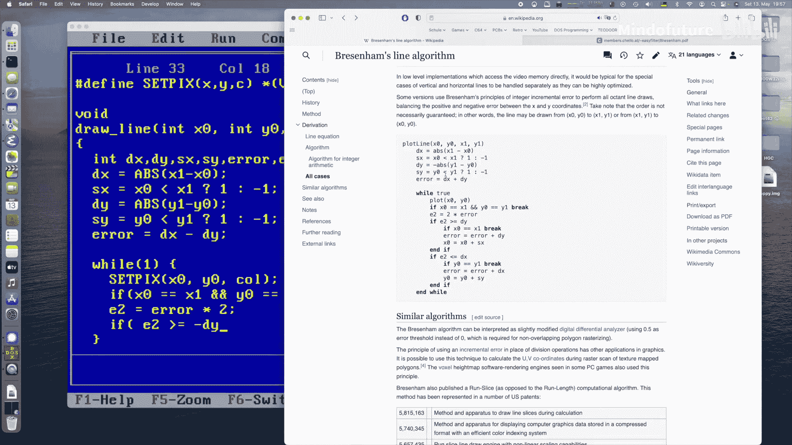

我们需要包含必要的头文件并定义绝对值宏。函数接收直线的起点、终点坐标和颜色值。
```c
#include <conio.h>
#include <dos.h>
#include <math.h>
#include <stdlib.h>
#include <time.h>

#define abs(a) (((a) < 0) ? -(a) : (a))

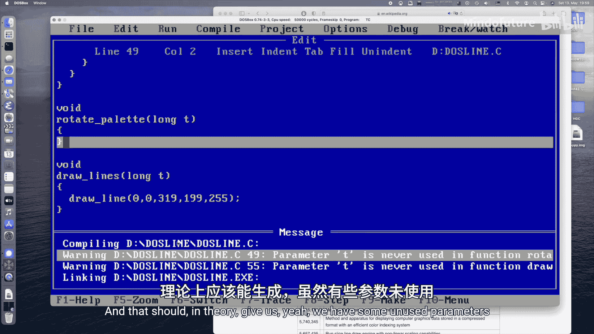

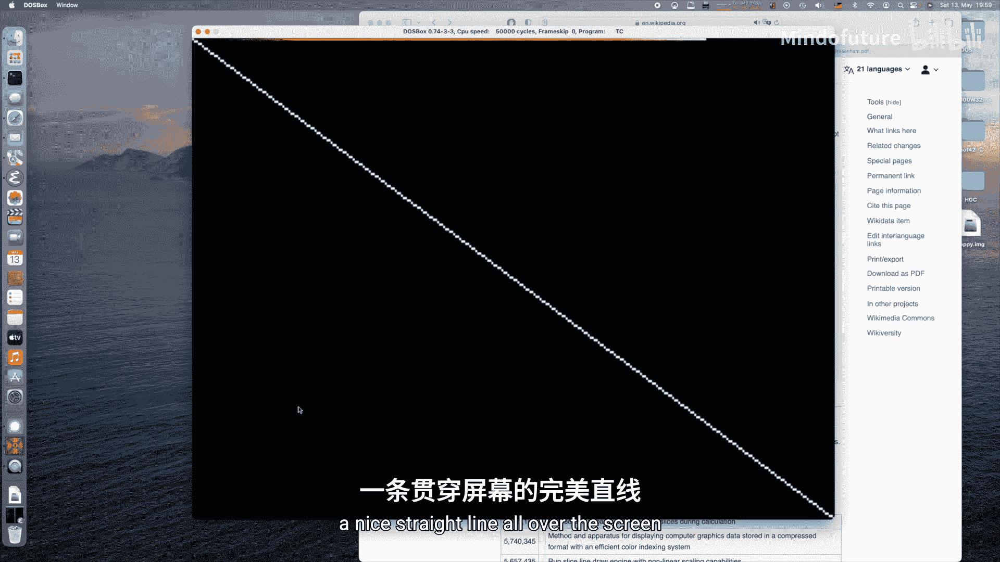

void draw_line(int x0, int y0, int x1, int y1, unsigned char color) {
    int dx = abs(x1 - x0);
    int dy = abs(y1 - y0);
    int sx = (x0 < x1) ? 1 : -1;
    int sy = (y0 < y1) ? 1 : -1;
    int error = -dx - dy;
    int e2;

    while (1) {
        /* 在此处写入像素到屏幕内存 (例如，0xA000段) */
        pokeb(0xA000, y0 * 320 + x0, color);

        if (x0 == x1 && y0 == y1) break;

        e2 = 2 * error;

        if (e2 >= -dy) {
            if (x0 == x1) break;
            error -= dy;
            x0 += sx;
        }
        if (e2 <= dx) {
            if (y0 == y1) break;
            error += dx;
            y0 += sy;
        }
    }
}
```

## 创建动态线条动画 🎨

仅仅绘制静态直线不够有趣。接下来，我们将利用这个函数创建一个动态效果：多条线段在屏幕边界反弹，并通过调色板旋转实现色彩渐变。

以下是实现该效果的核心步骤：

首先，我们需要定义存储多条线段坐标和速度的数组。
```c
#define MAX_LINES 256
int line_x0[MAX_LINES], line_y0[MAX_LINES];
int line_x1[MAX_LINES], line_y1[MAX_LINES];
int dx0[MAX_LINES], dy0[MAX_LINES];
int dx1[MAX_LINES], dy1[MAX_LINES];
```

在程序初始化时，随机生成线段的位置和移动速度。
```c
void init_lines() {
    int i;
    randomize();
    for (i = 0; i < MAX_LINES; i++) {
        line_x0[i] = rand() % 320;
        line_y0[i] = rand() % 200;
        line_x1[i] = rand() % 320;
        line_y1[i] = rand() % 200;

        dx0[i] = (rand() % 3) + 1;
        dy0[i] = (rand() % 3) + 1;
        dx1[i] = (rand() % 3) + 1;
        dy1[i] = (rand() % 3) + 1;
    }
}
```

在主循环中，我们每帧只做三件事：
1.  用黑色擦除最老的那条线（即255帧前画的那条）。
2.  根据速度更新最新一条线的位置，并处理屏幕边界碰撞。
3.  用当前颜色绘制最新的那条线。

这种“只画两条线”的策略极大地提升了性能，使得在8086级别的机器上运行动画成为可能。
```c
int t = 0; // 时间索引
while (!kbhit()) {
    int last_idx = t % MAX_LINES;
    int prev_idx = (t - 1) % MAX_LINES;
    int first_idx = (t - MAX_LINES) % MAX_LINES;

    // 1. 擦除最老的线（如果已存在）
    if (t >= MAX_LINES) {
        draw_line(line_x0[first_idx], line_y0[first_idx],
                  line_x1[first_idx], line_y1[first_idx], 0);
    }

    // 2. 更新最新线的位置（基于上一帧的位置）
    line_x0[last_idx] = line_x0[prev_idx] + dx0[prev_idx];
    line_y0[last_idx] = line_y0[prev_idx] + dy0[prev_idx];
    line_x1[last_idx] = line_x1[prev_idx] + dx1[prev_idx];
    line_y1[last_idx] = line_y1[prev_idx] + dy1[prev_idx];

    // 处理屏幕边界碰撞反射
    if (line_x0[last_idx] <= 0 || line_x0[last_idx] >= 319) dx0[prev_idx] = -dx0[prev_idx];
    if (line_y0[last_idx] <= 0 || line_y0[last_idx] >= 199) dy0[prev_idx] = -dy0[prev_idx];
    if (line_x1[last_idx] <= 0 || line_x1[last_idx] >= 319) dx1[prev_idx] = -dx1[prev_idx];
    if (line_y1[last_idx] <= 0 || line_y1[last_idx] >= 199) dy1[prev_idx] = -dy1[prev_idx];

    // 3. 绘制最新的线，颜色基于时间索引
    draw_line(line_x0[last_idx], line_y0[last_idx],
              line_x1[last_idx], line_y1[last_idx], (t % 255) + 1);

    t++;
    rotate_palette(); // 旋转调色板以产生色彩流动效果
    delay(10); // 控制帧率
}
```

## 实现调色板旋转 🌈

为了实现线条从亮白色渐变为暗红色的色彩流动效果，我们不需要重绘每条线，只需每帧旋转VGA调色板即可。这是实现高效色彩动画的关键技巧。

以下是旋转调色板的函数：
```c
void rotate_palette() {
    int i;
    int start = (254 - 2) % 255; // 计算旋转起始索引
    outp(0x3C8, 0); // 设置调色板索引寄存器，从索引0开始写

    // 写入索引0的颜色（通常为黑色，保持不变）
    outp(0x3C9, 0);
    outp(0x3C9, 0);
    outp(0x3C9, 0);

    // 旋转其余255个颜色索引
    for (i = 1; i < 256; i++) {
        int idx = (start + i) % 255;
        // 假设 palette 是一个存储了 RGB 值的数组
        outp(0x3C9, palette[idx * 3]);     // R
        outp(0x3C9, palette[idx * 3 + 1]); // G
        outp(0x3C9, palette[idx * 3 + 2]); // B
    }
}
```

## 总结 🎯

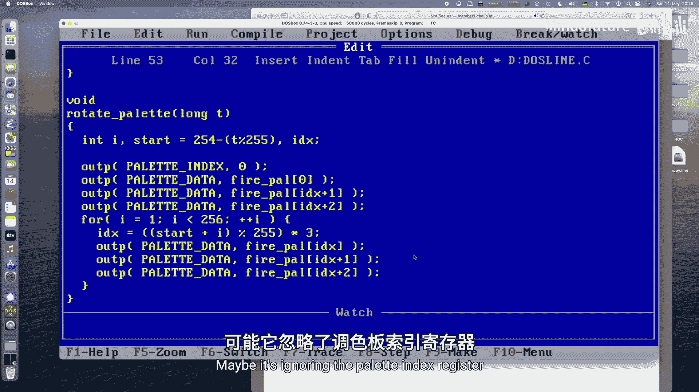

本节课中我们一起学习了Bresenham直线绘制算法的原理与实现，并在此基础上创建了一个生动的MS-DOS图形动画。我们掌握了以下关键点：

*   **Bresenham算法**：使用纯整数运算高效绘制直线，通过误差累积决定像素位置。
*   **动画技巧**：通过每帧只更新（擦除和绘制）两条线段，而非重绘全部256条线，实现了在低性能硬件上的流畅动画。
*   **色彩效果**：利用VGA调色板旋转技术，在不修改帧缓冲区像素的情况下，创造了动态的色彩渐变和流动效果。
*   **性能优化**：这些技术（整数运算、最小化绘制操作、硬件调色板操作）是早期计算机图形编程的核心，即使在现代编程中，理解其思想也很有价值。

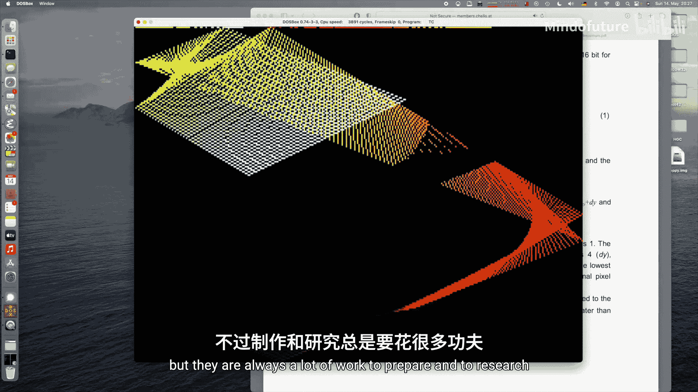

你可以尝试修改代码，例如改变线条数量、速度或碰撞逻辑，也可以尝试实现每帧清屏并重绘所有线段的效果，以对比性能差异。