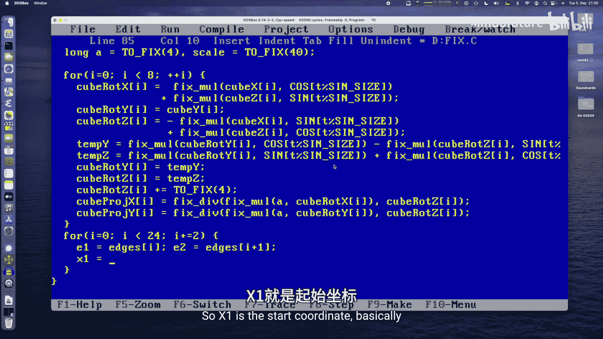
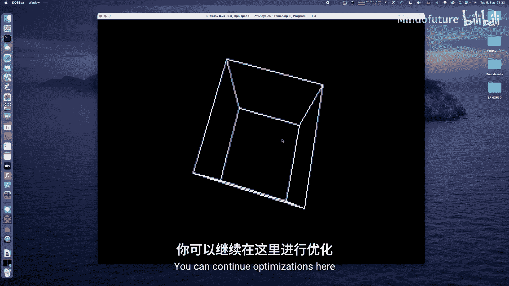
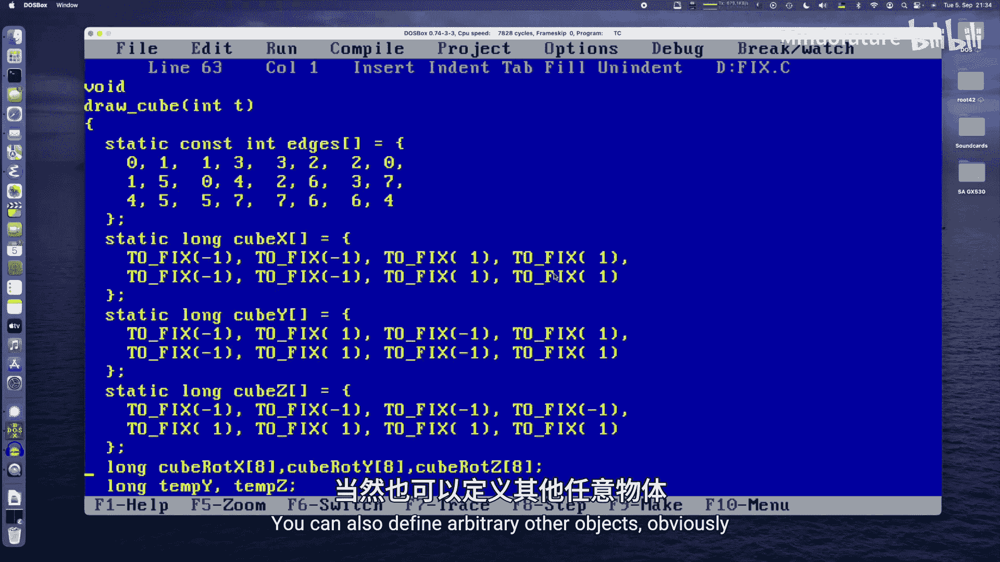
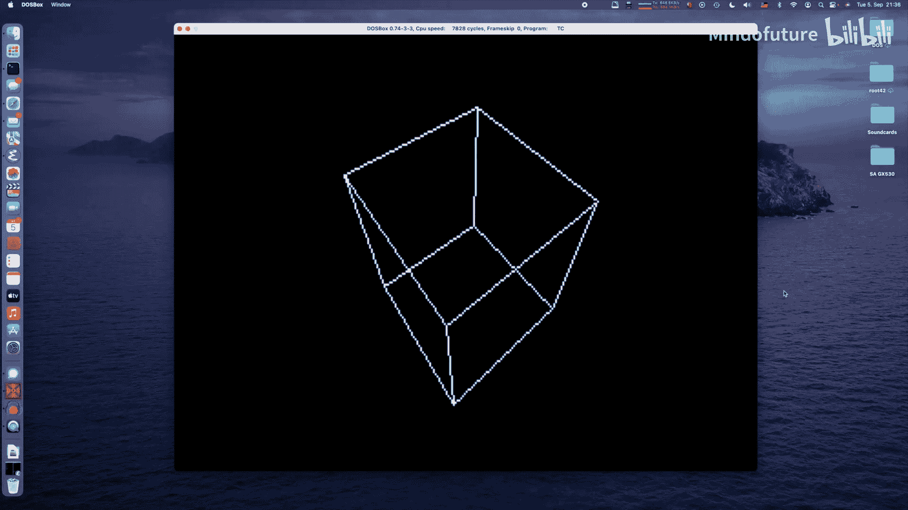

# 034：使用0x21中断和定点数学绘制3D线框立方体教程 🎮

在本节课中，我们将学习如何在MS-DOS环境下，使用C语言和定点数学运算，绘制一个旋转的3D线框立方体。我们将从基础概念讲起，逐步实现代码，最终得到一个在VGA 320x200 256色模式下运行的动画。

## 概述 📖

3D图形编程是演示场景和游戏开发的核心技能。在早期PC（如286、386）上，由于缺乏浮点运算单元（FPU），使用浮点数进行3D计算会非常缓慢。因此，定点数学成为了一种高效的选择。本节课，我们将利用定点数学、旋转矩阵和透视投影，实现一个简单的旋转立方体。

## 1. 背景与参考资料 📚

在20世纪90年代，互联网尚未普及，编程知识主要来源于杂志和书籍。一本名为《PC Underground》的德文书籍，由Data Becker公司出版，详细介绍了DOS、VGA和3D编程，是当时许多德国编程爱好者的重要学习资料。

这本书包含了大量用Pascal和汇编语言编写的图形例程，虽然出版于DOS时代的晚期，但其中的知识至今仍有价值。幸运的是，这本书现在可以在archive.org上找到。

## 2. 3D图形编程基础 🧮

上一节我们介绍了学习背景，本节中我们来看看3D编程所需的核心数学概念。

进行3D编程需要了解线性代数，特别是向量和矩阵。为了简化，我们暂时忽略点和向量的齐次坐标（第四维），只使用三维向量。

一个三维向量包含三个分量，可以表示为 `(x, y, z)`。它可以表示空间中的一个点，也可以表示一个平移。

以下是向量的基本运算：
*   **向量加法/减法**：对应分量相加或相减。用于物体的平移。
*   **标量积（点积）**：可用于计算两向量夹角的余弦值，未来可用于光照计算。
*   **向量长度**：公式为 `sqrt(x*x + y*y + z*z)`，本节课暂不需要。

### 2.1 透视投影 👁️

如何将三维空间中的点 `(x, y, z)` 投影到二维屏幕 `(x‘, y’)` 上？这需要透视投影。

假设相机位于原点，屏幕在相机前方，距离为焦距 `a`。那么投影公式非常简单：

**x‘ = a * x / z**
**y‘ = a * y / z**

可以看到，只需要一次除法运算。`z` 坐标决定了物体的大小和远近感。

### 2.2 旋转变换 🔄

为了让立方体旋转，我们需要旋转变换。旋转可以通过矩阵乘法来实现。

以下是绕X轴旋转的矩阵公式（旋转角度为 α）：

```
x‘ = x
y‘ = y * cos(α) - z * sin(α)
z‘ = y * sin(α) + z * cos(α)
```

类似地，可以推导出绕Y轴和Z轴旋转的矩阵。结合三个轴的旋转和平移，我们就可以让物体在三维空间中自由运动。

## 3. 定点数学 🎯

上一节我们介绍了3D变换的数学原理，本节中我们来看看如何在缺乏FPU的CPU上高效实现这些计算——使用定点数学。

定点数学的核心思想是使用整数来模拟小数。我们指定整数中的某几位来表示小数部分。

例如，我们使用32位长整型（`long`），并规定其中较低的9位为小数部分。这意味着我们将数值放大了 `2^9 = 512` 倍。

以下是核心的转换和运算宏定义：

```c
#define FIXED_PRECISION 9
#define TO_FIXED(x) ((long)((x) * (1 << FIXED_PRECISION)))
#define TO_LONG(x)  ((long)((x) / (1 << FIXED_PRECISION)))
#define TO_DOUBLE(x) ((double)(x) / (1 << FIXED_PRECISION))

// 加法和减法直接进行
// 乘法需要修正
#define FIXED_MUL(a, b) (((a) * (b)) >> FIXED_PRECISION)
#define FIXED_SQR(a) FIXED_MUL((a), (a))
// 除法需要预先将被除数放大
#define FIXED_DIV(a, b) (((a) << FIXED_PRECISION) / (b))
```

**注意**：除法运算 `FIXED_DIV` 在数值较大时可能溢出，因为我们将被除数放大了。在286等16位平台上需要格外小心，避免操作过大的数。更稳健的方法是使用64位中间值或手动处理高位。

## 4. 代码实现 💻

现在，让我们切换到代码层面，一步步实现旋转立方体。

### 4.1 程序框架与初始化

首先，我们来看程序的主干和初始化部分。

```c
#include <stdio.h>
#include <dos.h>
#include <math.h>
#include “vga.h” // 包含我们自己的VGA图形和画线函数

#define SINE_SIZE 512
long sin_table[SINE_SIZE + SINE_SIZE/4]; // 多分配一些空间，用于同时存储sin和cos
long *cos_table = sin_table + SINE_SIZE/4; // cos表是sin表的相位偏移

int main() {
    int key_code = 0;
    long time = 0;
    // 初始化正弦表（使用浮点数计算一次，可预先计算存入文件）
    for(int i = 0; i < SINE_SIZE + SINE_SIZE/4; i++) {
        double angle = 2.0 * M_PI * i / SINE_SIZE;
        sin_table[i] = TO_FIXED(sin(angle));
    }
    // 设置VGA 320x200 256色模式
    set_vga_mode(0x13);
    // 主循环
    while(key_code != 1) { // 1 代表 ESC 键
        // 清空后台缓冲区
        clear_buffer();
        // 绘制立方体
        draw_cube(time);
        // 等待垂直回扫，减少闪烁
        wait_for_retrace();
        // 将后台缓冲区复制到VGA显存
        copy_buffer_to_vga();
        // 更新动画时间
        time += 2;
        // 检查键盘输入
        if(kbhit()) {
            key_code = getch();
        }
    }
    // 恢复文本模式
    set_text_mode();
    return 0;
}
```

### 4.2 定义立方体模型 🔲

我们需要定义立方体的8个顶点和12条边（线框）。

以下是顶点坐标（使用定点数），定义了一个中心在原点、边长为2的立方体：

```c
// 顶点坐标 (-1, -1, -1) 到 (1, 1, 1)
long cube_x[] = { TO_FIXED(-1), TO_FIXED(1), TO_FIXED(1), TO_FIXED(-1),
                  TO_FIXED(-1), TO_FIXED(1), TO_FIXED(1), TO_FIXED(-1) };
long cube_y[] = { TO_FIXED(-1), TO_FIXED(-1), TO_FIXED(1), TO_FIXED(1),
                  TO_FIXED(-1), TO_FIXED(-1), TO_FIXED(1), TO_FIXED(1) };
long cube_z[] = { TO_FIXED(-1), TO_FIXED(-1), TO_FIXED(-1), TO_FIXED(-1),
                  TO_FIXED(1), TO_FIXED(1), TO_FIXED(1), TO_FIXED(1) };
```

以下是边的定义，每两个数字构成一条线段，连接两个顶点：

```c
int edges[] = {
    0,1, 1,3, 3,2, 2,0, // 底面
    4,5, 5,7, 7,6, 6,4, // 顶面
    0,4, 1,5, 2,6, 3,7  // 侧面垂直边
};
```

### 4.3 核心绘制函数

`draw_cube` 函数是核心，它负责对每个顶点进行旋转、平移、投影，然后绘制所有边。

以下是该函数的关键步骤：

1.  **旋转**：首先绕Y轴旋转，然后绕X轴旋转（顺序可调）。使用之前定义的旋转矩阵公式和定点乘法。
    ```c
    // 绕Y轴旋转
    temp_x = FIXED_MUL(cube_x[i], cos_table[angle_y]) + FIXED_MUL(cube_z[i], sin_table[angle_y]);
    temp_z = -FIXED_MUL(cube_x[i], sin_table[angle_y]) + FIXED_MUL(cube_z[i], cos_table[angle_y]);
    rot_y[i] = cube_y[i]; // Y坐标不变
    // 绕X轴旋转 (使用上一步的结果)
    rot_x[i] = temp_x;
    rot_y[i] = FIXED_MUL(rot_y[i], cos_table[angle_x]) - FIXED_MUL(temp_z, sin_table[angle_x]);
    rot_z[i] = FIXED_MUL(rot_y[i], sin_table[angle_x]) + FIXED_MUL(temp_z, cos_table[angle_x]);
    ```

2.  **平移**：将立方体沿Z轴正方向移动一段距离，使其位于相机前方。
    ```c
    trans_z[i] = rot_z[i] + TO_FIXED(4.0);
    ```



3.  **透视投影**：应用投影公式 `x‘ = a * x / z`。
    ```c
    #define FOCAL_LENGTH TO_FIXED(2.0)
    proj_x[i] = FIXED_DIV(FIXED_MUL(FOCAL_LENGTH, rot_x[i]), trans_z[i]);
    proj_y[i] = FIXED_DIV(FIXED_MUL(FOCAL_LENGTH, rot_y[i]), trans_z[i]);
    ```

4.  **缩放与居中**：将投影后的坐标转换为屏幕像素坐标。
    ```c
    #define SCALE 40
    screen_x1 = TO_LONG(FIXED_MUL(proj_x[edge_start], SCALE)) + SCREEN_WIDTH/2;
    screen_y1 = TO_LONG(FIXED_MUL(proj_y[edge_start], SCALE)) + SCREEN_HEIGHT/2;
    ```

5.  **绘制线段**：遍历所有边，调用画线函数连接两个投影后的屏幕坐标点。
    ```c
    draw_line(screen_x1, screen_y1, screen_x2, screen_y2, 15); // 15是白色
    ```

## 5. 总结与展望 🚀



本节课中，我们一起学习了在MS-DOS环境下进行3D图形编程的基础。

我们回顾了向量、矩阵、透视投影和旋转变换等核心数学概念。重点掌握了**定点数学**技术，它通过整数运算模拟小数，在旧款CPU上能获得极高的性能。我们实现了从浮点数到定点数的转换宏，以及定点数的加、减、乘、除运算。



通过代码实践，我们定义了一个立方体模型，对其顶点应用了旋转、平移和透视投影变换，最终将投影后的2D坐标用线段连接起来，在屏幕上绘制出一个旋转的线框立方体。

这个程序是3D图形编程一个非常简洁的起点。在此基础上，你可以进行许多优化和扩展：
*   **性能优化**：使用汇编语言重写关键计算函数；直接向VGA显存绘制以减少内存拷贝。
*   **功能增强**：添加绕Z轴旋转；实现背面剔除和平面着色（填充多边形）；加载更复杂的3D模型。
*   **效果丰富**：添加颜色渐变、纹理映射或简单的光照模型。




希望本教程能为你打开MS-DOS时代3D编程的大门。尝试修改参数，优化代码，并创造属于你自己的图形效果吧！