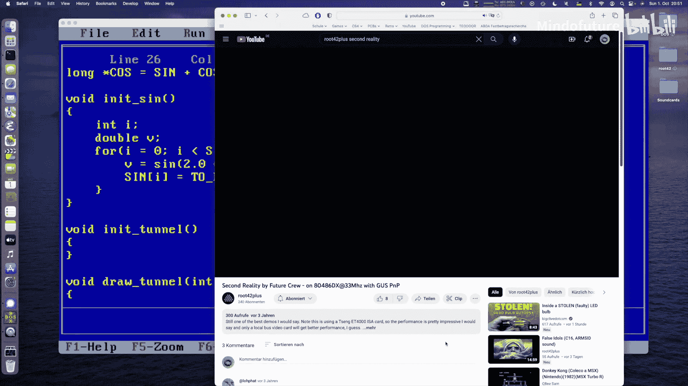
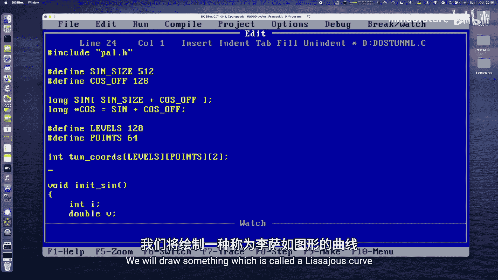
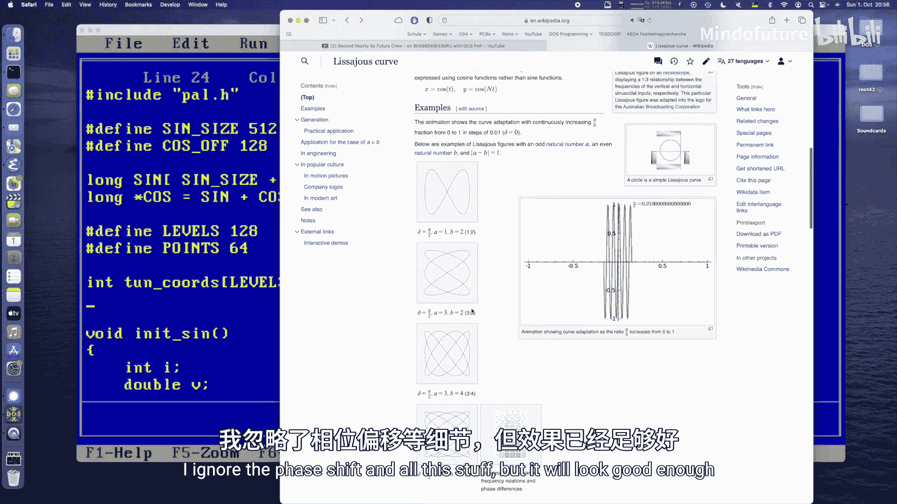
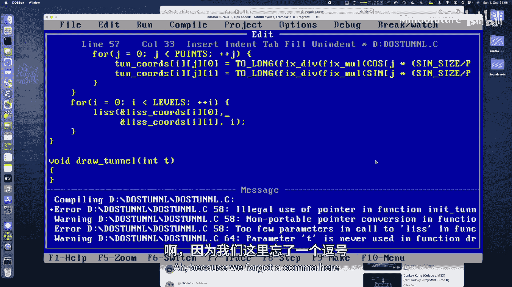
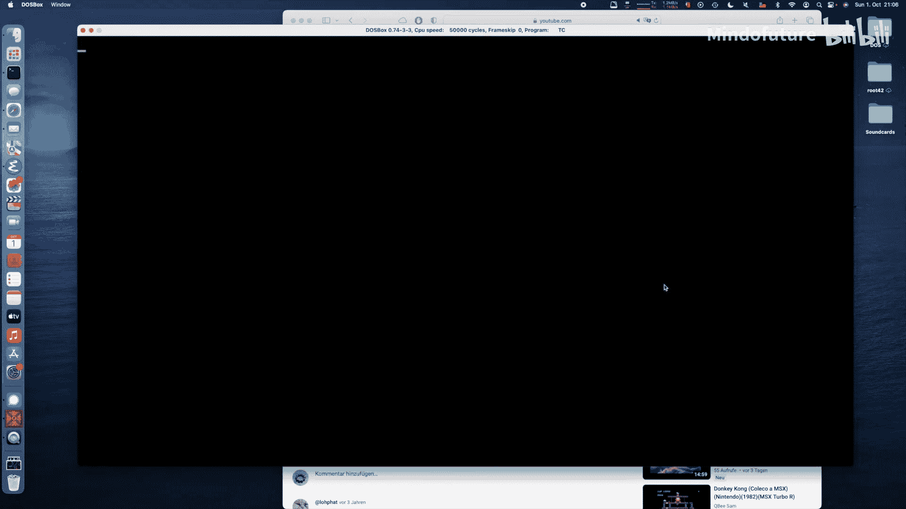
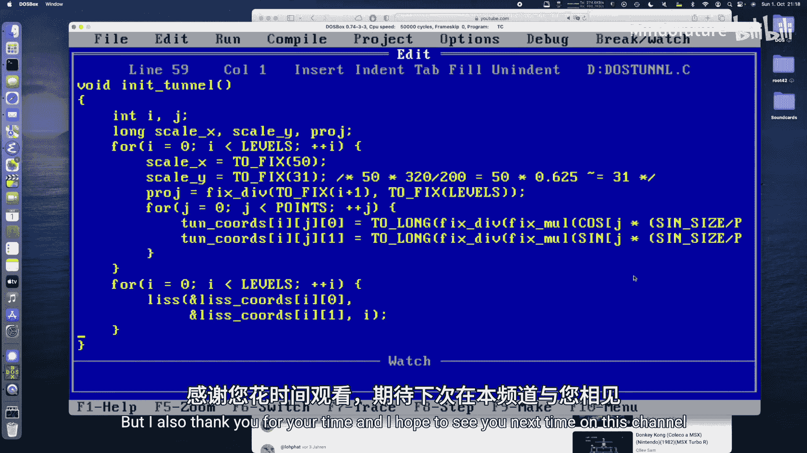

# 035：实现Second Reality隧道效果



在本节课中，我们将学习如何为MS-DOS系统编写一个经典的“隧道”视觉效果。这个效果因Future Crew的演示程序《Second Reality》而闻名。我们将使用C语言和汇编知识，在VGA图形模式下，通过预计算坐标和利萨茹曲线动画来创建一个具有3D透视感的动态隧道。

## 概述

我们将基于上一课的“DOS立方体”代码进行构建。核心思路是预计算一系列同心椭圆环（代表隧道的横截面），然后使用利萨茹曲线为这些环添加平滑的波动动画，最后通过透视投影将它们绘制到屏幕上，并利用灰度颜色模拟深度感。

---



## 初始化隧道数据



上一节我们介绍了项目的基础结构，本节中我们来看看如何初始化构成隧道的静态数据。我们需要定义隧道的环数、每环的点数，并预计算它们的坐标。

首先，定义两个常量：
*   `LEVELS`: 隧道的环数，例如108。
*   `POINTS`: 每个环由多少个点构成，例如64。

这总共需要计算 `LEVELS * POINTS` 个点。

我们声明两个数组来存储数据：
```c
int tunnel[LEVELS][POINTS][2]; // 存储每个点的原始(x, y)坐标
int liss[LEVELS][2]; // 存储每个环的利萨茹曲线偏移量(x, y)
```

`tunnel` 数组存储了未经动画偏移的、应用了透视投影的椭圆环坐标。`liss` 数组将用于存储使每个环产生波动的偏移量。

以下是初始化 `tunnel` 数组的步骤：

1.  遍历每一个环 (`i` 从 0 到 `LEVELS-1`)。
2.  计算当前环的透视缩放因子 `projection`。公式为：`projection = (i + 1) / LEVELS`。环越远（`i` 越大），`projection` 值越大，坐标就被缩放得越小。
3.  定义椭圆在X和Y轴上的缩放系数，例如 `scale_x = 50`, `scale_y = 31`，以适应屏幕的宽高比。
4.  遍历环上的每一个点 (`j` 从 0 到 `POINTS-1`)。
5.  计算每个点的角度：`angle = (j * TABLE_SIZE) / POINTS`。这确保了能均匀地覆盖整个圆周。
6.  使用正弦和余弦函数，结合缩放系数和透视因子，计算该点的屏幕坐标：
    *   `x = (cos(angle) * scale_x) / projection`
    *   `y = (sin(angle) * scale_y) / projection`
7.  将计算出的 `(x, y)` 存入 `tunnel[i][j]`。

接下来，我们使用利萨茹曲线为每个环生成一个初始的偏移量，让隧道在起始时就带有一定的扭曲，而非完全笔直。

以下是计算利萨茹曲线坐标的函数：
```c
void lissajous(int *x, int *y, int t) {
    int scale = 50; // 控制波动幅度
    // 使用 3:2 的频率比，产生特定的利萨茹图案
    *x = (cosine((t * 2) % TABLE_SIZE) * scale) >> FIXED_SHIFT;
    *y = (sine((t * 3) % TABLE_SIZE) * scale) >> FIXED_SHIFT;
}
```
这个函数根据输入的时间 `t`，计算出一对 `(x, y)` 偏移量。





在初始化函数中，我们为每个环 (`i`) 调用 `lissajous(&liss[i][0], &liss[i][1], i)`，将结果存入 `liss` 数组。这样，每个环都获得了一个基于其索引的独特偏移，形成了初始的扭曲隧道形状。

---

## 实现动画与绘制循环

初始化工作完成后，本节我们来看看如何在主循环中实现隧道的动画和绘制。动画的核心是让利萨茹曲线的偏移量随时间变化，并叠加到预计算的隧道坐标上。

在主绘制函数 `draw_tunnel` 中，我们接收一个时间参数 `T`，它随着每一帧递增。

以下是绘制每一帧的步骤：

1.  遍历每一个环 (`i` 从 0 到 `LEVELS-1`)。
2.  **创建运动条纹**：为了实现隧道内运动的条纹效果，我们让部分环不绘制。例如，判断 `(T + i) % 10 < 5`，如果成立则跳过当前环的绘制。这会产生每隔5个环出现一次空白带的效果，并且随着 `T` 增加，空白带会向隧道深处移动。
3.  **计算颜色**：根据环的深度决定其亮度，模拟透视衰减。公式类似于：`color = 31 - (i / (LEVELS / 16))`。这样，前面的环是亮白色（索引31），越往深处的环颜色越暗（索引向16靠近）。
4.  遍历当前环上的每一个点 (`j` 从 0 到 `POINTS-1`)。
5.  **计算最终屏幕坐标**：
    *   从 `tunnel[i][j]` 中获取该点的基准坐标 `(base_x, base_y)`。
    *   根据当前帧时间 `T` 和环索引 `i`，从 `liss` 数组中获取动画偏移量。索引计算为 `(T + i) % LEVELS`，确保动画连贯。
    *   最终坐标：`screen_x = (base_x + liss_x_offset) + SCREEN_CENTER_X`
    *   最终坐标：`screen_y = (base_y + liss_y_offset) + SCREEN_CENTER_Y`
6.  **边界检查与绘制**：检查 `screen_x` 和 `screen_y` 是否在屏幕范围内（0 <= x < 320, 0 <= y < 200）。如果在范围内，则使用 `set_pixel(screen_x, screen_y, color)` 宏将该点绘制到后缓冲区。

完成一帧所有点的绘制后，程序在垂直回扫期间将后缓冲区的内容复制到VGA显示内存，从而实现平滑的动画显示。

---

## 总结

本节课中我们一起学习了如何在MS-DOS环境下创建经典的“Second Reality”隧道效果。

我们首先定义了隧道的基本结构——由多个椭圆环组成，并预计算了它们的坐标，同时引入了透视投影来增强3D感。接着，我们利用利萨茹曲线为每个环生成动态的偏移量，这是实现隧道“蠕动”效果的关键。最后，在主绘制循环中，我们将预计算的坐标与动态偏移量结合，通过简单的灰度着色和条纹遮挡技巧，绘制出具有深度感和运动感的隧道动画。




这个效果演示了即使使用有限的硬件资源（如16色VGA模式），通过巧妙的数学计算和预优化，也能实现令人印象深刻的视觉效果。