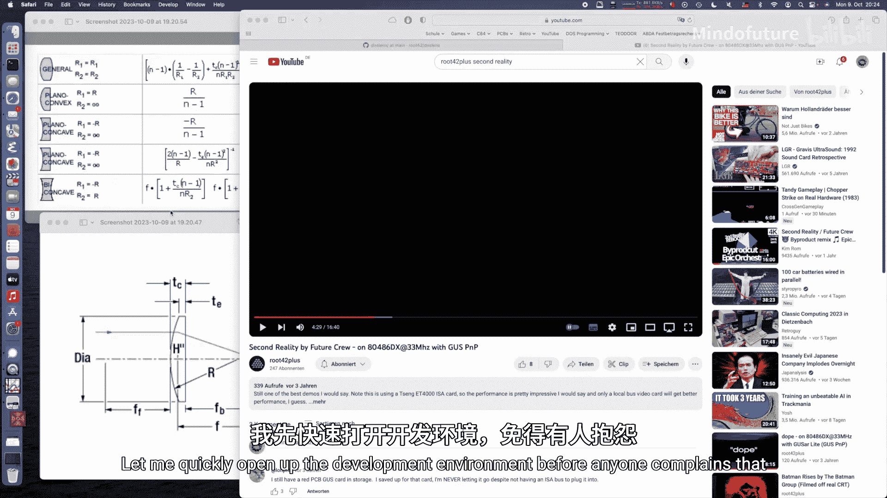
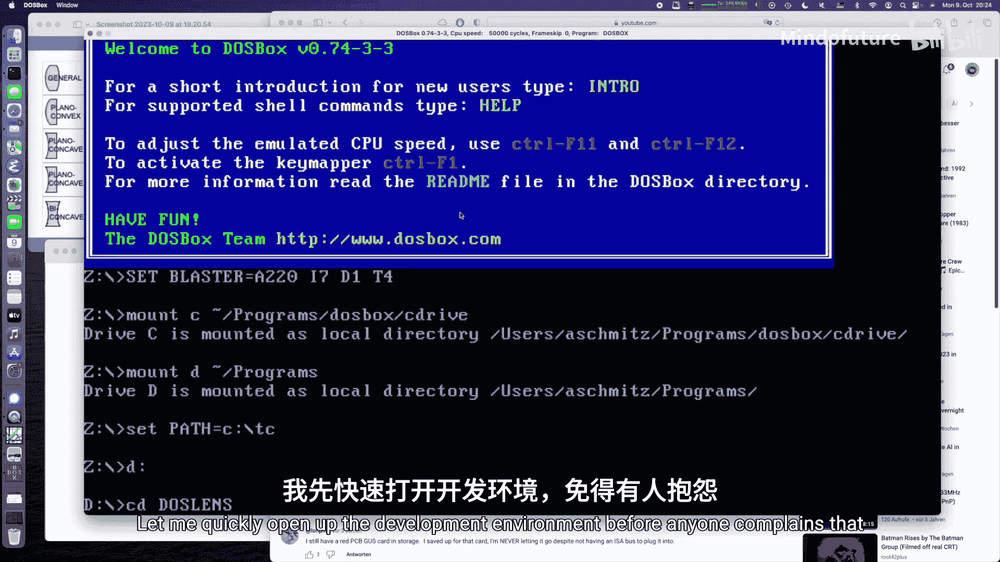
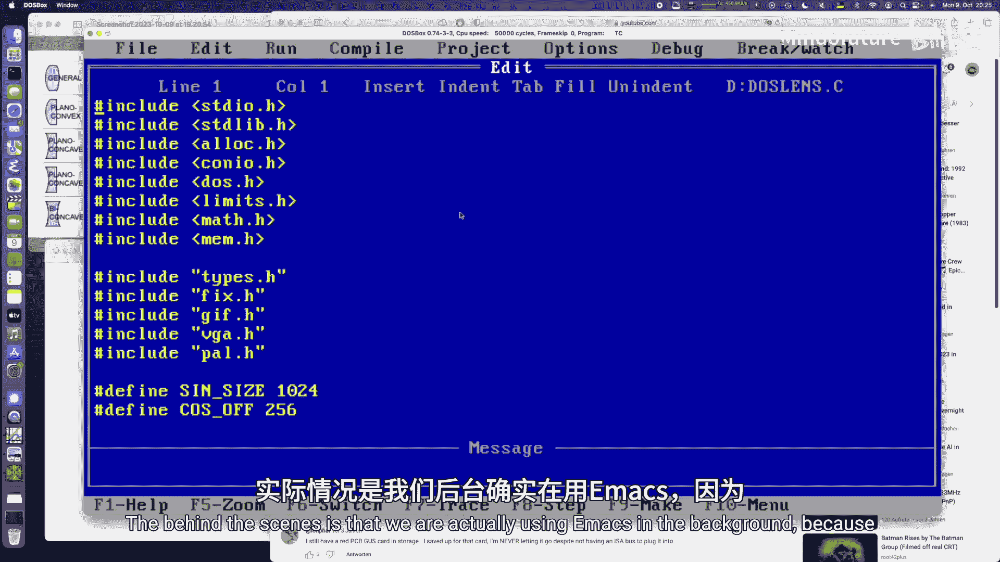
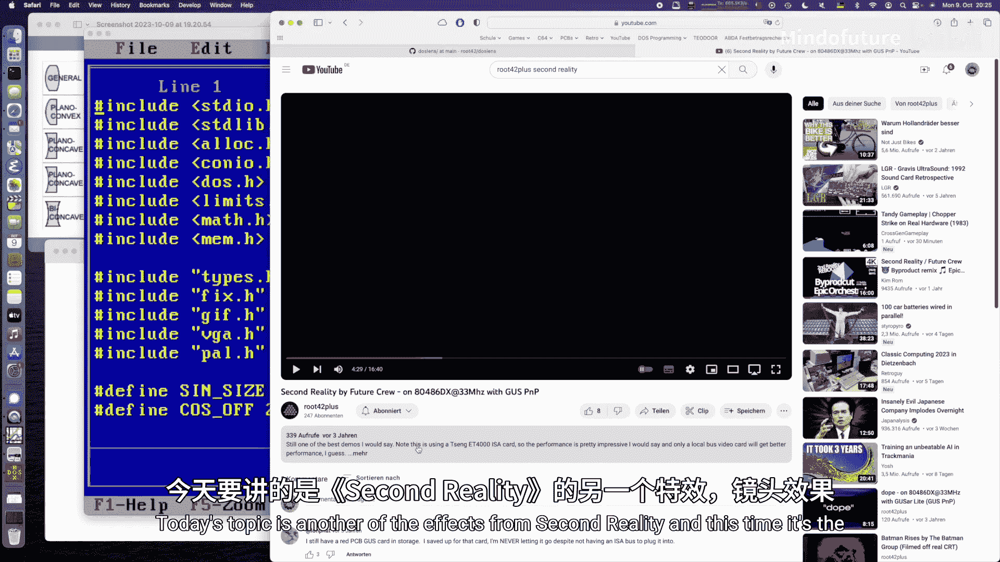
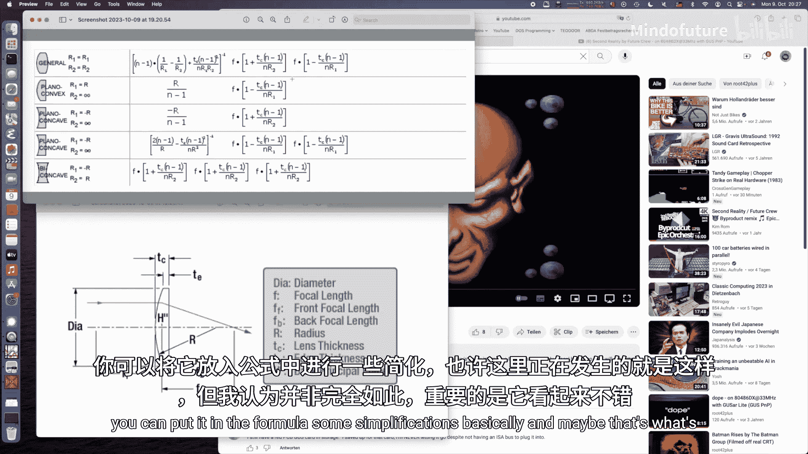
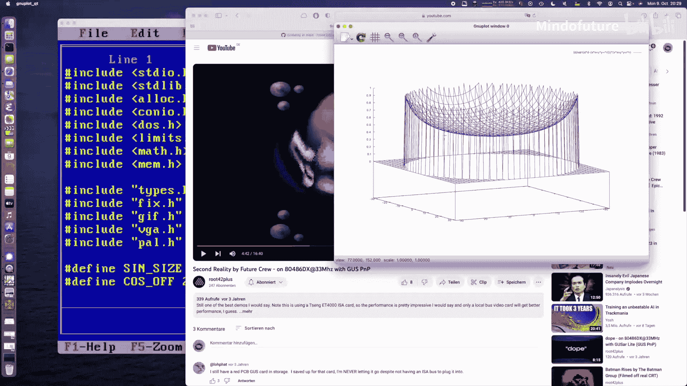
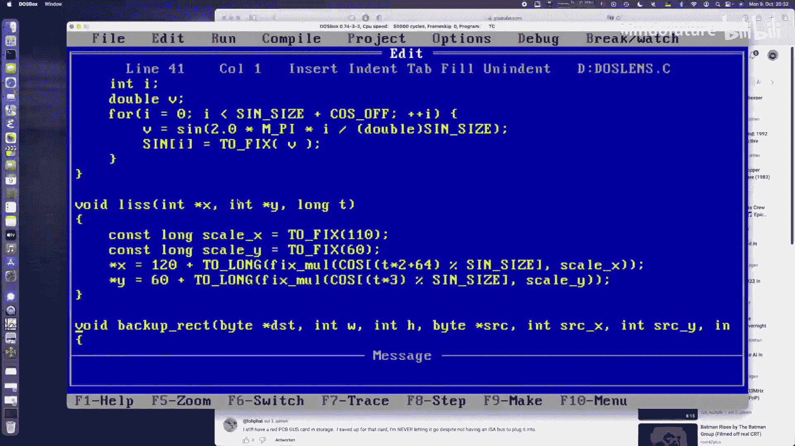
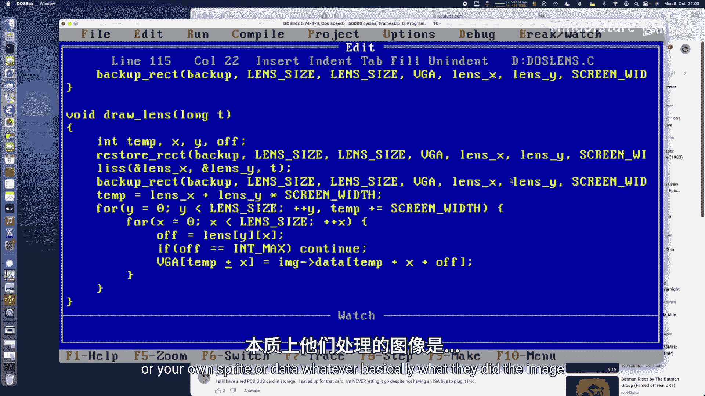
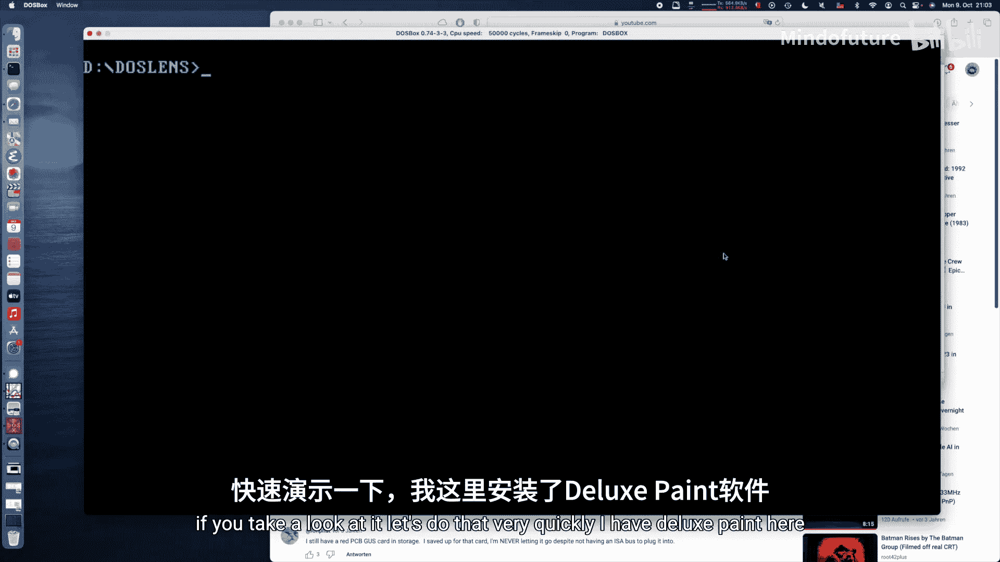
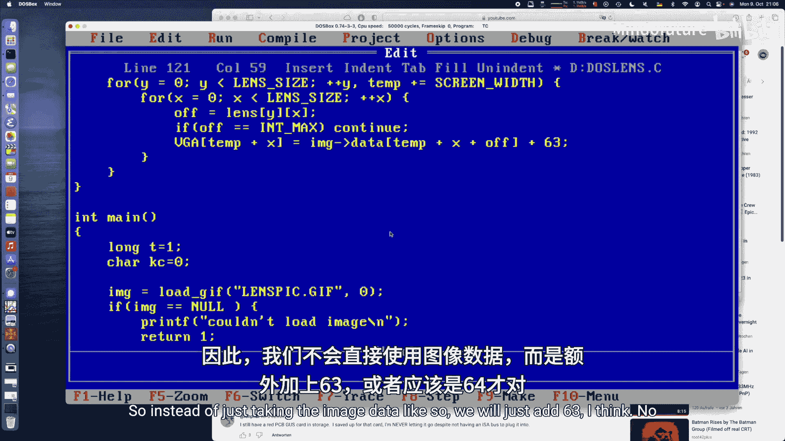

# 036：实现“第二现实”透镜效果教程









## 概述

在本节课中，我们将学习如何在MS-DOS环境下，使用x86汇编和VGA图形模式，复现经典演示程序“第二现实”中的透镜扭曲效果。我们将创建一个模拟玻璃球体的特效，它会扭曲并着色背景图像。

上一节我们介绍了基础的图形操作，本节中我们来看看如何实现一个预计算的扭曲效果。



## 开发环境设置

我们使用EMU8086作为开发环境，因为它便于代码编辑。为了最终演示，我们会切换回Turbo C++进行编译和运行。




## 效果原理分析

今天要实现的效果来自“第二现实”演示程序，它出现在“旋转祖玛”效果之前。该效果模拟了一个扭曲背景图像并赋予其淡蓝色调的玻璃球体。




本质上，它模拟了一种能扭曲背景图像的玻璃球体。我们将实现除反弹和边缘阴影外的所有核心部分。为了简化，我们复用上一期隧道效果的Lissajous曲线动画。边缘阴影部分可以作为练习，因为“第二现实”的源代码是公开的。

“第二现实”源代码中的图形略有不同，例如缺少五角星图案。我们将实现略有不同的扭曲公式，以产生更具玻璃质感的外观。

## 核心扭曲公式

我们使用的扭曲公式基于一个模拟透镜或球体表面的函数。该公式会产生一个缩放因子，导致图像中心被放大，并向边缘逐渐减弱。

**公式** 的核心计算如下：
```
shift = d / sqrt(d^2 - (x^2 + y^2))
```
其中 `d` 是缩放因子或焦距，`x` 和 `y` 是相对于透镜中心的坐标。

这个函数描述了一个球面。一个真正的玻璃球体会使图像倒置，但我们的简化版本仍然能产生有趣且可信的扭曲效果。缩放因子 `d` 决定了效果更像透镜还是更像球体；`d` 值越小，扭曲越强烈。


我们可以预先计算这些扭曲值（偏移量）。在渲染时，对于透镜上的每个像素点 `(x, y)`，我们不直接绘制该点的颜色，而是根据预计算的偏移量，从源图像的另一位置 `(x + offset_x, y + offset_y)` 获取颜色。

需要注意的技术点是，我们需要在垂直回扫期间备份和恢复被透镜覆盖的屏幕矩形区域，以避免闪烁。

## 代码结构与全局变量

我们将重用大量旧代码，包括用于加载图像的 `g.h` 头文件。图像已从LBM格式转换为PCX，再通过ImageMagick转换为GIF。

以下是需要定义的全局变量和常量：

```c
#define LENS_SIZE 80          // 透镜直径
#define LENS_RADIUS (LENS_SIZE/2)
#define LENS_ZOOM 16          // 缩放因子，值越小扭曲越强
#define SCREEN_WIDTH 320
#define SCREEN_HEIGHT 200

Gfx *g = NULL;                // 图像数据结构
int lens[LENS_SIZE][LENS_SIZE]; // 预计算的偏移量数组
char backup[LENS_SIZE * LENS_SIZE]; // 背景备份缓冲区
int lens_x, lens_y;           // 透镜在屏幕上的当前位置
```

## 初始化函数

初始化函数 `init_lens` 负责预计算扭曲偏移量。由于球体是中心对称的，我们只需计算一个象限的值，然后通过镜像得到其他三个象限的值，以提高效率。

```c
void init_lens() {
    int ls = LENS_SIZE / 2;
    int r2 = LENS_RADIUS * LENS_RADIUS;
    float zoom = (float)LENS_ZOOM;

    for (int y = 0; y < ls; y++) {
        int y2 = y * y;
        for (int x = 0; x < ls; x++) {
            int x2 = x * x;
            // 检查是否在圆形透镜内
            if ((x2 + y2) < r2) {
                // 计算扭曲偏移量
                float shift = zoom / sqrt(zoom*zoom - (x2 + y2));
                int offset_x = (int)(x * (shift - 1.0));
                int offset_y = (int)(y * (shift - 1.0));
                // 为四个象限赋值
                lens[ls + y][ls + x] = offset_y * SCREEN_WIDTH + offset_x;
                lens[ls + y][ls - x] = offset_y * SCREEN_WIDTH - offset_x;
                lens[ls - y][ls + x] = -offset_y * SCREEN_WIDTH + offset_x;
                lens[ls - y][ls - x] = -offset_y * SCREEN_WIDTH - offset_x;
            } else {
                // 透镜区域外的点标记为特殊值
                lens[ls + y][ls + x] = INT_MAX;
                lens[ls + y][ls - x] = INT_MAX;
                lens[ls - y][ls + x] = INT_MAX;
                lens[ls - y][ls - x] = INT_MAX;
            }
        }
    }
}
```

## 绘制透镜函数

绘制函数 `draw_lens` 在每一帧中执行。它首先恢复上一帧的背景，然后计算透镜新位置并备份该处背景，最后根据预计算的偏移量绘制扭曲后的图像。

```c
void draw_lens(int time_index) {
    // 1. 恢复旧位置的背景
    restore_rectangle(lens_x, lens_y, backup);

    // 2. 更新透镜位置（使用Lissajous曲线）
    lens_x = ...; // 根据time_index计算新x坐标
    lens_y = ...; // 根据time_index计算新y坐标

    // 3. 备份新位置的背景
    backup_rectangle(lens_x, lens_y, backup);

    // 4. 计算VGA内存中的起始位置
    int vga_offset = lens_y * SCREEN_WIDTH + lens_x;

    // 5. 遍历透镜的每个像素进行绘制
    for (int row = 0; row < LENS_SIZE; row++) {
        int img_offset = vga_offset;
        for (int col = 0; col < LENS_SIZE; col++) {
            int offset = lens[row][col];
            if (offset != INT_MAX) {
                // 从源图像获取扭曲后的像素颜色（添加64以使用调色板中蓝色调的部分）
                char color = g->data[img_offset + offset] + 64;
                // 写入VGA内存
                vga_memory[vga_offset + col] = color;
            }
        }
        vga_offset += SCREEN_WIDTH; // 移动到下一行
    }
}
```
辅助函数 `backup_rectangle` 和 `restore_rectangle` 负责矩形区域的内存拷贝，实现简单，未做边界检查。

## 实现蓝色调效果

“第二现实”中的蓝色调是通过VGA调色板技巧实现的。原图像使用64色。我们复制这64种颜色到调色板的下一组64个条目中，并增强每种颜色的蓝色分量，从而创建出着色玻璃的效果。





以下是修改调色板的函数：

```c
void init_palette() {
    // 设置前64种颜色（原始图像颜色）
    for (int i = 0; i < 64; i++) {
        set_palette_color(i, g->palette[i].r, g->palette[i].g, g->palette[i].b);
    }
    // 设置后64种颜色（增强蓝色的版本）
    for (int i = 0; i < 64; i++) {
        int new_r = g->palette[i].r;
        int new_g = g->palette[i].g;
        int new_b = (g->palette[i].b + 16) > 63 ? 63 : (g->palette[i].b + 16); // 增加蓝色，确保不超过63
        set_palette_color(i + 64, new_r, new_g, new_b);
    }
}
```
在绘制透镜时，我们从源图像获取颜色索引后，加上64，即可使用调色板中蓝色调的部分，从而实现着色效果。

## 主程序流程



主函数协调所有步骤，构成程序的主要循环。

```c
int main() {
    int time_index = 1; // 从1开始，0用于初始化透镜背景备份

    // 初始化
    load_gfx("background.gif");
    init_sin_table(); // 用于Lissajous曲线
    set_vga_mode();
    init_palette();
    init_lens();
    // 初始备份透镜位置的背景
    backup_rectangle(lens_x, lens_y, backup);

    // 主循环
    while (!key_pressed(KEY_ESCAPE)) {
        wait_for_vertical_retrace(); // 等待垂直回扫以减少闪烁
        draw_lens(time_index);
        time_index++;
    }

    // 清理并返回文本模式
    set_text_mode();
    return 0;
}
```

## 总结

本节课中我们一起学习了如何在MS-DOS环境下实现“第二现实”的透镜扭曲效果。我们分析了其核心原理，即通过一个预计算的球面扭曲公式来偏移像素位置。我们编写了代码来初始化扭曲映射、在每一帧中绘制扭曲图像，并运用VGA调色板技巧为透镜添加了蓝色色调。整个效果的关键在于预计算，这使得实时渲染成为可能。虽然这是一个简化版本，但它展示了演示编程中利用简单数学和硬件特性创造视觉奇迹的精髓。你可以尝试修改扭曲公式、调色板或添加阴影来进一步探索这个效果。