# 037：低级键盘编程教程

在本节课中，我们将学习如何为MS-DOS编写一个低级的键盘中断处理程序。我们将绕过BIOS，直接与键盘控制器通信，以实现无按键重复、支持多键同时按下的精确输入控制。这对于编写游戏等需要快速响应的程序至关重要。

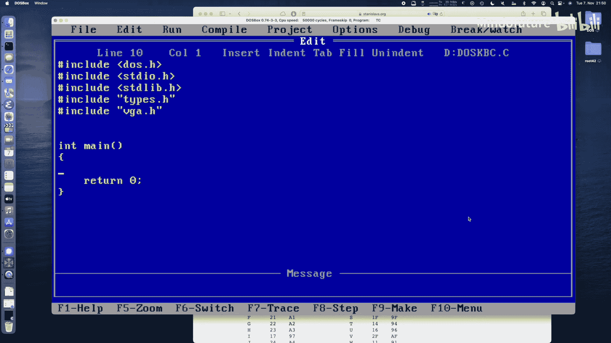

## 概述

键盘控制器通过硬件中断9（IRQ 1）与系统通信。每当按键被按下或释放时，控制器会生成一个唯一的“通码”（按下）和“断码”（释放）。我们将编写一个中断处理程序来捕获这些原始扫描码，并将其状态存储在一个数组中，供主程序查询。

## 核心概念与代码

我们将使用以下端口与键盘控制器通信：
*   **键盘数据端口**：`0x60`，用于读取扫描码。
*   **系统控制端口**：`0x61`，用于确认扫描码的接收。

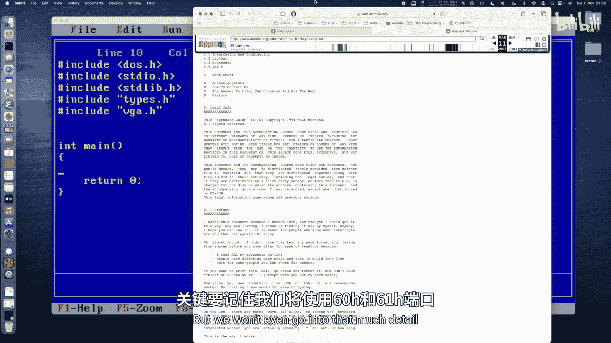

中断处理程序的核心逻辑是：读取扫描码，判断是通码还是断码，更新对应按键的状态，然后向键盘控制器和中断控制器发送确认信号。

## 实现步骤

### 1. 主程序框架

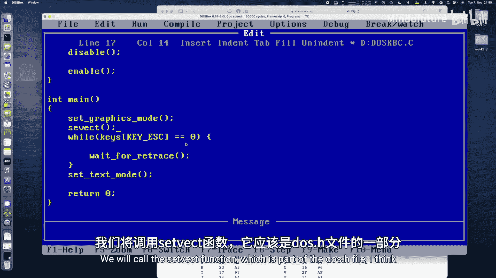

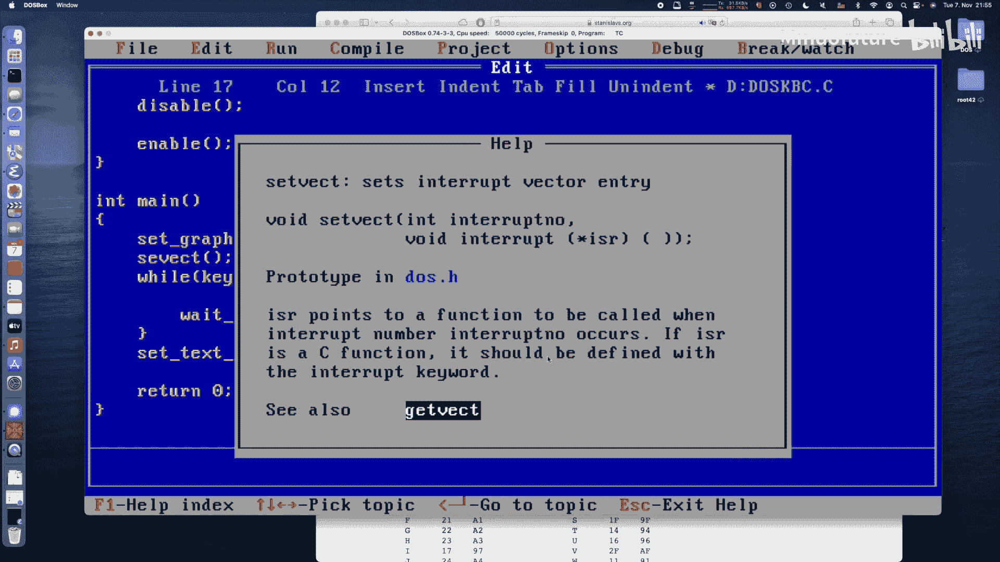

首先，我们建立程序的基本循环结构，并设置图形模式。

```c
void main() {
    // 初始化按键状态数组
    volatile unsigned char keys[256] = {0};

    // 进入图形模式
    set_video_mode(0x13); // 320x200, 256色

    // 主循环
    while (!keys[KEY_ESC]) {
        // 等待垂直回扫以控制速度
        wait_for_retrace();

        // 此处将处理绘图和按键查询逻辑
    }

    // 退出前恢复文本模式
    set_video_mode(0x03);
}
```

### 2. 设置中断处理程序

我们需要保存原有的中断9向量，并用我们自己的处理函数替换它。程序退出前必须恢复原向量。

```c
void interrupt (*old_kb_handler)(); // 保存原中断处理程序地址

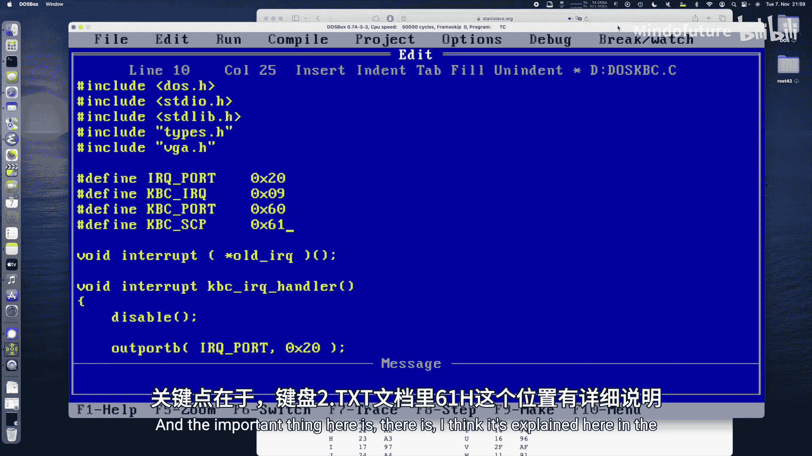

void setup_keyboard_interrupt() {
    // 获取并保存原中断向量
    old_kb_handler = _dos_getvect(0x09);
    // 设置新的中断向量
    _dos_setvect(0x09, our_kb_handler);
}

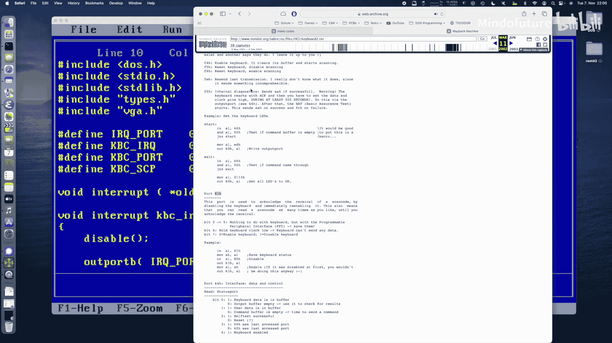

void restore_keyboard_interrupt() {
    // 程序退出前恢复原中断向量
    _dos_setvect(0x09, old_kb_handler);
}
```

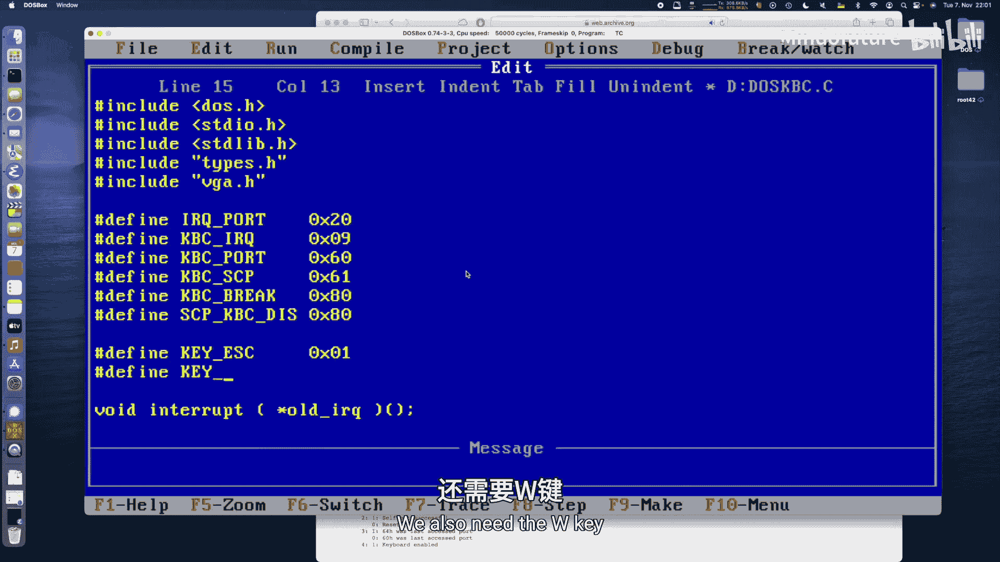

### 3. 编写键盘中断处理程序

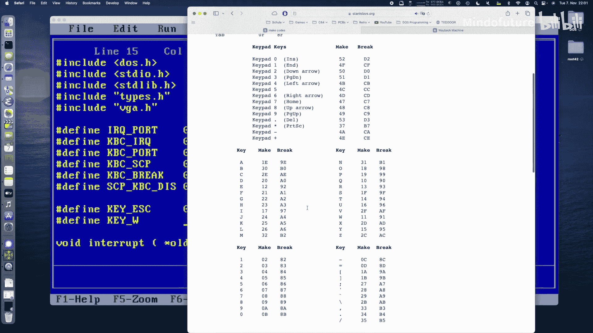

这是教程的核心部分。处理程序将直接读取硬件端口，处理扫描码。

```c
void interrupt our_kb_handler() {
    unsigned char scancode;
    unsigned char ctrl_port;

    // 禁用中断，防止处理过程被打断
    disable();

    // 从键盘数据端口读取扫描码
    scancode = inportb(0x60);

    // 从系统控制端口读取当前状态
    ctrl_port = inportb(0x61);

    // 判断是通码还是断码（断码 = 通码 + 0x80）
    if (scancode & 0x80) {
        // 是断码（按键释放）
        keys[scancode - 0x80] = 0; // 将对应按键状态设为0
    } else {
        // 是通码（按键按下）
        keys[scancode] = 1; // 将对应按键状态设为1
    }

    // 通过切换系统控制端口的第7位来确认接收扫描码
    outportb(0x61, ctrl_port | 0x80); // 禁用键盘
    outportb(0x61, ctrl_port);        // 重新启用键盘（完成确认）

    // 通知中断控制器（PIC）中断已处理
    outportb(0x20, 0x20);

    // 重新启用中断
    enable();
}
```

### 4. 定义按键常量与状态数组

为了方便使用，我们为常用按键定义其通码值。

```c
#define KEY_ESC    0x01
#define KEY_W      0x11
#define KEY_A      0x1E
#define KEY_S      0x1F
#define KEY_D      0x20
#define KEY_LSHIFT 0x2A
#define KEY_LCTRL  0x1D

// 全局按键状态数组，volatile确保中断中的修改能被主循环看到
volatile unsigned char keys[256];
```

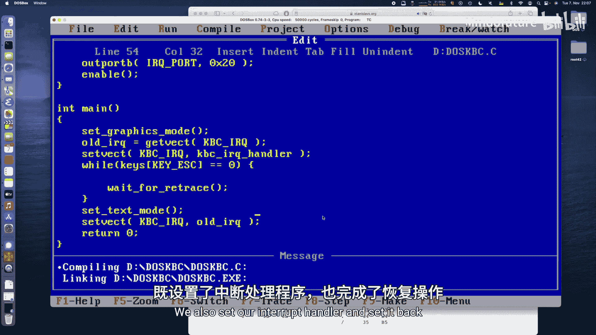

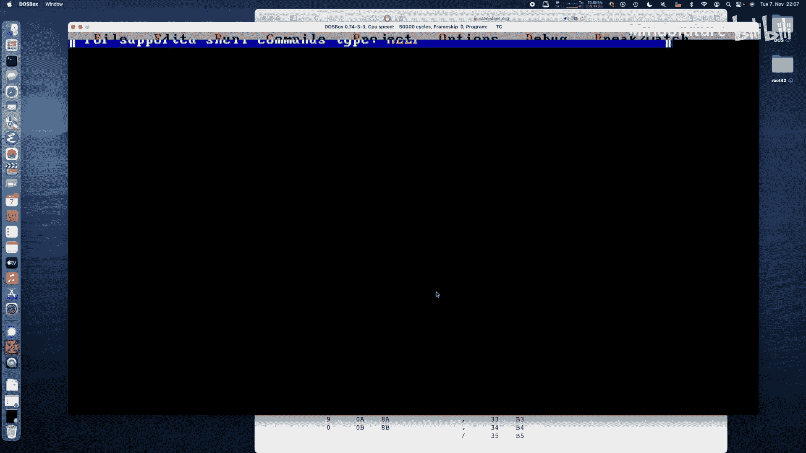

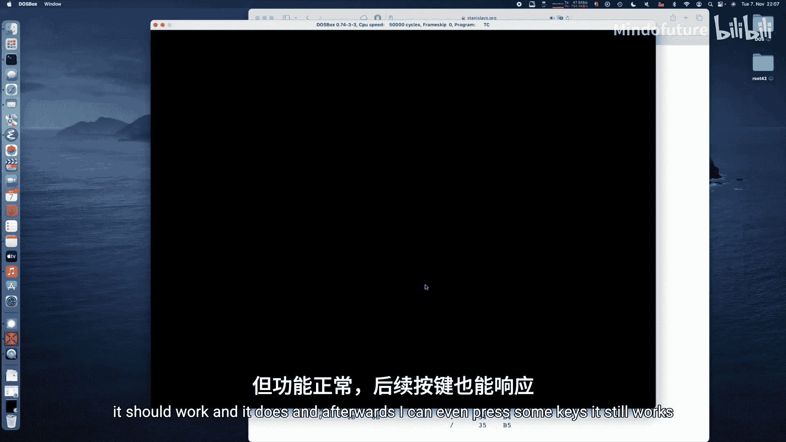

### 5. 在主循环中应用按键输入

现在，我们可以在主循环中查询`keys`数组，并根据按键状态实现一个简单的绘图程序。

以下是主循环中处理移动和颜色变化的逻辑示例：

```c
int x = 160, y = 100; // 初始位置在屏幕中心
int color = 15;       // 初始颜色为白色

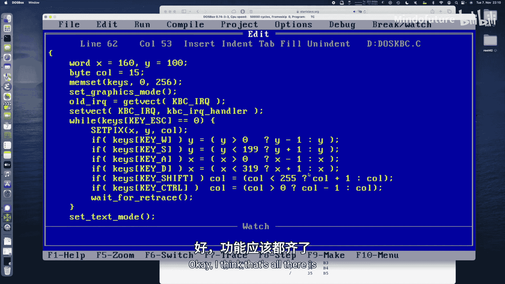

while (!keys[KEY_ESC]) {
    wait_for_retrace();

    // 根据WASD键移动点
    if (keys[KEY_W] && y > 0) y--;
    if (keys[KEY_S] && y < 199) y++;
    if (keys[KEY_A] && x > 0) x--;
    if (keys[KEY_D] && x < 319) x++;

    // 根据Shift和Ctrl键改变颜色
    if (keys[KEY_LSHIFT]) {
        color = (color + 1) % 256; // 颜色值循环增加
    }
    if (keys[KEY_LCTRL]) {
        color = (color - 1 + 256) % 256; // 颜色值循环减少
    }

    // 在屏幕上绘制一个点
    putpixel(x, y, color);
}
```

## 总结

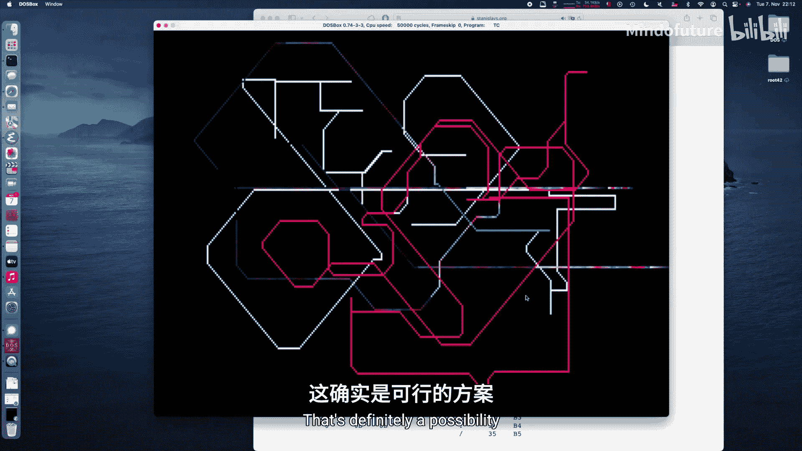

本节课中，我们一起学习了MS-DOS下的低级键盘编程。我们掌握了以下核心内容：

1.  **原理**：了解了键盘通过中断9（IRQ 1）与CPU通信，并生成通码和断码。
2.  **关键操作**：学会了使用`0x60`端口读取扫描码，以及使用`0x61`端口确认接收。
3.  **中断处理**：编写了一个完整的中断服务程序（ISR），包括禁用/启用中断、读取端口、更新状态数组、发送确认信号等标准流程。
4.  **应用**：实现了一个简单的绘图程序，演示了如何利用直接键盘输入实现多键检测和即时响应。

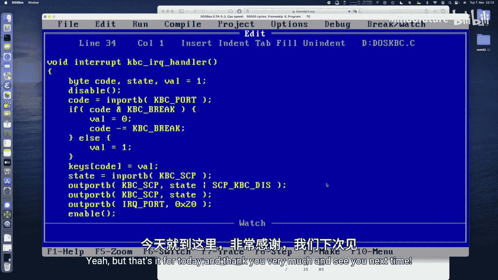

通过直接控制键盘控制器，我们获得了比标准BIOS调用更快速、更灵活的输入处理能力，这是开发DOS游戏和实时应用程序的重要基础。你可以将此框架扩展，用于检测更多按键或实现更复杂的输入逻辑。