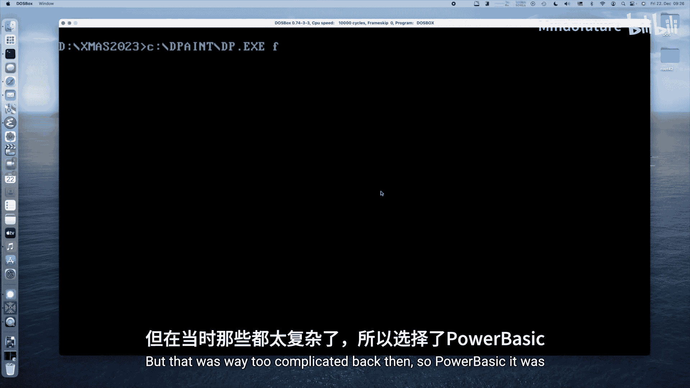
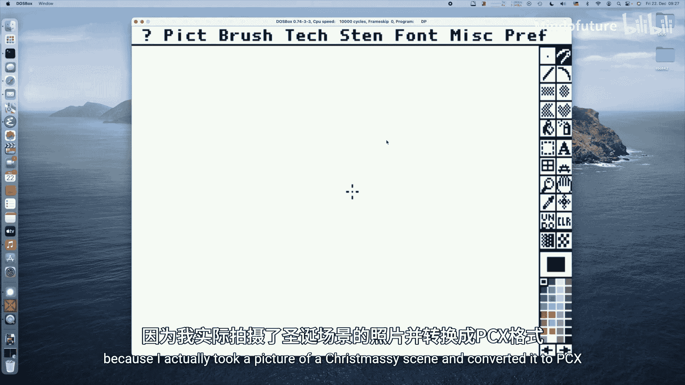
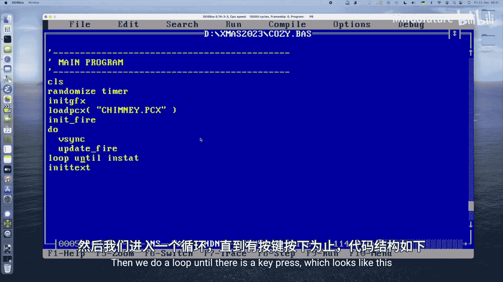
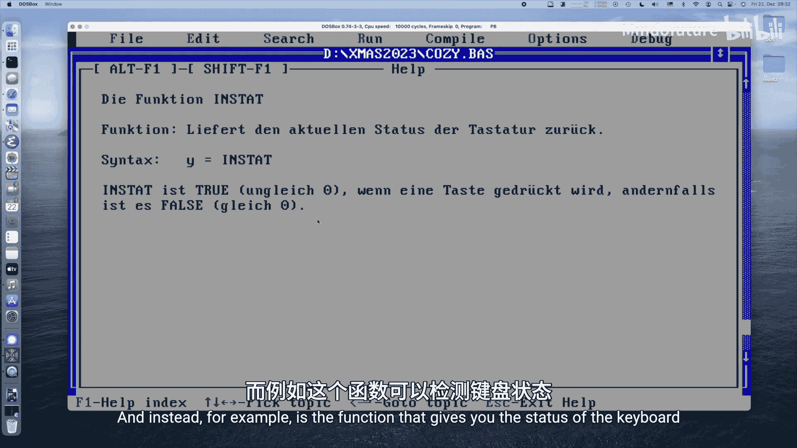
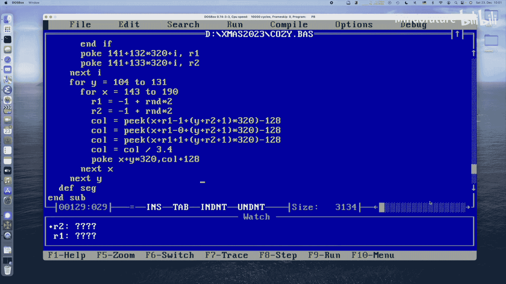
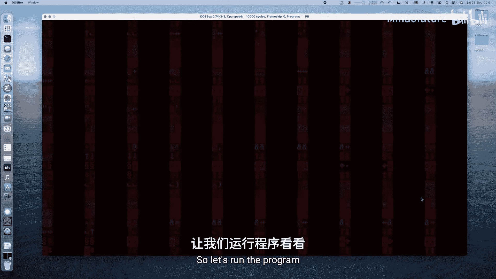
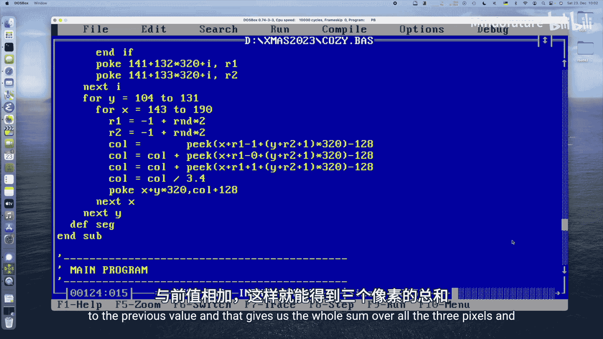

# 038：温馨的BASIC圣诞教程 🎄

## 概述
在本教程中，我们将学习如何使用PowerBASIC编译器，在MS-DOS环境下编写一个程序，加载一张圣诞场景的PCX格式图片，并在壁炉区域实现一个动态的火焰动画效果。我们将涵盖图形模式设置、PCX文件解码、VGA调色板操作以及火焰粒子系统的模拟。





---

## 章节 1：项目介绍与环境准备 🛠️

我们将在本次“Let's Code Attos”圣诞特辑中使用PowerBASIC。这是一个将BASIC代码编译为DOS可执行文件（.EXE）的编译器，而非解释器。本教程使用的是3.2版本。

首先，我们需要一张背景图片。这里使用了一张转换为PCX格式的256色圣诞场景图。PCX格式使用一种简单的游程编码（RLE）压缩算法，虽然压缩率不如GIF，但编码相对简单。



我们的目标是在图片的壁炉区域渲染一个动画火焰。为此，我们将使用VGA的256色调色板：低128位用于存储图片本身的颜色，高128位则预留给火焰动画的渐变颜色。



---

## 章节 2：主程序结构与图形模式设置 🖥️

上一节我们介绍了项目目标，本节我们来看看程序的主框架和如何设置VGA图形模式。

主程序结构如下：
1.  清屏。
2.  初始化随机数生成器。
3.  调用子程序初始化图形模式。
4.  调用子程序加载PCX图片。
5.  调用子程序初始化火焰区域。
6.  进入主循环，直到有按键按下。
7.  循环内进行垂直同步并更新火焰。
8.  退出循环后，返回文本模式。

在QBasic或QuickBASIC中，通常使用 `SCREEN 13` 来设置320x200、256色的图形模式。但PowerBASIC并不直接支持此模式。因此，我们需要通过DOS中断调用来手动设置。

以下是设置图形模式的代码：
```basic
SUB initGraphics ()
    REG 1, &H13
    CALL INTERRUPT &H10
END SUB
```
这里，`REG 1` 设置AX寄存器为 `0x13`（设置显示模式的功能号），然后调用 `0x10` 号中断（BIOS视频服务）。返回文本模式只需将AX设为 `0x03` 并再次调用中断即可。

---

## 章节 3：实现垂直同步与PCX文件加载 ⏱️

上一节我们成功进入了图形模式，本节中我们来实现垂直同步和图片加载功能，以确保动画流畅且无撕裂。

垂直同步可以确保我们在屏幕回扫期间更新画面，避免撕裂。我们可以通过读取VGA状态端口来实现。

以下是垂直同步子程序：
```basic
SUB vSync ()
    vsync0:
        IF (INP(&H3DA) AND 8) <> 0 THEN GOTO vsync0
    vsync1:
        IF (INP(&H3DA) AND 8) = 0 THEN GOTO vsync1
END SUB
```
接下来是加载PCX文件。PCX文件由128字节的文件头、经过RLE压缩的图像数据和768字节的调色板数据组成。

加载PCX文件的步骤如下：
1.  以二进制模式打开文件。
2.  读取文件头，验证魔数（第一个字节为0x0A）和编码方式（第四个字节为1表示RLE编码）。
3.  使用 `SEEK` 语句定位到文件末尾的调色板数据并读取。
4.  将调色板数据写入VGA调色板寄存器。
5.  重新定位到图像数据开始处，逐个解码像素并写入VGA内存（地址 `&HA000`）。

由于BASIC处理二进制文件时只能读取到字符串变量中，且字符串有长度限制，因此我们选择逐字节读取和解码。虽然效率较低，但代码更清晰易懂。

---

## 章节 4：初始化火焰区域与燃料 🔥

图片加载完成后，我们需要在壁炉的特定区域“挖”出一个矩形，用于放置火焰动画。这个区域将使用我们调色板中高128位的起始颜色（冷色）进行填充。

首先，我们需要确定壁炉区域在屏幕上的坐标。通过图像编辑器测量，我们确定矩形区域为：Y坐标从103到133，X坐标从140到195。

以下是初始化火焰区域的子程序：
```basic
SUB initFire ()
    DEF SEG = &HA000
    FOR y = 103 TO 133
        FOR x = 140 TO 195
            offset = x + y * 320
            POKE offset, 128
        NEXT x
    NEXT y
    DEF SEG
END SUB
```
这段代码将指定矩形内的所有像素设置为颜色索引128，即我们火焰调色板中的“冷”黑色，为后续的火焰计算准备好画布。

---

## 章节 5：生成与更新火焰动画 🌟

上一节我们准备好了火焰的“画布”，本节我们来看看如何生成动态的火焰效果。核心思想是模拟热量的传播和衰减。

火焰动画通过以下步骤实现：
1.  **添加燃料**：在火焰区域底部（Y=132,133的两行）随机生成高温像素点（颜色值在128-255之间），作为火焰的“燃料”。
    ```basic
    r1 = 128 + INT(RND * 127)
    r2 = 128 + INT(RND * 127)
    ```
2.  **传播热量**：从火焰区域底部向上遍历每个像素（Y从104到131）。对于每个像素，查看其下方一行（Y+1）以及左右随机偏移（-1,0,1）位置的三个像素的颜色值。
3.  **计算平均值**：将这三个像素的颜色值求和。
4.  **衰减**：将求和结果除以一个系数（例如3.4），模拟热量在上升过程中的冷却。这个系数控制火焰的高度和衰减速度。
5.  **写入新值**：将计算得到的新颜色值写入当前像素。

通过在主循环中不断重复“添加燃料”和“传播热量”这两个步骤，就能产生持续摇曳、上升的火焰视觉效果。随机偏移的引入增加了火焰的不规则性和真实感。





---



## 总结
在本教程中，我们一起学习了如何在MS-DOS环境下使用PowerBASIC创建一个带有动态火焰效果的圣诞图形程序。我们涵盖了从设置VGA 13h图形模式、解码PCX图像文件、操作VGA调色板，到实现一个基于粒子系统的简易火焰动画的全过程。虽然BASIC的执行效率有限，但通过清晰的步骤，我们成功实现了一个视觉效果不错的温馨圣诞场景。你可以尝试修改火焰参数、使用不同的背景图片，或优化代码逻辑来获得更好的性能或不同的效果。