# 039：AdLib鼓机编程教程

在本节课中，我们将学习如何为MS-DOS系统下的AdLib声卡（基于Yamaha YM3812 OPL2芯片）编写一个简单的鼓机程序。我们将涵盖声卡的基本原理、寄存器编程方法，并最终实现一个可以录制和播放鼓点序列的程序。

## 概述

AdLib声卡使用FM合成技术来产生声音。它有两种主要模式：旋律模式和节奏模式。本节课我们将专注于节奏模式，学习如何编程底鼓、军鼓、通鼓、踩镲和吊镲这五种打击乐声音。

## 声卡基础与FM合成

上一节我们介绍了本课程的目标。本节中，我们来看看AdLib声卡和FM合成的基本概念。

AdLib声卡通过两个I/O端口进行控制：
*   **索引寄存器**：`0x388`
*   **数据寄存器**：`0x389`

向芯片写入数据时，需要先向索引寄存器写入目标寄存器的地址，再向数据寄存器写入数据。这与VGA显卡的编程方式类似。

该声卡的核心是FM合成。它使用称为“算子”的振荡器来生成声音。每个算子产生一个波形（如正弦波）。通过让一个算子（调制器）去调制另一个算子（载波器）的频率，可以创造出复杂多变的音色。

以下是声卡可以产生的基本波形：
*   **正弦波**
*   **半正弦波**（类似锯齿波）
*   **绝对值正弦波**（类似三角波）
*   **脉冲正弦波**（类似方波）

声音的音量由包络发生器控制，遵循**ADSR**模型：
*   **A (Attack)**：起音，声音从零到达峰值的时间。
*   **D (Decay)**：衰减，从峰值下降到持续电平的时间。
*   **S (Sustain)**：持续，按住音符时保持的音量电平。
*   **R (Release)**：释音，释放音符后音量降到零的时间。

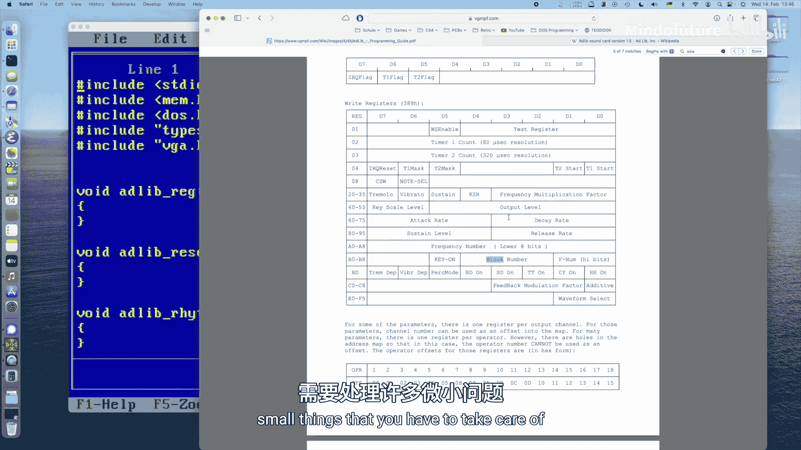

## 寄存器详解与鼓模式

了解了声卡的基本工作原理后，我们现在深入查看其寄存器结构，特别是用于控制鼓模式的寄存器。

OPL2芯片的寄存器分为全局寄存器和通道专用寄存器。对于鼓模式，关键寄存器如下：

*   **节奏模式使能寄存器**：地址 `0xBD`。将其第5位（`0x20`）设置为1可启用节奏模式。
*   **鼓乐器开关位**：同样在 `0xBD` 寄存器中，通过设置特定的位来打开或关闭各个鼓乐器：
    *   底鼓 (Bass Drum)：第4位 (`0x10`)
    *   军鼓 (Snare Drum)：第3位 (`0x08`)
    *   通鼓 (Tom Tom)：第2位 (`0x04`)
    *   吊镲 (Cymbal)：第1位 (`0x02`)
    *   踩镲 (Hi-Hat)：第0位 (`0x01`)

要播放一个鼓点，需要先启用节奏模式，然后置位对应的鼓乐器位。声音会使用预编程的振荡器参数（如音高、ADSR）立即播放。

每个鼓乐器对应一个或多个固定的振荡器（算子）。例如，底鼓使用两个振荡器。这些振荡器的参数（如音高、ADSR）需要提前设置好，以定义每个鼓的声音特性。

## 核心编程步骤

掌握了理论之后，本节我们将把编程过程分解为几个具体的步骤。

编写鼓机程序主要分为三个步骤：
1.  **重置并初始化声卡**：将声卡置于已知状态，配置所有振荡器的默认参数（如ADSR、波形选择）。
2.  **启用并配置节奏模式**：打开节奏模式，并为各个鼓乐器设置更合适的音高和包络参数。
3.  **实现主循环与交互**：检测键盘输入，将鼓点记录到序列数组中，并按照定时回放。

以下是实现这些功能所需的核心函数和常量定义示例：

```c
#define ADLIB_INDEX 0x388
#define ADLIB_DATA 0x389
#define ADLIB_REG_DRUM 0xBD

// 鼓乐器位定义
#define DRUM_BASS 0x10
#define DRUM_SNARE 0x08
#define DRUM_TOM 0x04
#define DRUM_CYMBAL 0x02
#define DRUM_HIHAT 0x01

// 向AdLib寄存器写入数据的函数（包含延迟）
void adlib_write(uint8_t reg, uint8_t value) {
    outportb(ADLIB_INDEX, reg);
    for(int i = 0; i < 6; i++) { inportb(ADLIB_INDEX); } // 写入前延迟
    outportb(ADLIB_DATA, value);
    for(int i = 0; i < 35; i++) { inportb(ADLIB_DATA); } // 写入后延迟
}
```

## 计算与设置音高

要让鼓发出正确音调的声音，我们需要计算并设置振荡器的音高。本节中我们来看看如何将音乐音符转换为芯片可以理解的频率数值。

音高由两个参数共同决定：**块号** 和 **频率编号**。
*   **块号** 代表八度音阶，存储在寄存器的高几位中。
*   **频率编号** 是一个10位数值（低8位在一个寄存器，高2位在另一个寄存器），代表该八度内的具体音高。

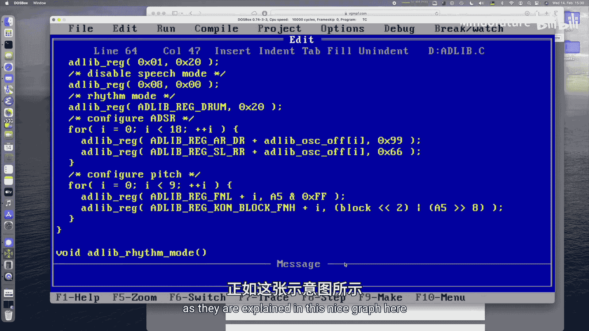

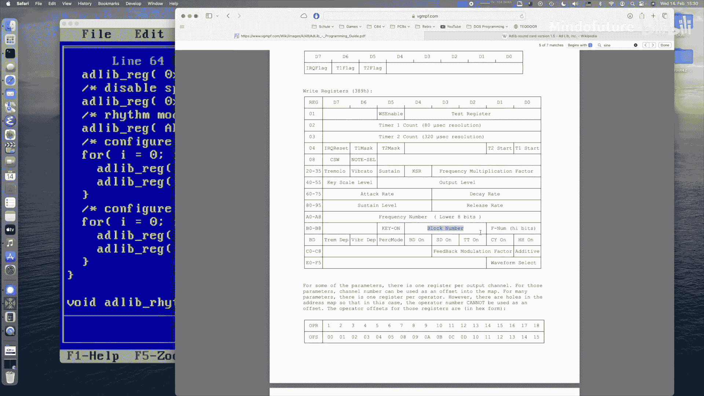

对于一个给定的音符（例如A4，440Hz），其频率编号 `F` 可以通过以下公式计算：

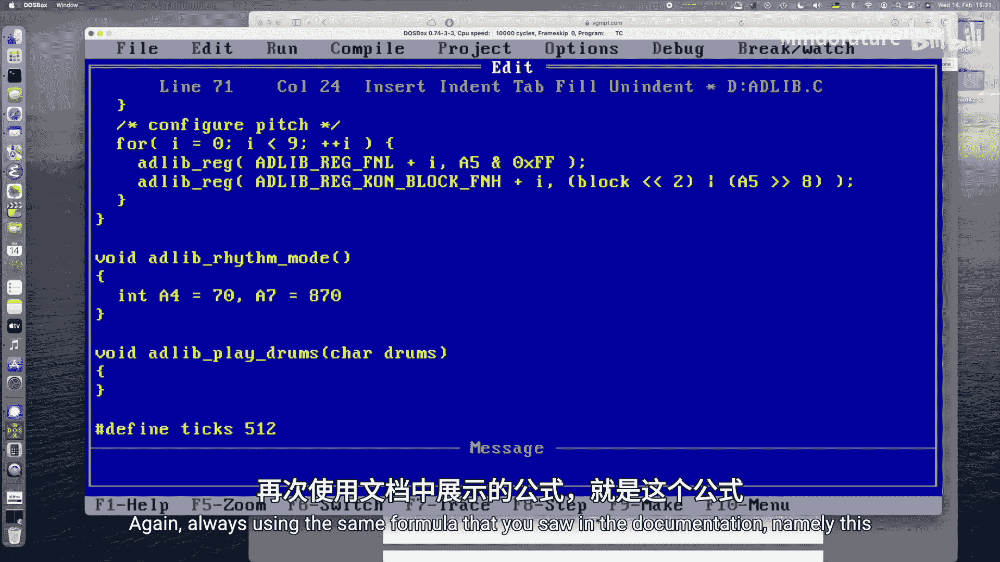

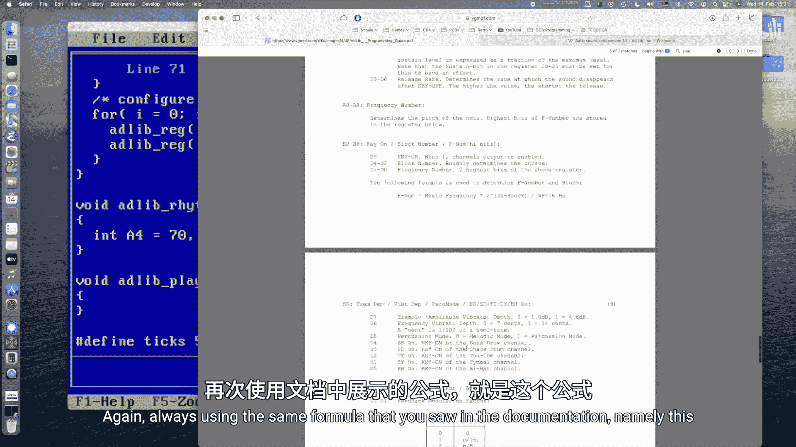

`F = (音符频率 * 2^(20 - 块号)) / 49716`

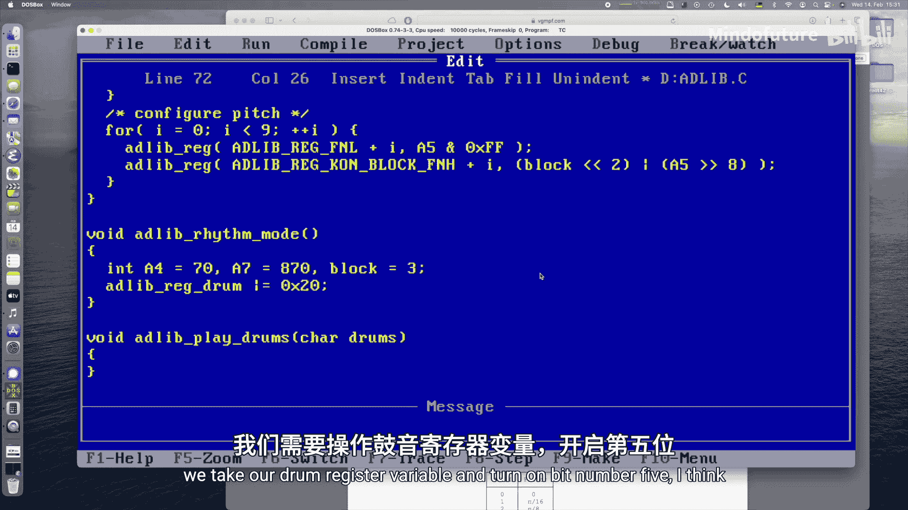

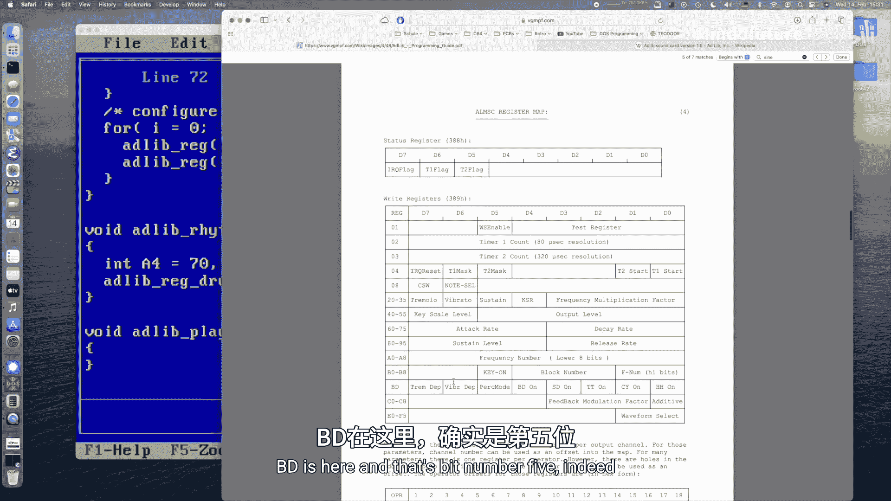

其中 `49716` 是芯片内部的采样频率。计算出的 `F` 取整后，其低8位写入 `0xA0` 至 `0xA8` 系列寄存器（对应不同通道），高2位与块号一起组合写入 `0xB0` 至 `0xB8` 系列寄存器。

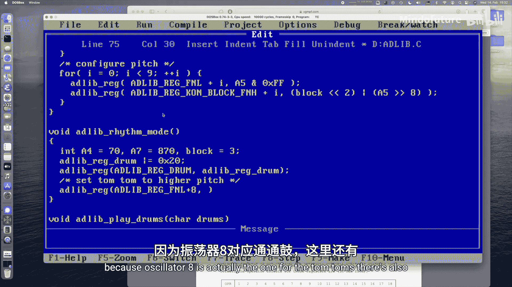

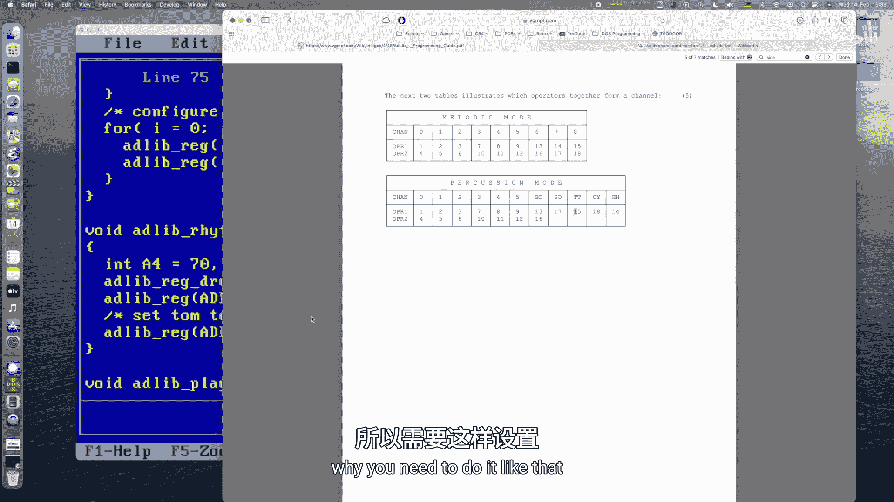

例如，要设置通道0播放A5（块号5，计算得频率编号约290）：
1.  向寄存器 `0xA0` 写入 `290 & 0xFF`（低8位）。
2.  向寄存器 `0xB0` 写入 `((5 << 2) | (290 >> 8))`（块号左移2位后与高2位组合）。

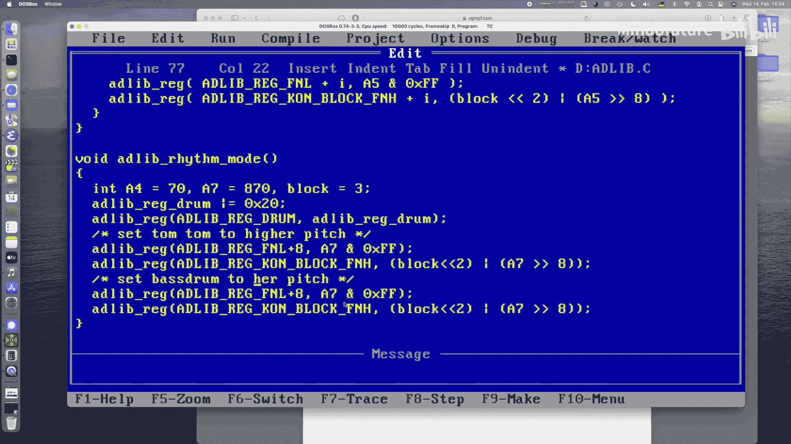

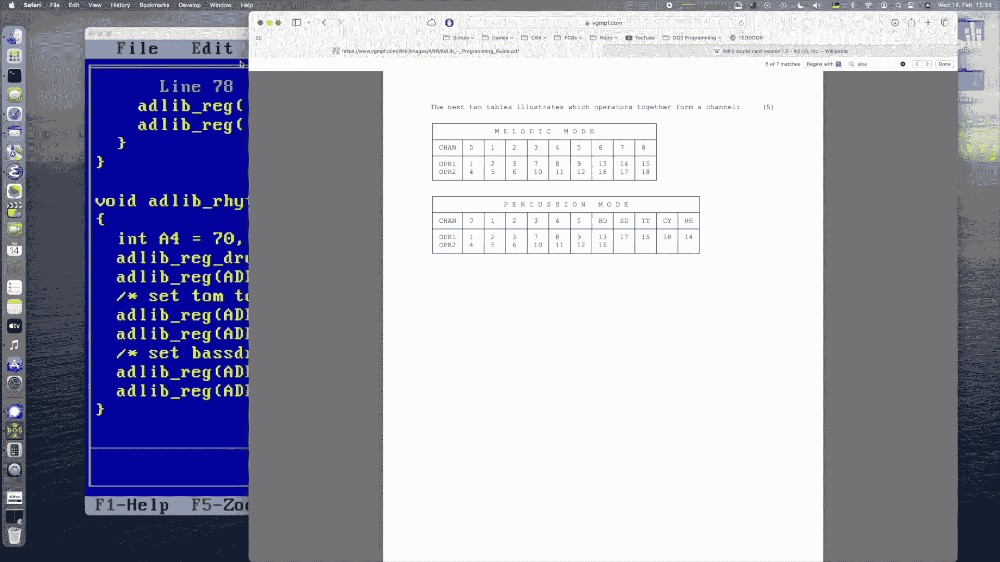

## 程序实现与演示

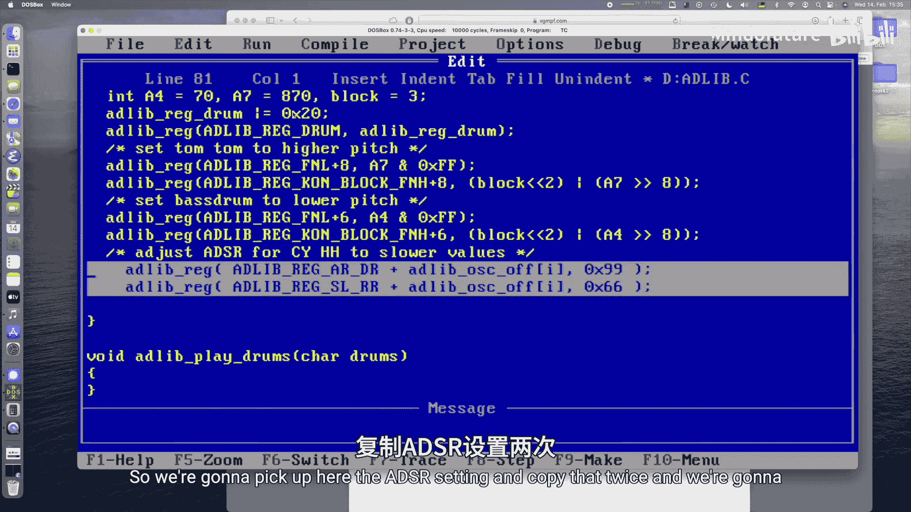

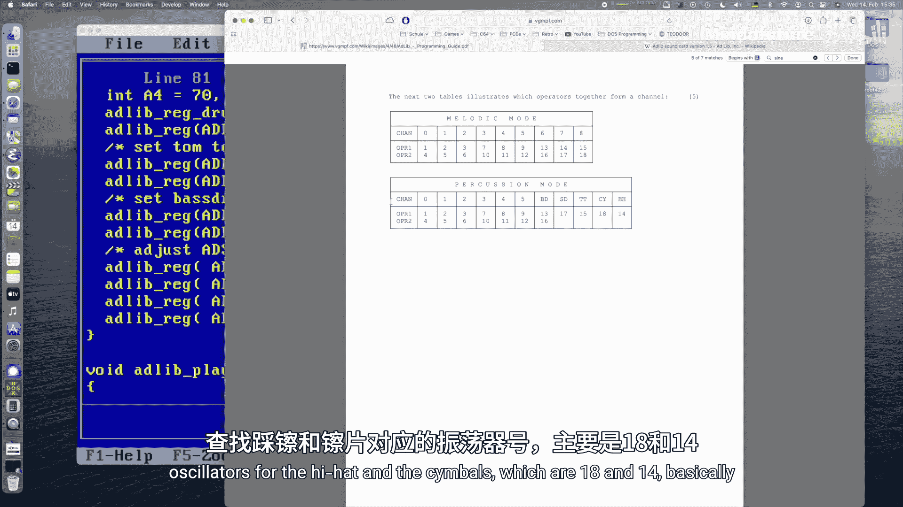

现在，我们将把前面所有的知识整合起来，完成鼓机程序的编写。

程序的主体是一个循环，它执行以下操作：
1.  使用 `kbhit()` 和 `getch()` 检测键盘输入。
2.  如果按下数字键1-5，则将对应的鼓点记录到一个循环数组 `drum_sequence[]` 的当前位置。
3.  每一帧（使用 `wait_for_retrace` 实现约70Hz定时），读取 `drum_sequence` 中当前时刻的值，并通过写入 `0xBD` 寄存器来触发记录的鼓点。
4.  在屏幕上显示当前播放的位置。

核心播放逻辑如下：

```c
// 在定时循环中
current_tick = (current_tick + 1) % SEQUENCE_LENGTH;
uint8_t drums_to_play = drum_sequence[current_tick];

// 先关闭所有鼓（可选，也可用其他方式实现键位释放）
adlib_write(ADLIB_REG_DRUM, rhythm_mode_enabled_bit);
// 播放当前时刻的鼓点
adlib_write(ADLIB_REG_DRUM, rhythm_mode_enabled_bit | drums_to_play);

// 显示当前节拍
printf("Tick: %d\n", current_tick / 32); // 假设32 tick为一小节
wait_for_retrace(); // 等待垂直回扫，控制速度
```

通过按下不同的数字键，用户可以实时录制一个鼓点循环，程序随后会不断播放这个循环。

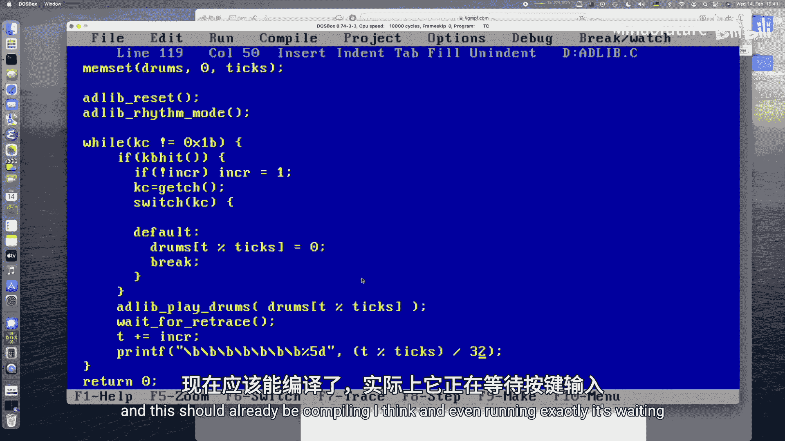

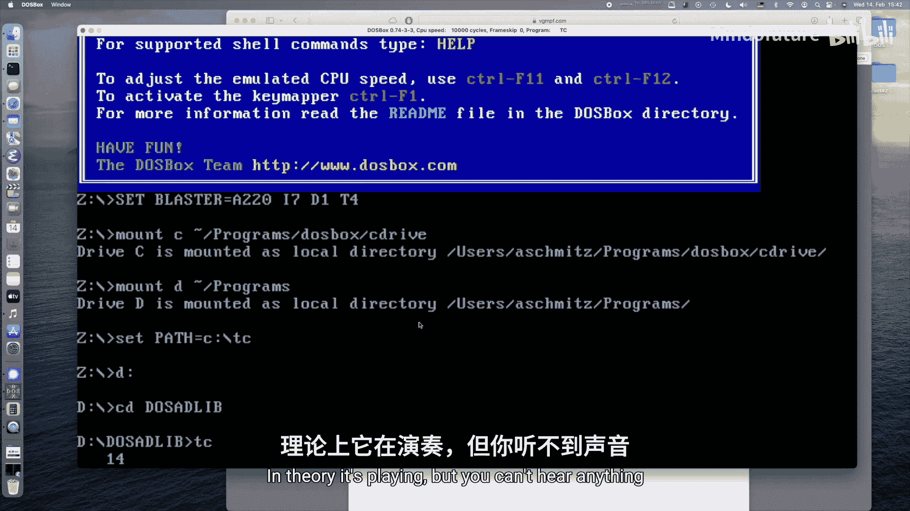

## 总结

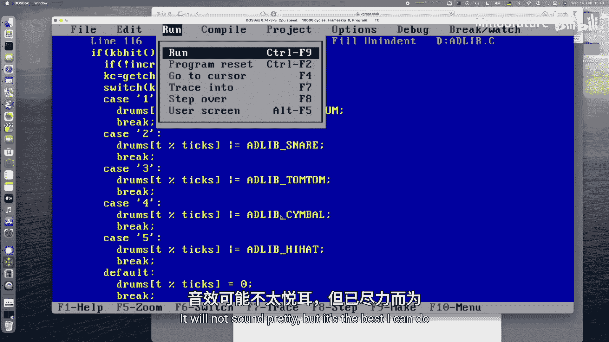

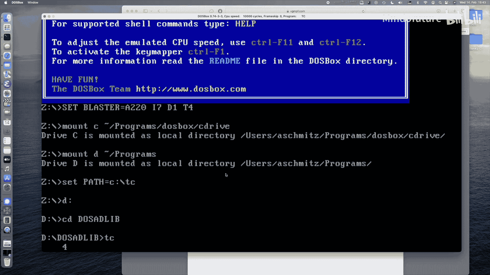

本节课中我们一起学习了AdLib声卡鼓机编程的全过程。

我们首先了解了AdLib声卡和FM合成的基础知识，包括其寄存器寻址方式和工作原理。然后，我们深入研究了用于控制节奏模式的关键寄存器。接着，我们分步讲解了编程的核心环节：初始化声卡、配置音高和ADSR包络、启用节奏模式。最后，我们实现了一个简单的主循环，能够响应键盘输入来录制和播放鼓点序列。

你现在已经掌握了：
*   AdLib声卡的基本编程方法。
*   如何计算和设置FM合成器的音高。
*   如何配置声音的ADSR包络。
*   如何启用和控制节奏模式下的各种打击乐器。
*   如何构建一个简单的交互式鼓机序列器。

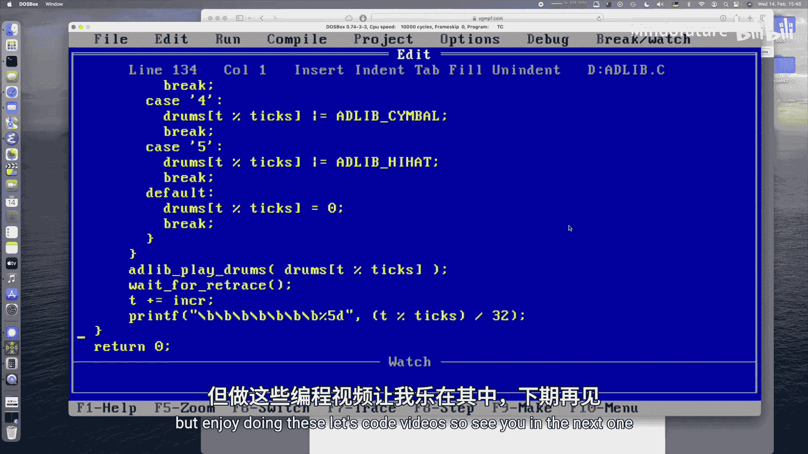

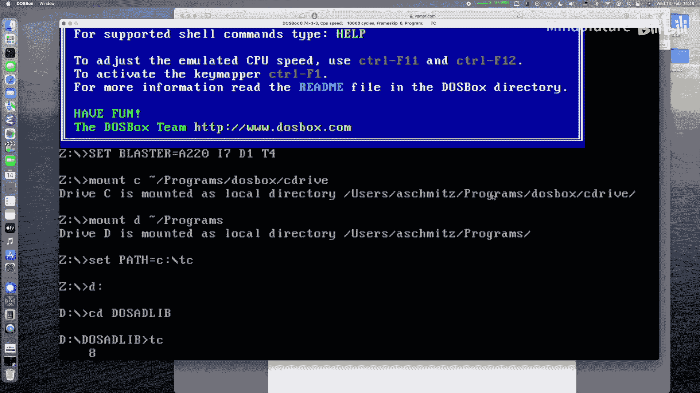


你可以在此基础上进行扩展，例如添加旋律通道的支持、实现更复杂的序列编辑功能，或者调整振荡器波形来创造更独特的音色。希望这为你探索MS-DOS时代的音频编程提供了一个良好的起点。