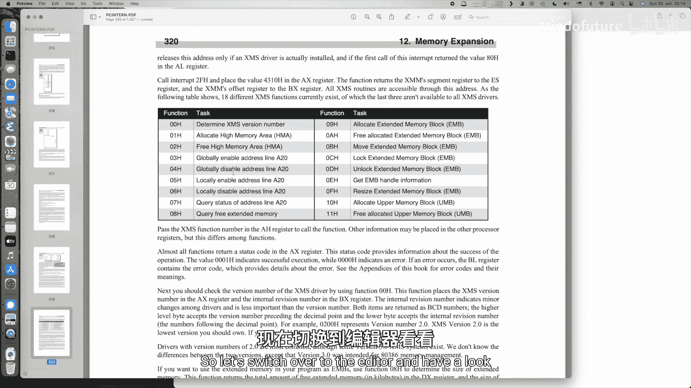
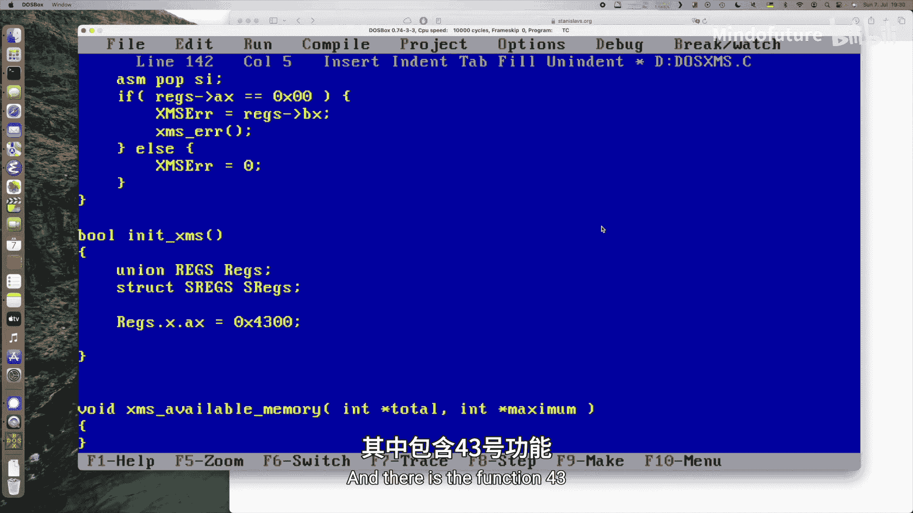
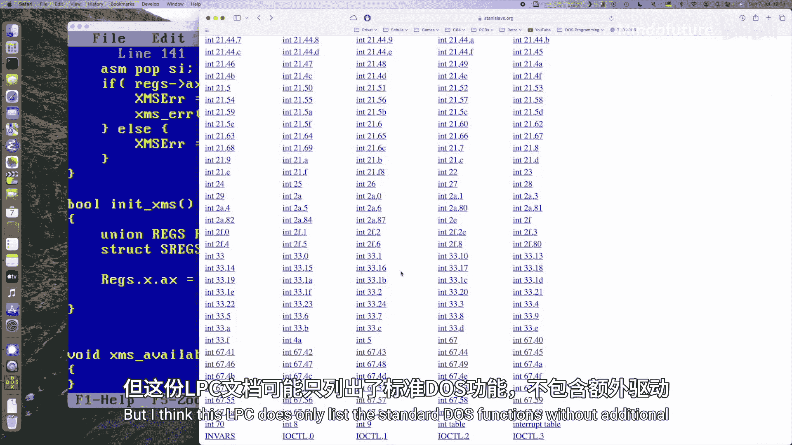
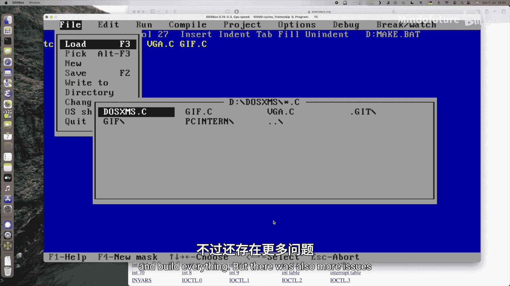
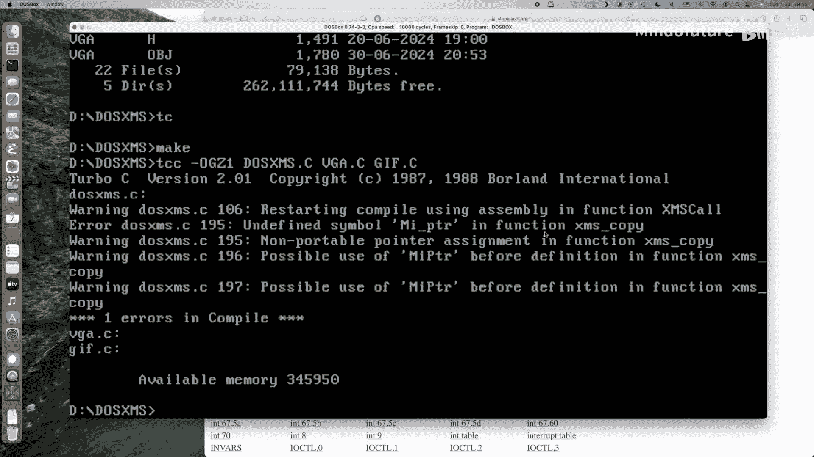
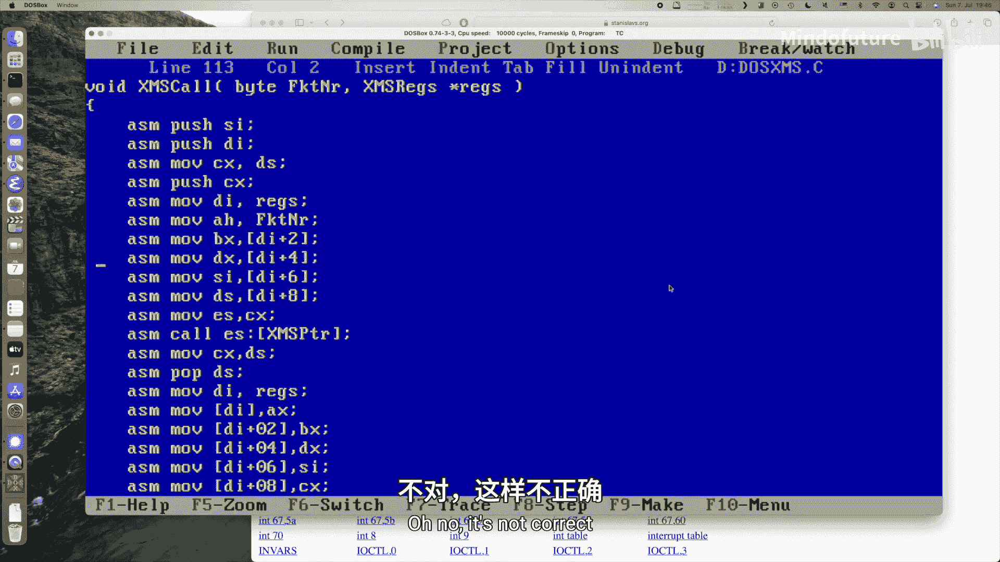
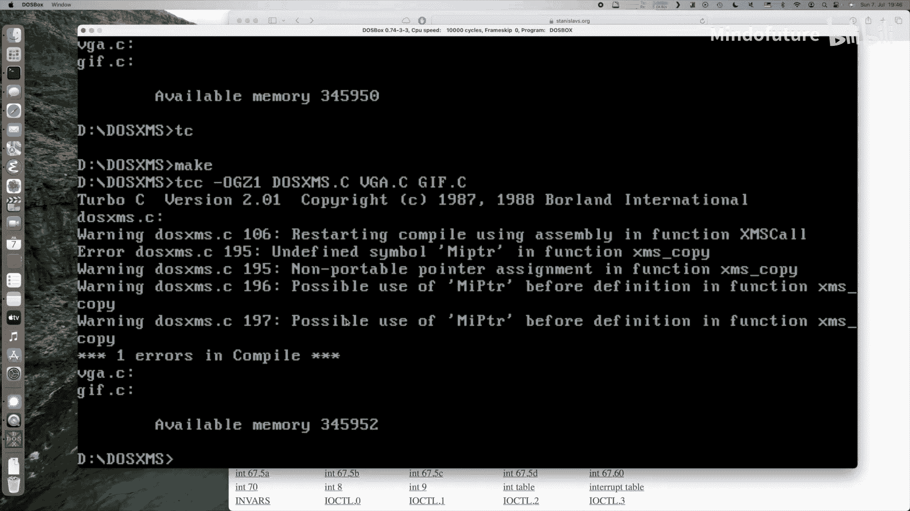
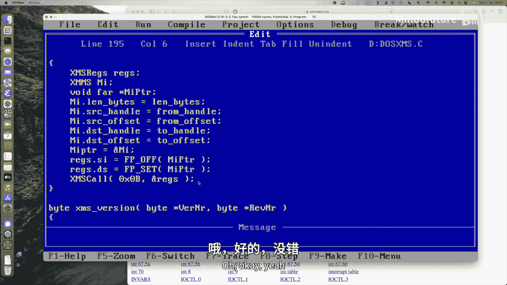
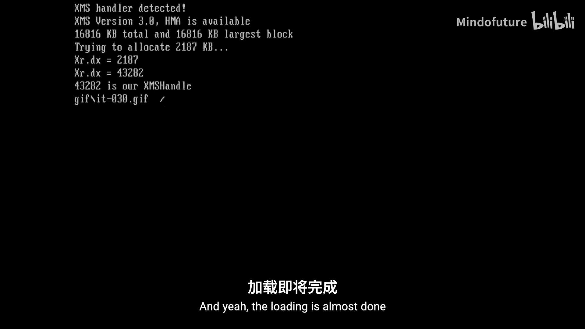
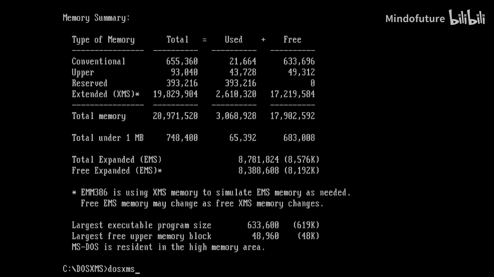

# 042：扩展内存XMS编程教程

## 概述
在本节课中，我们将学习如何在MS-DOS环境下使用扩展内存规范来突破640KB的内存限制。我们将编写一个程序，利用XMS驱动程序将动画帧加载到扩展内存中，并在VGA图形模式下播放。

## 背景知识：MS-DOS内存限制与解决方案

MS-DOS因其640KB的内存屏障而闻名。这意味着在常规的MS-DOS程序中，只能访问0到640KB之间的内存。

然而，即使是1981年IBM推出的第一台PC，也支持高达1MB的总内存。这是8088和8086处理器能够直接寻址的最大值。在640KB到1MB之间的空间，通常被显卡的显存、BIOS ROM以及其他内存映射设备或ROM占用。

随着80286处理器的出现，最大内存容量增加到了16MB。但由于8088和8086使用段和偏移量寻址内存的方式，在通常的实模式下，286仍然只能寻址最多1MB的内存。它需要切换到所谓的“保护模式”才能使用高达16MB的“扩展内存”。

80386处理器进一步扩展了寻址空间，达到了4GB，尽管在那个时代的主板上几乎不可能支持如此大的内存。486处理器也是如此，它们只是拥有更多的地址线来寻址扩展内存。

为了突破640KB或1MB的限制，出现了几种解决方案。上一节我们介绍了“扩展内存”，它本质上是“分页切换”技术，利用显存和BIOS之间的空白区域来分页或切换扩展内存，一次最多可见16KB或64KB。其优点是，如果有支持此功能的硬件板，分页切换速度相对较快。

后来的机器如386和286可以通过软件模拟这种方式，但速度较慢，因为至少需要部分地复制数据。EMS的主要优点是它也能在低端的8086和8088机器上运行。

## 扩展内存与XMS标准

本节中我们来看看“扩展内存”。根据XMS标准，扩展内存实际上只适用于286及以后的机器。甚至可以通过BIOS支持直接操作扩展内存，这一点我很久以后才知道。

在中断`INT 15h`的系统BIOS例程中，有几个相关的函数。例如，子程序`88h`可以返回以1KB块为单位的扩展内存大小。它只适用于286和386，基本上返回CMOS中设置的、机器启动时检测到的内存信息。

还有函数`89h`用于切换到保护模式，我们今天不涉及这部分，我们将坚持使用实模式。函数`87h`可以在扩展内存之间或与常规内存之间复制数据块，但操作起来有些困难，也不是通常使用的方法。

取而代之的是XMS标准。XMS标准提供了一种访问扩展内存中几个不同区域的方法：
*   **高端内存区**：这是扩展内存的第一个64KB。由于8086设计中的一个巧妙漏洞，即使在实模式下，你也可以访问第一个1MB之后的这64KB内存，无需切换到保护模式。
*   **上位内存块**：指640KB到1024KB之间如果有空闲空间的内存区域，也可以通过XMS驱动程序使用。
*   **扩展内存块**：这是我们将要使用的部分，即可以分配、复制数据到/从其中复制的实际扩展内存。

XMS的主要优点是，相比EMS，你可以拥有更多的内存。在386及以上的机器上，这是访问扩展内存的常规方式，无需特殊的硬件支持。XMS总是通过切换到保护模式来完成，这在386上相当快。但在286上，从保护模式切换回实模式非常慢，因为Intel认为这种情况永远不会发生。因此，在286上运行XMS可能相对较慢，而如果有主板硬件支持，EMS可能更快。不过我们不会深究这一点，我们假设在386上运行并具有快速切换能力。

我们将编写一个与上一节EMS程序功能相同的程序：将35帧动画从硬盘加载到扩展内存，然后复制到VGA显存中进行播放。

## XMS驱动程序函数简介

以下是XMS驱动程序提供的一些主要函数：
*   首先，必须检测XMS驱动程序是否已安装。
*   然后，可以查询驱动程序的版本号。
*   可以处理高端内存区，但我们不会使用。
*   我们将主要处理扩展内存块的分配、复制等操作。
*   我们不会涉及A20线（用于寻址高端内存区的技巧）。

## 程序结构与实现

现在让我们切换到代码编辑器，看看程序的结构。

我已经复制了`do_ems.c`文件，并更改了一些名称，因为我们现在处理的是XMS。主函数与之前的非常相似。

以下是程序的主要步骤：
1.  清屏并尝试初始化XMS驱动程序。如果未找到，则打印错误并返回。
2.  查询XMS驱动程序的版本号以及高端内存区是否可用（尽管我们不会使用它）。
3.  打印系统的可用内存信息。
4.  尝试分配足够的内存来存储所有动画帧（以1KB为单位分配）。
5.  存储XMS句柄。所有XMS函数调用都会有错误检查。
6.  通过读取所有帧的`.GIF`文件，将数据加载到XMS中。
7.  使用复制到XMS的函数，并复制调色板进行存储。
8.  切换到图形模式，设置第一个调色板。
9.  循环遍历所有图像，将数据从XMS直接复制到VGA显存中，无需任何绘制操作，驱动程序会为我们复制到原始的13h模式缓冲区。同时设置调色板。
10. 添加一个小的延迟（7帧刷新等待），以实现大约每秒10帧的动画速度。
11. 如果按下按键，则切换回文本模式并释放所有内存。

## 核心数据结构与调用机制

我们需要介绍几个关键的数据结构和调用机制。

首先是`XMSREGS`寄存器结构体和`XMSMOVE`扩展内存移动结构体。因为XMS驱动程序不像BIOS中断`INT 15h`那样使用软件中断，而是使用一个远过程调用，所有参数都通过寄存器传递。

`XMSMOVE`结构体用于移动数据，XMS驱动程序期望以下值：
*   `length`：要移动的字节数（32位值）。
*   `src_handle`：源句柄（16位值）。如果为0，则表示源在实模式内存中（低于1MB），此时`src_offset`是一个由段和偏移量构成的远指针。
*   `src_offset`：源偏移量（32位值）。
*   `dest_handle`：目标句柄。如果为0，同理，表示目标在实模式内存中。
*   `dest_offset`：目标偏移量。

我们还有一个指向驱动程序的远函数指针`XMSpointer`，以及全局错误变量`XMSerror`和程序使用的句柄`XMSHandle`。

调用XMS驱动程序需要使用内联汇编。因为Turbo C的旧版本IDE不支持内联汇编，所以我们必须使用命令行编译器进行编译。我写了一个名为`make.bat`的批处理文件，它使用TCC命令行编译器，并带有一些优化选项（针对286编译），将我们需要的三个文件（`dosxms.c`、`vga.c`和`gif.c`）编译链接成一个可执行文件。

## 关键函数详解

### XMS驱动程序调用函数

`XMScall`函数是核心，它使用内联汇编来设置寄存器、调用XMS驱动程序，并获取返回值。关键步骤包括保存寄存器、设置函数号、加载参数寄存器、执行远调用，然后恢复寄存器并读取返回值。

### 初始化XMS

`initXMS`函数用于初始化并获取XMS驱动程序的入口点。它通过DOS多路中断`INT 2Fh`的功能`43h`来检查XMS驱动程序是否存在并获取其地址。

### 查询版本与内存信息

`XMSversion`函数调用XMS驱动程序的`0x00`号功能，返回版本号（主版本在AH，副版本在AL），并通过DX寄存器指示HMA是否可用。

`XMSquery`函数调用`0x08`号功能，返回总的扩展内存大小（KB）和最大空闲块大小（KB）。

### 内存分配与释放

`XMSalloc`函数调用`0x09`号功能，按KB单位分配扩展内存，并返回一个句柄。
`XMSfree`函数调用`0x0A`号功能，传入句柄来释放之前分配的内存。

### 内存复制

`XMScopy`是通用复制函数，调用`0x0Bh`号功能。它接受一个`XMSMOVE`结构体指针，可以处理在扩展内存之间、扩展内存与常规内存之间的任意方向复制。
`copyToXMS`和`copyFromXMS`是基于`XMScopy`的便捷函数，分别用于将数据从常规内存复制到扩展内存，以及从扩展内存复制到常规内存。

## 编译与运行

由于使用了内联汇编，我们需要使用命令行工具进行编译。运行`make.bat`批处理文件可以完成编译链接。

首先在DOSBox中测试程序。程序会显示XMS版本（如3.0）、HMA可用性、总扩展内存大小（例如15MB），并分配约2188KB（35帧 * 64KB/帧）的内存。动画能够成功播放。

然后在真实的486 DX2/66机器（配备20MB RAM）上测试。程序检测到HMA可用，总扩展内存约16MB，并成功分配内存播放动画。虽然由于显卡速度等原因存在一些屏幕撕裂，但证明了概念是可行的。

## 总结

本节课中，我们一起学习了如何在MS-DOS下使用扩展内存规范来突破640KB的内存限制。我们了解了XMS与EMS的区别，掌握了通过XMS驱动程序查询内存、分配/释放扩展内存块以及在扩展内存与常规内存间复制数据的方法。我们成功编写并运行了一个程序，将动画数据加载到扩展内存中并在VGA模式下流畅播放。这为开发需要更大内存的DOS程序提供了有效手段，而无需直接处理复杂且耗时的保护模式切换。