# 044：内存与指针

在本节课中，我们将学习IBM PC及其兼容机上的内存管理，以及C语言中指针的概念、用法和原理。这对于理解如何在MS-DOS环境下进行底层编程至关重要。

上一节我们介绍了MS-DOS编程的基础，本节中我们来看看内存寻址和指针。

## 内存寻址基础

最初的IBM PC和XT使用8088 CPU，该CPU只能寻址最多1MB的内存。这1MB空间被分为两部分：较低的640KB（0x00000 - 0x9FFFF）通常可供程序自由使用，较高的384KB（0xA0000 - 0xFFFFF）则被系统保留，用于视频RAM、BIOS和扩展卡等。

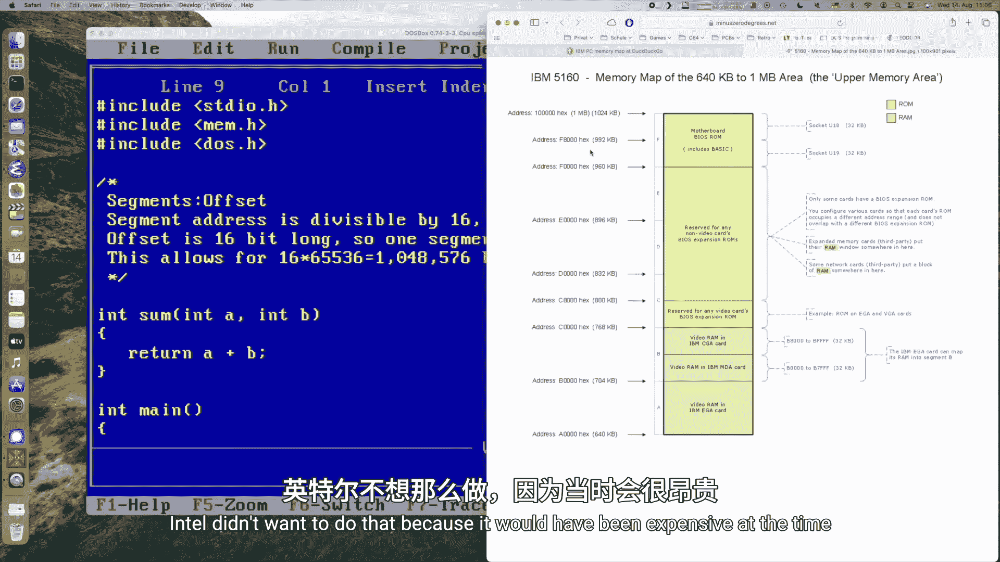

8088/8086 CPU使用一种称为**分段内存寻址**的机制。这与6502或Z80等使用**平坦内存模型**（16位地址线，64KB寻址空间）的CPU不同。

分段寻址使用两个16位的值来构成一个20位的物理地址：
*   **段地址**：指向一个以16字节为边界的起始位置。
*   **偏移地址**：指向该段内的具体字节。

物理地址的计算公式为：
**物理地址 = 段地址 × 16 + 偏移地址**

每个段的大小是64KB（2^16字节）。由于每16字节就有一个新的段起始点，因此总共可以寻址 `16 × 65536 = 1,048,576` 字节，即1MB。

在C语言中，这种分段细节通常被隐藏，但在需要直接操作特定内存区域（如视频缓冲区）时就会变得重要。

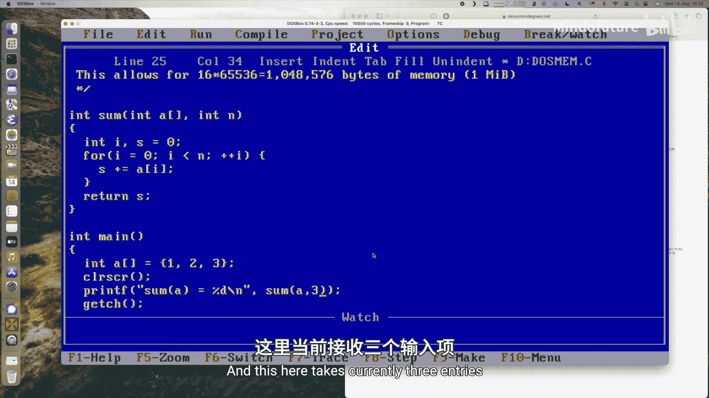

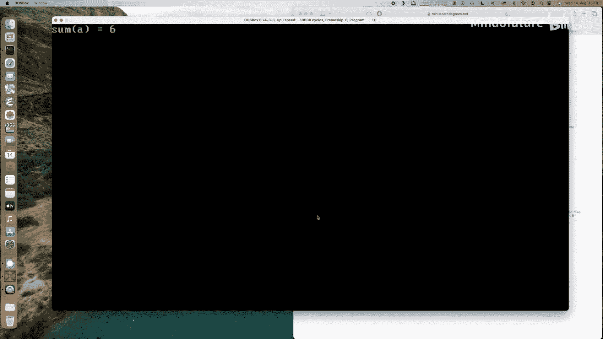

## 指针是什么？

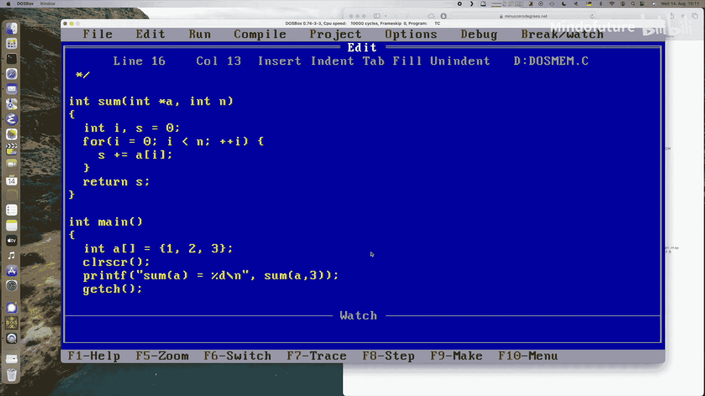

指针本质上是一个**内存地址**。在MS-DOS的实模式下，这个地址包含段和偏移两部分。指针“指向”内存中某个特定数据的位置，就像门牌号指向一栋房子。

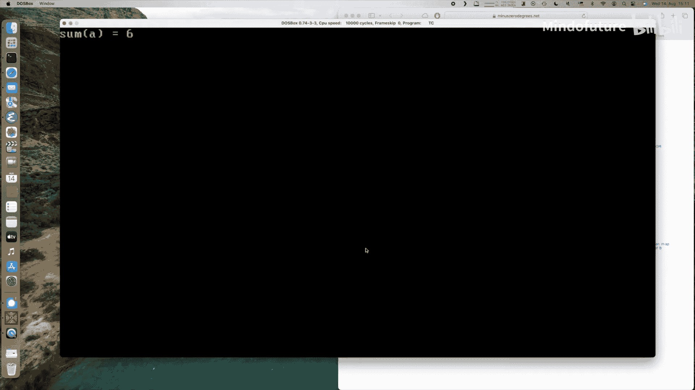

以下是一些语言对指针的处理方式：
*   **隐藏指针**：BASIC、Java等语言对程序员隐藏了指针。
*   **显式使用指针**：Pascal、C/C++等语言要求程序员显式地使用和操作指针。

## 指针的基本用法

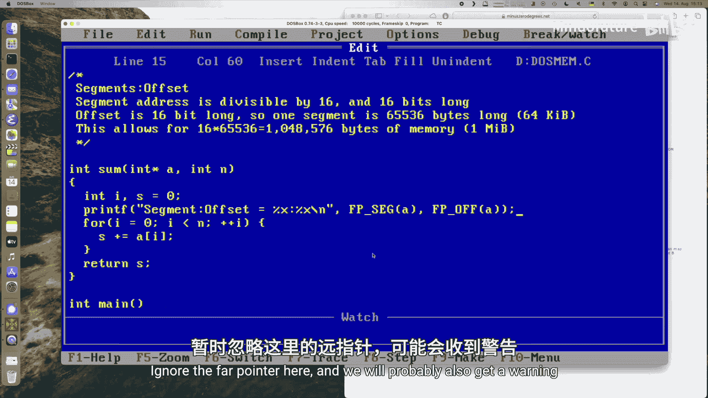

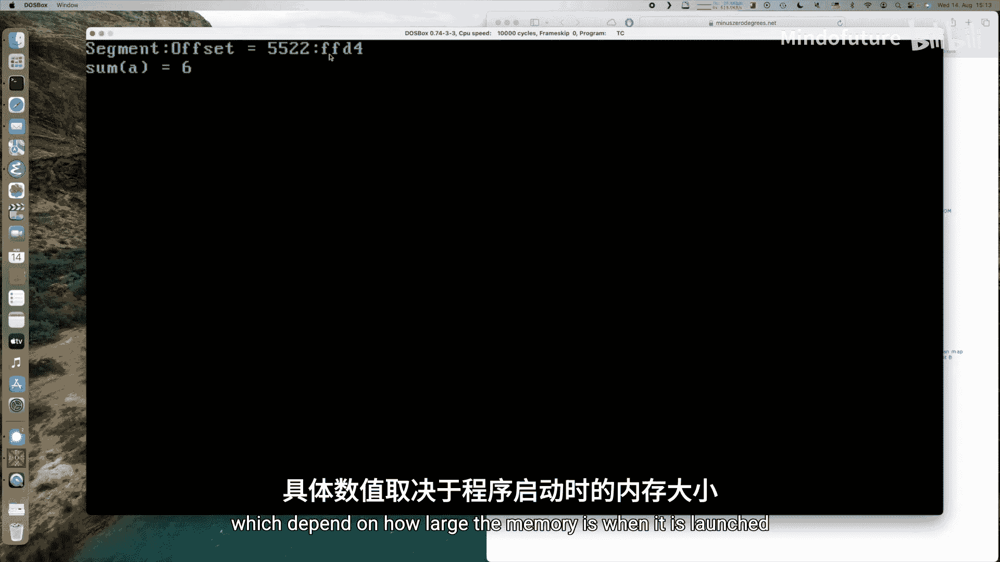


让我们通过一个简单的C程序来理解指针。首先，我们看一个不需要指针的函数。


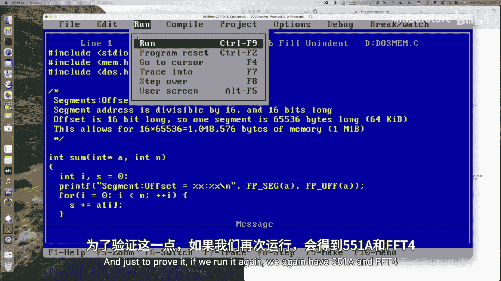


```c
int sum(int a, int b) {
    return a + b;
}

void main() {
    int a = 1, b = 2;
    printf(“%d + %d = %d”, a, b, sum(a, b));
    getch();
}
```
这个程序输出 `1 + 2 = 3`。这里参数通过值传递。

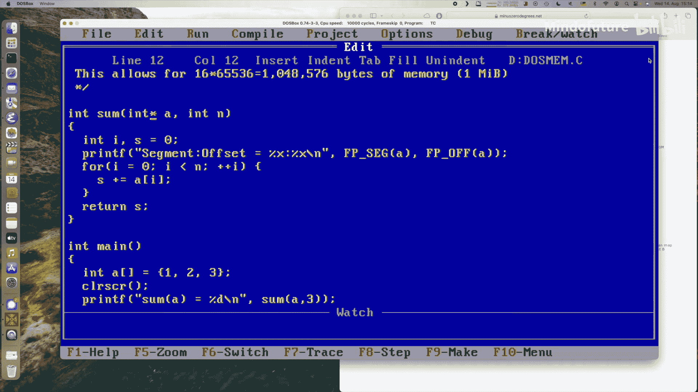

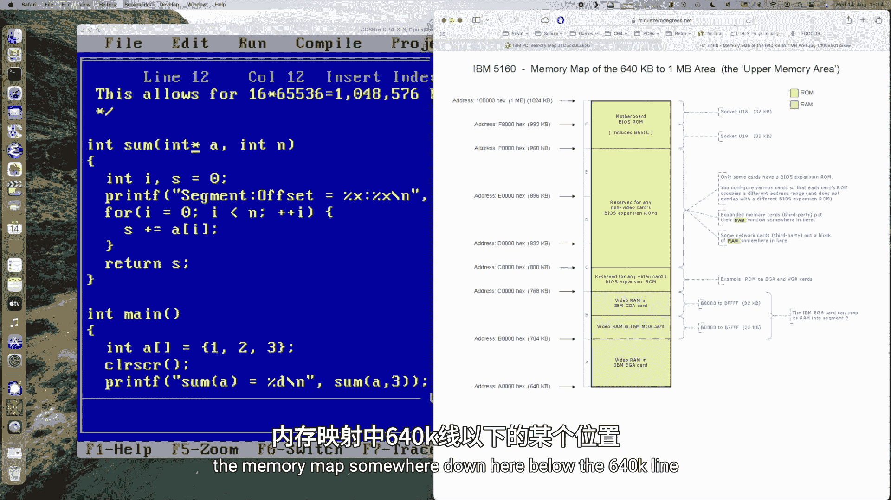

如果我们想计算一个可变长度数组的总和，直接传递多个参数是不现实的。这时，我们可以传递一个数组。

```c
int sum_array(int a[], int n) {
    int s = 0, i;
    for(i = 0; i < n; i++) {
        s += a[i];
    }
    return s;
}

void main() {
    int arr[] = {1, 2, 3};
    printf(“Sum = %d”, sum_array(arr, 3));
    getch();
}
```
程序输出 `Sum = 6`。

这里我们已经隐式地使用了指针。在C语言中，数组名就是指向数组第一个元素的指针。函数签名 `int a[]` 等价于 `int *a`。我们可以用指针形式重写这个函数。

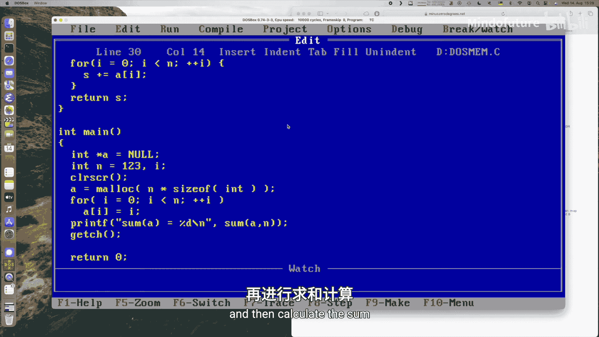

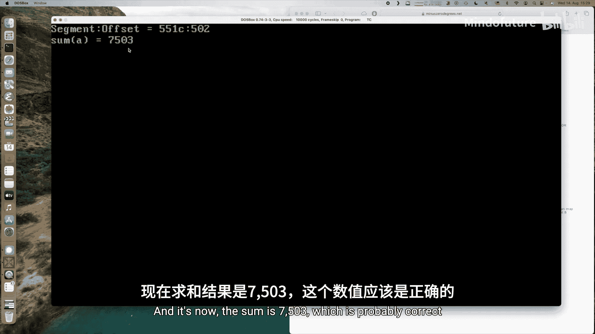

```c
int sum_pointer(int *a, int n) {
    int s = 0, i;
    for(i = 0; i < n; i++) {
        s += a[i]; // 指针同样可以用下标运算符[]
    }
    return s;
}
```
它的行为与数组版本完全一致。`int *a` 声明了一个指向整型的指针。

我们可以用Turbo C提供的宏来查看这个指针在内存中的实际地址（段和偏移）。

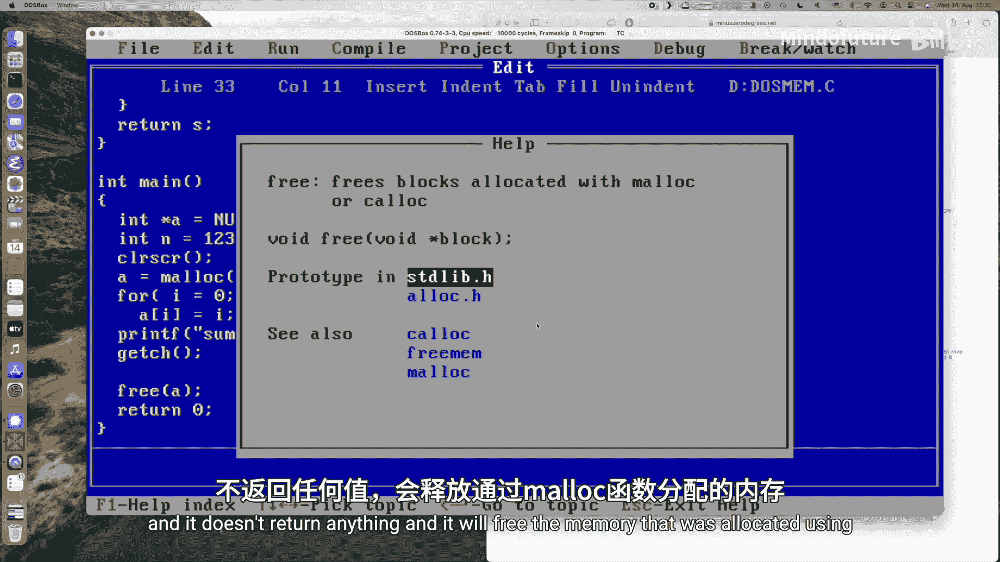

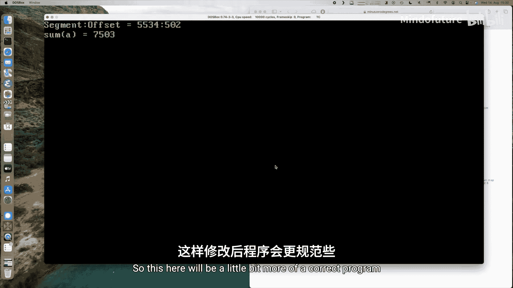

```c
#include <dos.h>
void main() {
    int arr[] = {1, 2, 3};
    printf(“Segment:Offset = %04X:%04X\n”, FP_SEG(arr), FP_OFF(arr));
}
```
运行程序会输出类似 `5522:FFD4` 的结果，具体值取决于程序加载的位置。

## 动态内存分配

当数据大小在编译时未知时（例如从文件读取可变数量的数据），我们需要动态分配内存。这是指针的核心用途之一。

以下是使用动态内存的步骤：
1.  使用 `malloc` 函数申请内存。
2.  使用指针操作这块内存。
3.  使用完毕后，用 `free` 函数释放内存，避免内存泄漏。

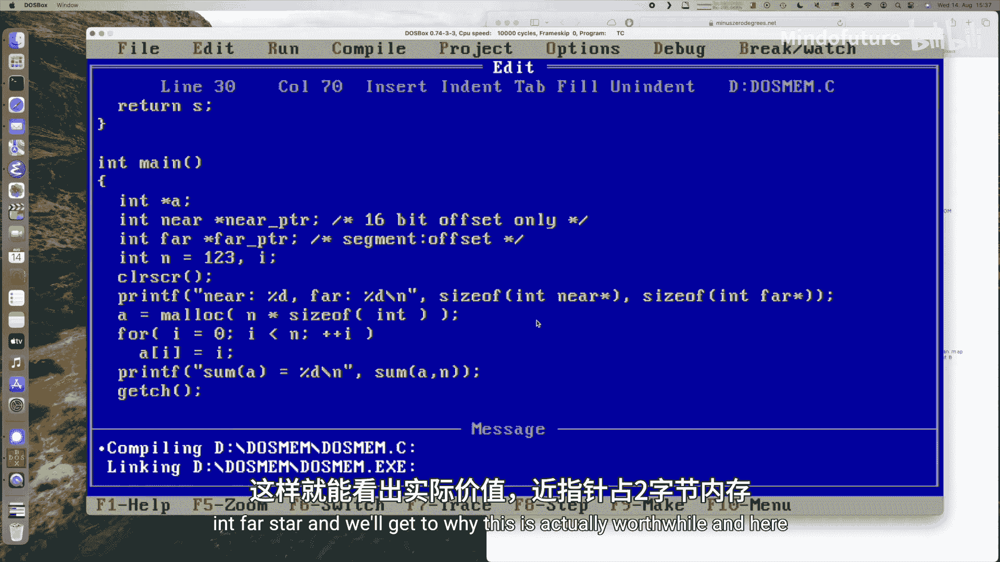

```c
#include <alloc.h> // 包含malloc和free的原型
void main() {
    int n = 123, i;
    int *dynamic_arr; // 声明一个指针
    dynamic_arr = (int*) malloc(n * sizeof(int)); // 分配内存

    if(dynamic_arr == NULL) {
        printf(“Memory allocation failed!\n”);
        return;
    }

    // 初始化动态数组
    for(i = 0; i < n; i++) {
        dynamic_arr[i] = i;
    }

    // 使用动态数组（例如计算总和）
    int s = sum_pointer(dynamic_arr, n);
    printf(“Sum of first %d numbers = %d\n”, n, s);

    free(dynamic_arr); // 释放内存
    getch();
}
```

## 近指针与远指针

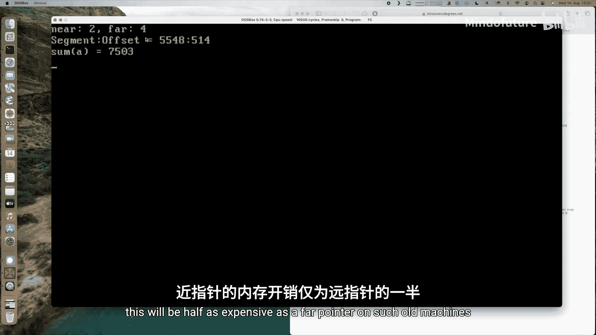

在DOS的C编译器（如Turbo C）中，由于分段内存模型，指针有**近指针**和**远指针**之分。

以下是它们的关键区别：
*   **近指针**：只包含16位的偏移地址，默认使用当前数据段。大小为 **2字节**。
*   **远指针**：包含16位的段地址和16位的偏移地址。大小为 **4字节**。

你可以使用 `near` 和 `far` 关键字来显式声明指针类型。

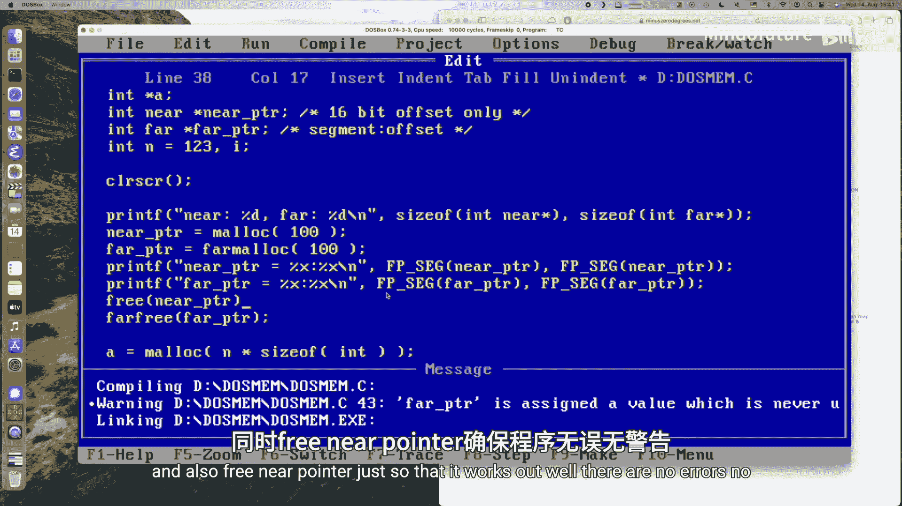

```c
int near *near_ptr;   // 近指针
int far *far_ptr;     // 远指针
printf(“Sizeof near*: %d\n”, sizeof(near_ptr));
printf(“Sizeof far*:  %d\n”, sizeof(far_ptr));
```
输出会显示近指针占2字节，远指针占4字节。

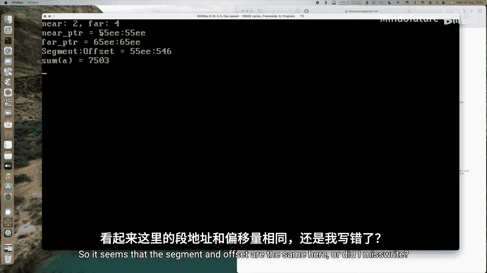

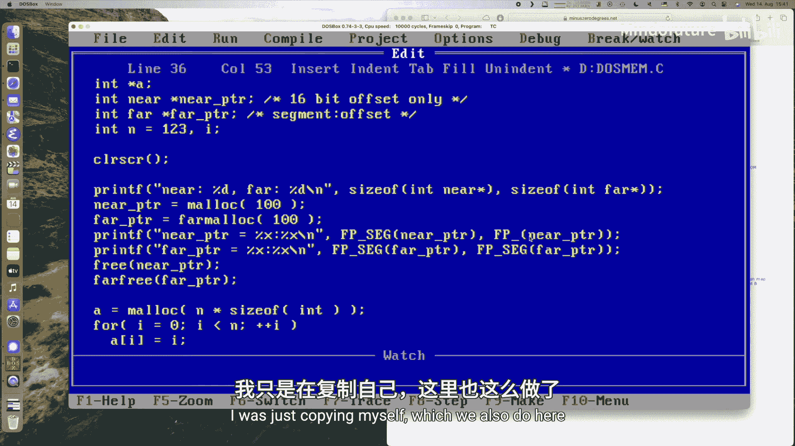

选择近指针可以节省内存和提升访问速度，但前提是你确定数据在当前64KB的数据段内。对于通过 `malloc` 在堆上分配的内存，其指针类型取决于编译时选择的**内存模型**（Tiny, Small, Compact, Large, Huge）。Turbo C也提供了 `farmalloc` 和 `farfree` 函数来专门管理远堆内存。

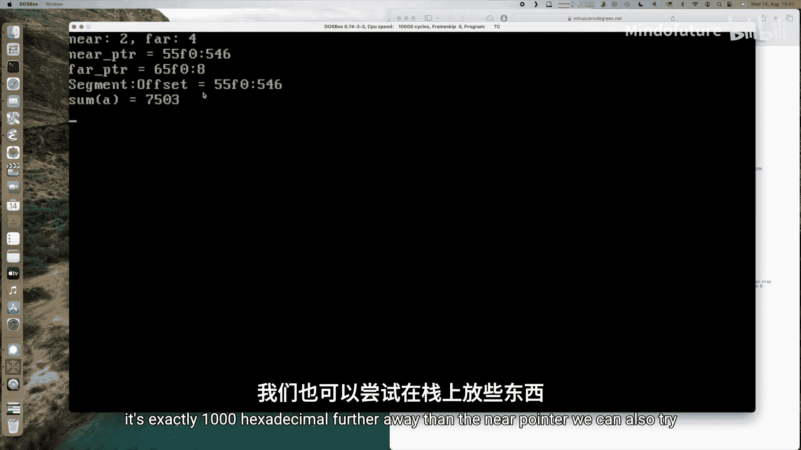

## 指针与复杂数据结构

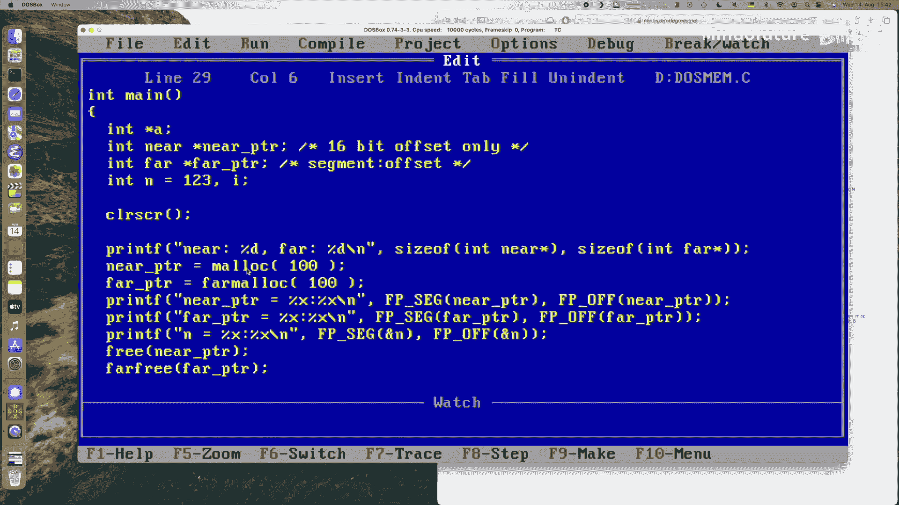

对于结构体等复杂数据类型，通常也通过指针来传递，以避免复制整个结构体带来的性能开销。

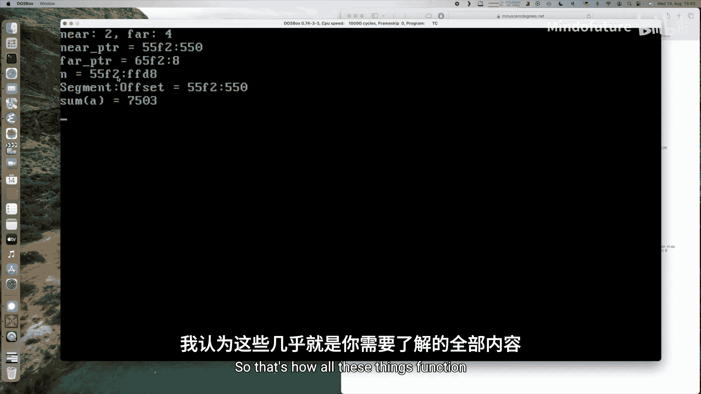

```c
struct Player {
    int x, y;
    int health;
};

void draw_player(struct Player *p) {
    // 通过指针p来访问和修改玩家的数据
    printf(“Drawing player at (%d, %d)\n”, p->x, p->y);
}

void main() {
    struct Player hero = {100, 200, 50};
    draw_player(&hero); // 传递结构体的地址
    getch();
}
```

## 总结

本节课中我们一起学习了MS-DOS实模式下的内存管理和C语言指针。
1.  **内存布局**：理解了1MB地址空间的分段（640KB常规内存，384KB上位内存）以及8088/8086的分段寻址机制。
2.  **指针本质**：指针是内存地址，在DOS下由段和偏移两部分组成。
3.  **指针用途**：用于处理数组、动态内存分配以及高效传递复杂数据结构。
4.  **动态内存**：学会了使用 `malloc` 和 `free` 来管理堆内存，并理解了防止内存泄漏的重要性。
5.  **近与远指针**：了解了DOS C编程中特有的近指针和远指针概念及其适用场景。
6.  **指针操作**：掌握了通过指针访问数据、获取变量地址（`&`运算符）等基本操作。

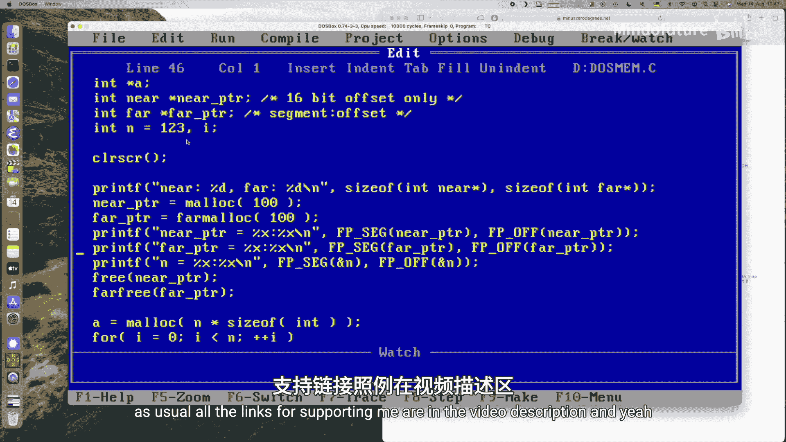

C语言要求程序员手动管理内存，这是其强大和灵活的原因之一，但也增加了责任。理解这些概念是进行MS-DOS系统编程和深入理解计算机工作原理的关键一步。