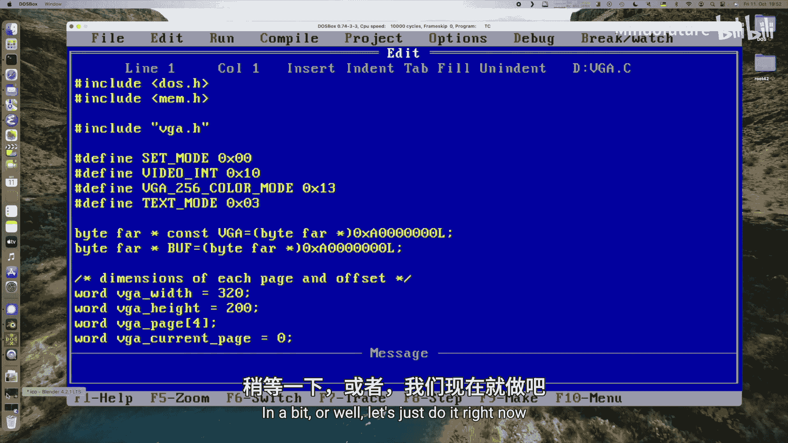
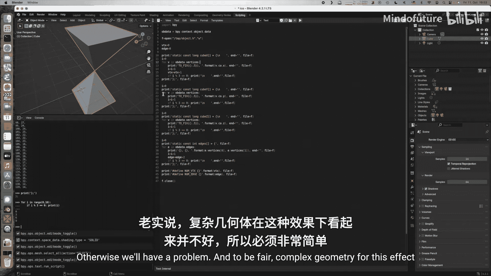
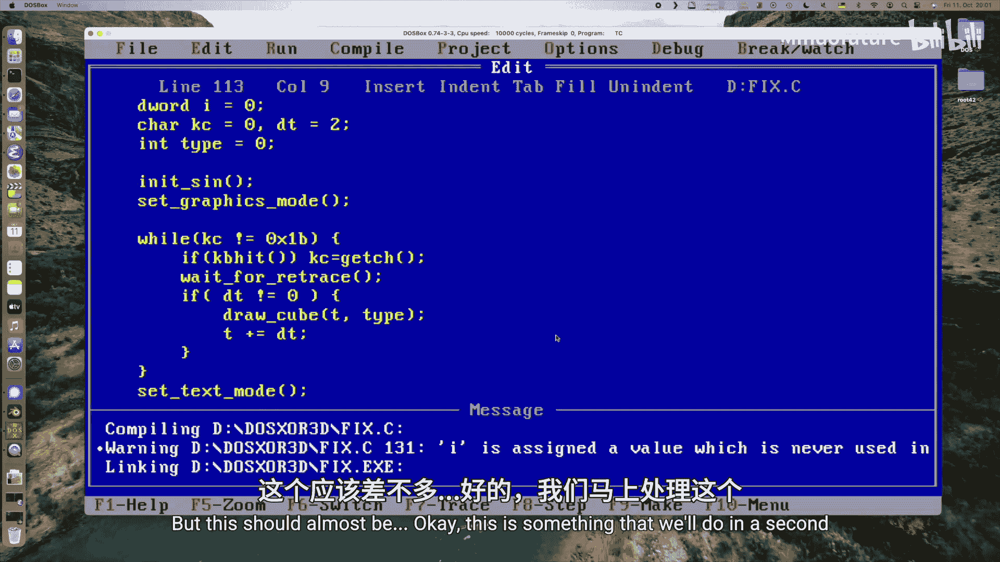
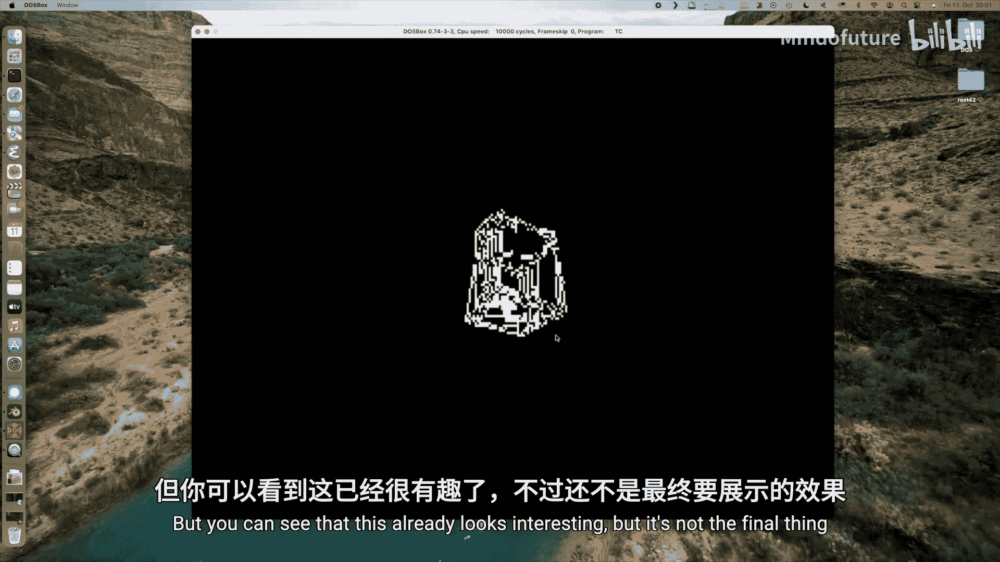
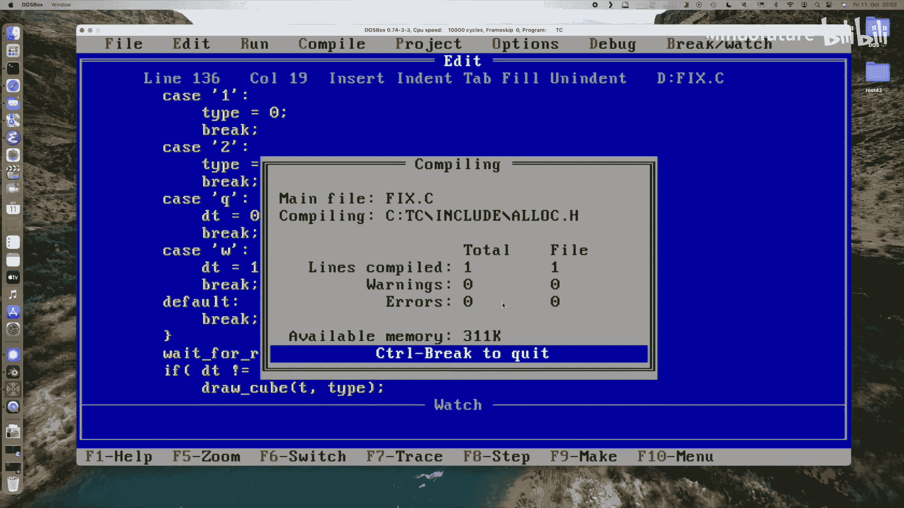
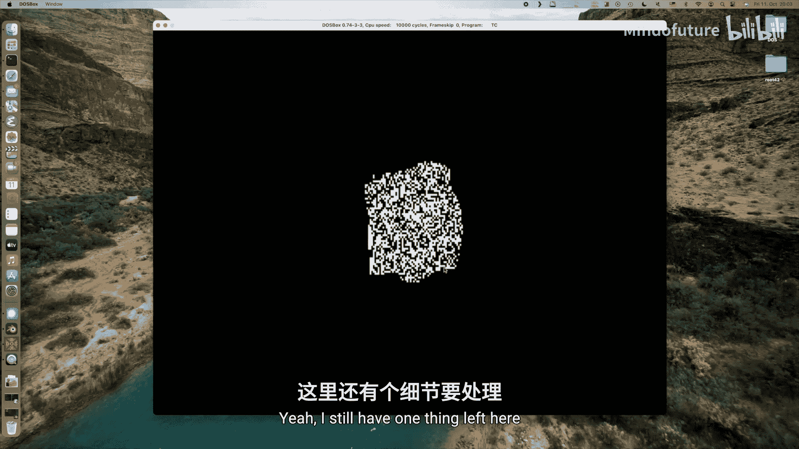
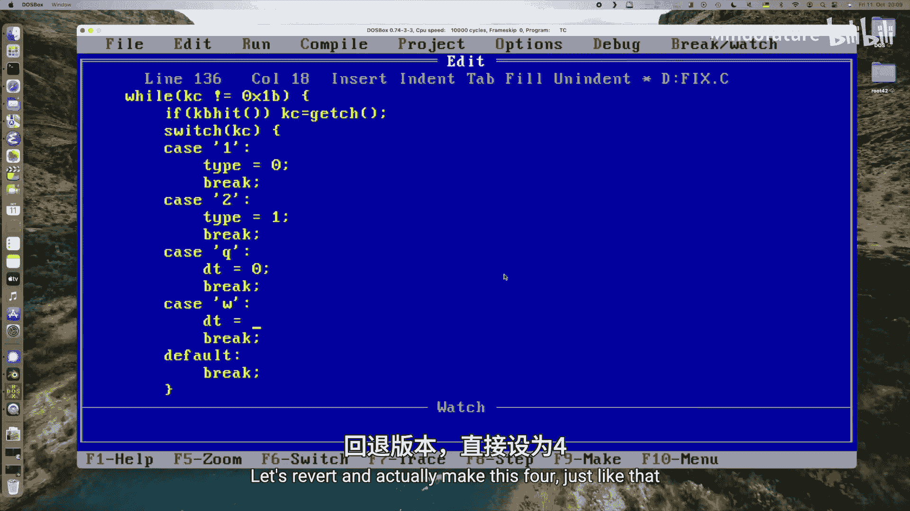

# 045：制作噪点3D动画

在本节课中，我们将学习如何修改一个已有的固定算术3D旋转立方体程序，将其转变为一个利用XOR绘图和随机屏幕噪点来创造独特视觉效果的动画。这个效果的特点是，物体仅在运动时可见，一旦停止，就会完全“消失”在噪点背景中。

## 概述与准备工作

上一节我们实现了一个不使用浮点数的3D旋转立方体。本节中，我们将以此为基础进行大幅修改。



首先，为了支持不同的几何模型，我们将顶点和边的数据从主函数中移出，放入独立的头文件中。我们定义了两个模型：一个立方体和一个由两个金字塔组成的八面体。由于是老式C代码，我们需要一个常量来定义数组的最大尺寸，这里设为64。



```c
#define MAX_VERTS 64
```

## 重构几何数据管理

接下来，我们清理并重构绘图函数。核心变化是使用指针来指向不同几何模型的顶点和边数据，而不是硬编码的数组。

以下是管理几何数据的关键变量：
```c
int *vertex_x, *vertex_y, *vertex_z; // 指向顶点坐标数组的指针
int *edges; // 指向边连接数组的指针
int num_verts, num_edges; // 顶点和边的数量
```

我们通过一个`switch`语句，根据传入的类型参数（0代表立方体，1代表八面体）来为这些指针赋值。这样就能轻松切换渲染的模型。

## 从Blender导出模型数据

为了能使用自定义的几何体，我编写了一个Blender Python脚本。这个脚本可以导出模型的顶点和边数据，并生成一个可直接包含在C项目中的头文件。你可以在代码仓库中找到这个脚本。

**重要限制**：模型不能超过64个顶点或边，并且过于复杂的模型在此效果下表现并不好，因此建议使用简单的几何体。





## 实现XOR绘图与动画控制

为了实现“消失”效果，我们不使用常规的画线函数，而是采用XOR（异或）模式来绘制线条。



我们实现了一个`set_pixel_xor`函数：
```c
void set_pixel_xor(int x, int y, char color) {
    VGA_BUFFER[y * SCREEN_WIDTH + x] ^= color;
}
```
这个函数将指定颜色与屏幕上已有的像素颜色进行XOR运算。当同一线条被绘制两次时，它会擦除自己。



在动画循环中，我们还将物体与屏幕的距离改为随时间正弦变化，从而产生平滑的缩放效果。

此外，我们增加了键盘交互功能：
*   按键 **1** 和 **2** 用于在立方体和八面体模型之间切换。
*   按键 **Q** 和 **W** 用于停止和启动动画。这是体验效果的关键：动画停止时，物体将不可见。

## 创造噪点画布与最终效果

最后一步是创造那个神奇的噪点背景。在程序初始化时，我们调用`randomize()`函数初始化随机数生成器。

然后，我们用随机黑白像素填充整个屏幕缓冲区：
```c
for (int i = 0; i < SCREEN_HEIGHT * SCREEN_WIDTH; i++) {
    VGA_BUFFER[i] = (rand() % 2) * 15; // 生成0（黑）或15（白）
}
```

现在运行程序，你会看到屏幕上充满噪点，而3D物体在其中旋转。**其视觉原理在于**：物体的运动（结合XOR绘图造成的闪烁）与静态的随机噪点形成对比，你的大脑会从中识别并构建出物体的形状。一旦动画停止，这种动态对比消失，物体也就完全融入背景噪点，仿佛从未存在过。

你可以尝试按 **Q** 键停止旋转，观察物体如何“消失”；再按 **W** 键启动，看它如何重新“出现”。



## 总结

本节课中我们一起学习了如何将一个标准的3D线框渲染器，改造为一个利用XOR绘图、随机噪点和视觉暂留原理的趣味动画。我们重构了代码以支持多模型，实现了交互控制，并最终得到了一个物体“动则显，静则隐”的奇妙视觉效果。这个项目展示了，简单的图形技巧结合对人类视觉的理解，可以创造出非常有趣的演示程序。