# 046：使用L系统绘制圣诞树 🎄

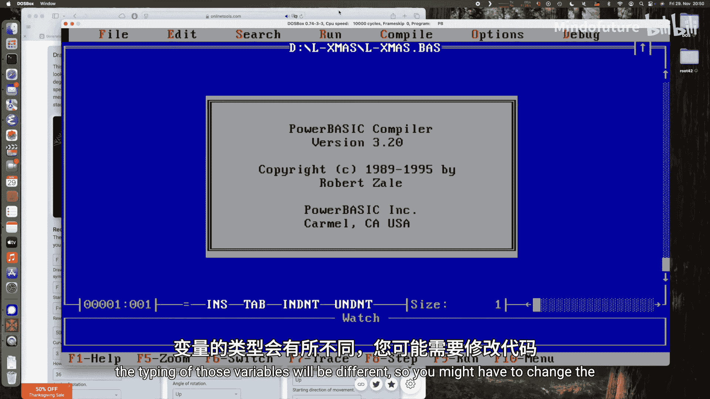

在本节课中，我们将学习如何在MS-DOS环境下，使用PowerBASIC编程语言和L系统（Lindenmayer系统）来生成并绘制一个动态的、类似圣诞树的复杂分形图案。我们将从零开始构建代码，涵盖L系统的基本概念、状态栈的实现以及图形绘制。

---

## 概述

L系统是一种用于模拟生物生长和分形结构的字符串重写系统。它从一个初始字符串（公理）开始，通过一系列规则迭代替换，最终生成一个描述图形绘制指令的字符串。本节课，我们将实现一个特定的L系统来生成圣诞树形状。

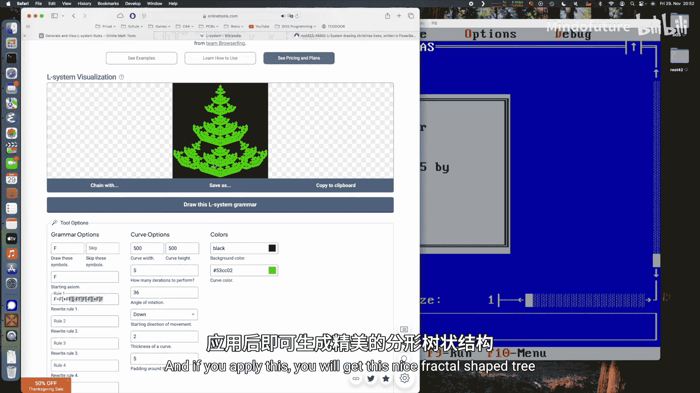

## 全局变量与数据结构

首先，我们需要定义一些全局变量来存储程序的状态。虽然全局变量在大型项目中不推荐使用，但在此演示中，它们能使代码更易于阅读和理解。

以下是所需的核心变量：

*   **`length`**: 一个双精度浮点数，表示基础线段的绘制长度。
*   **`co`**: 一个整数，表示绘制颜色（在VGA 16色模式下，范围为0-15）。
*   **`scale`**: 一个双精度浮点数，用于整体缩放绘制的树。
*   **`angle`**: 一个双精度浮点数，表示绘图光标当前的旋转角度（弧度制）。
*   **`posx`, `posy`**: 两个双精度浮点数，表示绘图光标当前的X和Y坐标。
*   **`stackx()`, `stacky()`, `stacka()`**: 三个数组，分别用作X坐标、Y坐标和角度的栈，用于保存和恢复绘图状态。
*   **`sp`**: 一个整数，作为栈指针，指示栈顶位置。

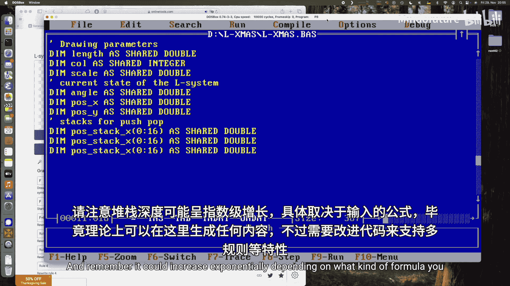

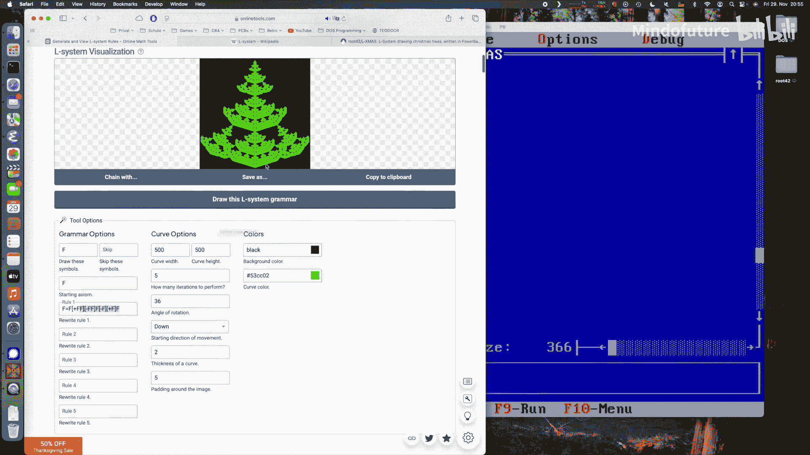

在PowerBASIC中，这些变量可以如下声明：
```basic
DIM length AS DOUBLE
DIM co AS INTEGER
DIM scale AS DOUBLE
DIM angle AS DOUBLE
DIM posx AS DOUBLE
DIM posy AS DOUBLE
DIM stackx(16) AS DOUBLE
DIM stacky(16) AS DOUBLE
DIM stacka(16) AS DOUBLE
DIM sp AS INTEGER
```

## 核心功能函数

有了数据结构，接下来我们实现绘图所需的核心功能。这些函数将处理状态保存、移动和转向。

### 状态栈操作：PUSH 和 POP

L系统中的方括号 `[` 和 `]` 分别对应状态的保存（入栈）和恢复（出栈）。状态包括当前位置和角度。

**PUSH函数** 将当前状态存入栈中：
```basic
SUB PushState
    stackx(sp) = posx
    stacky(sp) = posy
    stacka(sp) = angle
    sp = sp + 1
END SUB
```

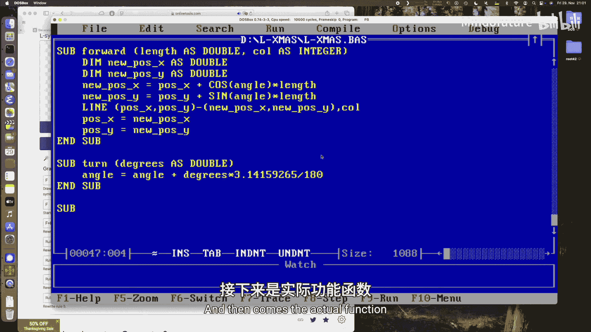

**POP函数** 从栈中恢复之前保存的状态：
```basic
SUB PopState
    sp = sp - 1
    posx = stackx(sp)
    posy = stacky(sp)
    angle = stacka(sp)
END SUB
```

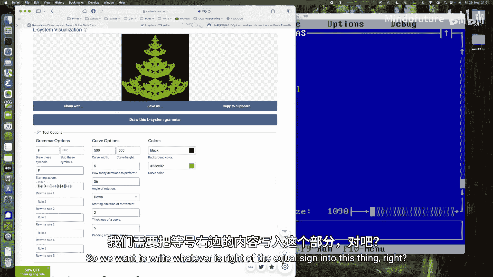

### 绘图与转向

**Forward函数** 根据当前角度和指定长度，从当前位置画一条线到新位置。
```basic
SUB Forward (len AS DOUBLE, col AS INTEGER)
    DIM newx AS DOUBLE
    DIM newy AS DOUBLE
    newx = posx + COS(angle) * len * scale
    newy = posy + SIN(angle) * len * scale
    LINE (posx, posy)-(newx, newy), col
    posx = newx
    posy = newy
END SUB
```

**Turn函数** 将当前角度旋转指定的度数。
```basic
SUB Turn (deg AS DOUBLE)
    angle = angle + deg * 3.14159265 / 180
END SUB
```

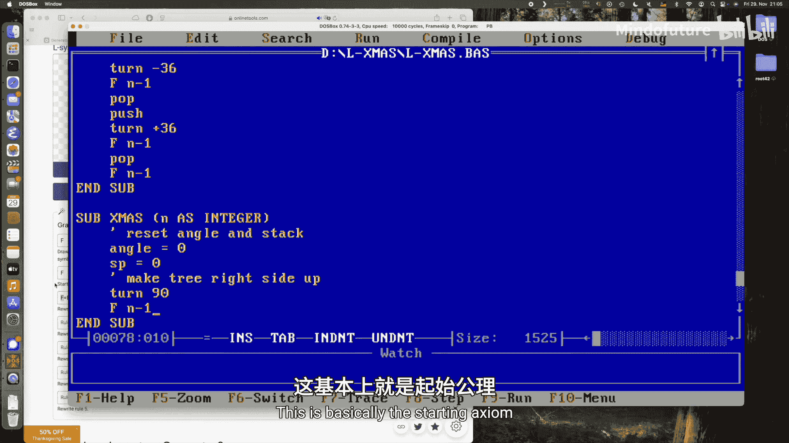

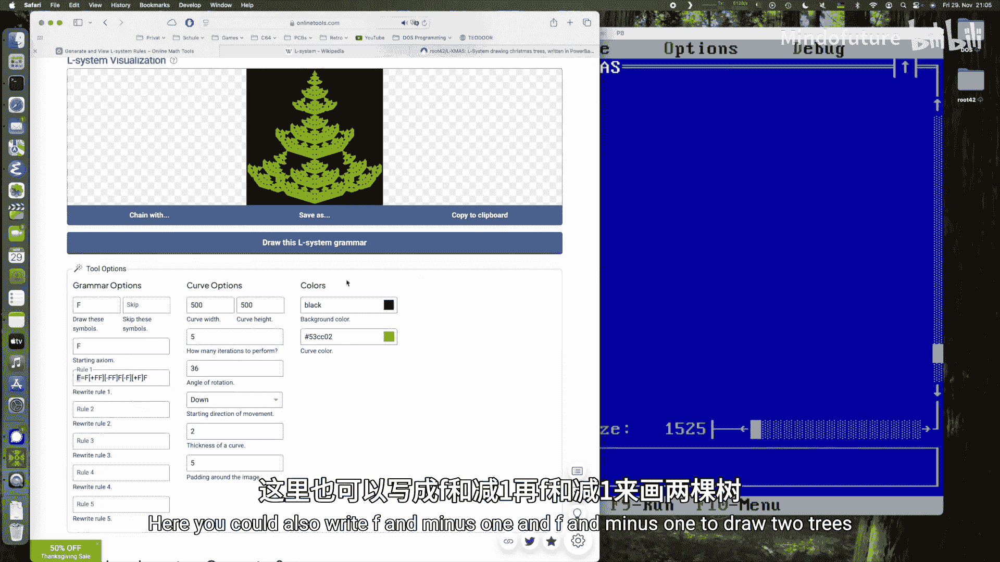

## L系统规则实现

现在，我们来实现生成圣诞树的具体L系统规则。我们使用的规则是：
**公理**: `F`
**规则**: `F` -> `F[+F]F[-F]F`

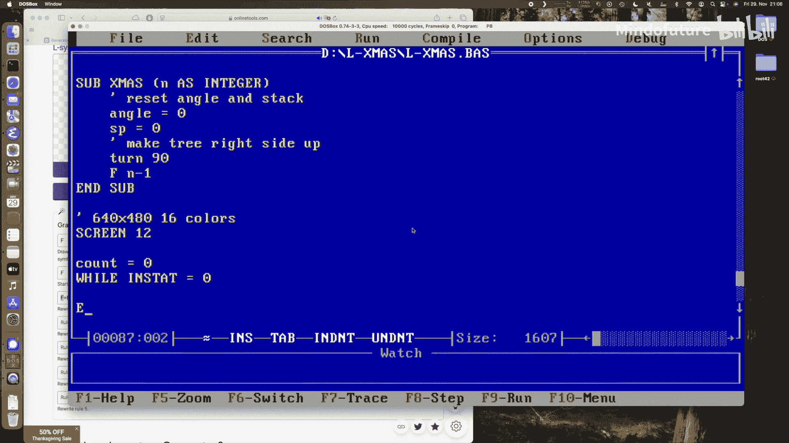

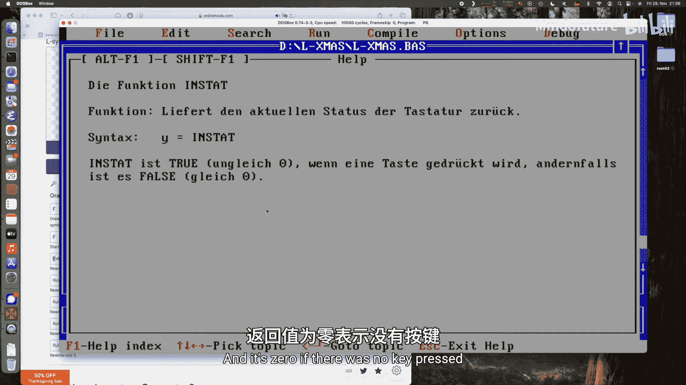

在代码中，我们通过一个递归函数 `F` 来模拟这个替换过程。参数 `n` 表示剩余的递归深度。

```basic
SUB F (n AS INTEGER)
    IF n = 0 THEN
        Forward length * scale, co
    ELSE
        F n - 1
        PushState
        Turn 36
        F n - 1
        PopState
        F n - 1
        PushState
        Turn -36
        F n - 1
        PopState
        F n - 1
    END IF
END SUB
```
当 `n` 为0时，我们直接绘制一条线段。否则，我们根据规则 `F[+F]F[-F]F` 递归调用自身，并在需要时使用 `PushState`/`PopState` 和 `Turn` 来管理分支状态。

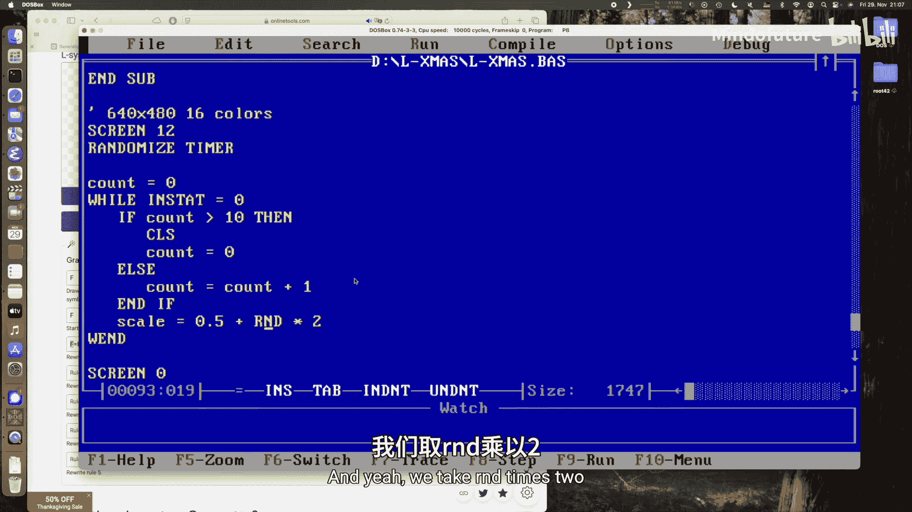

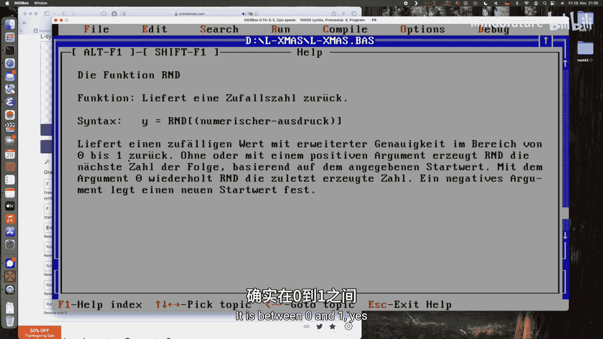

## 主程序与动画循环

所有部件准备就绪后，我们将它们组合到主程序中，创建一个动态的屏幕保护程序效果。

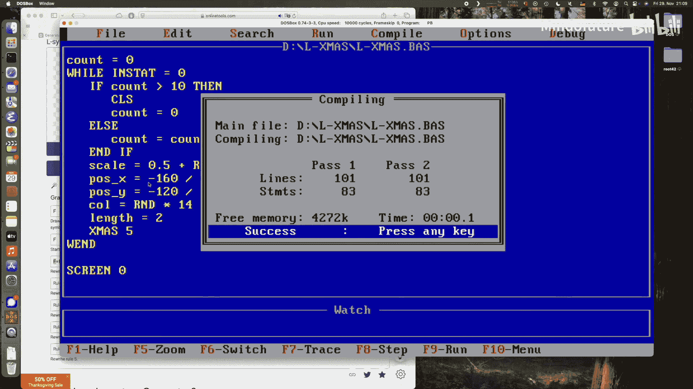

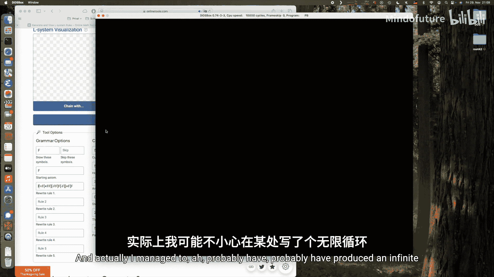

**初始化函数 `Xmas`** 设置初始状态并开始绘制树。
```basic
SUB Xmas (maxiter AS INTEGER)
    angle = 0
    sp = 0
    Turn 90
    F maxiter
END SUB
```

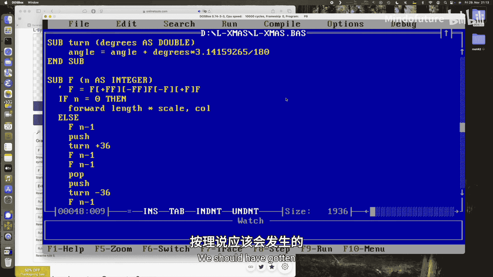

**主程序流程**：
1.  进入VGA图形模式（640x480，16色）。
2.  初始化随机数生成器。
3.  进入一个主循环，直到用户按下任意键。
4.  在循环中，每隔一定帧数清屏。
5.  每次循环，随机生成树的位置、大小、颜色和缩放比例。
6.  调用 `Xmas` 函数（例如设置迭代深度为5）绘制一棵树。
7.  循环继续，绘制无数棵随机变化的树。
8.  退出循环后，切换回文本模式。

关键的主循环部分逻辑如下：
```basic
SCREEN 12
RANDOMIZE TIMER
count = 0
WHILE INKEY$ = ""
    count = count + 1
    IF count > 10 THEN CLS : count = 0
    scale = 0.5 + RND * 2.0
    posx = -160 / scale + RND * 640
    posy = -120 / scale + RND * 480
    co = INT(RND * 14) + 1
    length = 2
    Xmas 5
WEND
SCREEN 0
```

## 总结

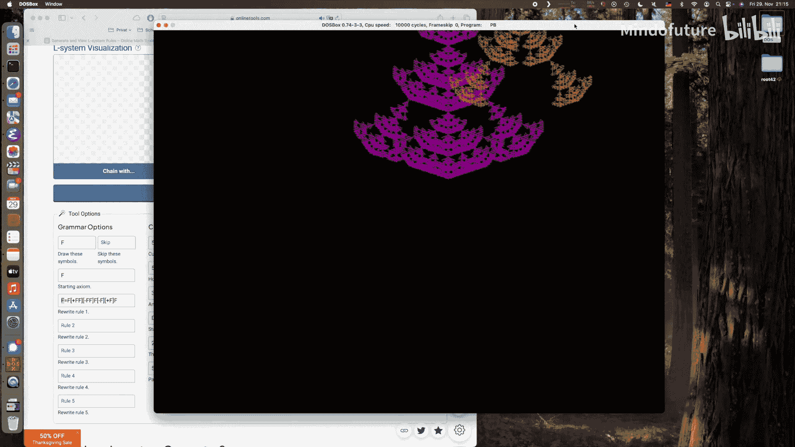

本节课中，我们一起学习了如何在MS-DOS环境下使用PowerBASIC实现一个L系统。我们从定义全局状态变量和栈数据结构开始，逐步实现了状态保存与恢复（PUSH/POP）、线段绘制（Forward）、方向旋转（Turn）等核心功能。接着，我们通过递归函数编码了特定的L系统规则来生成圣诞树分形。最后，我们将所有部分整合到一个主循环中，创建了一个能够持续绘制随机大小、位置和颜色的动态圣诞树林的图形程序。通过这个项目，你不仅接触了分形图形编程，也实践了状态管理和基础图形绘制的概念。