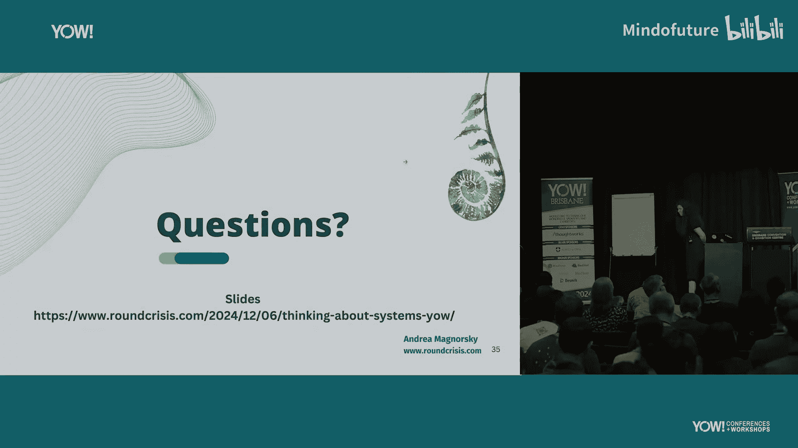

# 001：字节大小架构会话入门 🧩

在本节课中，我们将学习“字节大小架构会话”这一协作工作坊格式。我们将探讨为什么在团队中共享知识如此困难，了解当前常见的知识共享方法及其局限性，并详细学习如何通过一系列简短、聚焦的会话，来构建团队对系统的共同心智模型，从而更有效地设计、理解和演进软件系统。

## 为什么共享知识如此困难？🤔

上一节我们介绍了课程概述，本节中我们来看看阻碍团队有效共享知识的核心挑战。

缺乏共享的心智模型是许多软件项目问题的根源。如果编写软件系统的程序员不清楚系统应该做什么或为什么这样做，后果可能很严重。我们行业有时过于关注“如何”做事，而忽略了“是什么”和“为什么”。

有趣的是，事件风暴的创建者阿尔贝托·布兰多利尼也提出了类似的观点，他指出“我们最大的问题是我们不分享知识”。这印证了知识共享是普遍性难题。

知识共享的困难主要源于两个方面：时间因素和角色差异。

### 时间带来的挑战

以下是随时间变化而产生的知识共享难题：

*   **人员变动**：团队中有新成员加入，需要传授知识；或者掌握关键知识的成员离职，造成知识断层。
*   **跨团队协调**：当需要两个团队协调时，反馈循环已经很大。增加更多团队，协调和知识共享的难度会呈指数级增长。
*   **计划冲突与变更**：业务计划经常变化，而关于变更的知识像波浪一样在团队间传播，无法同时到达每个人，导致信息不同步。

### 角色差异带来的挑战

另一方面，知识共享的困难也与角色有关。不同角色（如程序员、工程经理、设计师、QA）关注的重点不同，这塑造了他们的思维方式。因此，在共享知识时，我们可能无意中遗漏了对其他角色至关重要的信息。即使团队没有正式的头衔，这些角色功能依然存在。

## 我们如何共享知识？📊

上一节我们探讨了知识共享的难点，本节中我们来看看目前常见的知识共享方法及其效果。

我们可以通过一个从“强反馈”到“弱反馈”的频谱来理解不同的知识共享方式。书面形式（如文档）迫使你思考所写的内容，但通常难以获得即时、高质量的反馈。同步交流（如面对面谈话或聊天）能获得更即时的反馈信号。

文档存在一个典型问题：它很难保持良好的反馈循环和及时更新。

“字节大小架构会话”位于这个频谱中“工作坊”的一侧。它是一个工作坊，意味着所有参与者都需要投入工作，而不仅仅是旁观。

## 什么是字节大小架构会话？🎯

上一节我们比较了不同的知识共享方法，本节我们来深入了解“字节大小架构会话”的具体定义和理念。

“字节大小架构会话”是一个工作坊格式。
*   **“字节大小”** 意味着它应该是短小精悍的。
*   **“架构”** 是希望你思考你的系统，而不是令人畏惧的宏大架构。
*   **“会话”** 的复数形式意味着你应该举行一系列小会话，而非一次大型活动。

唐纳德·诺曼在其关于系统的著作中指出：“系统是同时发生的”。不幸的是，它们并非按顺序发生，而我们习惯的交流方式（如语言）却是顺序性的。因此，我们需要工具来帮助理解同时发生的系统。

我们最终的目标是：理解系统当前的状态，并掌握足够的知识以保持其生命力。共享知识对于构建系统至关重要。

## 会话流程详解 🔄

上一节我们定义了字节大小架构会话，本节我们一步步拆解它的具体运行流程。

在运行会话之前需要准备：邀请合适的人员，并确保他们为参与做好了准备（例如，如果他们需要使用C4模型，则需要事先了解C4）。

会话本身（45-60分钟）遵循以下严格计时的流程：

1.  **设定目标**：用几分钟时间共同决定本次会话要做什么（例如：“绘制系统上下文图”）。
2.  **独立协作**：这是会话的核心。所有参与者（建议8-12人）在同一个物理或虚拟空间里，**各自独立地**完成会话目标（例如，各自绘制系统图）。计时器结束后，每人依次简要解释自己的成果。
    *   这个过程迫使你专注并梳理自己的理解。
    *   你会意识到自己遗忘或不确定的地方。
    *   倾听他人时，你能了解不同的思维角度和被你忽略的信息。
3.  **达成共识**：这是耗时最长的部分（约30分钟）。基于从“独立协作”中获得的新视角，**共同协作**，完成同一个会话目标，尝试将所有人的理解整合在一起。
4.  **总结回顾**：在会议最后用几分钟进行简短回顾，总结收获和感受。必须严格遵守计时器，如果未完成，可以留到后续会话中继续。

这种形式的感觉类似于合作式桌面游戏，大家为了解决问题而共同努力，而不是相互竞争。

## 为什么要采用字节大小架构会话？✨

上一节我们走完了会话流程，本节我们总结一下这种方法带来的核心好处。

采用字节大小架构会话能带来多重好处：
*   **构建共识与共同理解**：它帮助团队在对系统的理解上达成一致，这为内省和有效协作奠定了基础。共识意味着找到共同点，不一定总是意见完全统一。
*   **赋能包容性协作**：“独立协作”环节让每个人，包括神经多样性者，都有时间独立思考，这被许多人反馈为最高效的协作体验之一。
*   **催生涌现行为与设计资产**：通过多次会话，团队会创建出一系列公认正确的模型或图表。当需要设计新功能时，可以直接在这些现有资产上构建，新的设计又会反过来丰富资产库，形成良性循环。
*   **在安全环境中培养架构实践**：与其只在高压环境下进行架构讨论（选项A），不如经常性地进行这种轻量级会话（选项B），从而以小步快跑的方式学习如何建模、如何做出好的设计决策。

## 行业案例一：团队 onboarding 🚀

理论需要实践验证。本节我们将通过一个真实案例，看字节大小架构会话如何帮助新成员快速融入。

这是一个英国广播机构的案例。场景是：团队中有一半是新成员，领导希望帮助他们更快上手。

**会前准备**：邀请了在站会中活跃发言的成员（而非仅旁听者）。团队负责人负责提前教会他们C4模型。

**会话过程**：
1.  **目标**：在线协作绘制系统的C4上下文图。
2.  **独立协作**：设置3分钟计时，每人独立绘制。下图展示了参与者各自绘制的、差异显著的图表（模糊处理），这直观揭示了每个人对系统的不同理解。
    
3.  **共识**：团队共同绘制了一部分系统图，并在计时结束时意犹未尽。
4.  **总结**：团队反馈他们“学到了很多”，具体指通过这个过程，他们发现了许多具体而重要的问题，从而能够开启正确的对话。

## 行业案例二：多团队复杂协作 🏗️

单个团队的案例展示了基础价值，本节我们看一个更复杂的场景：如何协调三个团队对齐一个复杂问题及其解决方案。

这是一个为英国电视频道改进视频管道的项目。计划是通过几轮会话：首先弄清现状，然后设计理想方案，最后决定实际实施方案。

**第一轮会话：理解现状**
*   **目标**：绘制三个团队当前交互的系统上下文图。
*   **成果**：图表显示系统交互相当复杂。一个关键发现是：每个团队成员能清晰描述自己团队与相邻团队的交互，但对更远端的交互则很模糊。这引发了非常具体的问题（例如：“团队1的这个黄色组件是如何与团队3交互的？”），而非泛泛而谈。

**第二轮会话：探索理想方案**
*   **目标**：为改进管道寻找理想解决方案。
*   **过程**：在“共识”环节，一些成员提出了看似“疯狂”的想法。这些想法反而为讨论创造了空间，让团队意识到他们可以就一个虽然不是最理想但切实可行的方案达成一致。
*   **后续**：会话后，团队基于共识绘制了更详细的图表（如序列图），并明确了具体的技术细节（如契约格式）。

这个完整案例的细节被收录在尼克·滕的著作《协作软件设计》第17章中。

## 成功实施的关键与总结 🗝️

上一节我们看到了字节大小架构会话的强大应用，本节我们来探讨成功运行它的前提条件，并总结全课。

如果你打算尝试字节大小架构会话，有两件事至关重要：
1.  **心理安全**：如果团队成员感到不安全，害怕暴露无知或受到评判，会话效果将大打折扣。需要首先营造安全的交流氛围。
2.  **成长心态与好奇心**：如果参与者抱着“我没什么可学”的心态而来，那么他很可能一无所获。需要保持好奇和学习的心态。

**总结与核心收获**：
*   知识共享是系统构建的基石。
*   你可以利用多样化的工具（如字节大小架构会话）来实现有效且高效的知识共享。
*   一个系统不是其各部分的总和，而是各部分之间**相互作用**的总和。而我们人与人之间的沟通，正是这些相互作用中至关重要的一环。

最后，尝试运行一次字节大小架构会话吧！更多详细指南可访问 [bytesizearchitecturesessions.com](https://bytesizearchitecturesessions.com)。

---
本节课中我们一起学习了“字节大小架构会话”这一协作工作坊。我们从知识共享的挑战出发，了解了该会话的流程、价值，并通过两个案例看到了它在促进团队共识、解决复杂问题上的实际效果。记住，构建对系统的共同理解，是打造优秀软件的第一步。