# 002：简约之美——打造自己的技术

在本节课中，我们将探讨在软件开发中，尤其是在构建自己的技术栈时，保持简约的重要性。我们将分析选择现有解决方案与自主构建的利弊，并学习如何利用开源组件作为“构建块”来打造更贴合自身需求、更高效的产品。

## 开场与个人介绍

大家好，欢迎来到本次分享。

我想先问大家一个问题：当你们在开发技术或编程时，是否曾想过“这进展得很顺利，但我真希望它能更复杂一点”？希望没有。我们或许都认同，简约即便不一定优于复杂，但至少更可取。我们喜欢保持事物的简单。

这正是我们今天要讨论的主题：简约之美——打造自己的技术。

今天我想谈谈，为何很多时候我们被迫选择现有解决方案，而非自主构建。以及，如果你选择自主构建技术，简约如何成为这一核心流程的关键。

简单介绍一下我自己。大家好，我叫 Janan，感谢大家来听我的演讲，也感谢 YOWcon 的邀请。这是我第一年参加，非常高兴能在这里。

有些人可能通过我的 YouTube 频道 “Chno” 认识我。我在那里制作教育类编程视频，分享我正在进行的项目，还有一个代码审查系列，我会查看并点评他人提交的代码。我最出名的可能是一个教授 C++ 的系列视频。

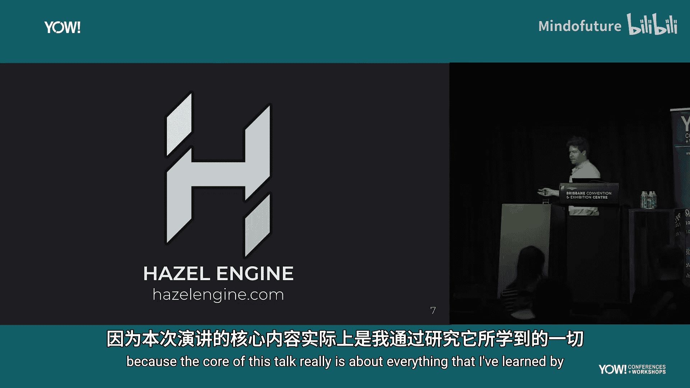

在成为“网络人士”之前，我有一份正式工作，曾在 EA 担任软件工程师，从事游戏引擎开发。游戏引擎是构建游戏的平台，既包括开发者使用的工具，也包括游戏在用户设备上运行的“运行时”部分。

我曾参与开发 EA 的主要移动游戏引擎 Assiris，后来团队转向 Frostbite，成为 Frostbite 墨尔本分部。2019年我离开了 EA，部分原因是转向 Frostbite 后，事情开始变得复杂。在大型组织和产品中工作，流程驱动性强，代码库的变更非常缓慢。

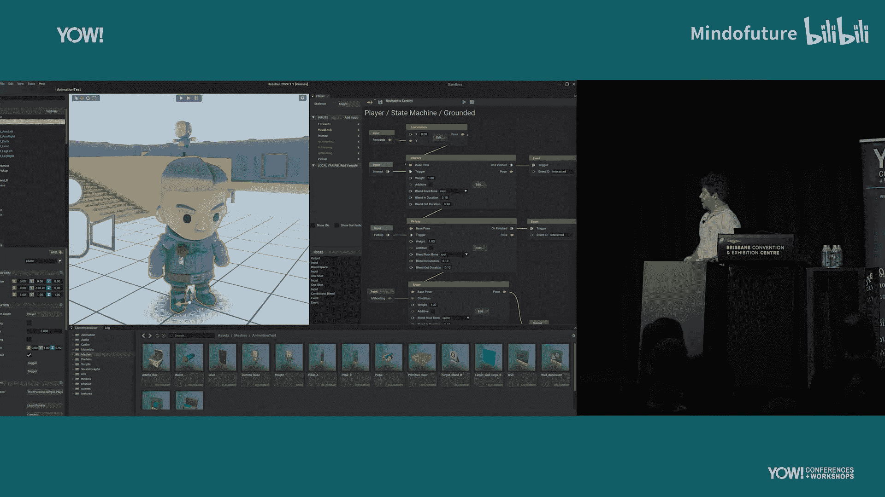

我20岁大学毕业后就加入了EA，很想花时间消化这段“深水区”经历中学到的一切，并尝试构建自己的游戏引擎，以便透彻理解所有环节。当时我的 YouTube 频道发展得不错，所以我决定离开，全职制作视频并构建名为 Hazel 的引擎。

## Hazel 游戏引擎项目

接下来我想谈谈 Hazel，因为本次演讲的核心正是我在开发这个引擎过程中学到的一切。

Hazel 是一个 3D 游戏引擎，上图是它的界面。大约五年前我开始开发它，最初是独自进行。但由于我制作了相关的 YouTube 视频，形成了一个社区，开始有志愿者对特定系统感兴趣并参与开发。团队最多时包括我在内大约有8人，我还雇佣了一些成员。这就是我们打造的成果。

我们仍在持续开发。构建游戏引擎很像艺术创作，它永远不会真正“完成”，总有新功能可以添加，新技术不断涌现，所以这是一个永无止境的过程。

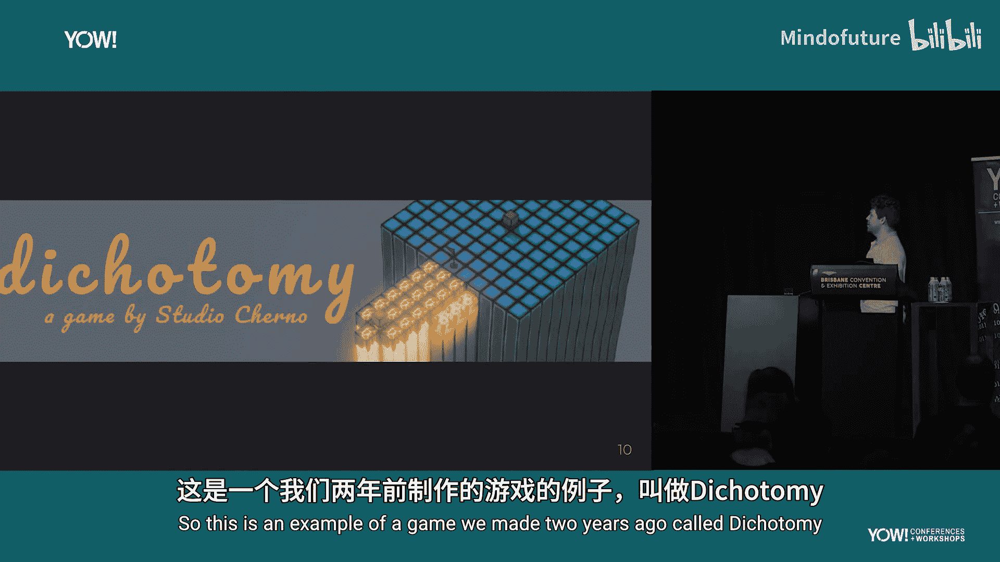

当我提到我在构建自己的游戏引擎时，最常被问到的问题是：**为什么？游戏引擎不是已经存在了吗？这难道不是很困难吗？**

我可以花40分钟来回答这个问题，但这里尽量简短说明。首先，我从小就非常喜欢游戏引擎。玩游戏时，我对背后的技术比游戏本身更感兴趣。我认为这是一个很酷的技术挑战，因为游戏引擎是众多必须协同工作的不同系统的集合。无论你对 AI、渲染还是音频感兴趣，它都涵盖其中，并且必须在这样一个庞大的系统中协同工作。

加上严格的性能约束以及需要在多种不同硬件上运行的要求，使得解决这个问题非常酷。其次，我也想把它作为我教育视频的素材。在教授 C++ 时，有一个真实世界的例子来说明为何要这样做，比仅仅展示几行代码更有说服力。最后，我最终希望用它来制作游戏。虽然这不是主要目标，但游戏对我而言如同艺术品，而技术是艺术的一部分。因此，用我自己的技术制作游戏，就像是我的艺术创作方法。

我们确实制作过一些游戏。例如两年前，我们为一次 Game Jam 用三天时间制作了一款名为《Dichotomy》的小游戏。这是一款解谜游戏，你需要在蓝色沙盒中规划一系列动作，然后这些动作会在“真实世界”中重演。

我特别提到这个游戏，是因为它是一个重要的里程碑。在此之前，我们开发引擎时并没有明确的完成预期或必须达到能制作游戏的状态。没有投资者给我们设定截止日期，这只是我们出于兴趣在做的事情。它很好地服务于我的 YouTube 内容，并帮助我教授 C++ 和游戏引擎知识。

但有一天早上醒来，我突然意识到，只要完成某些特定工作，我就可以用它来制作并发布一款游戏了。所有必需的部件都已就位。这对我来说是个惊喜。我将其比作跑马拉松（虽然我没跑过）。马拉松看起来令人生畏，距离很长。但只要你一直向前，不总盯着终点线，朝着正确方向前进，你就在接近目标。终有一天，你会抬头看到终点线。

现在，我已经走过了那段路，打造出了能够实现其目的的技术，我可以反思：**这一切真的像我想象的那么难吗？**

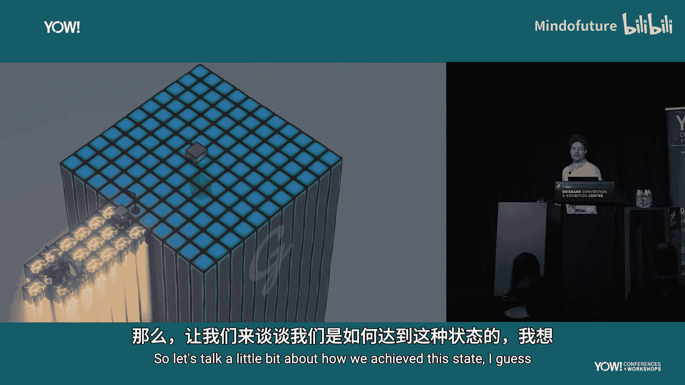

我希望大家也能思考一下，当你完成某个项目后，回过头看，它真的有那么难吗？

## 如何实现目标：简约与取舍

那么，我们来谈谈我们是如何达到能够制作想要的东西的状态的。首先，技术必须**简约**，这不是一个选择，而是必须。因为你必须在相当严重的限制下工作，并且必须做出**牺牲**，意味着你无法打造一个无所不能的东西，必须坚持特定的路径。

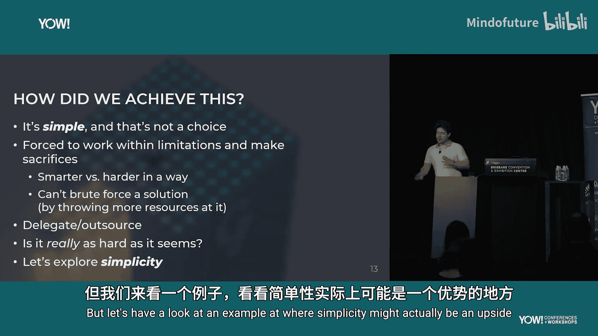

这有点像既要聪明地工作，也要努力地工作。你不能只靠蛮力投入更多资源来解决问题，因为你没有那么多资源可以投入。

**委派和外包**也是其中重要的一部分，我们稍后会重点讨论。此外，你必须不断问自己：**这真的像看起来那么难吗？** 我能否用一种简单的方式来完成？也许这样就足够了。我认为人类天生就有把事情复杂化的倾向。

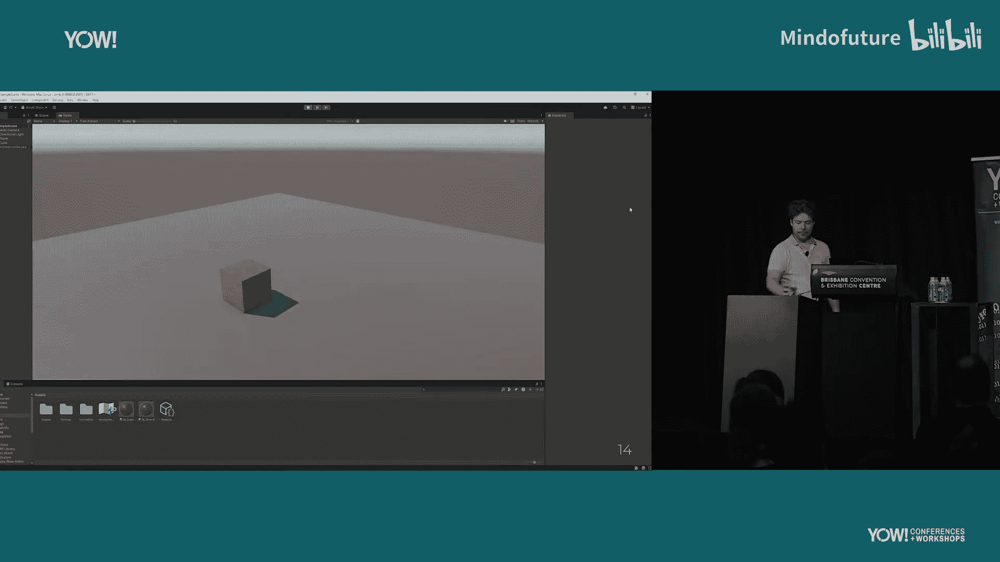

我想深入探讨“简约”这个概念，因为很多人可能认为简约是缺点，或者功能不全。但让我们看一个例子，看看简约如何成为优点。

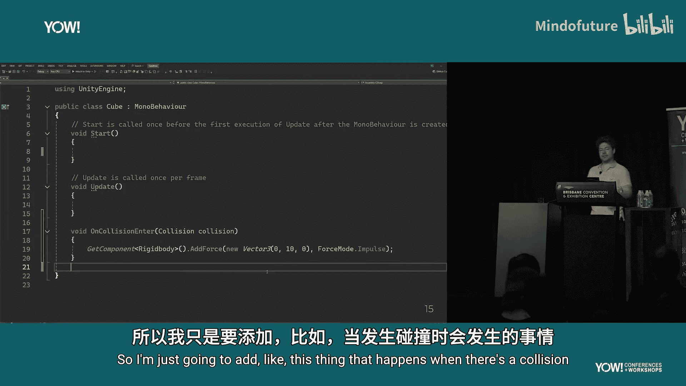

## 简约的优势：以 Unity 为例

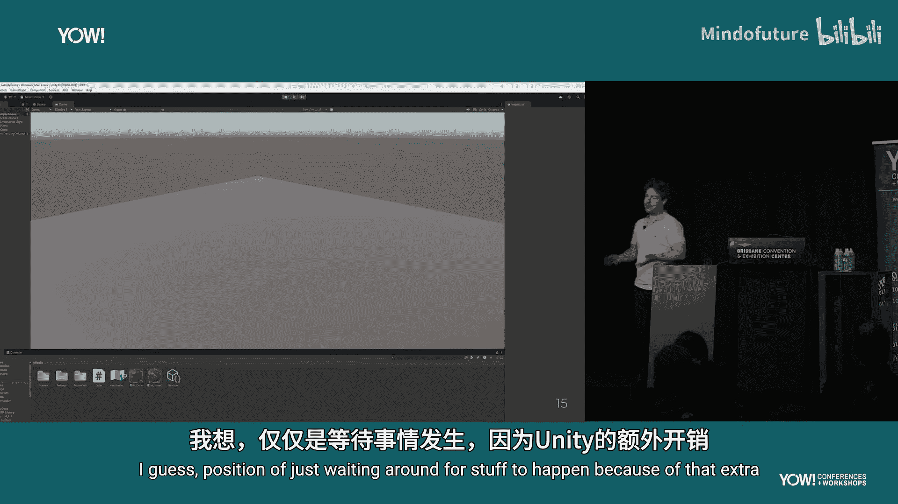

以 Unity 游戏引擎为例。这里有一个非常简单的场景，只有一个带有物理属性的立方体。请大家注意，当我点击播放按钮后，场景需要多长时间才能开始运行。

这是一个超级简单的场景，点击播放。我再操作一次，以证明这不是首次运行的延迟。这是上周下载的最新版 Unity。

现在，我们添加一些 C# 脚本行为，比如在发生碰撞时添加一个冲力。我需要返回编辑模式，Unity 需要编译和处理脚本，这需要一些时间，然后我才能点击播放。我发现自己陷入了等待，因为 Unity 的额外开销和复杂性。

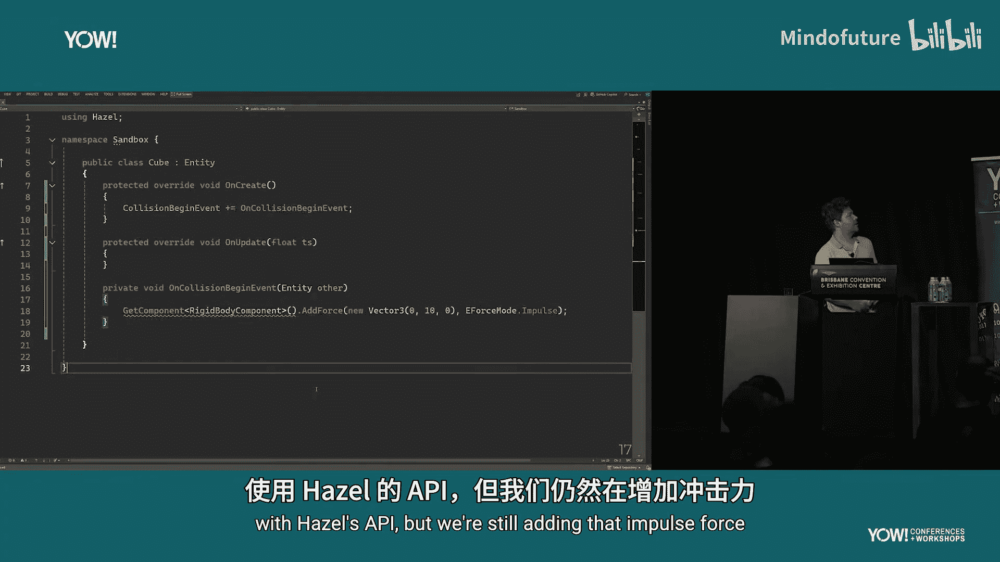

对于我正在解决的这个小问题，我因为 Unity 而受到了影响。那么，对于这个小问题，Unity 是一个好的解决方案吗？

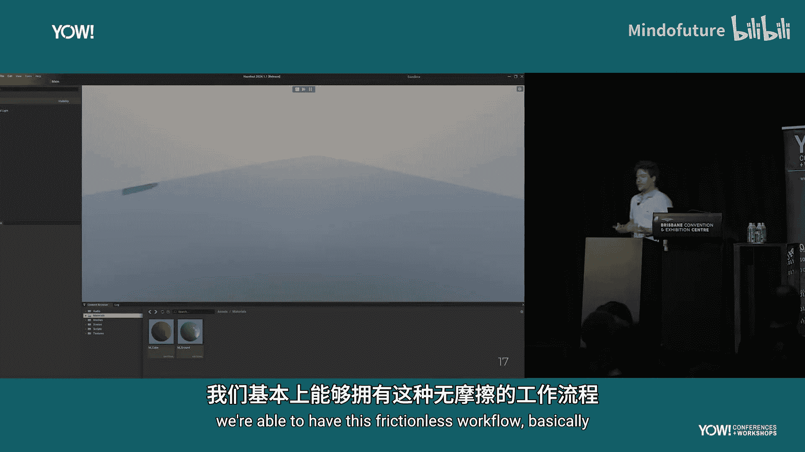

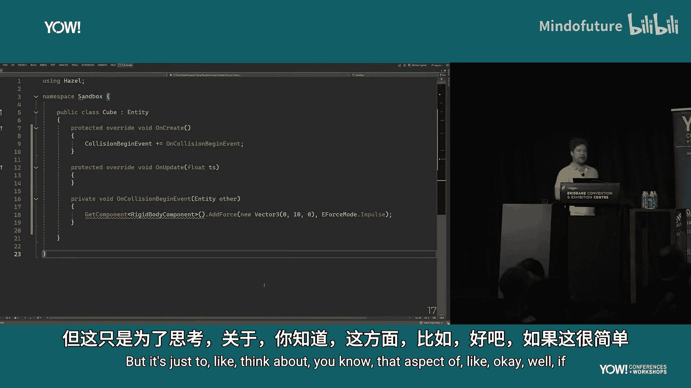

让我们看看一个更简单的例子。这是 Hazel，完全相同的场景。当我点击播放时，请大家计时，看看需要多长时间场景才开始运行。

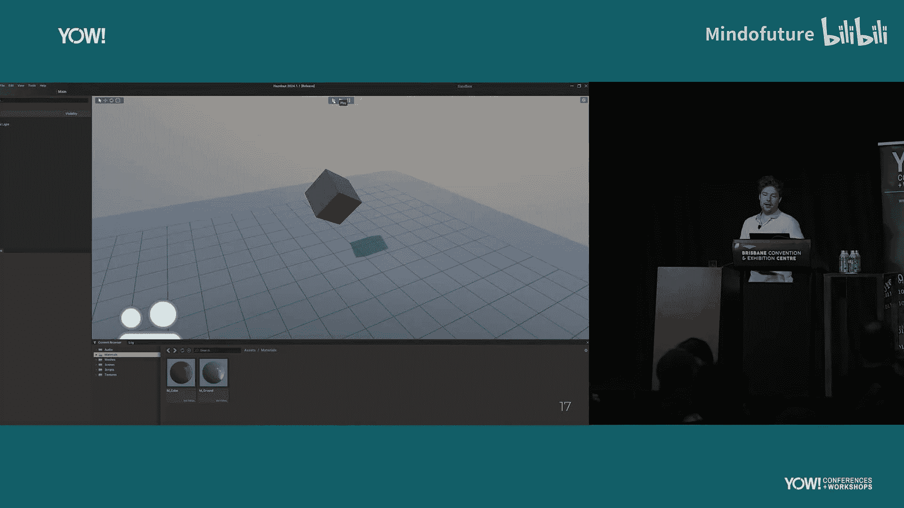

相当快。如果我们做同样的事情，用 C# 添加一些行为（虽然 API 略有不同，但同样是添加冲力），首先通过 Visual Studio 编译，根据日志显示耗时 0.7 秒。当我切换回 Hazel 时，它已经重新加载了 C# DLL，我可以直接运行所有内容。

可以看到，因为 Hazel 更加简约，我们能够实现这种近乎无摩擦的工作流程。当然，我们并非试图与 Unity 竞争。Unity 功能多得多，能解决的问题也远超 Hazel。

但这里想让大家思考的是：**如果技术简约，这可能实际上是一种优势。**

那么，对于这个特定问题，Hazel 是比 Unity 更好的解决方案吗？我可能会说是。然而，你必须考虑成本。如果你花了五年时间和一千万美元来构建这个东西，那么也许你愿意等待 Unity 几秒钟，并支付几千美元的许可费。

## 现有解决方案 vs. 自主构建

今天接下来要讨论的概述，基本上就是选择现有解决方案与使用这些“构建块”自主构建的概念。

首先，我想谈谈我们为何使用现有解决方案，以及它们是什么。现有解决方案就像一个现成的产品，它能解决你的问题。游戏引擎就是“制作游戏”这个问题的现有解决方案。但这适用于任何行业和领域。例如，如果你是 Web 开发者，客户需要一个动态网站，支持登录、发帖、上传图片，WordPress 可能就是他们问题的现有解决方案。

在接下来的讨论中，我将继续以游戏引擎为例，因为这是我的领域。但希望大家能将其转化到自己的行业和领域，道理应该是相通的。

我认为这很大程度上归结为商业决策。作为工程师，如果被赋予解决问题的任务，我们可能更倾向于自己构建解决方案，因为我们可以做得更好。但当然，我们生活在现实世界，必须受预算或时间框架的约束。因此，选择现有解决方案在这方面会更容易。

让我们以虚幻引擎（Unreal Engine）作为现有解决方案的例子，看看其好处。首先，成本是多少？虚幻引擎收取超过100万美元后总收入的5%。我们能与之竞争吗？虚幻引擎始于1998年，此后由数千人开发。它经过尝试和测试，许多游戏和作品都在各种设备上用它发布。此外，它还包括未来的维护，你支付的许可费包含了后续开发、更新和错误修复。

还有隐藏成本，比如现有技能。因为它已经存在了26年并且公开，在就业市场上有许多人知道如何使用它。这意味着如果你需要招聘，可以找到已经准备好使用它的人。相比之下，在 EA 的 Frostbite（内部引擎）工作时，除非新员工以前在 EA 工作过，否则他们不知道如何使用，我们需要花费大约六个月的时间培训他们。这是选择现有解决方案的另一个好处。你实际上是将这部分工作外包给了第三方。

那么，如果我们不想外包，自己做需要多少钱？答案是：无限多的钱。因为你需要一个时光机回到1998年开始构建。所以看起来选择现有方案是必然的。

但现有解决方案也有其问题。它们也是商业实体，目标与你不同。它们制造产品，希望成功，因此会尽可能吸引更多客户，撒下一张“大网”。它们的产品号称适合所有人，但这可能导致复杂且不必要的软件。例如，你可能在制作一款2D PC游戏，但虚幻引擎能制作3D Android手机上的第一人称射击游戏，这完全不同。所有这些为不同场景设计的管道都必须共存于你的项目中，这对你毫无益处，甚至可能导致产品运行更慢。

此外，这些现有解决方案通常是“黑盒”（尽管虚幻引擎是源码可用的，这很好）。但很多时候你得不到源代码，只有二进制文件。这意味着如果存在 Bug，或者你需要支持另一个平台、架构或 API，你只能依赖他们为你做。这就产生了强烈的依赖性。

以 Unity 为例。大约一年前，Unity 试图引入“运行时费用”（Runtime Fee），即按游戏安装次数向开发者收费，这引起了公愤。他们后来收回了这个决定。但你不必看一年前，上周 Reddit 上就有一个例子：一家独立游戏工作室在 Steam 上发布了游戏，但他们的 Unity 账户被暂停了，合规团队说两个月后才能查看。他们因此无法访问自己制作的产品，这很疯狂。有人评论说：“这就是依赖单一供应商的风险。”

我喜欢这样总结这种情况：**“你租用的工具成了你房东的工具。”** 这确实是所有依赖关系的问题。当然，我认为人们并非主动选择依赖第三方，而是由于商业决策或时间限制，最终变成了这样。

## 自主构建：从“构建块”开始

因此，我希望大家考虑这个概念：**如果你可以从头开始构建自己的定制解决方案，会不会更好？** 答案可能是否定的，这完全可以。但让我们探索一下这个概念。

首先，“从头开始”是什么意思？自己生火？自己造 CPU？人们通常认为“从头开始”是一项不可能的任务，并常常以此开玩笑：“你要从头开始？难道还要自己写操作系统吗？”

但在本次演讲的语境中，“从头开始”是什么意思？我将通过一系列笑话来解释。

有人知道这是什么吗？我喜欢你们中这么多人真的说出来了（墨尔本的观众很安静，我还以为你们不知道）。我称之为“现代软件开发”。

这是我们的代码。而这些是库或框架。我在维基百科上找到了这张图。基本上，这边的小文件柜就像一个库，是一堆代码、子程序的集合。这些磁带，据我理解，她正在通过中间的机器读取，然后抄写到自己的程序中。这是在50年代，她实际上是从库中复制代码。所以，没什么变化。

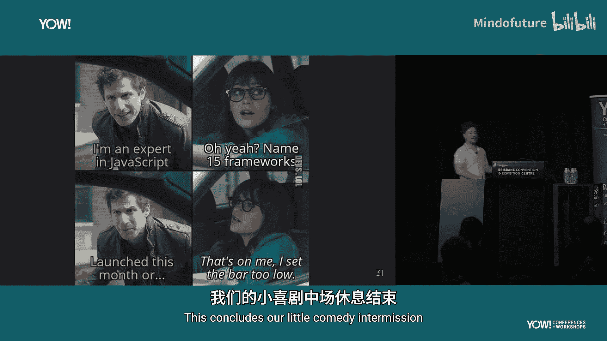

这里有 Web 开发者吗？你们可能对框架和库很熟悉。好了，Web 开发者的笑话到此结束。

有人听说过 GitHub 吗？事实证明，GitHub 上有大量代码。有多少？2024年，开发者对超过5亿个开源项目做出了超过50亿次贡献。这意味着什么？我们被代码淹没了。

那么，“从头开始”在这里是什么意思？我的意思是，**不要选择我们需要的那个确切产品（解决方案），而是选择构成那个产品的一切下层组件。** 我们可以自由选择所有这些。以虚幻引擎为例，在其代码仓库的第三方文件夹中，你可以看到许多目录，其中大部分是第三方库。对于一个非游戏引擎的例子，比如 iOS 上的 Google Drive，在“帮助-关于”里，你可以看到所有使用的开源许可。当然，任何开发者都知道，我们依赖如此多的开源软件和库。

但我也想指出，如今这些不仅仅是支持库（如压缩库、数据结构或任务系统），还包括**完整的系统**。

如果我们分解虚幻引擎，它由许多不同的系统组成。我随机挑选了这四个。这些系统本身又由其他系统组成，例如渲染可能有渲染硬件接口层。它们还会有许多支持库。所以，**为什么我们不直接选择这些“系统”作为构建块呢？** 它们是构成我们应用程序的基础。

我想聚焦于这一层。对我们来说，其中大部分将是库和开源代码，因为现在有海量的开源代码和知识。即使是在20年前，问“如何渲染3D图形”，你今天得到的答案也会全面得多。不仅有互联网上的资源，相关行业的研究也发展得非常深入。

再次强调，GitHub 上不仅有支持库，还有**完整的系统和中间件**。其中很多在过去是付费、许可或黑盒的。以我所在的行业为例，NVIDIA GameWorks。他们有一系列 SDK，可以提升游戏的图形效果。过去他们只提供 DLL，你只需将其插入管线，图形就会变得更好。但现在，NVIDIA GameWorks 在 GitHub 上是开源的，采用 MIT 许可证，所有 C++ 代码和着色器都在那里。时代真的变了。

这允许你将构建自己技术所需的许多系统和组件进行委派和外包，我认为这在某种程度上是新的趋势，并且越来越流行。当然，因为它是开源的，它实际上能增加你团队的资源，就像你自己完成了一样，因为你得到了相同的结果。

它还允许你**交叉维护**你的技术。这是好是坏，你可以自行判断。我的意思是，如果某个东西在 GitHub 上是公开的，人们在使用它，他们可能会贡献代码、提交拉取请求、进行测试。他们可能在不同的产品中使用它，做的测试比你内部团队能做的多得多。

未来的维护也是如此。即使原作者消失了，如果有足够多的人在使用那个库，他们就会有维护它的兴趣，并且通常具备专业知识。当然，GitHub 上代码质量参差不齐，但像 NVIDIA 这样的公司发布开源软件，EA、微软等许多公司也在 GitHub 上有库。这不仅仅是学生上传代码，实际上有很多高质量的东西。与自己开发相比，这可能是更好的选择。

因此，我将其视为与选择现有解决方案类似，但**粒度更细**。你可以在技术决策上做出更精细的选择，我们稍后会看一个真实世界的例子。

所以，请思考：与其选择确切的解决方案，不如考虑选择构成该解决方案的“构建块”。当然，如果它们是开源的，就不会是黑盒，这意味着它们**可修改、可扩展**。

但你也必须记住，尽管如此，你仍然需要构建实际的产品。你不仅仅是把这些库粘在一起。你构建的实际产品位于这些库之上，而这些库只是将那些底层系统外包出去。

## 真实案例：Hazel 的构建块演变

让我们看一个真实例子，看看我所说的使用这些“构建块”是什么意思。

Hazel 也由许多不同的系统组成。这里有8个作为例子。如果我们看看2021年这些构建块是什么样子：我们有一些系统，因为我们有资源，并且团队成员有兴趣自己编写，所以它们是定制的（图中蓝色部分）。然后你可以看到绿色的部分，我们将其外包给了第三方库。当时网络系统还不存在。

随着时间的推移，随着需求的变化，情况也发生了变化。如果我们快进到今天，它看起来像这样。我用红色高亮了变化的部分。例如，对于骨骼动画，我们决定需要比之前更强大、更定制化的东西，所以我们编写了自定义方案。脚本方面，我们从 Mono 转向了基于 .NET Core 的自定义 C# 脚本引擎。网络方面，我们采用了 Valve 的 GameNetworkingSockets 库。物理方面，我们从 NVIDIA PhysX 转向了 Jolt，因为它更符合我们的需求。

这样，我们就能够审视并决定：解决方案中我不喜欢的部分，我可以直接更换那些构建块。一切都是模块化的，我可以进去改变它。而如果我们选择了一个像 Unity 那样的现有解决方案，如果它不适合，我们就必须完全转向，这可能更具灾难性，且更不可定制。

这就是我所说的“我们可以做出更精细的技术决策”的含义。与其选择确切的解决方案，我们可以选择构成它的构建块。这也允许我们将资源集中在需要的地方，以产生更具体的解决方案。

再深入一点。假设我们正在构建一个应用，我们不太关心其网络、UI 或音频部分。那没问题，我们可以将这些外包给第三方库。但也许我们应用的独特之处在于它在渲染方面做了些独特的事情。那么，我们可以再次不担心其他部分，而是将所有资源集中在那部分渲染上，构建一个完全符合我们需求的、很可能比现有解决方案更优化的定制方案。

当然，拥有所有这些构建块会带来更模块化的软件架构方法，我认为这非常好。构建块可以被替换（正如我们展示的），但产品本身更难替换。我认为在2024年，用这些外包给第三方库的构建块来制作东西，比你想象的要容易得多。

## 决策过程：是否外包一个构建块？

让我们看一个正在决定是否要外包某个构建块的例子。这正是 Hazel 目前正在经历的事情。

Hazel 过去使用 OpenGL 和 Vulkan 作为渲染 API。后来我们决定放弃 OpenGL，因为我们想拥抱下一代图形技术，而 OpenGL 不太适合。所以我们只用了 Vulkan。但现在，DirectX 11 特别是 12 变得很有吸引力。也许我们想在 Xbox 上发布，或者只是想要一个更原生支持 Windows 的 API。

那么，如果我们自己添加这个支持，工程成本是多少？维护成本呢？因为这不仅仅是“我要构建这个东西，然后就完成了”。如果你熟悉渲染就知道，总有新东西在开发，新版本在增加，API 在不断增长。你必须维护它。以前在某个 API 版本中可行的做法，可能在下一个版本中变成验证错误。你需要在产品的整个生命周期内支付维护成本。

那么，替代方案是什么？对于这个具体问题，NVIDIA 有一个方案：NVIDIA 的渲染硬件接口层，它抽象了所有这些 API，支持 Vulkan、DirectX 11 和 12，还有很多额外功能。我想指出，这是 NVIDIA 制作的库，不是 GitHub 上的某个随机开发者。NVIDIA 是制造这些 Vulkan 和 DirectX API 所编程的硬件的公司。显然，他们知道自己在做什么。维护方面，他们也会了解正在为其驱动程序添加和开发的新功能。所以看起来非常完美。

但真的完美吗？不。因为它不支持 Metal（苹果的渲染 API）。也许我们想为 PlayStation 制作游戏，那就需要索尼的渲染 API。所以它并不支持一切。但是，它是开源的，采用 MIT 许可证。所以至少，它是一个极好的起点。你可以基于已有的代码和抽象层，添加对其他后端（如 Metal）的支持，这比完全从零开始设计要容易得多。

## 构建实际产品

好了，我们讨论了构建块。现在谈谈如何在这些构建块之上构建实际产品。这是否意味着构建产品很容易，因为大部分工作已经完成了？不，因为我们仍然需要构建产品本身。构建块只是提供了周围的一切，而不是产品本身。

现在谈谈这个“90% vs 100%”的概念。对于你的特定产品，你可能会发现 90% 的工作确实是这些第三方库，你只需要完成最后 10% 来实现你想要的功能。这看起来不多。但如果你将这 10% 与选择现有解决方案时那“不属于你的 10%”相比，这最后的 10% 可能非常关键。这里存在一种平衡：这 10% 要足够小，以便在现实的时间框架内实现；又要足够大，以便你能精确地定制它以满足需求，并希望保持其优化和精简，这很重要。

当然，良好的技术决策对此也至关重要。你需要评估所有你打算外包的东西，查看这些库，运行一些测试，也许咨询他人，看看它们是否适合你。即使不适合，也不一定是灾难性的，正如我们所见，我们可以转向、根据实际经验更换它们。这也是这种方法的一个好处，你可以根据需要调整和更改它们。

关于构建实际产品，我喜欢将其归结为**数据转换**。我们有一些格式的数据输入，然后我们的代码（这个小小的转换块）对它做一些处理，然后输出不同格式的数据。我认为记住这一点很重要，尤其是当我们试图把事情复杂化时。本质上，我们只是需要一些代码来进行一点转换。

我认为这也有助于我们清晰地定义管道和工作流。正如我提到的，我们不能制作一个超级通用、适合一切的东西。相反，我们应该专注于：“在我的解决方案中，这就是我们做这件事的方式。” 如果有人想用不同的方式做，很遗憾，这就是规则。这允许你专注于解决核心问题，因为所有相邻的部分都可以委派出去。如果你在音频方面不需要专门的解决方案，可以直接使用现有系统。

另外，始终将 **MVP（最小可行产品）** 放在心中，因为这确实有助于保持事物的简约。为了说明这一点，我上周编了一个词叫 **VSDD**。

**垂直切片驱动开发**。告诉你的朋友们，我想让它流行起来。垂直切片是指，当你有某个里程碑或截止日期时，强调展示项目所有组成部分的进展。你不是只在一个部分工作，而是确保项目的所有领域都在运作。

这让你能够审视从开始到结束的完整管道，看看它做了什么，然后根据需要回去改进。你负担不起钻得太深。我也喜欢将其比作“广度优先编程”而不是“深度优先”。不要在某些事情上钻得太深，让我们先保持简单，让一切运转起来。当然，之后我们可以在必要时增加复杂性。

因此，当你试图自己制作东西时，简约对于生存显然至关重要，保持这种状态非常重要。

## 关于优化

那么优化呢？很多人可能认为优化会增加很多复杂性。原本简单的东西可能需要变得更复杂，因为它们必须非常快。

但我发现，事实证明**计算机很快**。我认为我们习惯了使用那些开销巨大、功能繁多的现有解决方案。当我们自己编写简单、只做我们需要的事情的代码时，它通常就真的很快了。当然，这里有个巨大的星号：并非所有情况都如此，有很多需要考虑的例外。但结果证明，为了达到“足够快”而需要做的优化工作，远比我最初想象的要少。

## 总结与建议

那么，作为结论，你应该做什么？你应该构建自己的技术吗？我不知道，因为我不了解你的具体情况。但我希望你们记住，这是一个非常重要的收获：**让简约成为你设计的核心**。认真思考制作简单东西的重要性。

**一定要考虑定制解决方案**。但关键是，例如，我在 EA 从事游戏引擎工作，因此对我来说，制作自己的游戏引擎是有道理的，这是我熟悉的领域。如果你想在一个从未涉足的领域构建定制解决方案，那条路可能看起来非常不同。

再次强调，VSDD，试着让它流行起来。考虑垂直切片驱动开发。确保你始终关注全局，而不是只专注于一件事。我认为许多在大公司工作的人可能习惯了只负责产品的某个方面，甚至可能不理解一切是如何协同工作的。我鼓励你们中的一些人辞职，尝试自己构建整个产品。别告诉你的老板。

在进行 VSDD 时，**缓慢而谨慎地增加复杂性**。要意识到：“我正在给这部分增加复杂性。这真的必要吗？也许我可以用其他方式来做。”

最后，我想留给大家一句话：
> **“只有困难的事情才值得做。如果你做的事情不困难，重新思考你在做什么。”**

谢谢大家。

👏 问答环节。

