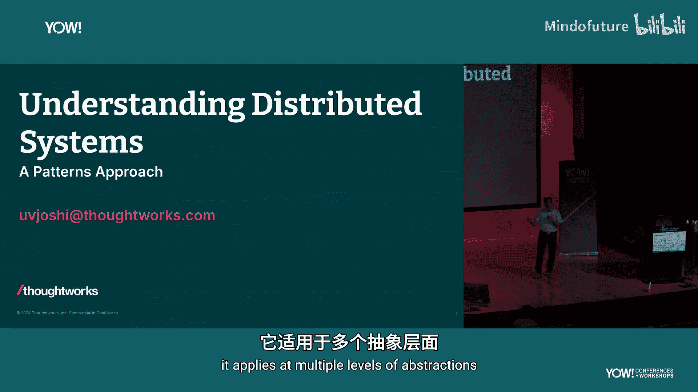
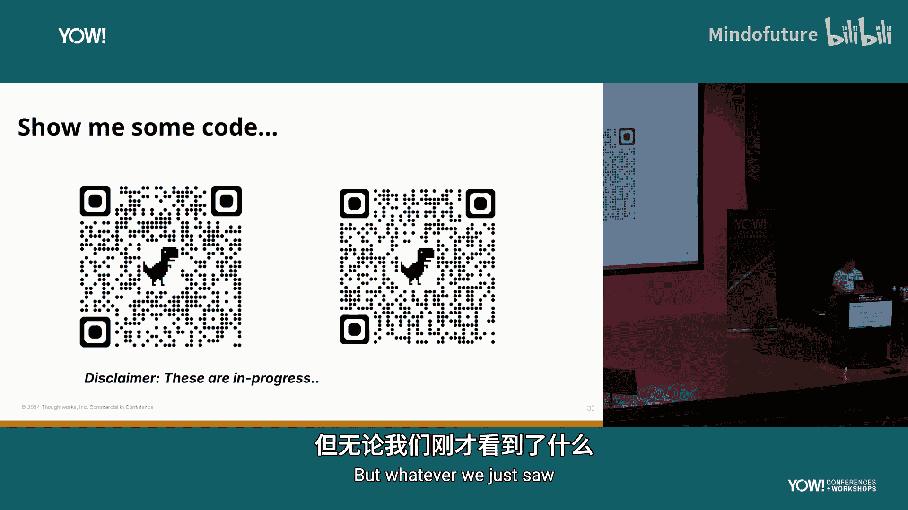
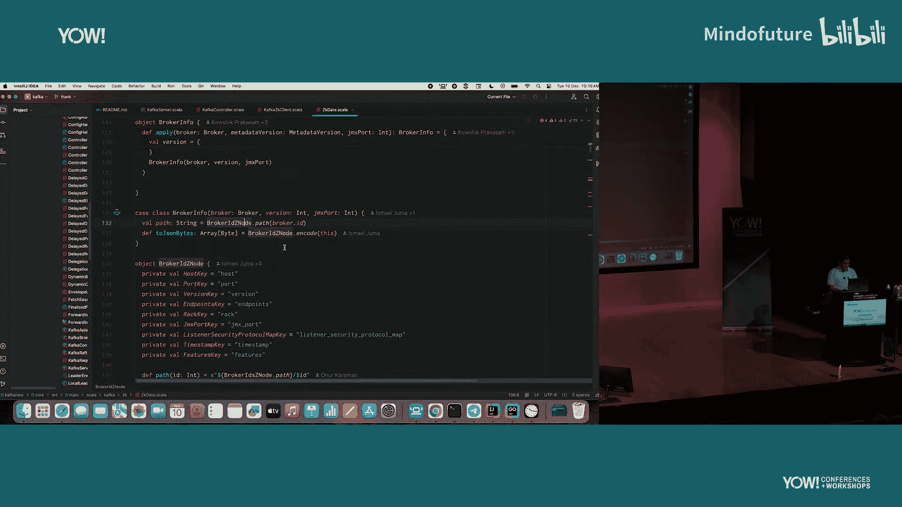
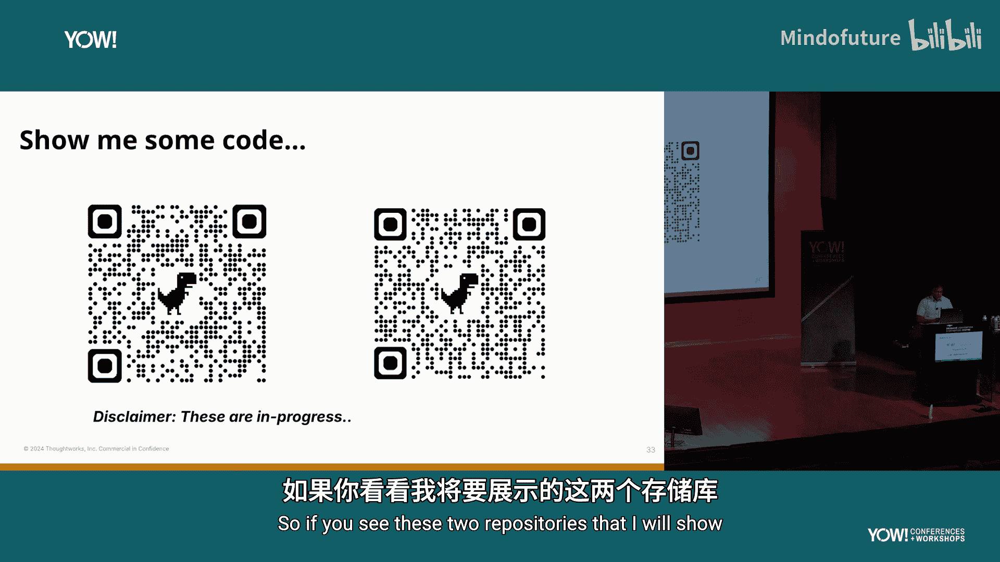
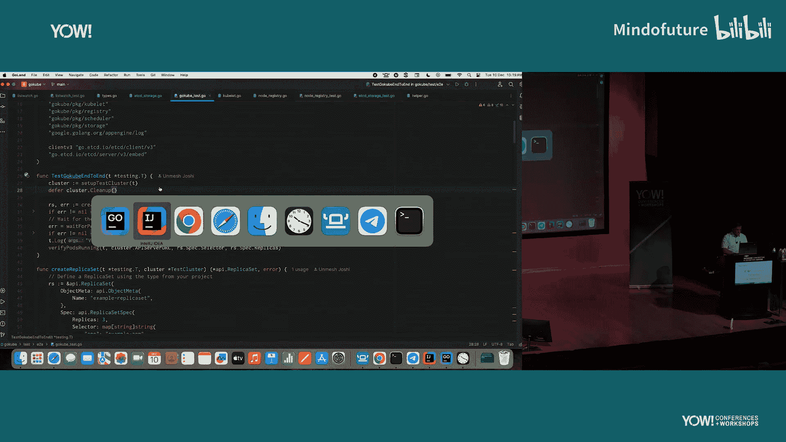
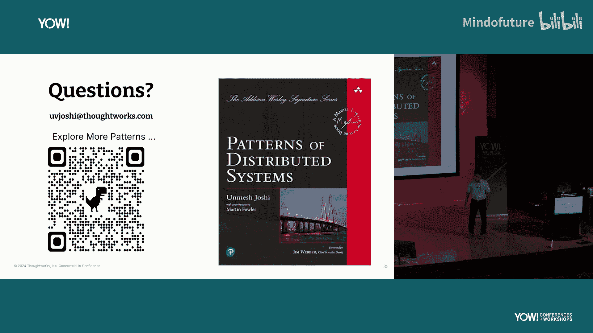
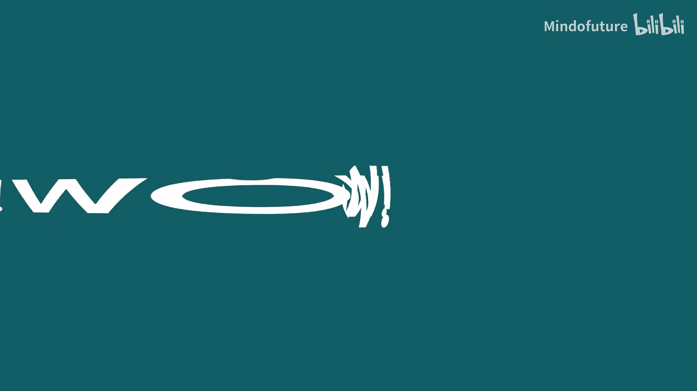

# 003：理解分布式架构的模式方法

在本节课中，我们将学习如何通过“模式”的方法来理解和描述分布式系统。我们将探讨为什么模式是理解像Kafka、Kubernetes这类复杂系统的有效工具，并通过具体例子展示模式如何帮助我们洞察其核心架构。

## 为什么选择模式方法？

上一节我们提到了分布式系统概念的广泛性。本节中，我们来看看为什么“模式”是描述和理解这些系统的有效途径。

分布式系统领域充斥着各种工具、框架和服务。例如：
*   数据库：MongoDB、Cassandra、AWS Aurora等。
*   消息代理：Apache Kafka等。
*   基础设施编排器：Kubernetes等。
*   内存数据网格。
*   分布式文件系统。
*   数百种云服务。

作为软件专业人员，要理解所有这些系统以进行架构设计或技术选型，是一个巨大挑战。我们需要理解它们为何如此设计、解决了什么问题、以及是否存在通用的解决方案和权衡取舍。模式方法正是为了应对这一挑战而生，它帮助我们在基本原理和基础构建块的层面理解系统。

## 实现平台共情

为了有效地使用和构建运行在现代数据中心（云环境）上的系统，我们需要理解这些环境的现实约束。这被称为“平台共情”。实现平台共情不能仅靠阅读书籍或听演讲，因为理论与实践之间存在鸿沟。

以下是两条重要的指导原则：
1.  **代码即数学**：Martin Fowler曾言，代码是我们专业的数学，它能消除所有歧义。
2.  **警惕抽象**：在《组织模式》一书中提到，“抽象不过是一种有纪律的忽视形式”。我们创造抽象来简化工作，但必须意识到它们隐藏了某些细节，而许多系统故障恰恰发生在这些被隐藏的细节中。

通过编写代码，我们可以穿透抽象，真正理解底层发生了什么。模式方法结合了描述性的解释和具体的代码示例，是实现平台共情的绝佳工具。

## 模式方法的优势

模式作为一种方法，具有以下优势：
*   **通用性与具体性的平衡**：模式描述足够宽泛，可应用于多个系统（如Kafka、Kubernetes），同时又足够具体，可以用实际代码（而非伪代码）来演示。
*   **命名与结构**：模式拥有公认的名称和与之关联的代码结构。这非常强大，因为当你了解一系列模式及其如何相互关联时，你就可以将整个架构视为一系列模式的组合，从而更容易理解。
*   **降低认知负荷**：一旦理解了核心模式，就能更容易地理解具体系统的文档和实现。

## 模式实例解析：一致核心、租约与状态监视

让我们通过一个具体例子来看模式如何帮助我们理解系统。阅读Kubernetes和Kafka文档时，你会看到类似描述：
*   Kubernetes有一个控制平面，使用etcd作为后端存储。
*   Apache Kafka需要ZooKeeper（或新版本中的控制器集群）。

这些描述意味着什么？在高层次上，这些系统都呈现出一种相似的结构：一个由成千上万节点组成的**大数据集群**，和一个仅由3-5个节点组成的**小集群**（用于管理元数据）。这个小集群就是“一致核心”模式。

以下是这个模式组合的关键部分：

**一致核心**
*   **问题**：如何在保证强一致性的前提下管理集群元数据，使得主集群能够独立扩展到数千个节点？
*   **解决方案**：使用一个独立的小型集群来专门管理元数据。它实现了共识算法（如Raft、Zab），但因其性质，规模通常仅限于3-5个节点。这样，主数据集群就可以无状态地横向扩展。

**租约**
一致核心通常不会单独使用。一个常见需求是选举主节点或控制器。为了避免单点故障和无限期占用，系统使用“租约”模式。
*   **机制**：节点向一致核心注册一个带有时限的租约（例如，注册为“server1”）。它必须定期续租。如果节点故障无法续租，一致核心会使租约过期并删除它，从而允许其他节点接管。

**状态监视**
大数据集群中的许多节点需要实时感知元数据或配置的变更。“状态监视”模式满足了这一需求。
*   **机制**：节点可以向一致核心注册对特定数据（例如，所有以“/servers”开头的租约）的兴趣。当这些数据发生变化时，一致核心会主动通知所有感兴趣的节点。

Kubernetes的控制平面或Kafka使用ZooKeeper，本质上就是**一致核心**、**租约**和**状态监视**这三个模式协同工作的体现。理解这三者的 interplay，就能理解这些系统的协调机制。

## 代码实践：从模式到实现

理解了这些模式后，我们可以通过编写简化版系统来加深理解。例如，可以构建一个迷你版的Kafka或Kubernetes。

查看Apache Kafka源码，你会发现与我们描述的“租约”模式对应的代码：Broker启动时会向ZooKeeper（一致核心）注册一个“临时节点”（Ephemeral Node），这就是一种租约实现。

通过自己编写代码实现这些模式（例如，[简易Kafka](https://github.com/example/mini-kafka) 和 [简易Kubernetes](https://github.com/example/mini-kubernetes) 项目），你可以：
1.  创建一个可实验的“游乐场”，模拟故障，观察组件间交互。
2.  穿透生产级代码的复杂性，直接理解核心概念。
3.  更有效地使用生成式AI工具（如GitHub Copilot），因为你能够基于模式层面的理解给出更精准的指令并验证输出。

## 总结与价值

本节课中，我们一起学习了通过“模式”方法来理解分布式架构。

*   **模式**是连接抽象理论与具体实现的桥梁，它通过命名、问题描述、解决方案和示例代码，帮助我们结构化地理解复杂系统。
*   **平台共情**是高效架构和运维云时代系统的关键，而模式是达成平台共情的有力工具。
*   通过分析**一致核心**、**租约**、**状态监视**等基础模式，我们能够洞悉Kubernetes、Kafka等系统协调层的本质。
*   动手编写基于模式的简化系统，能显著加深理解，并帮助区分系统的**本质复杂性**（如分布式、容错）和**偶然复杂性**（由特定实现方式引入），从而使我们的设计决策更加清晰。

掌握分布式架构的模式，不仅能让你更容易地理解现有系统，也能让你在设计和构建新系统时做出更明智的选择。