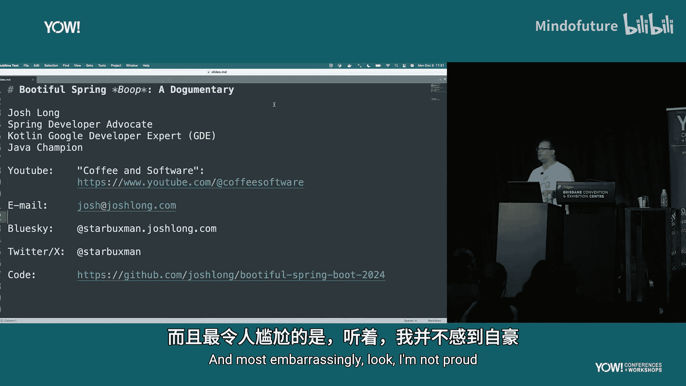
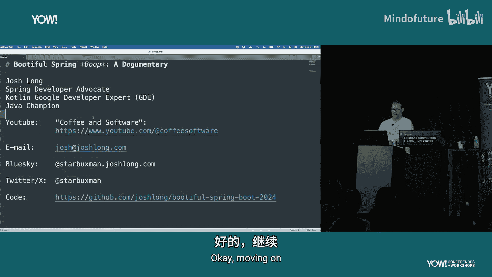
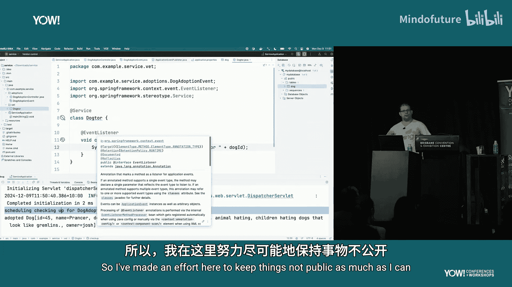
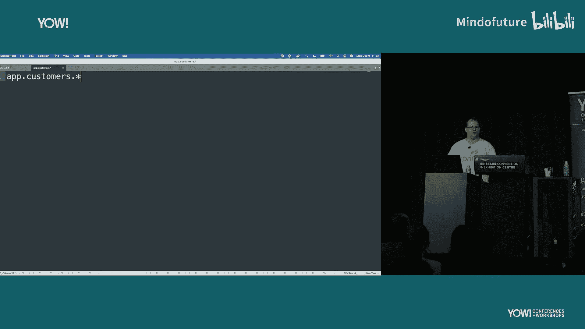
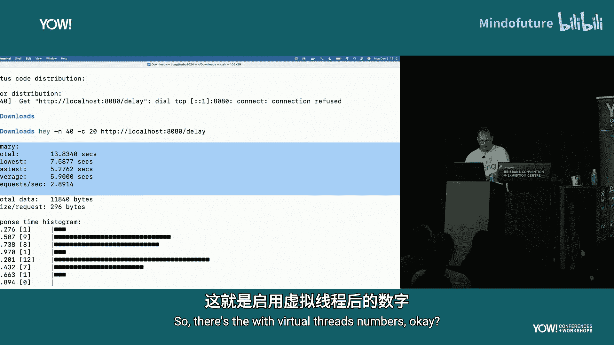
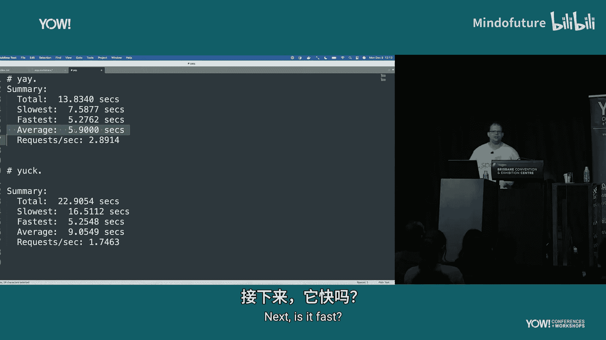
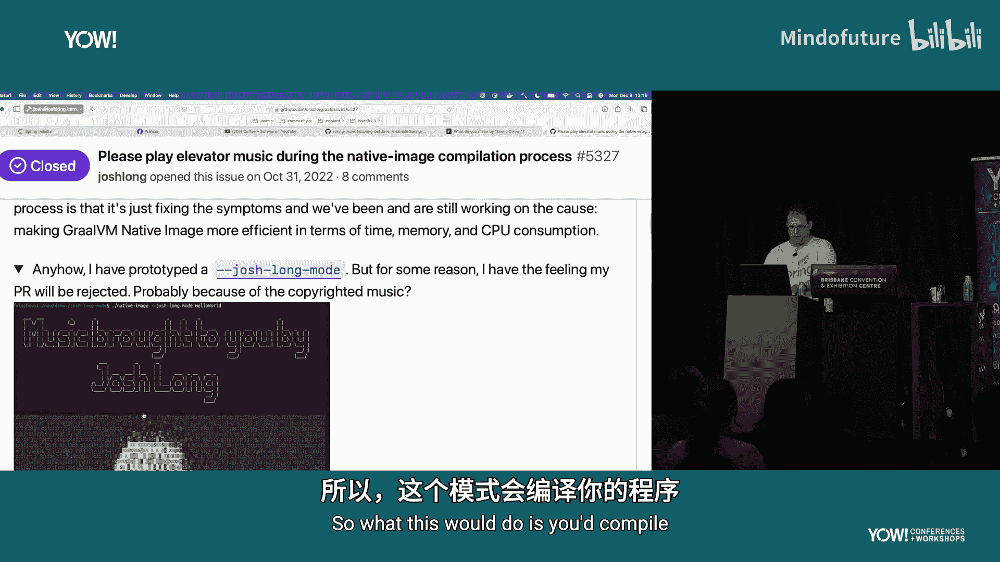
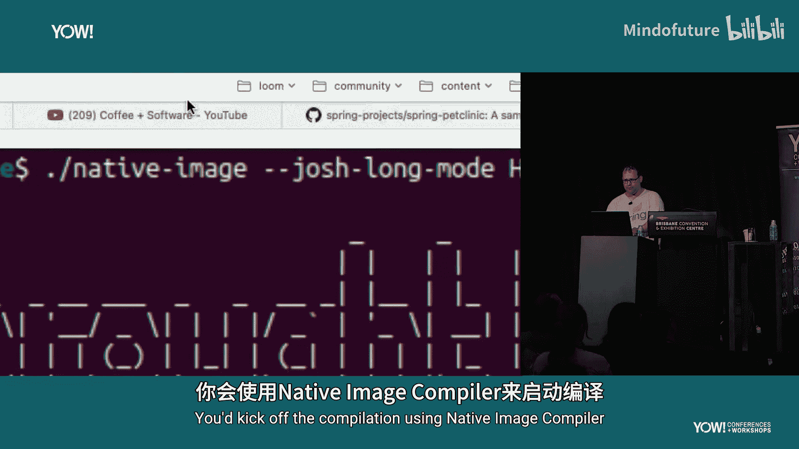
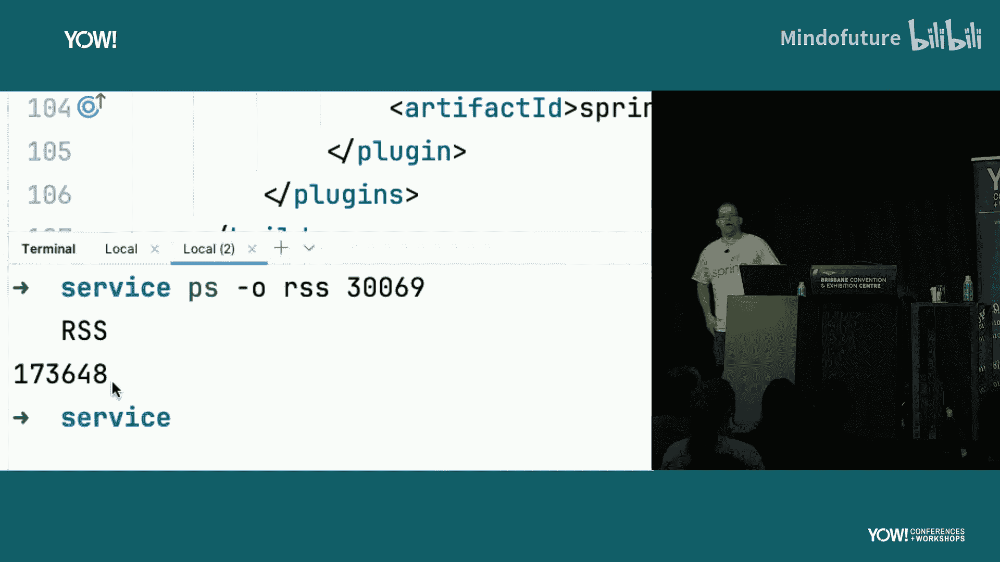

# 005：构建一个模块化、AI增强的Spring Boot应用





在本教程中，我们将学习如何使用 Spring Boot 构建一个现代化的应用。我们将涵盖模块化设计、事件驱动架构、AI集成以及性能优化等核心概念，最终创建一个用于宠物领养的服务。



## 概述

我们将创建一个名为“Service”的宠物领养应用。这个应用将演示如何组织代码以实现模块化，如何通过事件解耦服务，如何集成AI来回答用户问题，以及如何利用Java 21和GraalVM来提升应用性能。

## 项目初始化

首先，我们需要创建一个新的Spring Boot项目。我们使用 [start.spring.io](https://start.spring.io) 并选择以下配置：
*   **项目名称**: Service
*   **Java版本**: 21
*   **依赖项**: Spring Web, Spring Modulith, Spring Boot DevTools, PostgreSQL, Spring AI (OpenAI), Spring Data JDBC

生成项目后，在IDE中打开。我们需要配置数据库连接。在 `application.properties` 文件中添加：
```properties
spring.datasource.url=jdbc:postgresql://localhost/mydatabase
spring.datasource.username=myuser
spring.datasource.password=secret
```
确保本地PostgreSQL已运行并包含一个名为 `dog` 的表，其中包含 `id`, `name`, `description`, `owner` 等字段。

## 构建领养模块

上一节我们初始化了项目，本节中我们来看看如何构建第一个业务模块——领养模块。模块化的目标是减少变更的影响范围，使代码易于重构。

我们创建一个名为 `adoptions` 的包（模块），并在其中创建以下类：

**1. 实体类 (Dog)**
使用Java Record定义数据模型。
```java
record Dog(Long id, String name, String description, String owner) {}
```

**2. 数据访问层 (DogRepository)**
使用Spring Data JDBC简化数据库操作。
```java
interface DogRepository extends CrudRepository<Dog, Long> {}
```

**3. 业务逻辑层 (DogAdoptionService)**
处理领养业务，并发布领养事件。
```java
@Service
@Transactional
class DogAdoptionService {
    private final DogRepository dogRepository;
    private final ApplicationEventPublisher publisher;

    DogAdoptionService(DogRepository dogRepository, ApplicationEventPublisher publisher) {
        this.dogRepository = dogRepository;
        this.publisher = publisher;
    }

    Dog adopt(Long dogId, String ownerName) {
        return dogRepository.findById(dogId)
                .map(dog -> {
                    Dog adoptedDog = new Dog(dog.id(), dog.name(), dog.description(), ownerName);
                    Dog savedDog = dogRepository.save(adoptedDog);
                    // 发布领养事件
                    publisher.publishEvent(new DogAdoptionEvent(dogId));
                    System.out.println("Adopted dog: " + savedDog);
                    return savedDog;
                }).orElseThrow();
    }
}
```

**4. 控制器层 (DogAdoptionController)**
提供HTTP API接口。
```java
@RestController
class DogAdoptionController {
    private final DogAdoptionService adoptionService;

    DogAdoptionController(DogAdoptionService adoptionService) {
        this.adoptionService = adoptionService;
    }

    @PostMapping("/dogs/{dogId}/adoptions")
    void adopt(@PathVariable Long dogId, @RequestBody Map<String, String> payload) {
        adoptionService.adopt(dogId, payload.get("name"));
    }
}
```

**5. 事件类 (DogAdoptionEvent)**
这是一个公共类型，用于模块间通信。
```java
public record DogAdoptionEvent(Long dogId) {}
```

启动应用后，可以通过CURL命令测试领养功能：
```bash
curl -X POST -H "Content-Type: application/json" -d '{"name":"Josh"}' http://localhost:8080/dogs/45/adoptions
```

## 集成兽医服务模块

上一节我们完成了领养功能，但领养宠物通常还需要安排体检。本节中我们来看看如何通过事件驱动的方式集成一个独立的兽医服务模块，而不是直接注入依赖。



我们创建另一个名为 `vet` 的包（模块），并在其中创建兽医服务。



**1. 兽医服务 (DogDoctor)**
这个服务监听领养事件，并异步处理体检安排。
```java
@Service
class DogDoctor {
    @Async
    @TransactionalEventListener
    void checkup(DogAdoptionEvent event) {
        System.out.println("Scheduling checkup for dog ID: " + event.dogId());
        // 模拟耗时操作
        try { Thread.sleep(5000); } catch (InterruptedException e) {}
        System.out.println("Checkup scheduled for dog ID: " + event.dogId());
    }
}
```
这里使用了 `@Async` 让方法异步执行，并使用 `@TransactionalEventListener` 确保事件在事务提交后触发。

**2. 启用异步和事务事件监听**
在主应用类或配置类中添加注解：
```java
@EnableAsync
@EnableTransactionManagement
public class ServiceApplication { ... }
```

通过事件驱动，`adoptions` 模块和 `vet` 模块实现了松耦合。`adoptions` 模块只负责发布事件，不关心谁来处理；`vet` 模块只监听事件，不关心是谁发布的。

## 使用Spring Modulith增强模块化

上一节我们通过事件实现了模块解耦，本节中我们来看看如何使用Spring Modulith来更正式地管理模块，并确保事件的可靠传递。

Spring Modulith 提供了 `@ApplicationModuleListener` 注解和“发件箱模式”，可以保证跨模块事件至少被传递一次，即使应用重启。

**1. 修改事件监听方式**
将 `vet` 模块中的监听器改为使用Spring Modulith的注解。
```java
@Service
class DogDoctor {
    @ApplicationModuleListener
    void checkup(DogAdoptionEvent event) {
        System.out.println("Scheduling checkup for dog ID: " + event.dogId());
        try { Thread.sleep(5000); } catch (InterruptedException e) {}
        System.out.println("Checkup scheduled for dog ID: " + event.dogId());
    }
}
```

**2. 观察发件箱模式**
启动应用并执行领养操作后，查看数据库，会发现一个名为 `event_publication` 的表。它记录了所有待处理和已处理的事件，确保在应用崩溃重启后，未完成的事件能被重新处理。

这种方式为将来将单体应用拆分为分布式微服务铺平了道路，只需配置外部消息中间件（如Kafka、RabbitMQ）即可。

## 集成AI智能助手

上一节我们完善了应用的后端逻辑，本节中我们来看看如何为应用添加一个AI前端——一个能回答用户关于待领养宠物问题的智能助手。

我们将在 `adoptions` 模块中创建一个AI助手服务。

**1. 创建AI助手 (Assistant)**
使用Spring AI的 `ChatClient` 与大型语言模型交互。
```java
@Service
class Assistant {
    private final ChatClient chatClient;
    // 系统提示词，定义AI的角色和上下文
    private final String systemPrompt = """
            You are a representative for the fictitious dog adoption agency “Pooch Palace”.
            Answer questions about dogs available for adoption based on the provided context.
            If you don't know the answer, say so.
            Context: {context}
            """;

    Assistant(ChatClient chatClient) {
        this.chatClient = chatClient;
    }
    // ... 后续将填充具体方法
}
```
需要在环境变量中设置 `spring.ai.openai.api-key`。

**2. 连接AI与业务数据（RAG）**
为了让AI能回答关于我们数据库中宠物的问题，我们需要采用“检索增强生成”模式。首先，将数据库中的狗信息转换为文档并存入向量数据库。
```java
@Component
class DataInitializer {
    private final VectorStore vectorStore;
    private final DogRepository dogRepository;

    DataInitializer(VectorStore vectorStore, DogRepository dogRepository) {
        this.vectorStore = vectorStore;
        this.dogRepository = dogRepository;
    }

    @PostConstruct
    void init() {
        List<Document> documents = dogRepository.findAll().stream()
                .map(dog -> new Document(
                        String.format("ID: %d, Name: %s, Description: %s", dog.id(), dog.name(), dog.description()),
                        Map.of("id", dog.id(), "name", dog.name())
                )).toList();
        vectorStore.add(documents);
    }
}
```

**3. 实现问答功能**
修改 `Assistant` 服务，在提问时先从向量库检索相关文档，再将文档作为上下文提供给AI。
```java
@Service
class Assistant {
    private final ChatClient chatClient;
    private final VectorStore vectorStore;
    private final String systemPrompt = ...; // 同上

    String answerQuestion(String question) {
        // 1. 检索相关文档
        List<Document> similarDocs = vectorStore.similaritySearch(question);
        String context = similarDocs.stream()
                                    .map(Document::getContent)
                                    .collect(Collectors.joining("\n"));
        // 2. 构建包含上下文的完整提示
        String userPrompt = systemPrompt.replace("{context}", context);
        // 3. 调用AI
        ChatResponse response = chatClient.call(
                new Prompt(userPrompt + "\nUser Question: " + question)
        );
        return response.getResult().getOutput().getContent();
    }
}
```

现在，当用户询问“是否有神经质的狗待领养？”时，AI会检索到Prancer的信息，并给出准确的回答。

## 优化性能：虚拟线程与原生镜像



上一节我们为应用添加了智能功能，本节中我们来看看如何让应用运行得更快、更高效。我们将利用Java 21的虚拟线程和GraalVM原生镜像技术。



**1. 启用虚拟线程**
虚拟线程可以大幅提高高并发I/O密集型应用的吞吐量。在 `application.properties` 中启用：
```properties
spring.threads.virtual.enabled=true
```
无需修改业务代码，现有的 `@Async` 和Servlet容器将自动使用虚拟线程。

**2. 演示性能对比**
创建一个简单的测试端点，模拟调用外部慢服务。
```java
@RestController
class DelayController {
    private final RestClient restClient;

    DelayController(RestClient restClient) { this.restClient = restClient; }

    @GetMapping("/delay")
    String delay() {
        return restClient.get()
                         .uri("https://httpbin.org/delay/5")
                         .retrieve()
                         .body(String.class);
    }
}
```
使用压测工具（如 `hey`）分别测试启用和禁用虚拟线程时的性能，可以观察到启用虚拟线程后，吞吐量显著提升，延迟降低。

**3. 使用GraalVM生成原生镜像**
原生镜像能提供极快的启动速度和更低的内存占用。确保已安装GraalVM并配置了 `native` 构建工具。
在项目中，可能需要为反射等特性添加提示（例如使用 `@RegisterReflectionForBinding` 注解）。然后运行：
```bash
./mvnw -Pnative native:compile
```
编译完成后，会生成一个原生可执行文件。运行它，启动时间通常在几十毫秒，内存占用也远低于传统JVM模式。



## 总结






本节课中我们一起学习了如何构建一个现代化的Spring Boot应用。我们从模块化设计开始，通过清晰的包结构减少耦合。然后利用事件驱动架构，让领养模块和兽医服务模块解耦，并通过Spring Modulith保证了事件的可靠传递。接着，我们集成了Spring AI，通过RAG模式让智能助手能够基于我们自己的数据回答用户问题。最后，我们探讨了性能优化，使用Java 21的虚拟线程应对高并发场景，并通过GraalVM原生镜像技术获得了极致的启动速度和运行时效率。这套组合拳帮助我们构建了一个结构清晰、智能高效、易于扩展和维护的生产级应用。