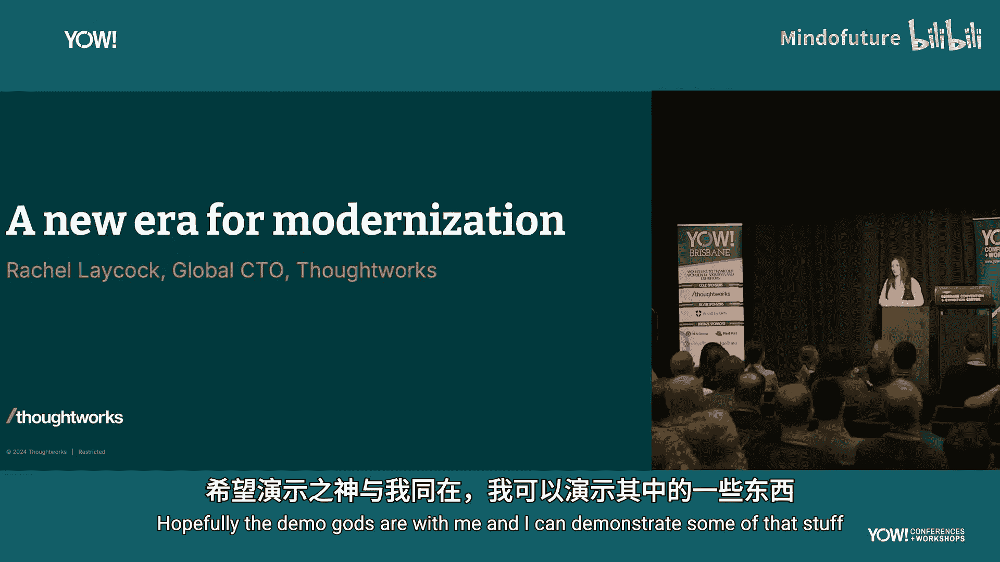
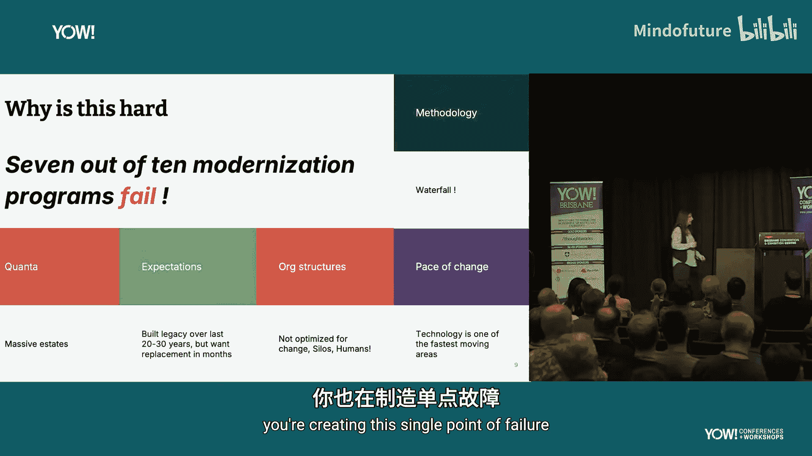
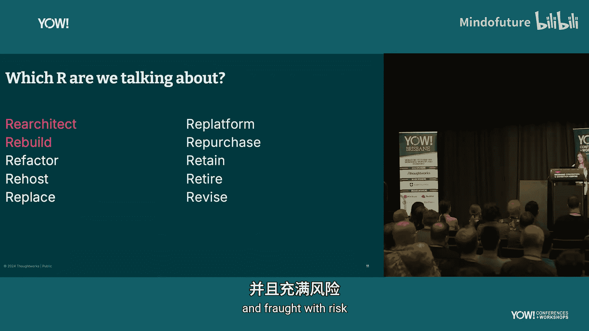
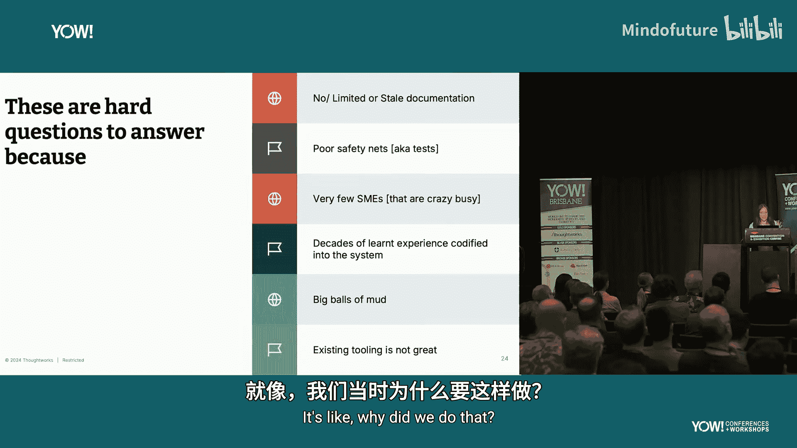
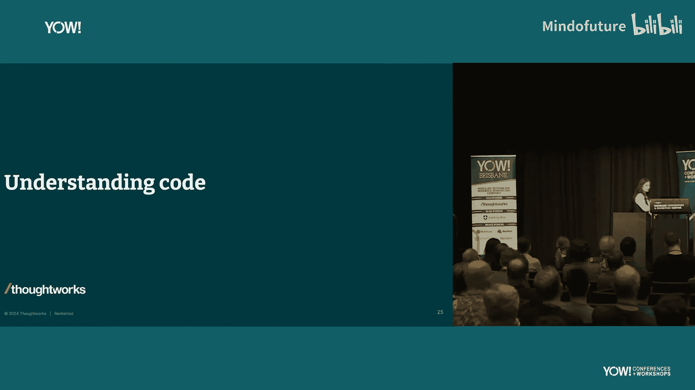
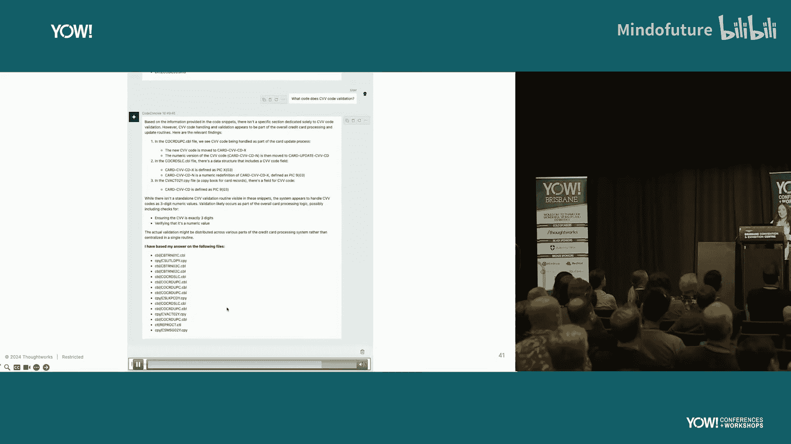
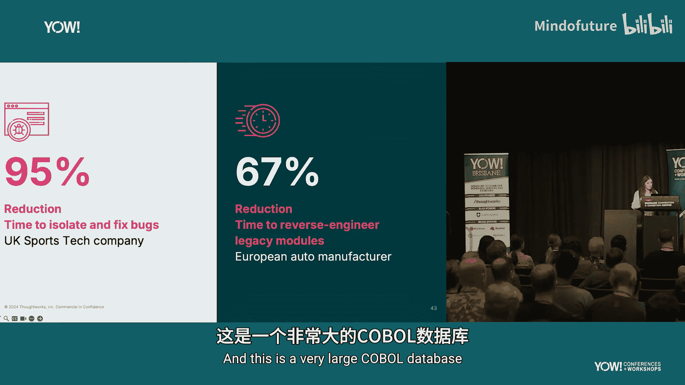
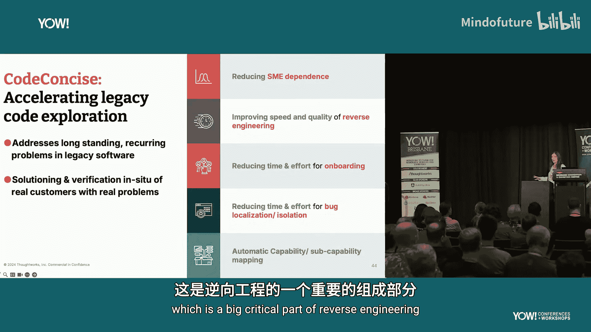
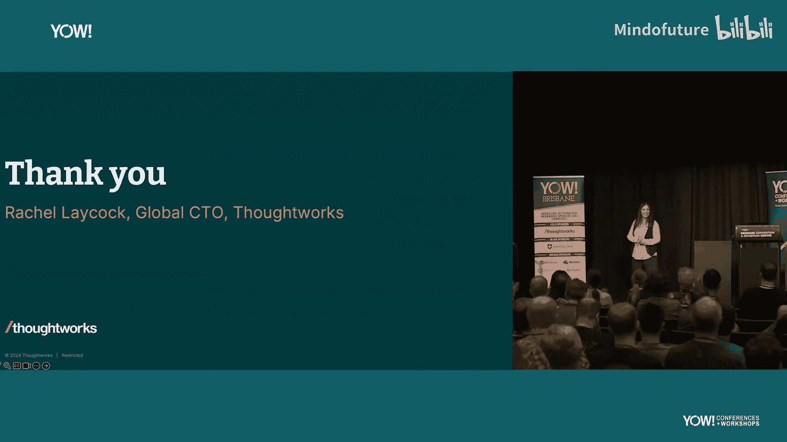

# 006：遗留系统现代化的新纪元

在本节课中，我们将探讨如何利用生成式人工智能来理解和现代化遗留代码系统。我们将分析遗留系统现代化面临的挑战，并介绍一种结合了抽象语法树、知识图谱和检索增强生成技术的新方法。

## 概述：遗留系统现代化的挑战

上一节我们介绍了本次演讲的背景。本节中，我们来看看为什么遗留系统现代化如此困难。

现代化遗留代码实际上非常困难，这并非一个已被行业完全解决的问题。根据研究，超过70%的现代化项目最终失败。这背后有多种原因。

以下是导致遗留系统现代化困难的一些关键因素：
*   **系统规模庞大且复杂**：超过70%的世界系统仍在大型机上运行，代码量巨大。
*   **不切实际的业务期望**：业务方通常期望在短时间内完成现代化，例如解决许可问题。
*   **组织架构的影响**：康威定律持续发挥作用，孤岛化的专业团队导致沟通问题和缓慢的发布周期。
*   **技术变化的快速步伐**：围绕系统的生态系统（如向云迁移、AI兴起）在不断变化，而遗留代码库难以适应。
*   **过时的开发方法论**：漫长的分析、开发、部署和测试周期，大量的交接工作，以及外包和短期项目，导致组织内缺乏理解代码的人，形成单点故障。

## 生成式人工智能能做什么？

既然遗留系统现代化如此困难，生成式人工智能与此有何关系？

自2022年以来，生成式人工智能领域经历了多轮实验。人们的焦点一直集中在如何让开发者更快地编写代码上。然而，对于资深工程师，这有时反而会降低效率，因为他们需要先审查生成的代码。对于初级工程师，则可能产生不理解所生成代码的问题。

但生成式人工智能真正擅长的是将大型语言模型视为非结构化数据，进行总结并允许你进行查询。考虑到遗留代码库，代码本身是结构化数据，但其周围发生着各种非结构化的事情。如果能将所有这些信息整合起来，你就能真正理解代码库在做什么。

在Thoughtworks，我们专注于**重新架构和重建**，而不是完全重写。我们思考如何理解现有系统的能力，哪些部分易于现代化，哪些部分困难，从哪里开始，以及如何利用绞杀者模式逐步剥离功能。然而，即使采用这种渐进式方法，仍然成本高昂且充满风险。

## 理解代码：核心问题

现代化过程非常复杂，涉及技术、流程、团队结构和沟通等多个方面。本节课我们将聚焦于**理解代码**。

当你首次接触一个完全不了解的遗留系统时，你想理解哪些事情？

首先，你想知道**它是做什么的**。它试图实现什么目标？有哪些功能和能力？这通常是一个缓慢而艰巨的过程，需要大量与人员访谈。

其次，一旦理解了功能，你想知道**它是如何工作的**。这些功能是如何实现的？这时静态和动态分析工具会变得有用。

第三，你需要关心**关系与依赖**。代码是高内聚的，还是分散在许多不同系统中且高度耦合？理解这些对于评估风险和问题至关重要。

最后，你想进行**假设分析**。如果我做X或Y，真正的影响是什么？更改会产生什么后果？这通常会导致大量的恐惧和决策瘫痪。

## 为什么这些问题难以回答？

即使有静态分析工具，回答上述问题也很困难，原因如下：

以下是具体原因：
*   **缺乏文档**：即使有文档，也往往很快过时。
*   **缺乏安全网和测试**：为高度耦合的遗留系统添加测试框架可能非常困难且测试脆弱。
*   **领域专家稀缺**：对于大型机系统，领域专家通常很少，且预约咨询耗时。
*   **人类记忆的局限性**：即使是领域专家，也可能遗忘细节。
*   **代码本身的特性**：例如，过程式代码对于面向对象背景的开发者可能难以理解。
*   **开发者的个人习惯**：在缺乏编码标准的时代，不同开发者的代码风格差异巨大。
*   **“大泥球”架构**：基于项目制开发且缺乏团队持续改进所有权，导致代码高度耦合。
*   **陈旧的工具链**：代码库越老，可用于分析它的现代工具就越少，效果也越差。

## 解决方案：将代码视为数据

考虑到上述所有问题，我们思考生成式人工智能是否能帮助解决。我们能否理解现有系统及其设计？能否在不依赖专家的情况下收集知识？能否以符合现代实践的方式转换代码？

我们决定从**大型机**代码开始尝试，因为如果能解决这个问题，其他代码库的问题也能迎刃而解。

我们采取的方法是**逆向工程**，试图提取出一些低层需求，以便理解系统的现有分析和需求，然后据此确定新系统的构建目标和方法。

我们构建了一个名为 **Concise** 的内部工具。其核心思想是**将代码视为数据**。

我们的方法包含以下几个关键步骤：
1.  **解析代码并构建抽象语法树森林**：我们将代码解析后存入图数据库，这非常适合此类数据，允许我们从高层概览深入到低层细节。
2.  **利用图数据库**：我们使用 Neo4j 图数据库来存储和遍历代码的结构和行为视图，它非常易于与大语言模型、搜索和检索增强生成技术集成。
3.  **结合检索增强生成与图查询**：我们使用 RAG 和图遍历技术，将相关信息整合起来，生成更简洁、有用的答案。

## 技术演进：从简单提示到知识图谱增强

该工具经历了多次迭代。

最初，我们尝试了最直接的方法：将整个代码文件丢进提示窗口进行询问。这对于大型文件会产生上下文窗口问题，模型可能会“忘记”部分内容。

接着，我们尝试利用**检索增强生成**。我们将代码块向量化，结合用户提示，从图谱中仅提取相关的节点，这有助于减少信息噪音和上下文窗口问题。

然后，我们通过**遍历图谱**来收集跨代码的更多信息。Neo4j 存储了这个丰富的知识图谱，为LLM提供了更多上下文，并利用了图结构。你可以获取关于代码的各种解释，包括描述、需求或能力。

我们为此工具构建了前端界面，允许用户直接询问并查看系统功能，从而填补知识空白。

## 演示：工具如何工作

想象一下，你的客户需要理解系统**身份验证**是如何工作的。通常，你需要与领域专家坐在一起询问。

但使用我们的遗留系统助手工具，你可以直接提问。该工具使用知识图谱作为后端存储的扩展RAG流程，它会根据具体问题的语义，在代码库的知识图谱中找到相关节点，然后引入与这些节点相连的其他节点。

我们通过解析代码并利用生成的抽象语法树来互连所有相关元素，从而构建这个知识图谱。这些元素不仅基于代码，还包括我们引入的描述和其他信息，共同构成了代码结构和行为模型的更全面视图。

这一切结合起来，使你摆脱了短暂的上下文窗口限制，帮助你处理现有代码的语义，并引入可能不在同一文件中的依赖关系。

## 映射业务能力

仅理解代码是不够的。我们还需要**映射业务能力**。在与客户合作时，我们会进行事件风暴和领域驱动设计等练习，以真正理解系统的能力。

拥有这些能力地图至关重要，否则你无法确定目标架构。你需要梳理支持它的所有流程和人员，创建庞大的流程图和能力地图。

在生成式人工智能出现之前，所有这些工作基本上都是手工完成的，由开发人员、分析师和领域专家携手合作，进行大量手动努力。对于小型代码库尚可，但对于数万行代码，理解系统需要耗费大量时间。

生成式人工智能改变了这一局面，它赋予了你总结大量文本的能力。在我们的集成开发环境中，团队可以选择访问能力地图，并进行逆向和正向工程。

通过获取这些能力地图并理解代码，你能够就保留什么、舍弃什么以及系统中哪些是死代码做出明智决策。这非常重要，因为系统中通常存在大量未被使用的代码。此外，它还允许你理解技术能力（如身份验证）与业务能力的区别。

现在，通过将代码库和业务能力地图整合到一个应用中，你可以将代码映射到能力上。这意味着你现在可以开始理解应用的接缝。

## 实际应用与成果

当我们采用这种方法——即结合大语言模型、RAG、抽象语法树和知识图谱来理解代码库时，我们看到了以下成果：

我们研究了两个不同的代码库。第一个是Java代码库的实验，开发者被要求查找并修复错误。使用此工具的开发者组比未使用组**速度快了95%**，因为大部分工作正是定位错误。

第二个案例涉及一个大型COBOL系统（约10,000行）。传统的逆向工程方法完全依赖领域专家。使用我们的方法后，原本需要领域专家和业务分析师花费**六周**理解系统的任务，被缩短到了**两周**。

该工具在以下方面提供了帮助：
*   **减少对领域专家的依赖**：非常关键。
*   **提高逆向工程的速度和质量**：关于“幻觉”问题，我们遇到的并不多。因为领域专家也是人，他们也可能“记忆模糊”或完全忘记事情。最终，你仍然需要检查、编写测试并与领域专家沟通，但现在你可以带着更多的上下文和信息去交流。
*   **理解和隔离缺陷**：如前所述，能够理解错误并隔离问题。
*   **映射和理解系统能力**：这是逆向工程的关键部分。

## 总结与展望

本节课中，我们一起学习了生成式人工智能如何为遗留系统现代化带来变革。

生成式人工智能将赋予**大多数人**理解遗留代码库的能力，而这在过去只掌握在**少数人**手中。这对于我们行业是一个巨大的障碍和挑战。

我们的行业在过去10年（更不用说20、30、40年）已经发生了翻天覆地的变化。我们有了不同的实践、不同的软件架构方式和不同的方法论，而旧的系统根本无法支持或适应这些变化。正如之前有人提到的，处理遗留代码“不性感”，没人愿意做。但有了这样的工具，情况将发生改变。

我们预计未来几年在这个领域会出现更多进展。人们已经对此感到兴奋，即使不打算立即现代化系统，他们也希望使用这类工具来理解和管理系统中的风险。

我们期望有一天这类功能能集成到IDE中。我们可以想象在IDE内部就能询问和理解代码的运作方式。

我们没有看到太多偏见或幻觉问题。我认为这将改变我们对现代化的思考方式。我期待看到这个领域出现什么样的工具。

对于那些直面“全球70%系统运行在大型机上”和“70%现代化项目失败”问题的人来说，这比让开发人员速度提高10%（目前真实研究显示的效果）要有趣和激动得多。