# 007：一次以代码为中心的Gleam语言之旅 🚀


在本教程中，我们将跟随YOWcon 2024软件开发大会的一次演讲，探索Gleam编程语言。我们将从最基础的“Hello World”开始，逐步构建一个功能完整的Web服务器，涵盖项目创建、依赖管理、Web框架使用、数据库交互以及Gleam的核心特性。我们的目标是让初学者能够理解Gleam的设计哲学和开发体验。

## 1. 初识Gleam：友好的语言 🌟

Gleam被描述为一种**友好**、**类型安全**且**可扩展**的语言。这意味着它易于学习，拥有强大的静态类型系统，并且能够构建适应分布式和并发世界的系统。


## 2. 从“Hello World”开始 👋

旅程从最经典的示例开始。以下是一个简单的Gleam程序：

```gleam
import gleam/io

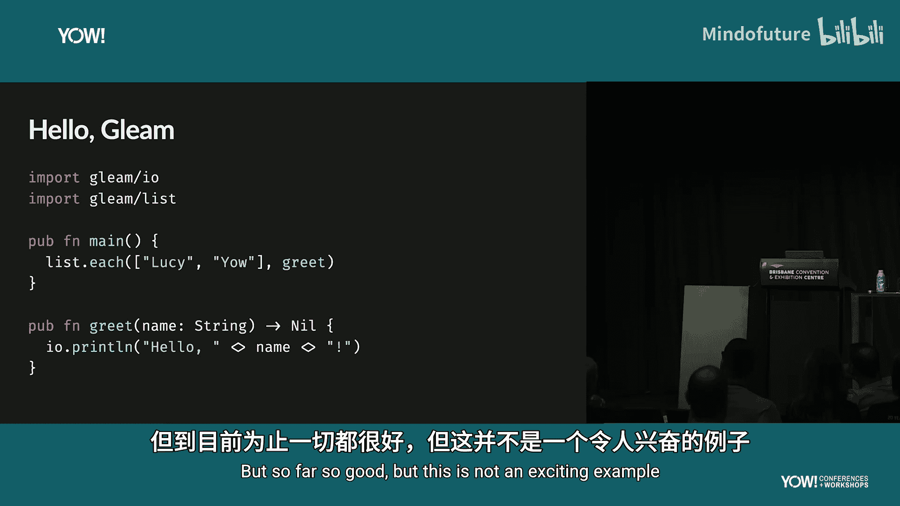

pub fn greet(name: String) {
  io.println("Hello, " <> name)
}

pub fn main() {
  let names = ["Lucy", "Yao"]
  list.map(names, greet)
}
```

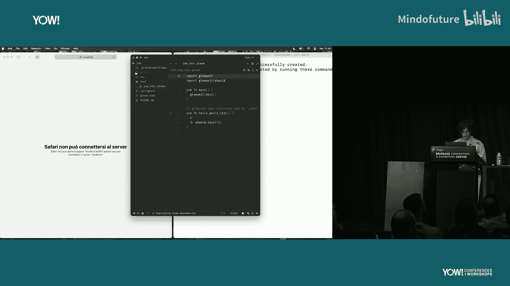

这段代码定义了一个`greet`函数来打印问候语，并在`main`函数中为列表中的每个名字调用它。如果你接触过JavaScript等主流语言，会发现其语法非常相似。Gleam的设计目标之一就是让语法不成为学习新概念的障碍。

## 3. 我们的目标：构建一个Web服务器 🏗️

仅仅打印字符串并不够。我们的目标是构建一个真正的服务器。它需要能够：
*   处理客户端请求并返回HTML响应。
*   可能需要进行模板渲染。
*   从数据库读取数据。
*   具备日志记录功能。
*   高可用并能承受高负载。

但在深入编写代码之前，我们需要了解如何开始一个Gleam项目。

## 4. 项目创建与工具链 🛠️

Gleam提供了出色的开箱即用开发体验。安装Gleam二进制文件后，你可以通过以下命令轻松创建新项目：

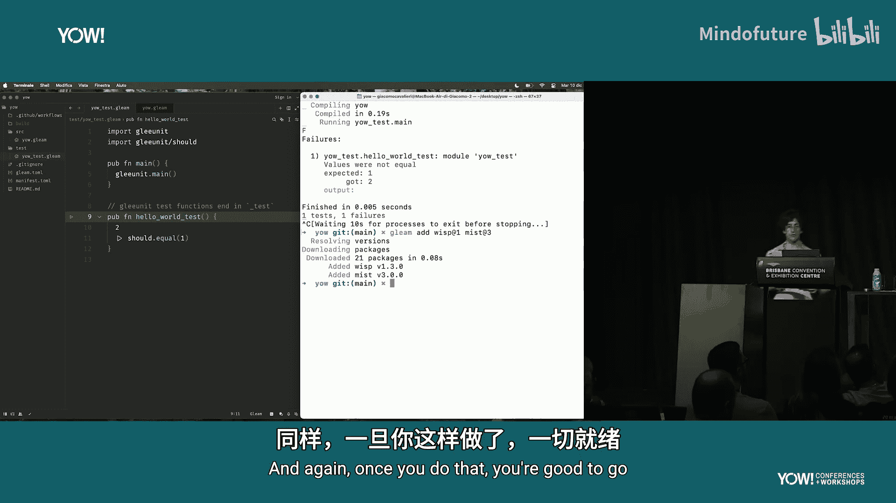

```bash
gleam new my_project
```

项目结构非常直观，包含`src`（源代码）和`test`（测试）目录。要运行代码，只需执行：

```bash
gleam run
```

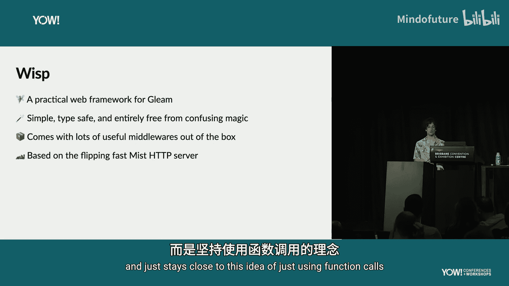

要运行测试，命令是：

```bash
gleam test
```

Gleam编译器速度极快，支持增量编译。这意味着在开发过程中，每次保存代码后重新运行测试，几乎能立即获得反馈，实现了真正的快速迭代开发。

## 5. 添加依赖：构建Web服务器 📦

要构建服务器，我们需要依赖项，如HTTP服务器和Web框架。Gleam内置了包管理器，添加依赖非常简单：

```bash
gleam add wisp mist
```

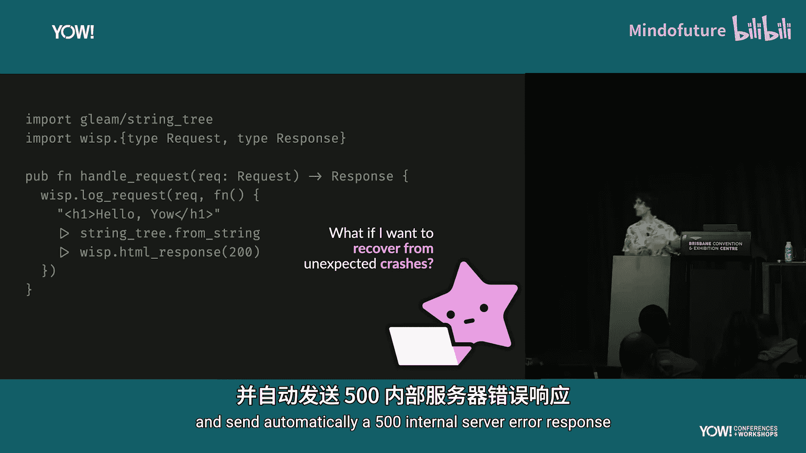

这里，`wisp`是Gleam的Web框架，`mist`是HTTP服务器。添加后即可在项目中使用。

`Wisp`框架体现了Gleam的哲学：**简单、明确、无隐藏魔法**。Gleam是一门显式的语言，没有隐式控制流、类型转换、空指针或未检查异常。代码即所见，这使代码更易于理解和维护。

## 6. 使用Wisp框架处理请求 🔄

在Wisp中，核心概念是**处理器**。处理器是一个函数，它接收客户端请求并返回要发送回客户端的响应。

以下是一个简单的处理器示例：

```gleam
import wisp

pub fn handler(req: wisp.Request) -> wisp.Response {
  let html = "<h1>Yao</h1>"
  html
  |> wisp.string_to_html_tree
  |> wisp.html_response(200)
}
```

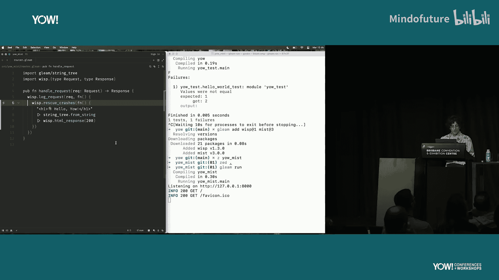

这段代码构建了一个HTML字符串，将其转换为Wisp用于高效构建响应的数据结构，最后返回一个状态码为200的HTML响应。

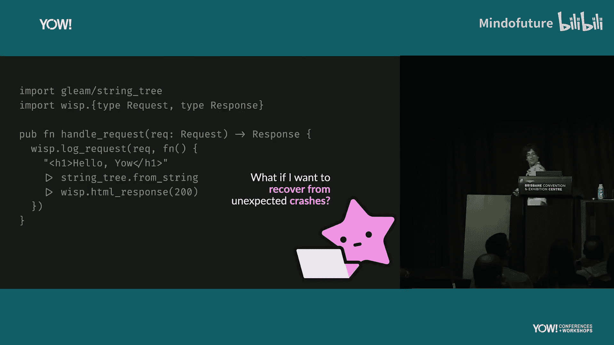

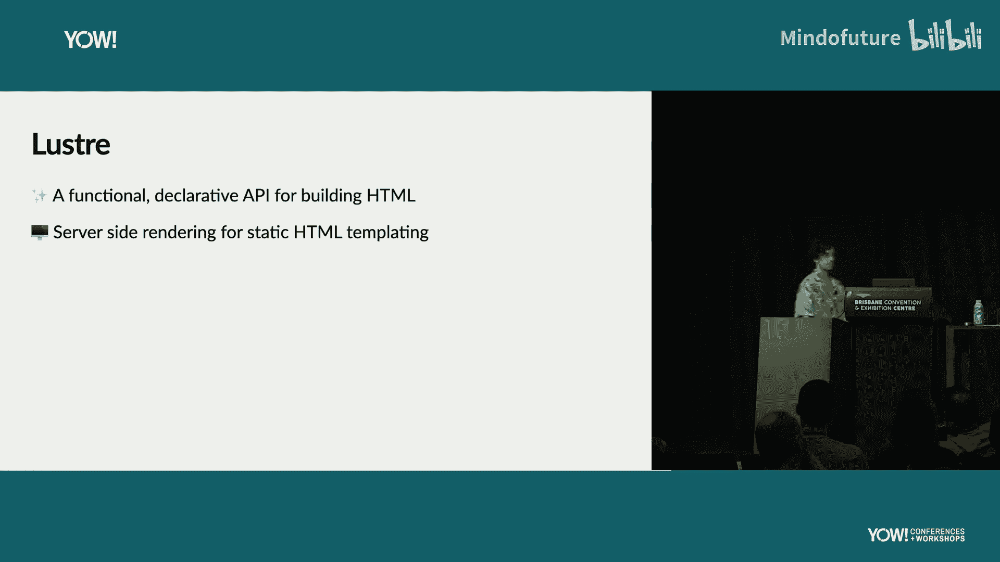

Gleam的管道操作符`|>`让代码更清晰。它将左侧表达式的结果作为第一个参数传递给右侧的函数，避免了为中间变量命名的麻烦。

## 7. 添加中间件：日志与错误恢复 🛡️

一个严肃的服务器需要日志记录和错误恢复。在Wisp中，这通过**中间件**函数实现。

以下是添加日志记录和崩溃恢复的示例：

```gleam
import wisp.{type Request, type Response}

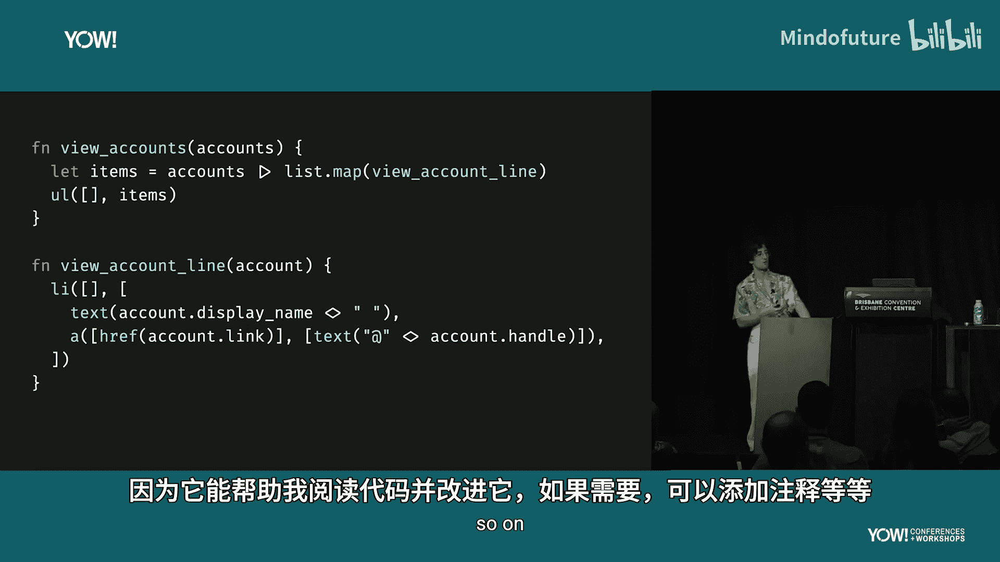

pub fn handler(req: Request) -> Response {
  // ... 处理逻辑 ...
}

// 使用中间件包装处理器
pub fn main() {
  wisp.serve(
    wisp.log_request(_, handler)
    |> wisp.rescue_crashes
  )
}
```

`log_request`中间件记录请求，`rescue_crashes`中间件自动捕获处理器中的崩溃并返回500错误，防止客户端一直等待。

然而，随着中间件增多，基于回调的API可能导致代码嵌套过深，形成“回调地狱”或“末日金字塔”。Gleam提供了`use`关键字来解决这个问题。

## 8. 使用 `use` 关键字改善代码结构 🧹

`use`关键字是一种语法糖，它能将后续代码块转换为匿名函数，并传递给`use`右侧的函数。这能有效扁平化嵌套的回调。

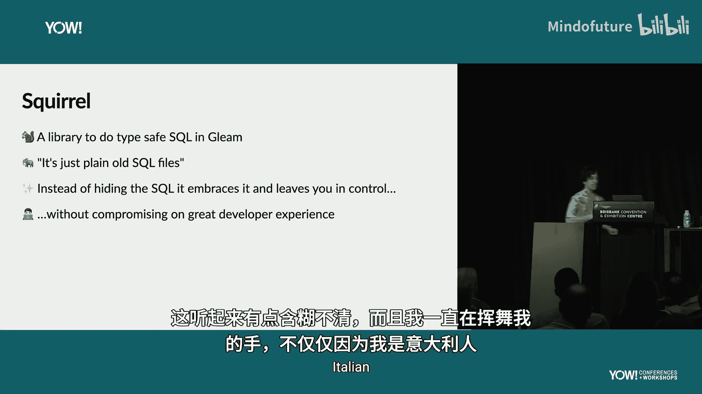

例如，上面的代码可以用`use`重写：

```gleam
pub fn main() {
  use req <- wisp.log_request
  use _ <- wisp.rescue_crashes
  handler(req)
}
```

这样，无论添加多少中间件，代码的缩进都不会无限增长，保持了可读性。Gleam的语言服务器可以轻松地在回调风格和`use`风格之间转换代码，帮助开发者理解。

## 9. 使用Lustre进行声明式HTML渲染 🎨

硬编码HTML字符串功能有限。我们可以使用`lustre`库，它以函数式、声明式的API来定义HTML文档。

在Lustre中，创建HTML元素就像调用函数一样简单：

```gleam
import lustre/element.{html}
import lustre/element/html.{h1}

pub fn my_page() {
  h1([], [html.text("Yao")])
}
```

`h1`函数接受两个列表：属性列表和子元素列表。这种方式完全是函数调用，没有嵌入新的DSL或宏。这意味着你可以用组织普通Gleam代码的方式来组织HTML生成代码，重构起来非常方便。

例如，我们可以将显示用户账户列表的代码拆分成可复用的函数：

```gleam
fn render_account(account: Account) {
  // 渲染单个账户
}

fn render_account_list(accounts: List(Account)) {
  list.map(accounts, render_account)
  |> html.ol([])
}
```

Lustre还支持构建交互式、客户端丰富的单页应用，无需每次交互都访问服务器。

## 10. 与数据库交互：拥抱SQL 🗄️

服务器通常需要与数据库对话。Gleam社区推崇的方式是**拥抱SQL**，而不是试图用ORM完全隐藏它。SQL本身就是强大的查询语言。

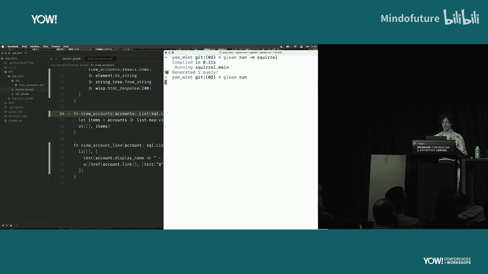

我们可以使用`sq`库。它的方法是使用普通的SQL文件。

首先，创建一个SQL文件，例如 `src/database/accounts.sql`：

```sql
-- src/database/accounts.sql
SELECT id, display_name, joined
FROM accounts
WHERE joined BETWEEN ? AND ?
```

然后，运行`sq`命令，它会根据SQL文件自动生成类型安全的Gleam代码。

在Gleam代码中，可以这样使用生成的函数：

```gleam
import my_app/database

pub fn handler(req: Request) -> Response {
  let today = date.today()
  let one_month_ago = date.sub_days(today, 30)

  case database.list_accounts(db_conn, one_month_ago, today) {
    Ok(accounts) -> render_account_list(accounts)
    Error(_) -> wisp.internal_server_error()
  }
}
```

`sq`生成的函数是类型安全的，编译器会确保你传入正确数量和类型的查询参数。这种方式避免了ORM可能导致的N+1查询或过度获取数据的问题，同时保留了SQL的全部能力。

## 11. Gleam的强大之处：多运行时支持 ⚡

Gleam能编译到两个强大的运行时：
1.  **JavaScript**：可以在任何能运行JavaScript的地方（浏览器、Node.js等）运行Gleam代码。
2.  **Erlang**：编译到Erlang，运行在**BEAM**虚拟机（Erlang VM）上。

BEAM虚拟机诞生于电信行业，专为构建**高容错**、**高并发**、**分布式**系统而设计。这些特性正是现代云服务所必需的。

因此，你可以用Gleam编写后端（编译到Erlang，运行于BEAM），同时用Gleam编写前端（编译到JavaScript，运行于浏览器），实现真正的全栈开发，并共享业务逻辑代码。

## 12. 总结与资源 📚

本节课中我们一起学习了Gleam语言的核心旅程。

Gleam是一门旨在**提高生产力**的语言。它通过简单的语法、强大的类型系统、出色的编译器错误信息以及一流的工具链（内置编译器、构建工具、包管理器、代码格式化器和语言服务器）来实现这一目标。

它基于两个基本构建块：**数据**和**函数**。这种简单性使得代码易于推理、测试和维护。正如一位社区成员所说：“阅读我的Gleam代码让我感到平静。”

如果你想继续探索Gleam：
*   **官方工具**：访问 [tool.gleam.run](https://tool.gleam.run)，直接在浏览器中尝试Gleam。
*   **练习平台**：在 [Exercism](https://exercism.org/tracks/gleam) 上完成Gleam编码练习。
*   **社区交流**：加入 [官方Discord服务器](https://discord.gg/Fm8Pwmy) 获取帮助和交流。


希望这次旅程能激发你对Gleam的兴趣！