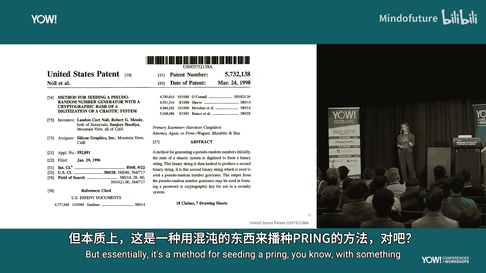
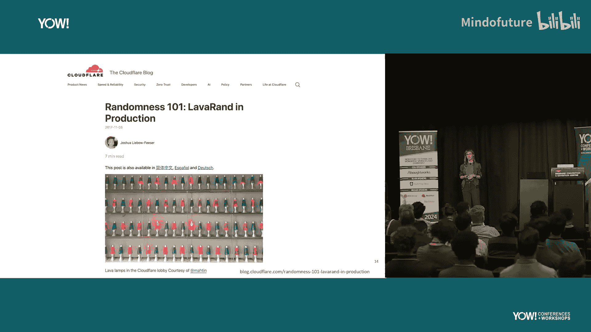
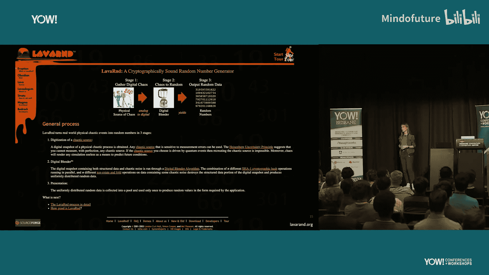
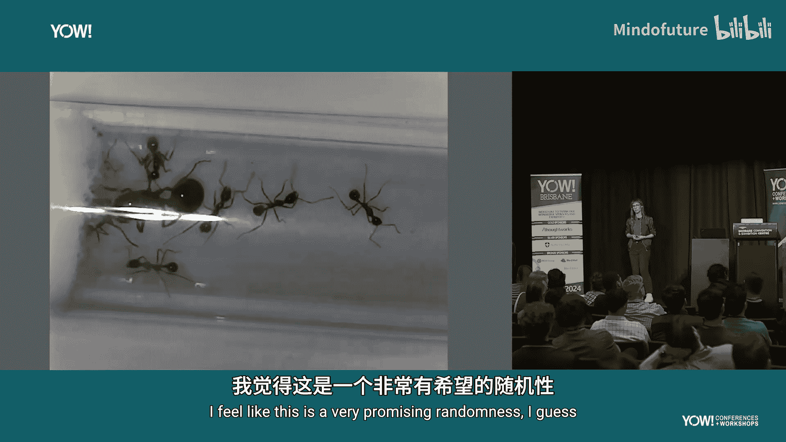

# 008：糖动力加密 🐜🔐

## 概述

在本节课中，我们将学习如何利用一个看似奇特的混沌系统——蚂蚁农场——作为加密随机性的来源。我们将探讨伪随机数生成器的基础知识、现有的混沌熵源，并详细介绍一个将蚂蚁行为转化为可用加密熵的研究项目。

---

## 伪随机数生成器基础

首先，我们需要了解伪随机数生成器。它们是许多加密操作的基础。

伪随机数生成器用于生成加密密钥、签署安全证书、生成TLS握手密钥、文件邮件加密以及数字签名。它们在后台被广泛使用，我们通常对此习以为常。

计算机本质上是确定性的。它们完全按照指令执行，无法自行产生真正的随机性。因此，我们需要从外部为计算机寻找随机性来源。

我们将这种随机数据称为“熵”。伪随机数生成器需要一个“种子”来启动。它们基于这个种子生成可预测的随机数序列。虽然这听起来不是真正的随机，但它非常有用。例如，在测试中需要生成相同的随机序列时，或者因为伪随机数生成器比其他真随机数生成器更高效、运行更快时。

---

## 系统中的熵源

那么，我们如何找到这种随机性呢？在Unix系统中，常见的熵源设备是 `/dev/random` 和 `/dev/urandom`。还有一个系统调用叫 `getrandom`。

`/dev/random` 和 `/dev/urandom` 的主要区别在于，前者是阻塞的，而后者是非阻塞的。如果你请求一定量的熵而当前不足，`/dev/random` 会阻塞调用，直到收集到足够的熵。

这些随机数据通常由系统事件填充。例如，键盘敲击的时间间隔是难以预测的。硬盘访问读取事件等系统事件也具有一定随机性。任何难以预测的、发生在需要随机性的机器上的系统事件，都可以作为方便的熵源。

---

## OpenSSL 与熵

OpenSSL是一个开源密码学库，它广泛使用自己的伪随机数生成器进行加密操作。它被用于许多软件包，从Web服务器到命令行工具（如curl）。OpenSSL也作为一个命令行工具存在，例如在GitHub上生成密钥对时可能会用到。

通常，在Unix系统上，OpenSSL会使用 `/dev/random` 或 `/dev/urandom` 来获取熵，为其伪随机数生成器提供种子。

---

## 其他混沌熵源

除了系统事件，世界上还存在其他受混沌系统启发的熵源。

**Random.org** 是一个提供随机数的网站。其随机数生成器使用大气噪声作为熵源。它通过分布在全球的无线电设备，收集未使用频率上的背景噪声来生成随机性。

一项2003年的研究探索了使用**放射性衰变**作为高效、简单的随机性来源。研究尝试从家用电离式烟雾探测器中的镅元素衰变中提取可用的熵。

更著名的例子是**“熔岩灯熵”**。这项技术于1998年获得专利。其核心思想是：熔岩灯中流体的动态行为是混沌且难以预测的。通过用摄像头对准一排熔岩灯，定期捕获其状态，并将图像转换为二进制字符串，再经过加密哈希函数处理，最终得到可用于播种伪随机数生成器的熵。

Cloudflare公司在其总部大厅就使用了这种方法。相关专利和博客文章提供了更详细的技术细节。

---

## 研究构想：蚂蚁农场熵

受到“熔岩灯熵”的启发，我们提出了一个想法：能否用**蚂蚁群落**作为混沌熵源？

蚂蚁的运动看起来是混乱且难以预测的。它们似乎一直在活动。研究表明，大多数蚂蚁物种会进行极短时间（最多一分钟）的小睡，然后恢复活动，而不是像人类一样长时间集体睡眠。这意味着它们可以近乎全天候地提供混沌行为。

这引出了两个核心研究问题：
1.  蚂蚁群落作为一个混沌系统，是否是足够的熵源？
2.  是否可能替换常用伪随机数生成器的默认熵源？

---

## 项目实践：硬件与设置

为了验证想法，我们开始了实践项目。

首先，我们获得了蚂蚁。蚁后可以存活长达15年，工蚁从卵到成虫需要8-10周。我们从一个装有蚁后、一些工蚁、水和糖水的试管开始。

蚂蚁被安置在一个“初创蚁巢”中。这是一个小空间，适合初期群落成长。未来它们会迁移到一个带有激光切割隧道、空间更大的“成长蚁巢”中。

为了24/7捕获蚂蚁状态，我们需要一个摄像头。我们选择了一款支持红外夜视的USB摄像头，以便在黑暗环境下（不打扰蚂蚁）也能清晰拍摄。摄像头通过3D打印的支架固定在蚁巢上方。

---

## 项目实践：软件实现

我们的应用目标是家中的Linux服务器。它运行着许多使用TLS/SSL的服务（如MediaWiki, Home Assistant），并且所有代码提交都使用数字签名。这些操作都依赖于伪随机数生成器。

我们决定从替换OpenSSL的熵源入手。审计发现系统上有大量软件依赖OpenSSL库。

接下来，我们实现类似于“熔岩灯专利”的流程，但针对蚂蚁农场：

1.  **记录混沌系统状态**：定期（例如每5秒）拍摄蚂蚁农场的照片。
2.  **数字化状态**：提取照片的RGB像素值，并将其转换为一个很长的二进制数字序列。
3.  **应用哈希函数**：使用SHA-256哈希函数处理上一步得到的数字，生成一个固定长度（256位）的哈希值（摘要）。公式可以表示为：`熵数据 = SHA256(图像像素数据)`。
4.  **添加到熵池**：将这个哈希值添加到累积的熵池中。
5.  **提供种子**：当OpenSSL等程序需要熵来播种其伪随机数生成器时，从该池中提供样本。

我们编写了一个Go语言实现的**熵收集守护进程**来管理这个过程。它使用OpenCV库捕获摄像头图像，计算SHA-256哈希，并将其与现有熵池进行异或混合。守护进程还会检查哈希的唯一性，并将重复项和对应图像记录到数据库以供分析，这是评估熵质量的重要部分。

OpenSSL可以通过重新编译来配置使用自定义熵源。我们使用 `--with-rand-seed=egd` 选项，并指定我们守护进程的Unix域套接字路径。

---

## 初步成果与未来步骤

目前，项目已取得一些初步成功：
*   我们能够使用蚂蚁农场生成的熵，通过OpenSSL命令行工具**重新生成SSL证书**并为其签名。
*   我们也用这个熵池**重新生成了用于代码提交签名的GPG密钥对**。现在，每次提交到该项目仓库的代码，都是由蚂蚁间接“签名”的。

当然，项目还在进行中。蚂蚁群落需要时间成长到更具规模的阶段，以提供更丰富的混沌行为。

下一步计划包括：
1.  将蚂蚁迁移到更大的永久性蚁巢中。
2.  重新设计并3D打印适配新蚁巢的摄像头支架。
3.  长期收集熵数据，并使用更严格的测试套件（如Diehard测试）分析熵的质量。
4.  最终，将服务器上依赖OpenSSL库的服务重新配置，使其使用我们的蚂蚁熵守护进程作为熵源。

---

## 总结与思考

本节课我们一起探索了伪随机数生成器和熵的概念，了解了从系统事件到熔岩灯等多种熵源。我们重点介绍了一个将蚂蚁农场作为混沌熵源的研究项目，涵盖了从生物习性研究、硬件搭建到软件实现的完整过程。

这个项目可能看似不切实际，但它充满了价值：**它有趣，带来了意想不到的学习机会（如蚂蚁习性、OpenSSL内部机制、熵收集守护进程的历史），并且鼓励我们在常规工作之外进行探索和创造**。并非每个项目都需要立即证明其商业实用性，享受学习过程、满足好奇心本身就是一个美好的目标。

---

**（注：本教程根据演讲内容整理，所有技术实现均为研究性质，请勿用于生产环境。）**