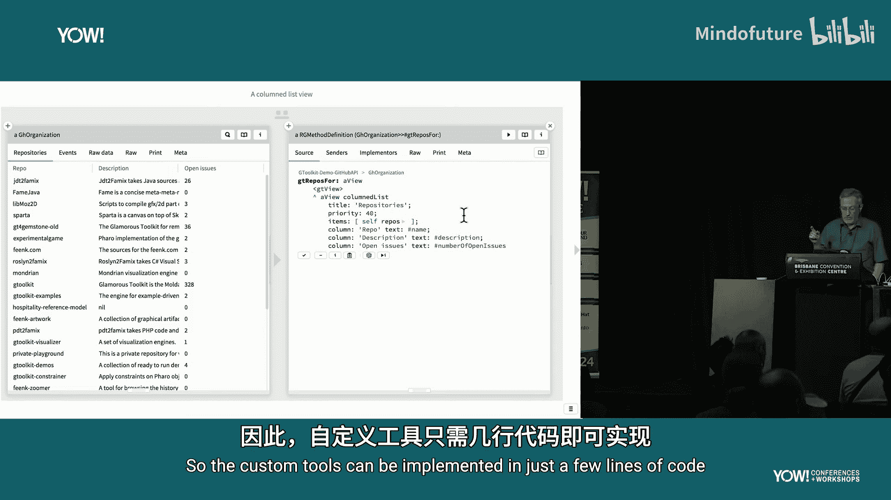
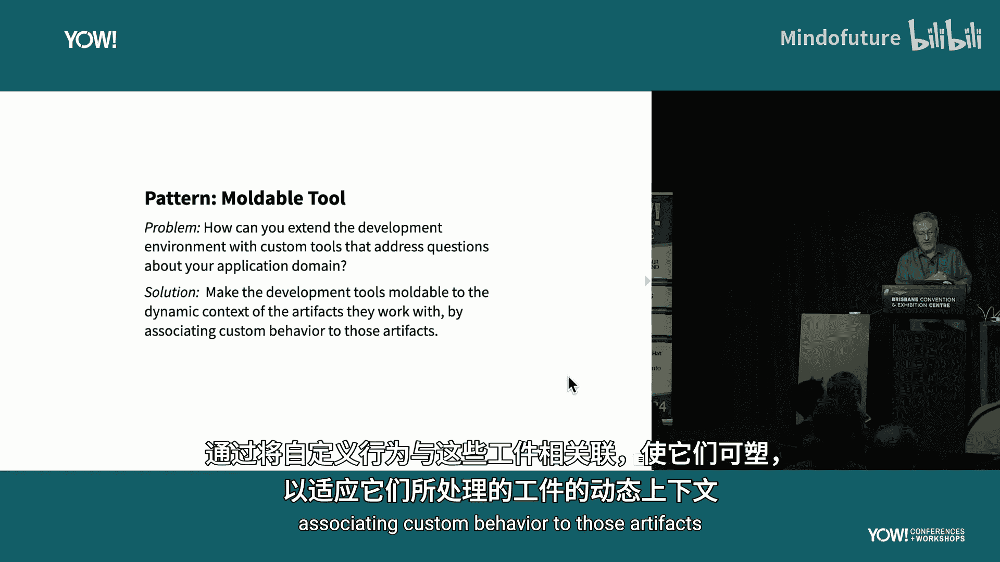
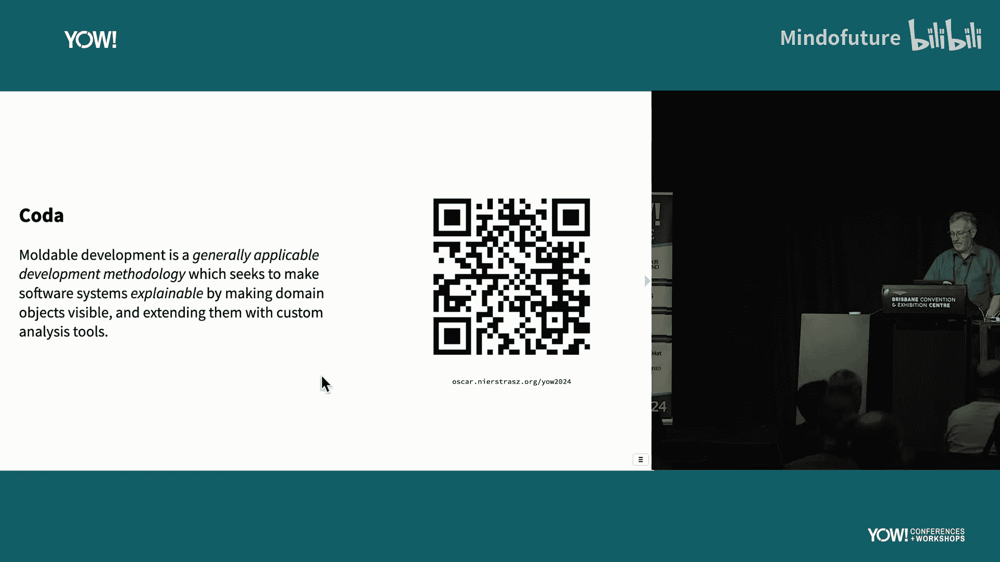

# 011：遗留系统现代化模式

在本节课程中，我们将学习“可塑化开发”的核心理念与实践模式。我们将探讨如何通过开放领域模型，让软件系统变得可解释，从而能够回答关于其自身的问题。课程将通过具体示例，展示如何将这一理念应用于实际开发环境。

## 目标：构建可解释的软件系统

我们的目标是让软件系统变得可解释。那么，什么是可解释的系统呢？其对立面是不透明的系统。我们认为，当今大多数软件系统都是不透明的，很难回答关于它们的问题。一个可解释的系统则相反，它会暴露其内部运作，让你能够与之对话，从而获得问题的答案。

## 传统方法的局限性

以一个用Java实现的学生游戏为例。你可以通过其用户界面与之交互，例如双击骰子来投掷。但除此之外，你无法做更多事情，也无法通过交互获得对应用程序的深入理解。其界面非常有限。

我们还有其他一些方法，但都存在局限：
*   **阅读源代码**：对于小型游戏或许可行，但对于任何真实的软件，这无法扩展。
*   **阅读文档**：文档可能未涵盖你感兴趣的部分，且常常与实际系统不同步。
*   **使用通用分析工具**：这类工具很多，但通常无法回答你的具体问题。
*   **查阅在线资源**：它们可能不了解你的具体上下文，只能回答关于框架的通用问题。
*   **使用生成式AI**：它可能未在你的软件上进行训练，并且你无法确定其答案的可靠性。

这些方法都存在局限性。

## 可塑化开发的核心思想

我们的观点是，软件本身是希望与你对话的，我们应该让它做到这一点。这就是今天要传达的核心信息：你应该尝试让软件与你对话。我们将展示一些实现这一目标的方法。这并非易事，但你可以从一些简单的事情开始，再逐步尝试更高级的方法。

可塑化开发的理念是：如果你想理解一个软件系统，就打开它，添加大量微小的自定义分析工具，这些工具能回答你关于软件内部运作的问题，从而使系统变得可解释。

本质上，这是在你的开发工具和软件应用之间建立一种对话。我们希望拥有开放的开发工具，而不是封闭的，让它们能够了解我们的软件应用。因此，它们向我们展示的不是通用界面，而是大量微小的自定义工具。

## 实践演示：从游戏到遗留系统

我们在自己的平台（Glamorous Toolkit）上实现了这一点。让我们通过几个例子来演示。

**示例一：Ludo游戏**

之前看到的Ludo游戏，现在不是通过用户界面查看，而是在一个对象检查器中查看游戏实例。我们打开了对象检查器，并针对Ludo游戏提出了各种问题，例如：游戏的玩家有哪些？游戏的方格及其状态是什么？游戏执行到当前状态有哪些移动步骤？

在左侧，我们有一个Ludo游戏实例；在右侧，我们有一个移动步骤的实例。这些都是我们提取出来并使其显式化的不同领域对象。通过“塑造”应用程序和对象检查器，工具变得非常有用，能告诉我们关于软件的信息。

**示例二：COBOL遗留系统**

Amazon Web Services 提供了一个用于演示遗留主机现代化的COBOL应用程序。下载后，你会得到一堆文件：图像文件、随机图表、大量源代码和COBOL文件。仅仅阅读源代码并不是理解其运行的有效方式。

我们可以将这些信息包装起来，使其成为可塑化的对象。例如，将所有菜单文件包装成领域对象。然后，我们可以为这些对象添加自定义工具。例如，为菜单集合添加一个工具，或者为单个菜单生成其可达性图，从而可视化整个应用程序的结构。

这些微小的分析工具通常只需几行代码即可实现。

## 现场演示：可塑化开发工作流

现在，我将用几分钟时间，现场演示在我们的平台上可塑化开发是如何工作的。我希望大家思考：如何在自己的平台中实现类似功能？哪些东西对自己有用？

我们使用Github托管Glamorous Toolkit的所有源代码。我们可以从Github获取组织及其仓库的信息，返回的是JSON数据。直接阅读JSON就像阅读COBOL程序一样乏味，但我们可以做得更好。

以下是工作流程：

1.  **从探索开始**：通常从一个笔记本页面开始，描述我想要做什么，并编写代码片段进行探索。
2.  **包装原始数据**：从Github获取的JSON数据本身不是领域对象。我们创建一个`Organization`领域类来包装这些原始数据。
3.  **添加自定义视图**：为`Organization`对象编写一个视图方法，将其原始数据以更友好的方式展示出来。这通常只需几行代码。
4.  **深化领域模型**：我们发现`Organization`有仓库列表，但返回的是字典数组。我们创建`Repository`领域类来包装每个字典。
5.  **迭代与完善**：为`Repository`添加有用的方法（如`name`）和视图。然后，为`Organization`添加一个显示所有仓库的视图。
6.  **形成可探索模型**：现在，当我们检查`Organization`对象时，可以立即看到所有仓库，并可以深入查看单个仓库，继续提问和探索。

这个过程几乎总是相同的。一旦我们这样做并迭代一段时间，就会得到一个可探索的领域模型。我们提出的问题、找到的答案以及创建的视图，都成为了应用程序的一部分。应用程序被“塑造”了，你的开发环境将展示这些内容，而不仅仅是原始源代码，从而使系统变得可解释。

## 核心模式总结

我们已经在演示中看到了许多模式。现在，让我们快速回顾其中几个关键模式。

**模式一：自定义视图**

如何轻松地保存在探索活动领域模型时发现的有趣信息？关键是将这些有趣的数据转化为自定义视图。

通常，开发者找到问题答案后，整个过程就丢失了。在这里，我们将整个过程转化为一个工件——自定义视图。它保留下来，你明天可以再次看到，你的同事也可以看到。它成为了应用程序的一部分。

自定义工具只需几行代码即可实现。如果实现成本低廉（例如只需几分钟），那么这将非常有效。如果像构建插件那样昂贵，就没人会去做。你的投入时间不应超过你为回答问题原本就需要的时间。

视图可以是简单的列表、树、文本编辑器，也可以是转发到现有视图、图形布局（如COBOL菜单图），甚至是复用已有的GUI。

**模式二：示例对象**

如何创建处于特定状态的对象以启动可塑化开发任务？答案是：将示例包装为实例方法，可选地评估一些测试，并返回示例实例。换句话说，将单元测试转化为工厂。

一个单元测试完成后通常只是显示“通过”。我们则说，除了“通过”，还要返回对象，以便你能用它做点什么。

这看起来是一个微小的改变，但影响巨大。现在你拥有了测试，如果你想理解这个测试，可以查看对象。你可以深入其中，拥有游戏实例，并开始与之交互和探索。这样的示例可以被重用，作为另一个测试的起点，并且可以组合。它们成为一种活的文档形式。

**模式三：可塑化工具**

对于工具构建者，如何在实践中实现这一点？这需要在一定程度上开放你的开发工具。

问题在于：如何扩展开发环境，添加能够解决你应用领域问题的自定义工具？你必须开放开发工具，通过将自定义行为与这些工件关联，使它们能够根据所处理工件的动态上下文进行“塑造”。

例如，对象检查器默认显示原始视图。为了让回答“第6步移动发生了什么”这个问题更容易，我设计了一个微小的自定义视图，让我能以简单的方式查看所有移动并深入其中。这是对对象检查器的一个小扩展。

你可以为其他工具做同样的事，比如代码浏览器、代码编辑器，甚至是调试器。我们最近开始开放调试器，创建了可塑化调试器，它提供比堆栈视图更友好、更有趣的视图（例如显示字符串差异）。

其工作原理完全相同：异常是一个对象，该对象定义了一些视图。其中一个视图作用于对象检查器，另一个作用于可塑化调试器。

## 模式库与总结

我们看到的这些模式都被记录在案。如果你下载Glamorous Toolkit，会找到动态笔记本页面，其中详细记录了所有模式。也有一篇PDF论文描述了所有模式的细节。

让我们回顾一下我们见过的模式：
*   **可解释系统**：我们想要达到的目标。
*   **可塑化工具**：已开放支持微小自定义扩展的工具。
*   **可塑化对象**：我们为其添加视图的工作对象。
*   **示例对象**：从测试返回的具体示例对象。
*   **上下文化工作区**：对象检查器底部的小型REPL，用于编写可重构的实验性代码。
*   **自定义视图**：我们看到的，大多数都非常简单。
*   **自定义操作**：类似于视图，但表现为可执行的操作（如小按钮）。
*   **自定义搜索**：为拥有大量对象的领域定义专门的搜索。
*   **可塑化数据包装器**：将原始数据（如来自Github的JSON）包装为对象，以便为其添加视图。

为了让这一切工作，你至少需要开放一些工具使其变得可塑化，但这通常不需要巨大的实现努力。示例模式则需要修改你的测试框架，使测试能够返回对象。

## 课程总结

总而言之，可塑化开发是一种我们相信具有普遍适用性的方法论，旨在通过使领域对象可见并用自定义分析工具扩展它们，从而使软件系统变得可解释。

Glamorous Toolkit 是具体如何实现的一个例子。你可以自由下载它，但我更鼓励你思考如何将这些想法应用到你自己的开发环境、语言和工具中。

本节课中，我们一起学习了可塑化开发的核心理念，并通过多个实例看到了如何将不透明的软件系统转变为可解释、可对话的系统。关键步骤包括包装领域对象、创建自定义视图、利用示例对象作为起点，以及开放开发工具以支持微小的自定义扩展。希望这些模式能启发你在自己的项目中实践可塑化开发。

