# 012：构建能够自我构建的API层

在本教程中，我们将探讨现代软件开发中一个核心但充满挑战的领域：系统集成。我们将分析传统集成方式的痛点，并介绍一种基于语义的自适应架构方法，旨在消除手动编写的“胶水代码”，让系统能够自动发现、连接并适应变化。

## 1️⃣：传统集成方式的挑战

集成始于一个简单的场景：一方是拥有数据或服务的**生产者**，另一方是希望使用这些数据或服务的**消费者**。消费者需要构建某种集成来连接两者。

然而，在企业环境中，这个过程远非如此简单。在开始编码之前，消费者首先需要经历一个漫长的**发现之旅**，以追踪他们所需的数据源位于何处、由哪个团队维护。这本身就是一个巨大的挑战。

当消费者终于找到生产者后，他们拿到API规范（如OpenAPI Spec），真正的工作才刚刚开始。他们需要：
*   根据规范生成客户端代码。
*   处理字段映射（将生产者的字段名映射到消费者内部模型）。
*   考虑错误处理、重试机制。
*   实现缓存以提升性能。
*   处理多个服务间的编排、并发和级联故障。

更复杂的是，一个消费者通常需要连接**多个生产者**，这意味着上述工作需要重复多次。而整个组织中存在**无数消费者**，每个都在重复着类似的发现、构建和维护工作。这种集成代码通常是项目特定的，难以复用。

研究表明，在企业中构建并交付一个内部集成的平均时间长达**3到9个月**。这暴露了当前基于“胶水代码”的集成方式效率低下、成本高昂的问题。

## 2️⃣：问题的核心——紧耦合

上一节我们看到了传统集成方式的低效，其根本原因在于它导致了系统的**紧耦合**。

耦合的定义是：一方的变更会导致另一方出现问题。在当前的集成模式下，生产者发布API变更（如V2版本）时，所有依赖它的消费者都可能“爆炸”，需要手动修复。

作为架构师，我们尝试过多种策略来解耦系统，但效果有限：
*   **微服务**：旨在通过服务边界解耦，但API变更仍会破坏消费者。
*   **无服务器**：减少了服务器管理，但连接点更多，变更影响依旧。
*   **消息队列**：生产者和消费者通过消息中介解耦，但消息格式的变更仍会破坏消费者。
*   **API网关/GraphQL**：这是一个较好的策略，它在中间层封装了集成逻辑，保护了消费者。但当网关本身需要变更时，影响范围依然很大。

关键在于，我们并非要阻止变更，而是要**适应变更**。问题在于，我们手动编写的“胶水代码”将生产者和消费者**紧密地耦合**在了一起。

## 3️⃣：一种不同的思路——基于语义的集成

既然传统方式导致了紧耦合，本节我们来看看一种不同的思路。其核心思想是：让生产者和消费者**发布声明**，而非直接连接。

具体来说：
1.  生产者发布其**API契约**（包含数据含义）。
2.  消费者发布其**数据需求**（描述需要什么数据）。
3.  将这些声明提交给一个**中间层**，由它来负责处理集成。

为了让这个中间层真正区别于传统方案，它必须遵循两个规则：
1.  **能够按需连接**：当新的集成需求出现时，它必须能自行计算出如何编排已知的各个系统来满足需求，而无需工程师部署新代码。
2.  **能够适应变更**：当底层系统重构、字段名更改或数据源切换时，集成应能自动适应，无需人工修复。

**核心原则是：必须没有“胶水代码”。** 没有任何需要我们去编写代码的地方。

这一切都始于API规范。我们拥有机器可读的API规范（如OpenAPI），但为什么第一件事总是交给人类工程师来处理呢？为什么机器不能自己构建“胶水”？

答案是：**我们现有的API不够丰富**。它们只描述了**传输和结构**（地址、协议、字段名），而没有描述**语义**（数据的含义）以及数据间的关系。

我们思考和讨论需求时使用**语义**（如“客户邮箱”、“账户余额”），但编写代码时却针对**结构**（如JSON路径）。业务语义很少变化，而系统结构却频繁变更。这造成了认知与实现之间的鸿沟。

## 4️⃣：Taxi——为API注入语义

为了解决语义缺失的问题，我们引入了 **Taxi**。Taxi是一种用于为API添加语义的语言。

它的核心作用是表达“**这个字段和那个字段是同一个东西**”。例如，`Customer`服务中的`id`字段和`Cards`服务中的`customerNumber`字段，虽然名称和所属系统不同，但都表示“客户ID”这个语义。

Taxi是**语义元数据**。它不替代现有的API规范，而是作为**补充元数据嵌入其中**。你可以在Protobuf、OpenAPI、SOAP或JSON Schema中加入Taxi注解。

Taxi本身是一个完整的语义类型系统，支持编译、构建工具和检查器，确保正确性。它也可以独立用于描述特定对象。

以下是三个不同团队使用不同技术栈时嵌入Taxi语义的示例：
*   **团队A（OpenAPI）**：在字段中添加`x-taxi-type`注解。
*   **团队B（Protobuf）**：在字段选项中添加Taxi注解。
*   **团队C（代码优先，如Kotlin）**：在代码中使用注解生成包含语义的API规范。

通过Taxi，我们将数据的**含义**（What）与**位置和结构**（Where & How）关联了起来。

## 5️⃣：TaxiQL与Orbital——查询与执行引擎

上一节我们介绍了如何用Taxi描述语义，本节我们来看看如何利用这些语义来查询数据并自动执行集成。这主要通过 **TaxiQL** 和 **Orbital** 实现。

当我们为所有系统的API添加了Taxi语义并发布后，中间层（Orbital）就能构建一个庞大的**数据关系图**。基于此图，它可以回答语义化的问题。

例如，对于问题“给定邮箱地址，查询客户的账户余额”，Orbital可以自动推导出执行路径：1）调用REST API通过邮箱获取客户ID；2）查询数据库通过客户ID获取卡号；3）调用SOAP服务通过卡号获取账户余额。**这一切都无需编写任何代码**，满足了“按需连接”的要求。

当生产者发生变更（例如，数据库访问被新的gRPC API替代），只需更新并发布新的API规范（包含语义）。Orbital会更新关系图，并**自动调整**集成路径，无需消费者修改代码，满足了“适应变更”的要求。

那么，消费者如何提出问题呢？这就是 **TaxiQL** 的用武之地。它是一种**语义查询语言**，用于使用业务术语（语义）来请求数据。

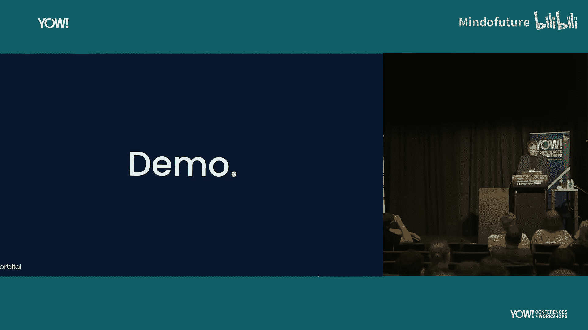

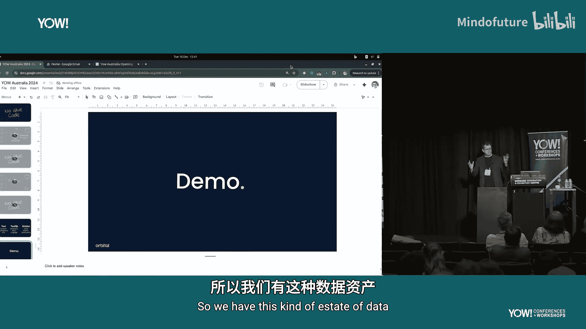

TaxiQL的关键特性包括：
*   **声明式**：不指定系统或字段名，只描述需要什么数据。
*   **语义化**：使用业务语言，与生产者解耦。
*   **发布消费者契约**：消费者定义自己需要的数据结构和字段名，而不是从一个集中式模式中挑选。这消除了一个关键的耦合点。
*   **内嵌表达式**：支持在查询层进行数据转换（如字符串操作）。
*   **约束条件**：可以添加过滤、排序等约束，帮助查询层选择最合适的源系统。

**Orbital** 则是一个**查询执行引擎和可观测性平台**。它的工作流程如下：
1.  从Git仓库读取Taxi类型定义（语义词汇表）。
2.  生产者发布包含Taxi语义的API规范。
3.  消费者提交TaxiQL查询（定义了自己的数据契约）。
4.  Orbital利用所有信息，动态构建集成逻辑，执行查询，并返回结果。
5.  同时，它会收集追踪、数据血缘和性能数据，便于调试。
6.  当生产者变更并发布新规范时，Orbital自动适配查询，消费者不受影响。

## 6️⃣：实战演示——电影数据集成

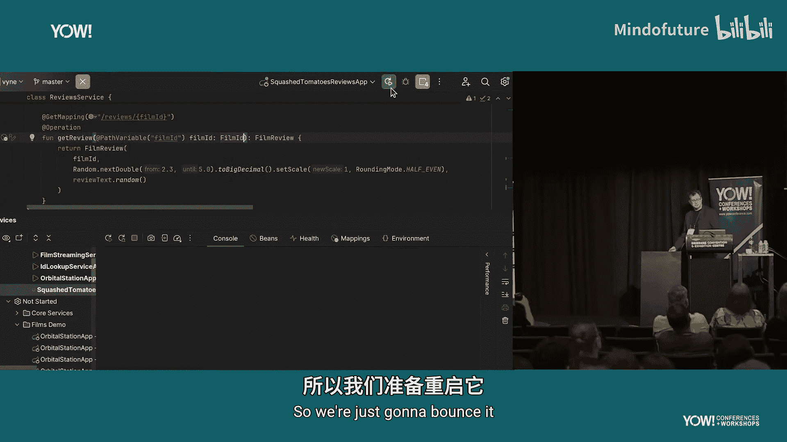

现在，让我们通过一个实战演示来将以上概念串联起来。场景是一个电影制片公司，拥有电影数据库和多个微服务（提供评论、流媒体价格等信息）。

我们有一个Spring Boot微服务，它接收`filmId`并返回影评。为了给它添加语义，我们：
1.  在Taxi项目中定义语义类型（如`FilmId`, `FilmReviewScore`）。
2.  使用代码生成器（如Kotlin生成器）生成对应的类型别名代码。
3.  在Spring Boot服务的API中，使用这些语义类型注解参数和返回对象（例如，将参数声明为`FilmId`类型，而不仅仅是`Int`）。
4.  服务启动时，会自动将其包含语义的API模式发布到Orbital。

在Orbital的控制台中，我们可以看到已注册的数据源（电影数据库表、各微服务）。此时，我们可以编写TaxiQL查询：
*   初始查询：`find { Film[] }`，这只是简单地查询数据库。
*   定义消费者契约：`find { Film }`，指定了需要的字段和结构。
*   扩展查询：添加`reviewScore`和`price`字段。Orbital会自动识别到这些数据来自不同的微服务，并构建集成：先查数据库获取电影列表，然后并行或用影ID去调用影评服务和价格服务，最后将结果组合返回。**整个过程无需编写任何集成代码**。

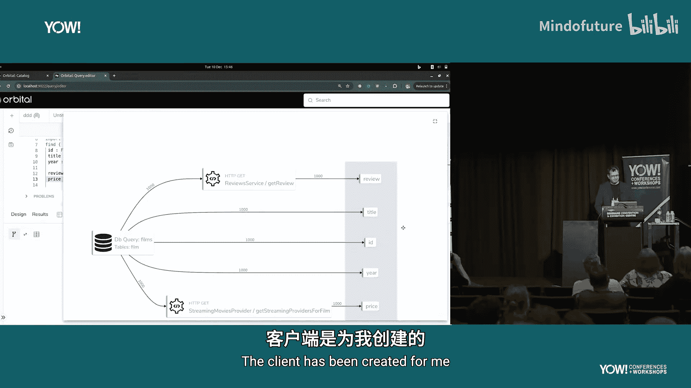

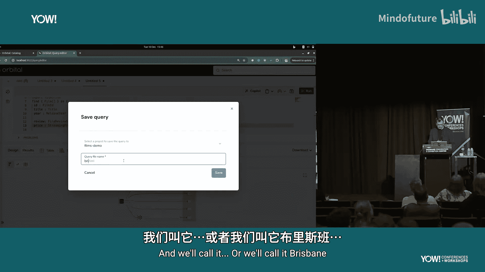

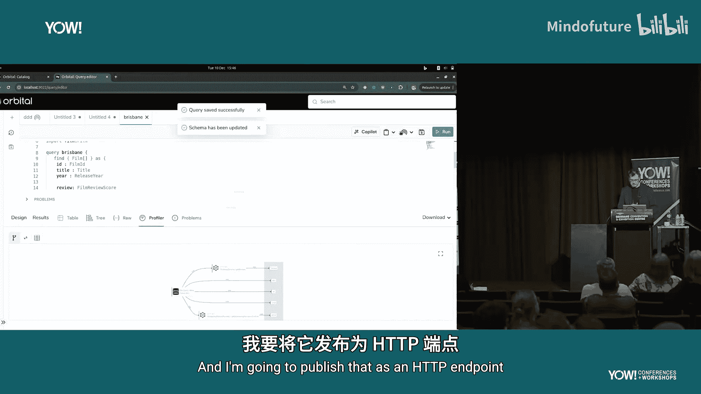

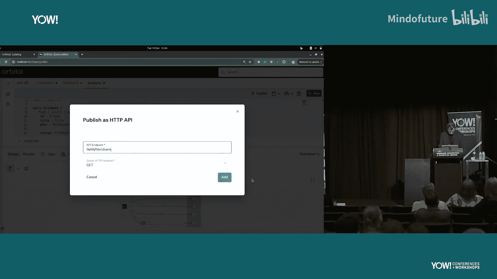

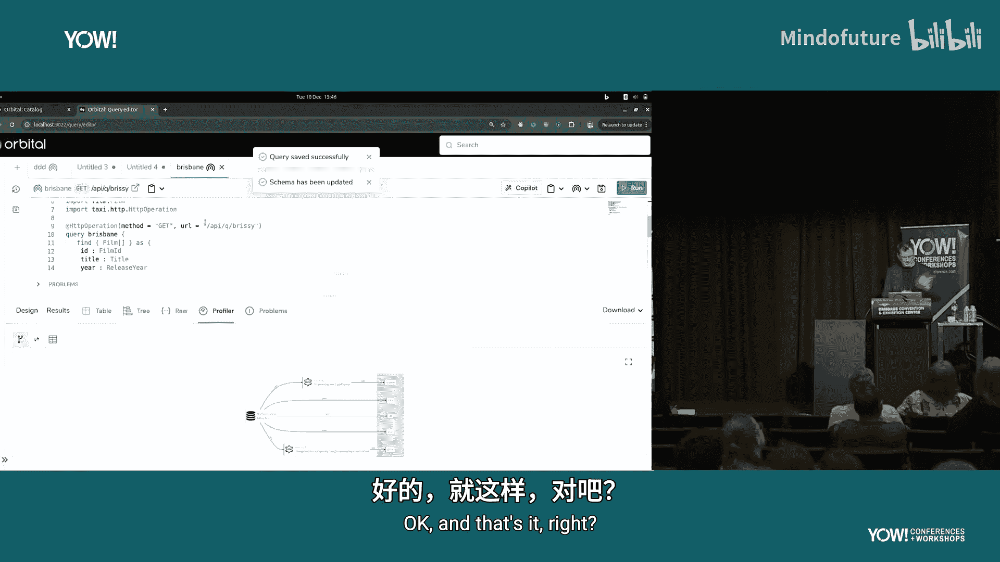

我们可以将此查询保存并发布为一个**REST API端点**，供其他服务直接调用。

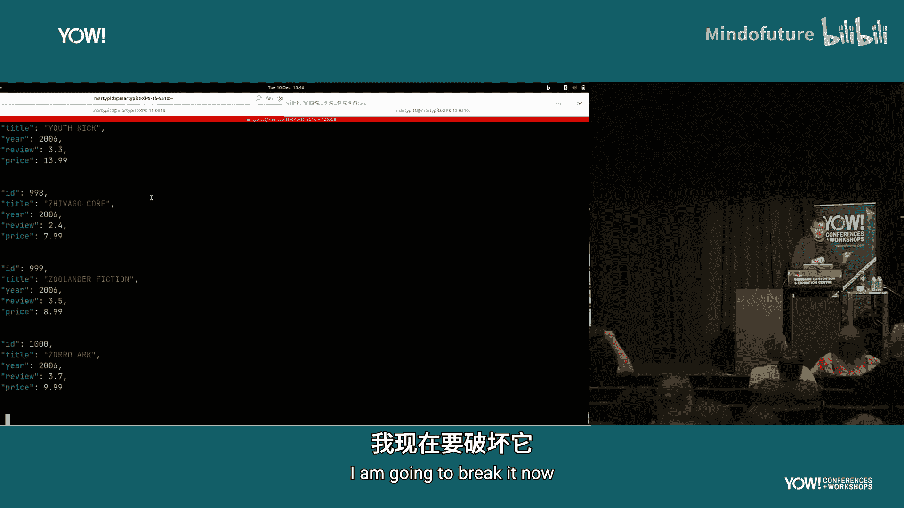

接下来，模拟**变更**：公司决定改用外部服务（Squash Tomatoes）获取影评。新服务的API也接受`filmId`，但它们的ID体系不同（`SquashTomatoesFilmId`），且返回的字段名也可能不同。我们更新影评服务，使用新的语义类型（`SquashTomatoesFilmId`），并重新发布API模式到Orbital。

神奇的是，之前创建的消费者API端点**依然有效**。Orbital在后台更新了集成图：它发现无法直接将数据库的`FilmId`用于新服务，于是自动插入了一个“实体解析”步骤（可能通过某个映射服务），将`FilmId`转换为`SquashTomatoesFilmId`，再调用新服务。**消费者完全感知不到底层数据源的切换**。

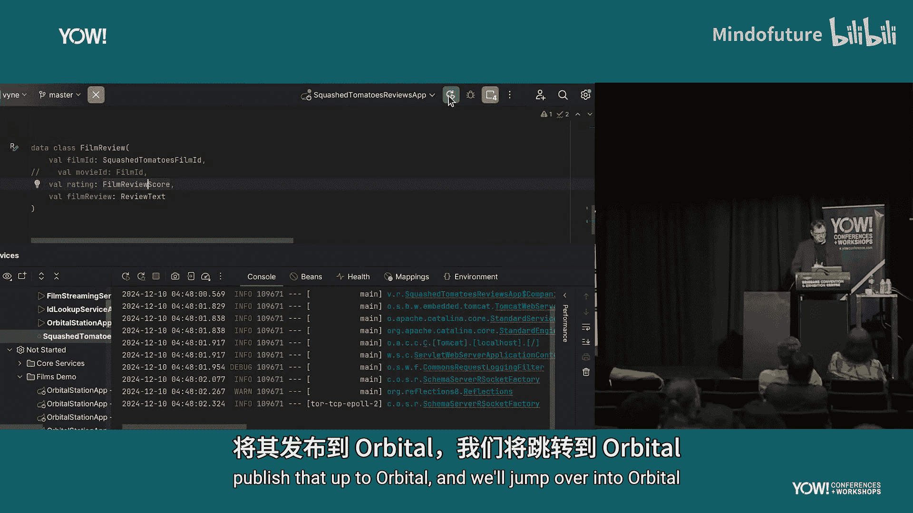

最后，演示**流式集成**：公司还有一个Kafka主题，发布Netflix上新电影的消息（Protobuf格式）。我们可以使用**相同的TaxiQL消费者契约**，但指定以流式方式查询。Orbital会自动创建从Kafka主题到满足契约的数据流的集成，处理其中可能更复杂的ID转换关系，而消费者只需关心他们想要的最终数据格式。

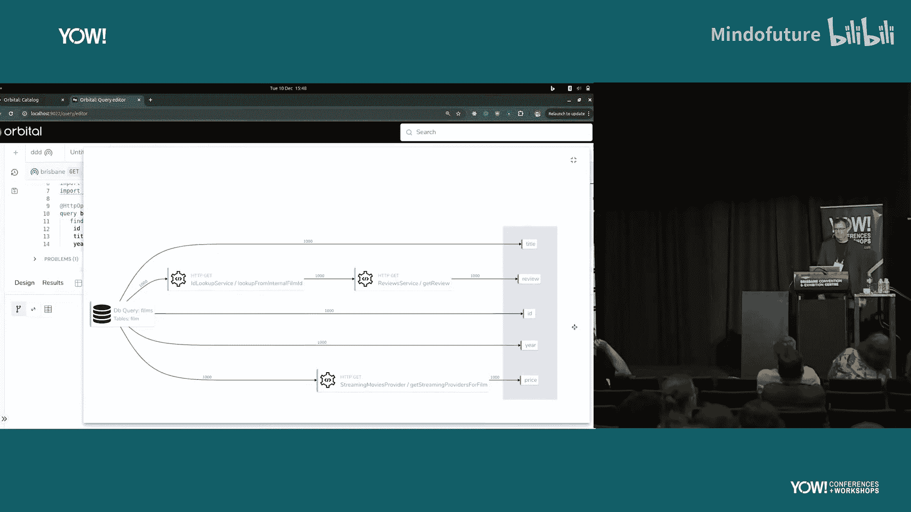

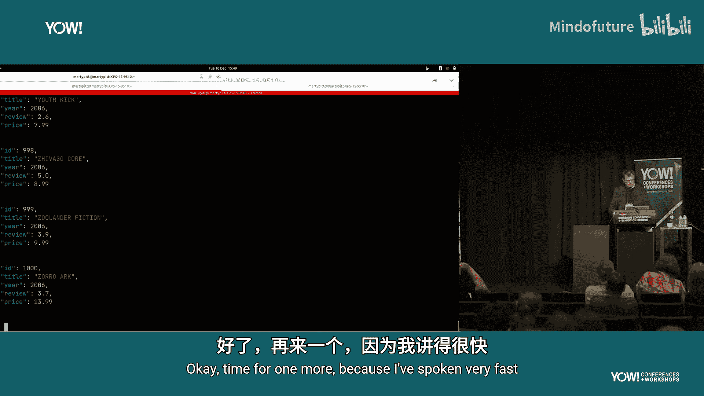

## 总结

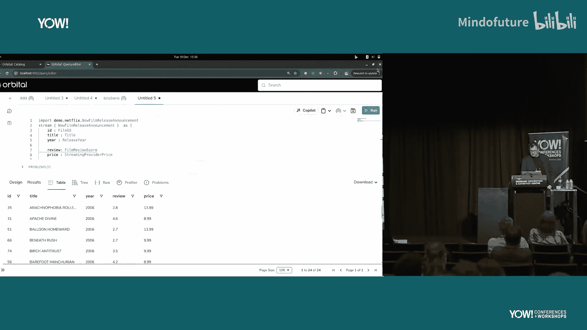

在本教程中，我们一起学习了构建自适应API层的核心思想。我们首先剖析了传统“胶水代码”集成方式的弊端：耗时、低复用性且脆弱。其根源在于它造成了生产者和消费者之间的紧耦合。

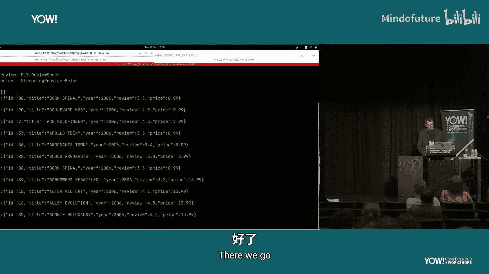

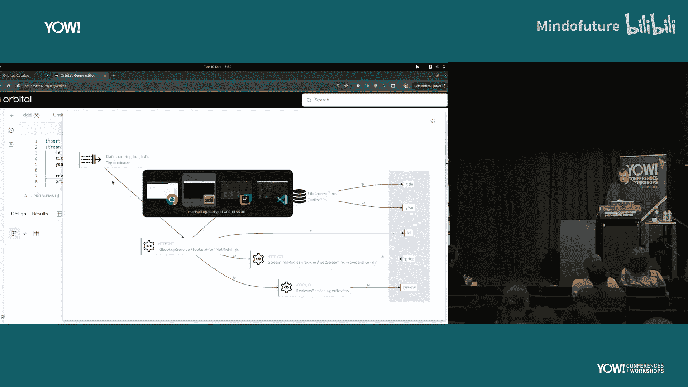

接着，我们探索了一种基于语义的解决方案：
*   **Taxi** 作为**语义元数据**，回答了“数据是什么”的问题，将业务含义注入API。
*   **TaxiQL** 作为**语义查询语言**，让消费者能用业务语言声明所需数据，并自动生成集成逻辑。
*   **Orbital** 作为**执行与观测平台**，利用语义信息动态构建、执行并维护集成，并能自动适应底层系统的变更。

这种架构的核心优势在于**消除了手动的胶水代码**，将集成工作的重心从重复的、易错的编码，转变为对业务语义和数据契约的定义与管理，从而显著提升开发效率、系统灵活性和可维护性。