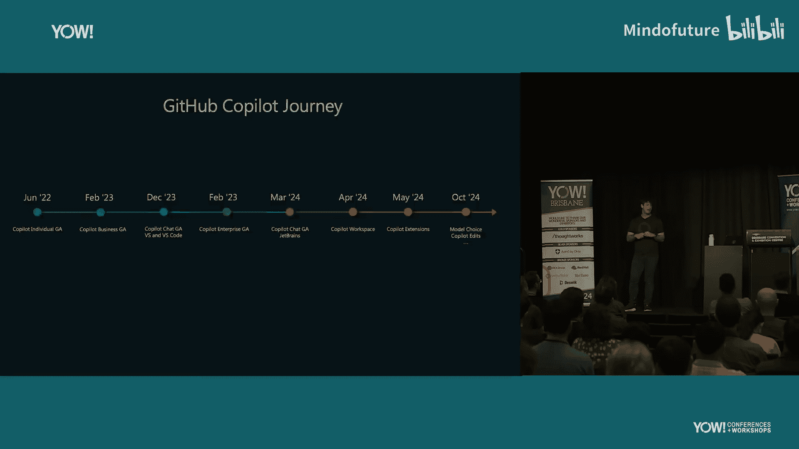
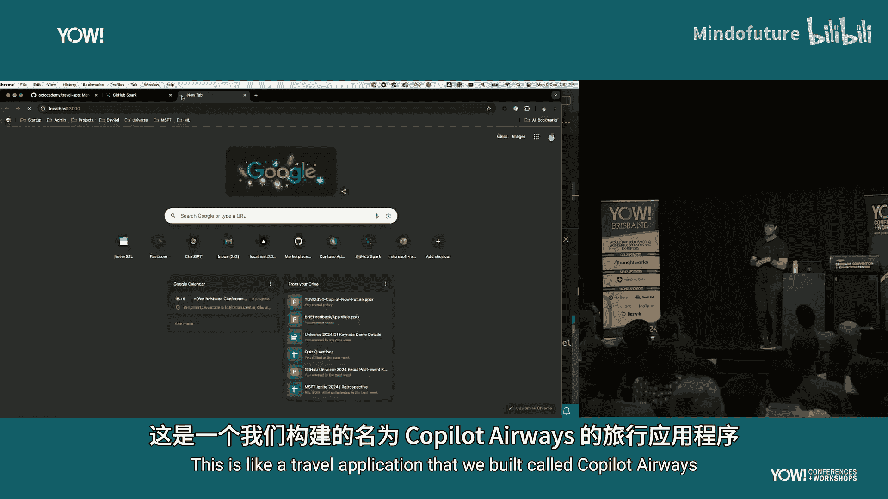
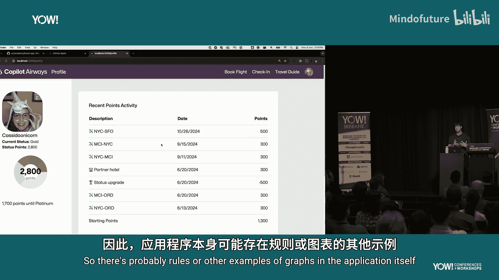

# 014：GitHub Copilot 深度解析

在本教程中，我们将深入探讨 GitHub Copilot 这一 AI 开发工具。我们将了解它的起源、核心工作原理、当前功能，并展望其未来发展方向。本教程旨在为初学者提供一个清晰、全面的认识。

## 起源与发展历程

上一节我们介绍了本教程的概述，本节中我们来看看 GitHub Copilot 的起源。

GitHub Copilot 源于 GitHub 内部一个名为 GitHub Next 的团队。这个团队类似于公司的研发部门，负责进行各种实验，探索软件开发的新可能性。

最初，团队每隔半年左右就会讨论一次构建通用 AI 编程工具的想法，但每次都因为技术不成熟而放弃。直到 OpenAI 发布了 GPT-3 模型。GitHub Next 团队和微软的研究人员获得了 API 访问权限，并开始进行测试。

他们最初给模型一些自包含的编程问题。GPT-3 在没有任何特定指令的情况下，成功解决了大约一半的问题。通过调整提问方式和提供上下文，成功率很快提升到了 90%。正是这个转折点让他们意识到，这可以成为一个有用的工具。

早期的测试形式是提供小型、自包含的问题，但后来他们不再采用这种方式，因为模型在这方面变得过于强大，而且这种测试并不符合日常开发的真实场景。

最初的想法是将其构建成一个聊天机器人。但在 2020 年 6 月，团队中有人提出了将其作为智能代码补全工具的想法。当他们开始以这种方式实现时，发现这是一个更好的范式，并在一段时间内完全放弃了聊天功能，专注于提供我们如今称为“幽灵文本”的代码建议。

此后，GitHub Copilot 经历了一年的技术预览期，然后才正式发布。自发布以来，团队不断扩展其功能，例如重新引入 Copilot Chat、推出 Copilot Workspace、支持扩展以及最近发布的模型选择和 Copilot Edits 等功能。

## 核心理念：提升开发者幸福感与生产力

上一节我们回顾了 Copilot 的发展历程，本节中我们来探讨其背后的核心理念。

开发 Copilot 这类工具的核心目标是提升开发者的幸福感。这听起来可能像一句营销口号，但研究表明，开发者的幸福感与生产力以及公司的盈利状况密切相关。

传统的生产力衡量方式（如代码行数、提交次数）存在很大缺陷。一些最有价值的贡献可能并不产生新代码，甚至可能是删除代码。

一种更好的衡量框架是 SPACE 框架，它从多个维度评估软件开发团队的生产力。其中，“满意度”和“幸福感”与开发者快乐程度直接相关。

GitHub Next 团队在 2021 进行的“美好一天”项目研究揭示了几个关键发现：
*   开发者需要深度专注时间。一天内会议越多，达成目标的可能性急剧下降。
*   干扰越少，开发者越有可能报告自己度过了“美好的一天”。

总结来说，如果开发者感到快乐，能够进入心流状态而不被打断，那么他们的生产力和幸福感都会提升，这对组织也有实际好处。

像语法高亮、自动补全这样的工具，其目的就是节省时间，让开发者无需频繁中断工作去查阅资料。Copilot 等 AI 开发工具的目标也是如此：帮助开发者保持专注，提升效率。

## GitHub Copilot 核心功能演示

上一节我们了解了工具背后的理念，本节中我们通过实际演示来看看 Copilot 的核心功能。

大多数用户最熟悉的是其自动代码补全功能。在编辑器中，它会根据上下文给出代码建议，用户可以通过按 `Tab` 键接受。

除了自动补全，Copilot Chat 功能也很有用。用户可以在聊天窗口中要求它解释代码、生成文档或编写测试。

例如，可以选中一段复杂的正则表达式，在聊天框中输入 `/explain`，它就会给出解释。用户甚至可以要求它“像对五岁孩子一样解释”。

对于导航和理解现有代码库，Copilot 也提供了帮助。在一个不熟悉的 React 项目中，用户可以打开聊天窗口并询问：“这个项目中的个人资料页面在哪里？” Copilot 会分析整个工作区，找到相关文件并给出简洁答案。用户还可以询问“这个文件有测试吗？”或“为这个文件中的所有函数生成测试”等问题。

Copilot Edits 是一个较新的功能，允许用户通过一个提示，让 AI 同时修改多个文件来解决一个问题。例如，用户可以提示：“创建一个可复用的面积图来显示积分活动。它应该看起来像 `#onTimeLineChart`（引用项目中的现有组件），并显示在个人资料页面的表格下方。确保添加测试，并从 `pointsActivityService` 拉取数据。” 用户还可以选择使用不同的底层大语言模型（如 GPT-4o、Claude、Gemini）来执行此任务。

Copilot Instructions 功能允许用户通过一个 markdown 文件，为 Copilot 设定每次响应的固定指令。例如，可以要求“创建新的可复用 React 组件时，添加一个 LaunchDarkly 功能标志”。这可以设置在项目级别或用户个人设置中。

## 未来方向：从工具到伙伴

上一节我们演示了 Copilot 的当前能力，本节中我们来展望其未来的发展方向。

业界存在 AI 工具是否会取代开发者的担忧。但 Copilot 的定位是帮助开发者提高生产力的工具，而非替代他们。GitHub 的目标是服务更多开发者，而非减少其数量。

未来的方向是让 AI 从单纯的代码生成工具，逐渐转变为开发者的“思维伙伴”。这意味着 AI 将更多地帮助开发者导航、理解代码库，并进行构思。

设想一下，一个像在代码库中工作了几十年的“AI 同事”，它拥有完美的记忆力和即时回忆能力，并且真心希望你成功。你可以对它说：“我需要在应用的支付屏幕上添加一种新的支付方式。” 这个 AI 工具可以拉取所有相关的支付代码文件，指出需要修改的部分，甚至建议更新网站 FAQ，或者根据新支付方式的名称去查找实现细节并组装代码。

这引向了“AI 原生开发”的概念。目前，AI 开发工具是显性的，用户需要主动打开聊天窗口或等待补全。未来，理想的状态可能是“两院制用户体验”：一侧是自然语言描述的需求，另一侧是跨多个文件的正式代码，修改任何一侧，另一侧都会相应变化。这本质上是在更高层次上对代码进行抽象。

GitHub 近期宣布的目标是达到 10 亿开发者。实现这一目标的方式之一是重新定义“开发者”的范畴。Github Spark 就是一个面向更广泛用户的低代码/无代码工具的实验。它假设应用 UI 和基础架构（如数据存储、主题）可以相对标准化，用户只需用自然语言描述他们想要的应用，并通过多次迭代来完善它。这使得更多非专业开发者也能创建有用的程序。

## 总结

在本教程中，我们一起学习了 GitHub Copilot 的完整图景。我们从其起源于 GitHub Next 团队的研发实验开始，了解了它如何从解决自包含编程问题发展到成为智能代码补全工具。我们探讨了其核心设计理念——通过减少干扰、提升效率来增加开发者幸福感和生产力。通过功能演示，我们看到了它在代码补全、解释、测试生成、代码库导航和多文件编辑等方面的实际应用。最后，我们展望了未来，Copilot 正朝着成为开发者的“思维伙伴”和实现“AI 原生开发”的方向演进，同时也在通过像 Github Spark 这样的工具降低开发门槛，让更多人能够进行软件创作。