# 016：将AI模型引入画布

在本课程中，我们将探讨如何超越传统的聊天界面，将人工智能模型的能力引入到交互式画布中。我们将回顾人机交互的历史演变，分析当前AI交互的局限性，并展示一系列将AI与画布结合的创新实验。

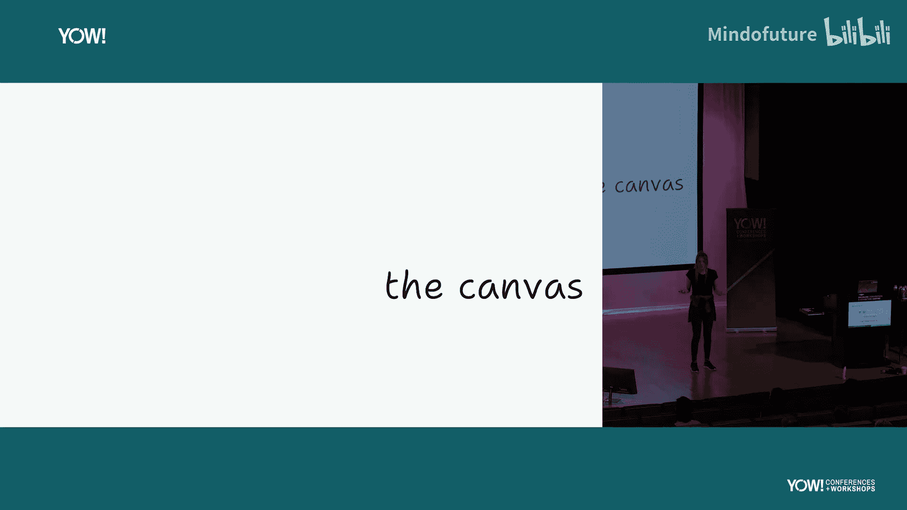

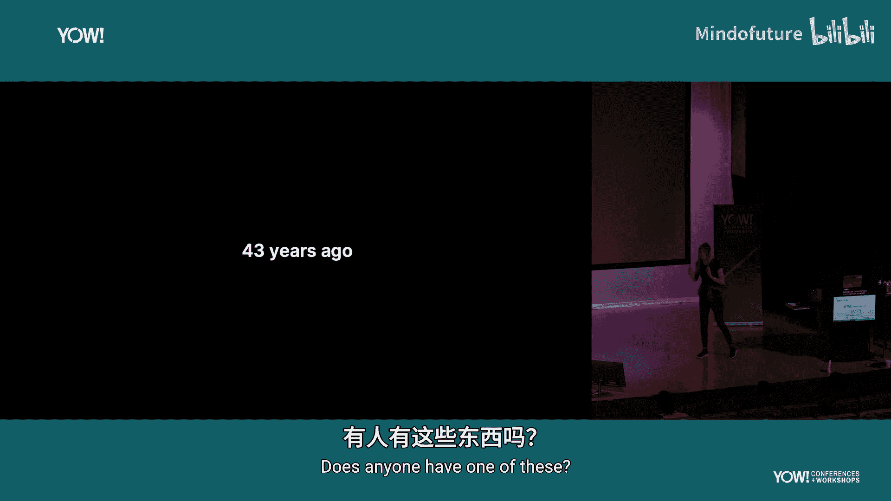

## 1. 引言：什么是画布？

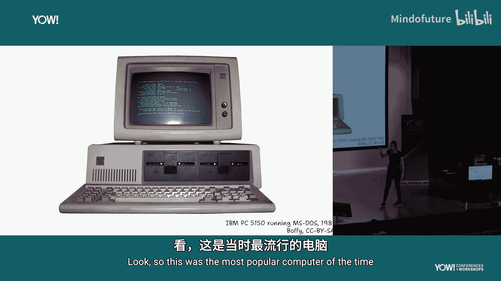

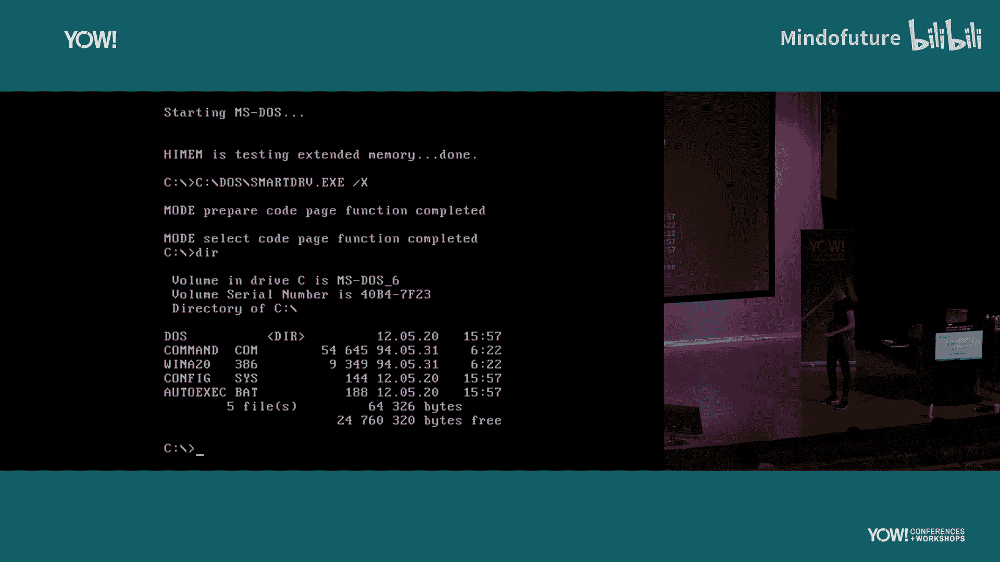

大家好，我是Lou，也可以叫我Luke。我在网上使用的名字是Toadponnd。今天演讲的主题是“超越聊天：将模型引入画布”。这里的“模型”指的是AI模型，但我真正想深入探讨的是“画布”本身。

那么，什么是画布呢？

为了回答这个问题，我们需要回顾43年前的计算机历史。

## 2. 历史的启示：从命令行到图形界面

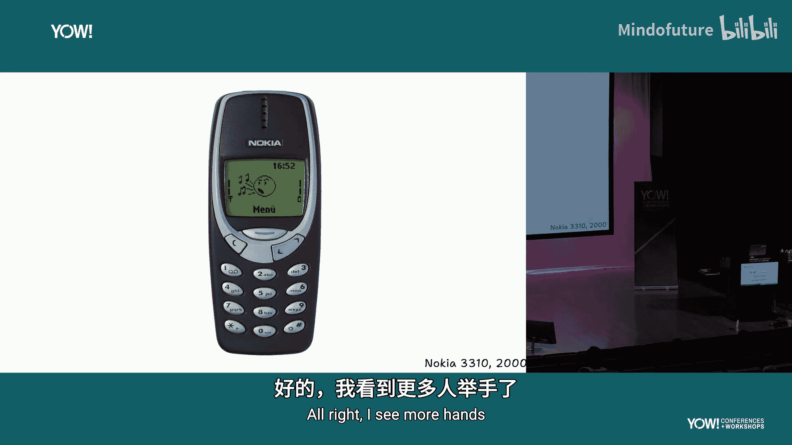

43年前，最流行的计算机交互方式是这样的：你有一个聊天框，输入一条消息，计算机会回复你。你通过这种一来一回的对话，逐步构建起与计算机的交互。这就是当时使用计算机的方式。

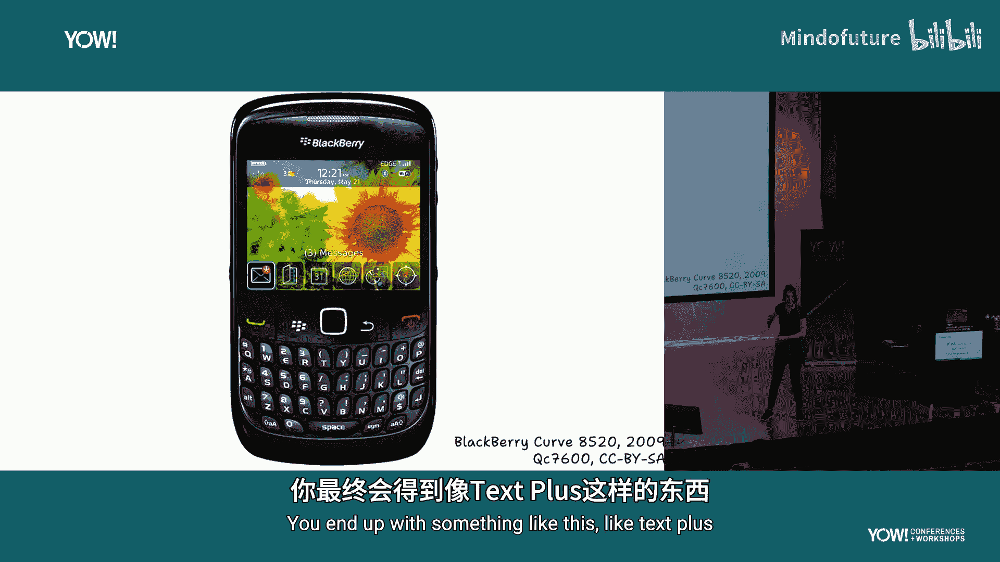

让我概括一下：你发送一条聊天消息，得到一条回复。你再发送一条消息，再得到一条回复。尽管当时已有大量关于更好交互方式的研究，但这就是我们使用计算机的方式。

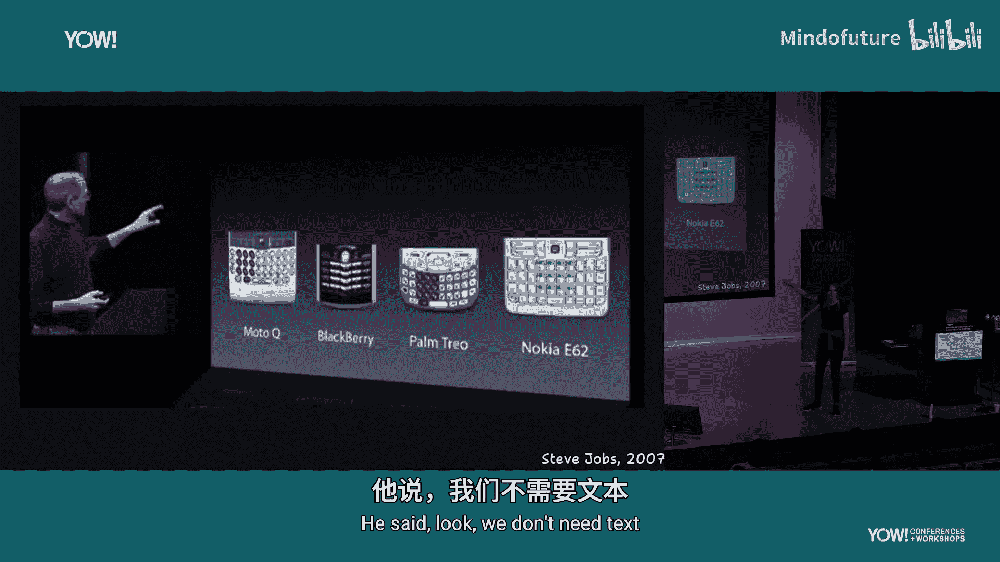

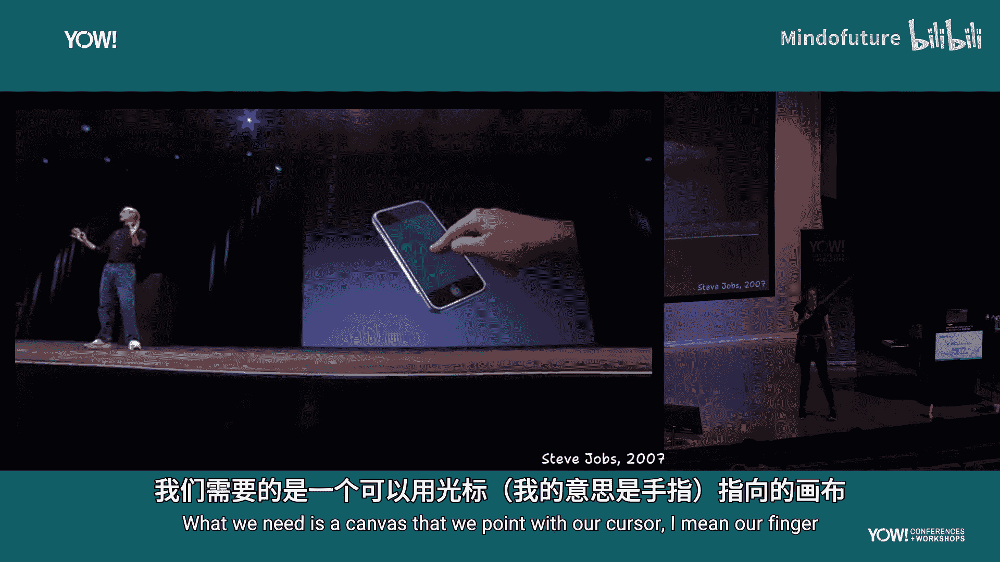

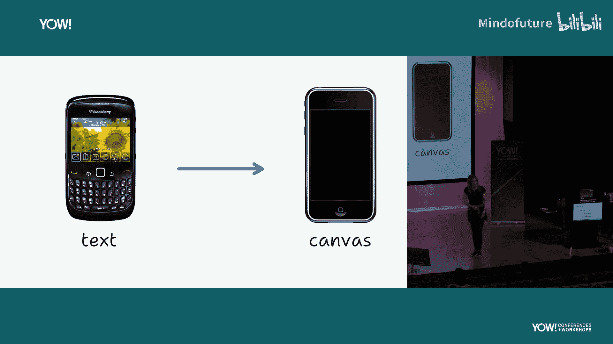

实际上，在更早的研究中，我们已经看到了未来的雏形。你们知道这是什么吗？对，这是鼠标。这个呢？这是光标，一个指针箭头。那这些呢？这是来自同时期另一篇研究论文的概念——重叠窗口。如今，我们在每台台式机或笔记本电脑上都对此习以为常，但当时必须有人去发明它。直到多年后，第一台Macintosh才首次在个人电脑上普及了这种界面，这彻底改变了计算机。

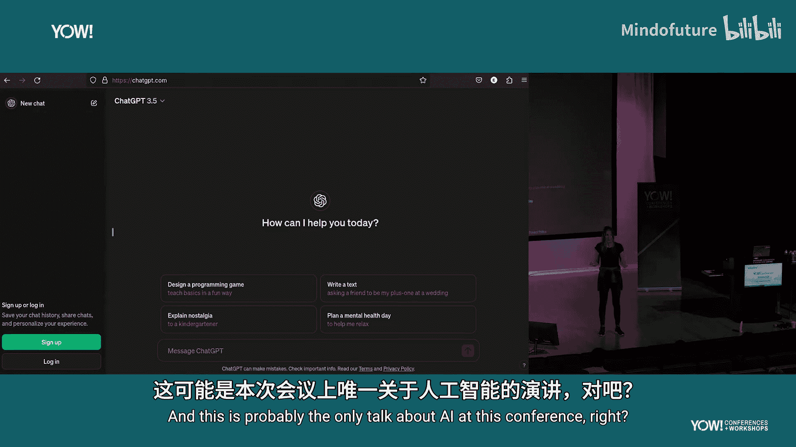

让我们概括一下：我们从基于文本的聊天框开始，最终发展到了画布。

## 3. 移动设备的演变：从文本到触摸屏

让我们谈谈手机。有人用过这种手机吗？它们基本上就像一个命令行界面。你不停地按“上、上、上”直到找到想要的命令，然后你输入文字。是的，我们称之为“发短信”是有原因的，因为你发送的就是文本。

那么，如果整个世界都遵循这种以文本为范式的交互方式，你会得到类似“文本增强”这样的东西。但正如史蒂夫·乔布斯著名地指出的那样：我们不需要文本，我们需要的是一个可以用手指（我们的光标）来指向和操作的画布。这永远地改变了手机，从文本交互转向了画布交互。

到目前为止，大家能跟上吗？能看出这个趋势将引向何方吗？

## 4. 当前AI的交互范式：困于聊天框

现在，让我们谈谈AI。在场有谁听说过AI？很好，看来我是全场最幸运的人。AI代表人工智能，这可能是本次会议上唯一关于AI的演讲。

目前使用AI的方式是：你有一个小聊天框，输入一条消息，然后开始与计算机对话。每个人都在这样做，这就是当前的范式。无论是ChatGPT、Claude还是Gemini，有时你可以稍微跳出聊天框，比如使用Claude的“工件”功能，你们可以共同在一个画布上工作，但使用它的主要途径仍然是聊天框。你必须通过聊天来交互。ChatGPT可以上传画布的图片，但那不是一回事，而且区域也很小，你仍然需要谈论它。

概括一下：我们向AI发送一条聊天消息，得到一条回复。我们再发送一条消息，这次又得到一条回复。然后我们再发送一条消息，有时还需要检查答案是否正确。总之，我们从AI的文本交互开始，但目前仍然处在这个文本范式中。

那么，我们能超越聊天吗？大家认为我们可以吗？

## 5. 实验探索：将AI引入画布

我非常幸运，在一家名为Tldraw的公司工作，这是一家画布库公司。我们构建SDK，供其他人用它来构建画布应用。我很幸运能和团队一起进行实验，尝试解决如何将AI引入画布的问题。

接下来，我将快速展示多年来我们进行的许多不同实验，让大家一窥我们的工作。需要声明的是，这里有些是我做的，有些是团队其他成员做的，但所有成果都是协作努力的结晶。

好的，现在开始。

这是Tldraw，它正在运行我的幻灯片软件。Tldraw是一个画布软件，我们做了很多工作，比如让文本渲染得非常顺滑，让箭头连接得非常漂亮。即使我旋转这个星星，箭头也会自动调整。我甚至可以弯曲它，当我移动它时，它会动态变化。看，如果我把这个文本移到前面，会有一个小小的白色边框，这意味着即使它覆盖在其他东西上，也是可见的。当我们使用虚线时，我们会确保虚线的点总是落在拐角处，这样看起来总是很美观。我们在努力让画布变得好用方面获得了许多乐趣。

在展示实验之前，大家需要知道的另一件事是：这一切都是基于Web的。所以你在画布上看到的所有东西都只是网页内容，这意味着它是HTML。看，我们甚至可以放入一个YouTube视频，并且仍然可以移动它。它可以与所有其他东西交互，我甚至可以给它画一个箭头，当我旋转这个视频时……（暂停视频）我可以向你们证明这一点。看，如果我打开检查器，这是一个H2标签，这是一个段落，这是一个链接。这全是网页内容。这一点很重要，是为后面的内容做铺垫。

因为在2023年3月14日，OpenAI发布了（或者说宣布了）其首个公开可用的多模态模型。这基本上意味着你不仅可以输入文本，还可以发送图像，虽然这个阶段你得到的回复仍然是文本。但他们展示了一个例子：你可以在餐巾纸上画一个粗糙的网站草图，然后它会返回一个可工作的网站。这引出了我们今天的第一个实验，叫做“Make Real”。它最初是由社区里有人使用Tldraw开始的，我们接手并继续开发。我想展示一下它的功能。

我在这里画了一个小应用的用户界面。我可以全选它们，然后点击右上角这个“Make Real”按钮。现在，我在向演示之神祈祷。好的，它正在工作。大家能看到它在做什么吗？它把我的设计变成了一个真实的网站。如果我悬停在这些元素上，它们会有交互行为。看，Grow（放大）效果有效，Bounce（弹跳）效果有效。Rotate（旋转）效果无效。所以我们要拒绝OpenAI的版本。让我们看看Anthropic的模型做得对不对。这个会放大，这个会弹跳，这个会旋转。有趣的是，它把放大效果做得特别大，这里面有些巧思。

好的，这是另一个例子。如果我点击“Make Real”，它会根据草图创建出东西。很好。我可以在这里输入内容，然后提交，它会发送到某处。但大家看到错误了吗？提交按钮目前在这里，但它不应该在这里。我把它画在了这边。所以我需要做的是把它移到这里。然后我再次全选并点击“Make Real”，祈祷它会成功。大家觉得这会成功吗？看，它做到了！两种情况都做到了。我可以继续下去，现在这就像一个反馈循环。我可以说，实际上我想要这个是绿色的，并且在这里放一个大的红色取消按钮。让我们看看会发生什么。

我认为这其中的重大突破在于：当你发送一些东西出去时，这并不是终点。你并没有被取代，你仍然是这个过程的一部分。它完成了我的更改。我不认为这是在取代我的工作，但它是一个有趣的实验。

我们意识到的另一件事是：你不必只给它一个屏幕。你可以给它多个不同的视图。这里我给了它移动端和桌面端应该是什么样子的草图，我想看看它是否能理解我的意思。看起来它正在处理移动端视图。如果我拉伸它，我们得到了一个响应式设计，这非常令人惊讶。我们想，好吧，我们还能给这个东西什么？

这里有一个状态图。我不知道大家昨天是否听了David的演讲，但我确保了我演讲中所有的箭头都加了标签。如果我给它这个状态图，它会尝试生成对应的用户界面。或者，如果我只给它用户界面，它会尝试推断行为，做相反的事情。我也可以说，就做一个秒表，我不在乎细节。最终你会得到不同保真度的结果，取决于你在乎的程度。让我们试试添加秒数和开始按钮。很好，它正在倒计时，就像我在状态图中指定的那样。这是它根据我给的UI生成的另一个版本，让我们看看会发生什么。这个在正数计时，因为我没有指定足够的细节。而这个只是一个通用的秒表，因为我说了我不在乎细节。

社区的人们真的在大力推动这个实验。我们对人们的创造力和他们探索这个东西能做什么、不能做什么感到非常惊讶。我接下来要尝试一堆例子，我们看看它的成功率如何。一个JavaScript终端，这回到了演讲的开头。还有一个视频游戏。现在让我们看看它做得怎么样。

这是我的颜色选择器。有趣，它把顺序搞反了。所以，如果我有更多时间，也许我会这样做，然后……让我们试试，我不知道那是否会成功。下一个，这个不可能成功吧？哇，它做到了。它成功在Tldraw里做出了Tldraw吗？让我们看看。这里有个bug，大家可能觉得这不好，但实际上这是好事，因为我还有工作。下一个，终端。很好，这个成功了。最后一个，视频游戏。游戏玩法还有待改进，但这仍然相当令人惊讶。

我们继续实验，看看还能做什么。最终我们得到了这个叫做“Draw Fast”的实验，我今天不能展示它，因为它会杀死场馆的Wi-Fi。基本上，这是图像生成，但不是通常那种。在这个实验里，你不是输入一些词然后发送出去让AI生成，我认为那样很令人沮丧。在这个实验里，你是在直接操作底层图像，来塑造你想要的东西并进行探索。我认为这是一种有趣的方式，可以学习和理解这些图像模型是如何工作的，因为看下面，它只是这样。但疯狂的是，如今它的速度足够快，让你感觉像是在自己移动图像。你点击、拖拽、拉伸、挤压，这太神奇了。

当然，因为Tldraw只是一个网页画布，你可以在上面放任何东西。你可以放一个视频流，我们在办公室里玩得很开心。

然而，有一个大问题，一个非常大的问题。

## 6. 核心挑战：让AI理解并操作画布

到目前为止，我们所做的是：获取画布上的内容，无论是什么，发送给模型，然后它返回给我们一些东西，一个工件、一个网站或一张图片。然后，游戏就结束了。如果你想做别的东西，你必须从头开始。我们真正想做的是让模型生成更多的Tldraw内容，生成更多的画布，因为这样你就形成了一个闭环。谁知道会发生什么呢？

这就是大问题：模型非常不擅长处理画布。这不是它们设计的目的。

不同的画布团队一直在尝试找出如何绕过这个弱点。这是Figma的FigJam，他们所做的是有一个巨大的模板列表，然后用信息填充这些模板。但不幸的是，这有时并不是你真正想要的。如果你输入“蜜蜂的生命周期”，你会得到这种流程图，有时你会得到一个甘特图，这很有趣。

但梦想是让模型能够像你一样操作画布。从一开始，我们就尝试了所有这些不同的方法。但方法太多了，我们不知道哪条路是对的。这里，模型像是在控制一个假的光标，我们只是给它光标，看看会发生什么。它做得相当不错，但只能走这么远。

这是另一个方法，我们让它慢慢地画出墨迹，这有点像恐怖电影里的场景。从字母E和M可以看出，有一些困难，但它做得相当好。我特别喜欢这个人头上出现的帽子。

另一种方法是创建一个假想的API，让它使用那个API，利用函数调用和结构化数据。如果想了解更多细节，可以在演讲结束后找我。这些方法都相当有限，但都显示出了潜力。

那么，最好的方法是什么？它们可能都有效，但有些可能比其他更难。

我们做的另一个完全不同的方法是：不是让它遵循指令，而是让它继续你正在做的事情。这是自动补全，但不是像你Gmail收件箱里的那种自动补全，这是在画布上的自动补全。当你使用更快的模型时，看到什么是可能的，这相当令人惊讶。而且我们会得到越来越快的模型。

## 7. 当前方案：Teach——教AI使用画布

所有这些工作最终引导我们开发了这个叫做“Teach”的东西。我想现在向大家展示它。这是我们目前让模型“玩”Tldraw的最佳尝试。

我这里有一个小提示词和一个工作区。我要求它画一个雪人。再次向演示之神祈祷，希望它能正常工作，并且保持在线。很好，这不是图像生成。这不是一张图片，而是我可以交互的形状，即使在它还在绘制的时候。之后我可以操作它。我可以说“加一条围巾”，它能看见那里有什么，它知道东西的位置。它会尽力画一条围巾。但因为我们在布里斯班，我会说这里的冬天有点不一样。它也可以修改已经存在的东西。大家喜欢它，别担心。

它画了一些非常滑稽的图画。如果你给它这些工具，它能画得多好，这让我感到惊讶。当然，有些东西它画得比其他的好。像城堡这样的结构化东西，它画得相当好。我真的很喜欢它画的猪。像人脸这样的东西，就稍微棘手一些。那是一只强壮的企鹅。

当然，我认为在我们场景中，真正的潜在用例是帮助我们完成非常枯燥、繁琐的任务，比如绘制图表。请看这个，它实际上给大部分箭头都加了标签。如果你没听过David的演讲，你真应该听听，这样你就能理解更多这些笑话了。但好处是，这还不是终点。这是我现在可以操作、改变和改进的东西。事实上，我要去掉这些。这并没有取代我，而是在帮助我。

我们经常做团队会议，做回顾板会议，所以看看它对回顾板的版本是什么样子也很有趣。还有，什么在困扰它？会议超时。这个呢？更好的故事估算。好吧，这像是回顾吗？总之，有趣的是，我之前展示的“Make Real”功能，我们意识到它可以做相反的事情。它可以拿一个网站，然后把它变成线框图。但它对字体大小非常保守。所以我可能会说，请增加字体大小。我发现使用大写字母和句号似乎能让它表现得更好，我想是因为它知道自己处于专业语境中。好的，它把字体都增大了一点。

我一直在用它来画表格，以及所有在这些工具中手动操作起来很烦人的事情。好的，开始了。它正在决定我在蛋糕义卖会上要卖什么。我要让它用示例数据填充。看看它认为我会卖什么。这是相当不错的一天。现在我想把它转换成条形图。请用句号。让我们看看会发生什么。好的，它移动了一些东西。我真正喜欢的是它倾向于使用颜色编码。一旦我们给了它这些工具，它真的会利用它们，这相当令人惊讶。

我们一直在尝试的另一件事（尚未公开，但我可以在这里展示）是：如果你放一些花括号，它就像是搜索网络的快捷方式。所以如果它花的时间有点长，那是因为它要去搜索布里斯班当前的天气。现在我们有了一个个性化的天气预报。

如果你想知道这个东西能做什么，你可以问我，但也可以问它。所以我为它放出了这个小模板，我发现这通常有助于给它一些结构来围绕。然后它正在用它的答案填充。我喜欢它在一个拉伸的星星上，因为我要求它使用整个宽度。缩放文本，缩放文本大小，大。它正在使用一种特定的XML格式，我稍后会解释一下。

我认为它做的是：它没能写出格式，因为通过写出格式，它创建了形状。让我们看看。我要求它在这里向我解释它的格式是什么。但它有点困惑。希望……我认为一个反复出现的主题是：当它做错事时，这并不是终点。我认为当我们使用AI工具时，重要的是……它又失败了，我们稍后再试。演讲结束后可以找我聊。

## 8. 关键技术：AI友好的格式

我们使用的这种格式，我称之为“AI驱动格式”。这是什么意思呢？当你要求这些模型做某事时，它们倾向于一遍又一遍地做某事。这只是它们所知道的一切的自然总和与平均。但这不一定是它们擅长的。我们尝试做的是：找到它们想做的事和它们擅长做的事之间的重叠部分。有时我们可以顺应它自然想做的事，有时我们需要稍微引导它一下。我们称这种格式为“Easy”，不是因为它对我们来说容易，而是因为它对模型来说容易。

我来帮它处理这些。好了。“Easy”。这是终极测试。它能画出蜜蜂的生命周期吗？让我们看看。好的，看起来不错。我们有箭头了。我要它说明每个阶段。检查一下：蜂王产下单个卵，喂食蜂王浆和蜂蜜，然后转化。好的，这里有漂亮的图画。那里有两个小翅膀。所以我们有卵、幼虫、蛹和蜜蜂。很好。

## 9. 进阶探索：多步骤AI工作流

到目前为止，一切都只是我们所谓的“一次性”或“零次”提示。我们向其中一个模型发送请求，得到回复，就这样。但在现实中，在大多数AI工具和应用中，情况并非如此。它更像这样：当人们使用ChatGPT时，它发送一个请求，然后由一个模型处理，再发送给另一个，再另一个。通常这对用户是完全不可见的，他们脱离了循环。他们看不到发生了什么，只看到一个旋转的加载图标。

所以，我非常高兴能非常简要地向大家展示我们最新的实验，它甚至还没有发布或宣布。这是一个节点连线图，一种节点连线编程语言，我这里有不同的组件。如果我点击播放，它就会发送请求。我可以有更多这样的组件，它们会组合在一起。如果我这样设置，它们会一起工作。我实际上可以用这个创建循环，希望它不会崩溃。但让我们看看，它会停止工作流。

有趣的是，当你添加其中一个块时，它叫做“指令块”。我在这里放一个数字。然后我说，这里，我说“增加一”。现在当我点击播放，它会使用AI模型作为计算机。这就是为什么……它做到了。我可以做的是，实际上把它绕回到这里，再次创建一个循环。现在我们有一个数字变得越来越大，但我不想杀死Wi-Fi，所以我停下来，改为添加一个按钮。现在每当我点击这个按钮，它就会增加一。大家跟上了吗？

因为在这里进行计算的是AI，我可以说像“数字词”这样的东西。我可以说“增加三”。希望这应该能成功。它做到了。但另一件事是，我可以更……我可以使用一些词汇。我可以说“增加一倍”。我不需要教它那是什么意思，它会尽力去做。我可以说一些更抽象的东西，像这样。我不知道它会做什么。我们可以做任何我们想要的操作，比如“从数字中移除零”。它会尝试弄清楚该做什么。它做到了。我说，转换成罗马数字。这没什么，让我们继续。

更有趣的是把东西组合在一起。看这里，我现在有两个数字输入。我只是要求它把所有东西加在一起。但关于AI有趣的是，它相当擅长合并东西。这可能不会成功。它可能不会成功，我可能需要给它一些帮助。它没有成功，因为它非常理智。它说“生命的意义”不是一个数字，你在说什么？我只是忽略它。

所以我要做的是添加另一个指令，我会说“从这个输入推断数字”。我把它连接到这里。我们在这里做的是创建一个多步骤的提示链。这就是现在所有AI应用在幕后工作的方式。但目前，用户没有办法与之交互。请成功。它成功了！

我认为这很有趣，因为到目前为止，只有程序员才能做这种多步骤提示。ChatGPT会为你做，它从“章鱼”推断出“8”。但更有趣的是，如果你拿像这样的东西，然后尝试推断“8”。如果这不成功，那不是AI的错，是我的绘画能力。它说是“8”。我认为更有趣的是，如果我们看到这个相机。这不可能成功。让我们试试。拜托，有很多人在看。是的，然后添加一些东西，很好。

所以，当把本不应该连接在一起的东西组合在一起时，看看会发生什么，这很有趣。总之，这是我的食谱生成器。你做的就是把不同的食材放进盒子里，然后它会尽力从中制作食谱。但当你尝试给它一些不太合理的东西时，比如巧克力和汉堡，这很有趣。我不完全确定会是什么。巧克力汉堡，来了。我这里有一些我可能想放进去的购物清单。我正试图变得更素食一点。我要扔进去一个苹果和巧克力。让我们看看。素食巧克力苹果甜点，这很不错。我认为，我们为什么不试试完全抽象的东西，比如星星，不要再有巧克力了，我想我已经受够了有毒废物。

顺便说一下，每当你创建一个这样的流程时，模型会分解它认为需要遵循的步骤。小心星星食谱。这个食谱是一个受输入图像启发的隐喻。小心处理所有食材。如果是不适合食用的东西，它会给你警告。

就像我说的，它会分解它认为需要遵循的步骤，尽力遵循你的指令。我要再展示两个。这个我称之为“我的大杂烩机器”，我的AI大杂烩机器。这对于发明创造非常有用。我已经发明了这个叫做“猫用太阳镜”的发明。我现在愿意接受新发明的建议，所以我想请大家想一个物体，任何物体，然后喊出来。现在。哇，这比我想象的要好。我听到了“过山车”和“骑士长枪”。我们要做一个“骑士长枪过山车”。这是我得到过的最好的建议之一。现在我要做的是把整个过程放慢，这样你们就能看到它在我制作的这个极其复杂的东西中移动。

它会为这个发明构思五个名字，然后替换掉。骑士长枪过山车，长枪……它现在也在写一个宣传语。它从那些工作坊名字中选出了最好的一个：“翻滚骑士”，有趣。翻滚骑士，长枪翻滚，过山车。我们这里有一个完整的宣传语，以防房间里有风险投资人。它现在要尝试创作几个宣传口号，并选出最好的一个。“翻滚进入历史”，“征服刺激”。这里有一个概念图。那实际上很糟糕，很好。它甚至为我制作了着陆页。它试图使用一些公开可用的知识共享图片，但URL错了。不过我们确实有这个小着陆页的模型，包括2023年版权信息。“获取门票”、“功能”、“推荐语”。“这是有史以来最棒的过山车体验。我的孩子们喜欢骑士主题和互动元素。”

我只是想让大家一瞥，你可以真的深入其中，你可以疯狂探索。我一直在尽可能多地推动它。这是另一个，我的最后一个，我称之为“战斗模拟器”。

我之前尝试的是想知道在一场战斗中谁会赢：一万亿只狮子还是太阳。我们这里有战斗本身的图片和一个播客。“伟大的太阳狮子战争”，这里有口语诗篇：“现在，讲述一场不为人知的战争。一万亿只狮子，勇敢而大胆，对抗太阳。”你们可以自己找时间听。但赢家是太阳（剧透）。所以，我想要一个建议，我想要一个可能打败太阳的东西的建议。我想让大家现在喊出一些东西。后面那位说什么？黑洞。好的，但我要让这更有趣一点。我想是黑洞。然后，代替太阳，我想我要用我自己。所以让我们看看，这需要放到那里，那个是我。让我们看看，你们认为谁会赢？哦，我应该站在这里。你们认为谁会赢？你们认为可能是我，还是我们银河系的中心？

我们来了，这是一张非常科学准确（或不准确）的图片。但让我们看看它是什么。你在开玩笑吗？等等。人类以惊人的事件转折成为胜利者，不是通过彻底的毁灭，而是通过力量的展示和对宇宙力量的新理解。黑洞，尽管拥有可怕的力量，却退缩了，变得虚弱并充满敬畏。黑洞和人类。一个具有难以想象引力的旋转漩涡，黑洞隐约出现。它的事件视界，一个不归点，脉动着恶意的能量。与之对抗的是一个孤独的人类，渺小而脆弱，却散发着蔑视。这个人类，奇怪地被赋予了力量，感到宇宙能量在她的血管中流动。

## 10. 总结与展望

让我们结束吧。当我们试图为AI逃离聊天框时，会是什么样子？我认为我们还不知道。我希望我已经让大家一瞥我们有多么不了解。当我们在画布上使用时，有如此多的可能性。我希望我已经表明，我今天展示的例子是如此不同，但又如此有趣和令人兴奋，也许它给了你们一个稍微新的视角。

我确实知道一件事：这总是会发生。我们从文本开始，然后转向画布。这已经一次又一次地发生了。我认为它会继续发生，不仅对AI，而且对各种领域和技术。

看，这就是我们作为人类的交流方式。我们一直在使用画布。我们一直都是这样做的，无论是画地图、草图，还是用箭头和评论进行注释。这是我们传递信息的方式。这是我最喜欢的标志，我知道这很能说明我的为人。这是在苏格兰的滑雪缆车上的指示，关于如何下缆车。想象一下，如果那是几段文字，你可能会直接又坐下去。当我们想向团队和他人传达信息时，我们使用画布。

所以我认为值得探索，从列奥纳多·达·芬奇，甚至追溯到洞穴壁画，画布是我们使用的东西。我认为如果我们停留在文本和聊天中，那将是令人沮丧的，而这就是我们目前的困境。对这个没什么可说的。哦，这是来自Andrea的演讲。她已经向大家解释了在团队中使用图表进行沟通的重要性和价值。这是在David的演讲中，一切都是图。一切都可以在画布上表达。只是构建它们真的很难。有时需要很多年才会有人出现并说，是的，这将是我们的产品，这是我们要做的，我们要让它变得负担得起。

如果你想帮助构建画布，那么请和我或我团队的人谈谈，我们热爱画布。如果你想今天就开始，那么我认为，去这个网站。我真的很想看到你们用画布构建什么。

谢谢大家。

---

**本节课总结：**

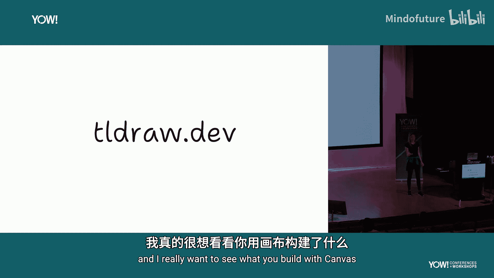

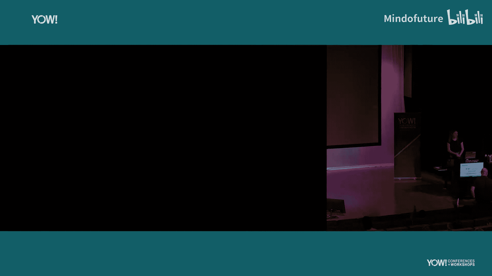

在本节课中，我们一起学习了人机交互从命令行到图形界面、再到触摸屏的历史演变，并分析了当前AI交互主要局限于聊天框的现状。我们探讨了将AI模型能力引入交互式画布所面临的核心挑战，并详细介绍了Tldraw团队进行的一系列创新实验，如“Make Real”、“Draw Fast”和“Teach”。这些实验展示了AI如何从被动生成内容，发展到能够理解、操作甚至与用户在画布上协同创作。最后，我们展望了多步骤AI工作流的潜力，并强调了画布作为人类自然沟通和思考工具的重要性。未来，超越聊天框，在画布上释放AI的创造力，将是人机交互发展的一个重要方向。